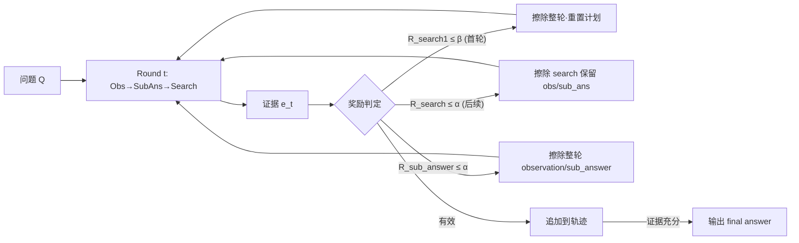

# Erase to Improve: Erasable Reinforcement Learning for Search-Augmented LLMs

**会议**: ICLR 2026  
**OpenReview**: [https://openreview.net/forum?id=UpZHjUtcUM](https://openreview.net/forum?id=UpZHjUtcUM)  
**代码**: 待确认  
**领域**: reinforcement_learning  
**关键词**: 搜索增强 LLM、多跳推理、可擦除 RL、过程奖励、自我纠错

## 一句话总结
提出 **Erasable Reinforcement Learning (ERL)**：在搜索增强 LLM 的多跳推理轨迹中，通过密集过程奖励识别出错的子查询/子答案，**就地擦除并重新生成**，把"一步错满盘皆输"的脆弱轨迹改造成可恢复的鲁棒过程，训练出的 ESearch 在四个多跳 QA 上刷新 SOTA。

## 研究背景与动机
**领域现状**：检索增强生成（RAG）已演进为把搜索与推理放进自治循环的研究型 agent，强化学习（RL）成为驱动这类 search-augmented agent 的核心手段（Search-R1、StepSearch 等）。

**现有痛点**：现有 RL agent 把整条"搜索+推理"轨迹建模为单一 MDP，只用稀疏的终端奖励优化（终点对比 EM/F1）。论文实证总结出三类致命失败模式：①**分解错误**——子查询跑偏导致检索完全失效；②**检索缺失**——即使子查询合理也检索不到关键证据；③**推理错误**——整合证据时出错并沿推理链累积。

**核心矛盾**：单体式（monolithic）轨迹优化天然脆弱——任一步出错都会污染后续所有状态，形成"多米诺骨牌"式崩塌；推理链越长（>10 步）性能下降越剧烈。而人类遇到错误会暂停、纠正、从纠正点继续，现有系统缺这种自我纠错机制。

**本文目标**：让 agent 像人一样"用橡皮擦掉一个错词而不丢整篇手稿"，精确定位分解/检索/推理中的错误段并擦除重写。

**核心 idea**：在 PPO 训练基础上引入①密集的逐步过程奖励（搜索奖励 + 子答案奖励 + 终端奖励），②基于奖励阈值触发的**擦除算子 $E$**，把轨迹截断到最近正确状态后重新生成。

## 方法详解

### 整体框架
ESearch 把推理建模为 $T$ 个结构化 round，每个 round 产出交互对 $\langle a_t, e_t\rangle$：先 `<observation>` 观察 → `<sub_answer>` 给阶段结论 → `<search>` 发查询取证据，直到输出 `<answer>` 终止。在 PPO 优化之上，叠加密集过程奖励与擦除算子：每个 round 用奖励判定是否出错，出错则按错误类型擦除相应动作单元并重置到截断前缀 $\tau_{0:t}$，从该处重新生成。

### 关键设计
**1. 结构化 Round-based 推理：把轨迹切成可定位的动作单元。** 不再把整条轨迹当作单一 token 序列，而是显式拆成有序动作单元 $\langle(o_t, r_t), q_t\rangle$，分别对应 `<observation>`、`<sub_answer>`、`<search>` 标签。这种格式让 agent 在"查询"与"推理"之间交替，把检索和生成紧耦合，也为后续按动作单元粒度做奖励归因和擦除提供了锚点。PPO 目标中用掩码 $I(y_t)$ 屏蔽检索回来的 token（不对环境返回的内容求梯度）。

**2. 密集过程奖励：让每一步都有监督信号。** 针对稀疏终端奖励，引入两个中间奖励。**搜索奖励** $R^{search}_t = G_t - P^t$：用 TF–IDF 余弦相似度衡量检索集对金标证据的覆盖度，维护覆盖向量 $m^t_i = \max\{m^{t-1}_i, c^t_i\}$，增益 $G_t = \frac{1}{n}\sum_i \max\{c^t_i - m^{t-1}_i, 0\}$ 只奖励**新增**的证据覆盖，再减去冗余惩罚 $P^t$（重复检索已见文档的比例），鼓励检索新证据、抑制重复查询。**子答案奖励** $R^{sub\_answer}_t = \frac{S_t}{\max\{m,1\}}$：用 F1 衡量中间结论 $r_t$ 对金标子答案的重叠，且只奖励相对历史最优的**真实改进** $\delta^t_i = \max\{u^t_i - u^{t-1}_i, 0\}$。**终端奖励** $R^{answer} = \frac{1}{2}\text{EM} + \frac{1}{2}\text{F1}$。三类奖励通过 token-level 归因分别对齐到 `</search>`、`</observation>/</sub_answer>`、`</answer>` 标签。

**3. 可擦除算子 $E$：按错误类型外科式删除并重生。** 设两个阈值——$\alpha$ 管局部错误、$\beta$ 管 plan 级错误，定义三种擦除：
- **子答案擦除**：若 $R^{sub\_answer}_t \le \alpha$，擦掉本轮 `<observation>`、`<sub_answer>` 及后续所有动作，$s_{t+1} \leftarrow \tau_{0:t} \oplus \langle\text{None}\rangle = s_t$（回退本轮）；
- **后续搜索擦除**：若 $R^{search}_t \le \alpha$ 且 $t>1$，只擦掉本轮 `<search>` 查询，保留正确的 obs/sub_answer，$s_t \leftarrow \tau_{0:t} \oplus \langle o_t, r_t\rangle$；
- **初始搜索/计划擦除**：若首轮 $R^{search}_1 \le \beta$，擦掉首查询并**重置整条轨迹** $\tau \leftarrow \tau_{0:0} \oplus \langle\text{None}\rangle = s_0$。

通过把轨迹截断到 $\tau_{0:t}$ 再 $\oplus E[a_t, e_t]$，错误不会污染后续状态，脆弱轨迹被改造成可优雅恢复的弹性轨迹。

### 训练策略
基础优化用 PPO（GAE 估计 advantage $A_t$），目标在最大化奖励的同时用 $\beta D_{KL}$ 约束策略不偏离参考模型；输入 $x$ 同时含自然语言和检索结果，让策略学到超越 prompt 方法的"检索-推理一体化"。

## 实验关键数据

### 主实验
四个多跳 QA 基准（†与∗为不同检索/评测设置），仅用 EM/F1（拒用第三方 LLM 评测以保证可复现）。下表取 3B/7B 上 ESearch 与最强基线对比（∗设置示例）：

| 模型规模 | 数据集 | 指标 | ESearch | 此前 SOTA | Δ |
|----------|--------|------|---------|-----------|---|
| 3B | HotpotQA∗ | EM | 0.513 | 0.394(StepSearch) | +0.119 |
| 3B | 2Wiki∗ | F1 | 0.644 | 0.542(StepSearch-base) | +0.102 |
| 3B | Bamboogle∗ | F1 | 0.813 | 0.656(R-Search-PPO) | +0.157 |
| 7B | 2Wiki∗ | F1 | 0.730 | 0.638(StepSearch-base) | +0.092 |
| 7B | Bamboogle† | EM | 0.534 | 0.467(StepSearch-base) | +0.067 |

整体上 3B 模型平均 **+8.48% EM / +11.56% F1**，7B 模型 **+5.38% EM / +7.22% F1**，全面超越 Search-R1、ZeroSearch、R-Search、SSRL、StepSearch 等强基线并刷新 SOTA。

### 消融实验
Qwen2.5-7B-Base 上逐一移除三种擦除（2Wiki† / Bamboogle† 的 F1）：

| 配置 | 2Wiki† F1 | Bamboogle† F1 | 说明 |
|------|-----------|---------------|------|
| ERL（完整） | 0.513 | 0.656 | 三种擦除互补，全数据集最佳 |
| w/o ε-plan | 0.496 | 0.634 | 去计划擦除，2Wiki 掉 -2.05% F1，结构化数据最受影响 |
| w/o ε-search | 0.485 | 0.620 | 去搜索擦除，Bamboogle 掉 -2.40% F1，检索密集任务受损 |
| w/o ε-sub_answer | 0.463 | 0.592 | 去子答案擦除，推理密集任务退化最大 |

### 关键发现
- 三种擦除机制**互补且各有专长**：plan 擦除对高结构化数据集（2Wiki）关键但治不了检索缺失；search 擦除对检索密集任务（Bamboogle）优势明显但解决不了全局推理错误；sub_answer 擦除最利于推理密集任务，移除后整体退化最大。
- 密集过程奖励 + 擦除把"长链脆弱"问题压住，模型规模越小收益越大（3B 增益明显高于 7B），说明纠错机制对能力较弱的 backbone 更有价值。

## 亮点与洞察
- **"擦除-重生"是新颖范式**：不同于把错误轨迹整条丢弃（reject sampling）或仅靠终端奖励，ERL 在轨迹内部做外科式局部回退，保留正确前缀，复用度高、信号利用率高。
- **错误分类驱动奖励/擦除的一一对应**：把三类失败模式（分解/检索/推理）精确映射到三类奖励信号和三类擦除算子，设计对称清晰，可解释性强。
- **过程奖励纯靠 TF–IDF/F1 等无参规则**，不依赖额外奖励模型，工程上轻量、可复现。

## 局限与展望
- 过程奖励依赖**金标证据 $D^\star$ 和金标子答案 $A^\star$**，需要数据集提供细粒度标注，在缺乏中间监督的真实开放域任务上难以直接套用。
- 搜索奖励用 TF–IDF 余弦相似度衡量证据覆盖，对语义改写/同义证据可能低估，换成稠密检索器打分或许更稳。
- 阈值 $\alpha, \beta$ 为超参，论文未充分讨论其敏感性与自适应设定；擦除重生可能增加训练时的 rollout 开销。
- 评测局限在四个多跳 QA，未验证在更开放的 deep research / 工具调用更复杂场景下的泛化。

## 相关工作与启发
- **vs Search-R1 / 单一 MDP 终端奖励**：本文指出其"单体轨迹 + 稀疏奖励"是脆弱性根源，用密集过程奖励 + 局部擦除直接对症。
- **vs StepSearch（逐步奖励）**：StepSearch 也引入步级奖励，但只"加奖励不删错误步"；ERL 进一步引入擦除算子做轨迹内回退纠错，主实验上全面超过 StepSearch。
- **启发**：把"识别错误段 → 擦除 → 就地重生"的思路推广到一般 agentic RL（工具调用、代码 agent），可作为缓解长程任务错误累积的通用模块；过程奖励的"只奖励真实增益（max-improvement）"设计可迁移到其他需要抑制重复/刷分行为的 RL 任务。

## 评分
- 新颖性: ⭐⭐⭐⭐ 「擦除-重生」轨迹内局部纠错 + 三类错误到三类擦除的对称设计，范式较新颖
- 实验充分度: ⭐⭐⭐⭐ 四基准 ×（3B/7B）× 多基线 + 逐项擦除消融，证据充分；但仅多跳 QA、未做阈值敏感性
- 写作质量: ⭐⭐⭐⭐ 失败模式→MDP 脆弱性→奖励→擦除推进清晰，公式与图示对应良好
- 价值: ⭐⭐⭐⭐ 对搜索增强 agent 的鲁棒性是实用贡献，思路可迁移到通用 agentic RL

<!-- RELATED:START -->

## 相关论文

- [\[ICLR 2026\] TIPS: Turn-Level Information-Potential Reward Shaping for Search-Augmented LLMs](tips_turn-level_information-potential_reward_shaping_for_search-augmented_llms.md)
- [\[ICLR 2026\] Leveraging Explanation to Improve Generalization of Meta Reinforcement Learning](leveraging_explanation_to_improve_generalization_of_meta_reinforcement_learning.md)
- [\[ICLR 2026\] TROLL: Trust Regions improve Reinforcement Learning for Large Language Models](troll_trust_regions_improve_reinforcement_learning_for_large_language_models.md)
- [\[ICLR 2026\] A$^2$Search: Ambiguity-Aware Question Answering with Reinforcement Learning](a2search_ambiguity-aware_question_answering_with_reinforcement_learning.md)
- [\[ICLR 2026\] References Improve LLM Alignment in Non-Verifiable Domains](references_improve_llm_alignment_in_non-verifiable_domains.md)

<!-- RELATED:END -->
