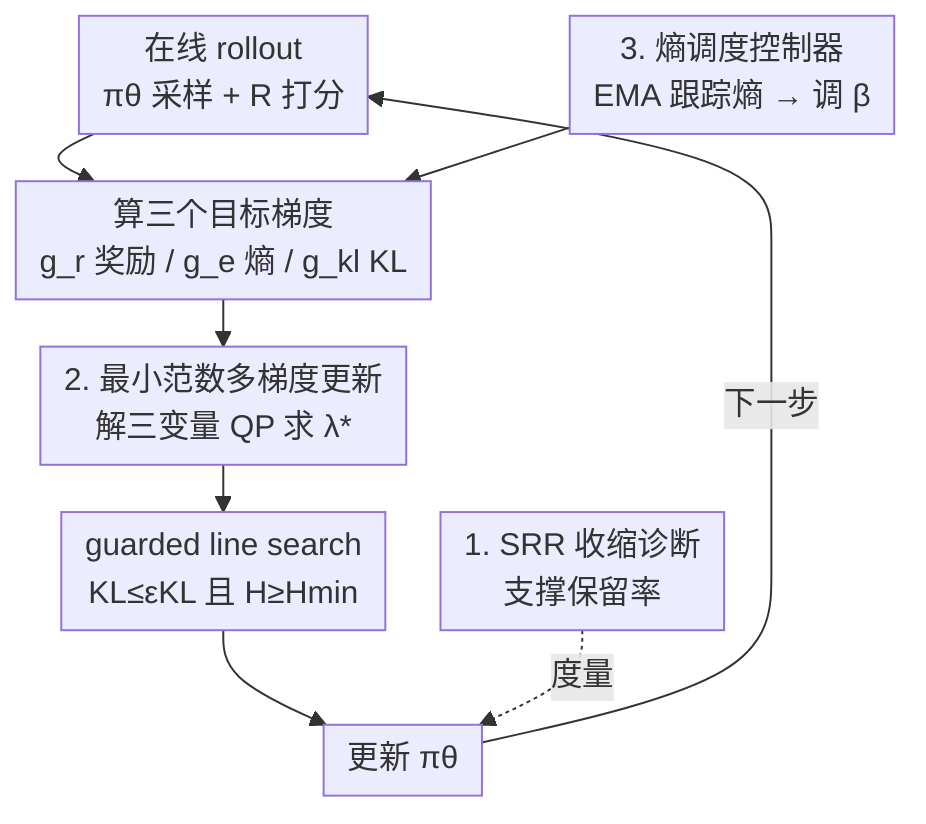

# Escaping Policy Contraction: Contraction-Aware PPO (CaPPO) for Stable Language Model Fine-Tuning

**会议**: ICLR 2026  
**OpenReview**: [https://openreview.net/forum?id=vDlkJewkDu](https://openreview.net/forum?id=vDlkJewkDu)  
**领域**: 对齐RLHF / 强化学习  
**关键词**: RLHF, PPO, 策略收缩, 多目标优化, 熵调度  

## 一句话总结
本文指出 PPO 做 RLHF 时会让策略"支撑集"逐步收缩（熵塌缩、重复变多、SFT 里很多合理回答概率被抹平），提出用支撑保留率 SRR 量化这一现象，并设计 CaPPO——把奖励、熵、KL 当成平级目标做最小范数多梯度更新，再配一个熵调度控制器，在不掉对齐胜率（反而 +2~4 点）的前提下把多样性和支撑保留率显著拉回来。

## 研究背景与动机

**领域现状**：主流对齐管线是 SFT 之后用 PPO 做 RLHF——先训一个偏好奖励模型，再用 PPO 在线优化策略，同时用一个对参考策略（SFT 模型）的 KL 惩罚来稳定训练、抑制 reward hacking。这套配方在指令跟随、对话系统上被广泛采用。

**现有痛点**：实践者反复观察到一个副作用——经过在线 RL 微调后，模型输出多样性下降：每 token 熵变低、重复率上升、SFT/参考模型下许多本来合理的候选回答概率几乎归零。常用的多样性代理指标（Self-BLEU、Distinct-n）虽有信号，但对解码策略敏感、噪声大，没法干净地诊断"支撑集到底丢了多少"。

**核心矛盾**：标准 PPO 在目标函数里把奖励最大化当成首要目标，把熵正则和 KL 正则当成系数固定（或人工调）的次要项。这种"标量化加权"很脆：当奖励尺度大、或 critic 估计噪声大时，熵会迅速塌缩、策略收缩到一小撮高奖励回答上。一旦熵掉到某个水平以下，探索失效、重复上升、概率质量畸形地集中——奖励看着在涨，分布却在恶化。用静态熵系数或手调 KL 权重去控制这种塌缩，既不可靠又强烈依赖数据集/底座/尺度。

**本文目标**：(1) 给"策略收缩"一个解码无关、可跨 prompt 比较的直接度量；(2) 设计一个能在不牺牲对齐性能的前提下、系统性缓解收缩的 PPO 改造，而不是靠手调系数。

**切入角度**：作者把多样性/支撑保留从"附加惩罚项"提升为"一等训练目标"。既然奖励、熵、KL 三者本质上是相互冲突的多目标，就不该用固定权重硬加在一起，而该在每一步求一个对三者都不损害（Pareto 改进）的更新方向。

**核心 idea**：用最小范数多梯度下降（求三个目标梯度凸包里范数最小的组合方向）替代脆弱的标量化加权，再叠一个反馈式熵调度控制器把 token 熵稳定在目标值附近——把"防收缩"做进 PPO 的优化几何里。

## 方法详解

### 整体框架

CaPPO 是 PPO 的一个 drop-in 替换，目标是阻止在线微调中策略支撑集收缩。它在标准 PPO 的裁剪代理损失之外，把奖励改善、熵保持、KL 约束三件事当成**平级目标**：每一步先各自算出三个目标的梯度，求一个最小范数凸组合作为实际更新方向（近似一个 Pareto 改进步），再用一个 guarded line search 确保奖励有进展、同时熵不过度损失、KL 不越界。与此并行，一个熵调度控制器持续监测 token 熵，用比例反馈动态调整熵系数 $\beta$：熵塌缩时注入探索压力，熵足够时放松。诊断侧则用 SRR 来量化收缩、验证缓解效果。

记 $\pi_{\text{ref}}$ 为 SFT 参考策略、$\pi_\theta$ 为可训练策略、$R(x,y)$ 为偏好模型打分，序列对数似然按长度归一化。

### 关键设计

**1. SRR：给"策略收缩"一个解码无关的直接度量**

要修一个问题，先得能干净地量它。作者发现既有多样性指标（Self-BLEU、Distinct-n）都依赖解码采样、噪声大，无法直接回答"训练后的策略对 SFT 分布丢了多少支撑"。为此定义支撑保留率（Support Retention Ratio, SRR）：在固定阈值 $\tau$ 下，从参考策略采的 SFT 回答中，有多大比例在当前策略下的长度归一化对数似然仍高于 $\tau$：

$$\text{SRR}(\tau) = \mathbb{E}_x \Pr_{y\sim\pi_{\text{ref}}(\cdot|x)}\Big[\tfrac{1}{|y|}\log\pi_\theta(y\mid x) \ge \tau\Big]$$

阈值 $\tau$ 用参考策略的某个分位数来定，长度归一化让不同 prompt 可比。它衡量的是"SFT 集合里还有多少在新策略下依然概率不可忽略"，完全独立于解码启发式。配合熵/前向 KL 轨迹（收缩的特征是 KL 不降甚至升、而熵持续下滑）和 SFT 回答的对数似然直方图（PPO 后质量集中、左尾变重），三件诊断工具共同坐实了收缩现象——表 1/2 显示 PPO 让熵从 3.88→3.42、KL 升到 ≈0.45，SRR 只有 0.37~0.41。

**2. 最小范数多梯度更新：把奖励/熵/KL 当 Pareto 平级目标**

这是 CaPPO 的核心，针对"标量化加权很脆"这个痛点。定义三个最大化目标：奖励项 $J_r=-L^{\text{PPO}}_{\text{reward}}$、熵项 $J_e=H(\pi_\theta)$、KL 项 $J_{kl}=-\text{KL}(\pi_\theta\|\pi_{\text{ref}})$，对应梯度 $g_r,g_e,g_{kl}$。当原点落在三个梯度的凸包内时即为 Pareto 稳定点 $0\in\text{co}\{g_r,g_e,g_{kl}\}$。CaPPO 不去手调权重，而是每步求梯度凸包里**范数最小的凸组合**作为更新方向：

$$\min_{\lambda\in\Delta^3}\ \big\|\lambda_r g_r+\lambda_e g_e+\lambda_{kl}g_{kl}\big\|_2^2,\quad \hat g=\sum_i\lambda_i g_i,\quad \theta\leftarrow\theta+\eta\hat g$$

由于三个目标尺度不同，先用对角度量 $P^{-1/2}$（如 Adam 二阶矩或参考策略的 Fisher 对角）预条件化再求解。三目标问题退化成一个三变量二次规划，用两三步投影梯度或 Frank-Wolfe 即可解。它等价于一个带约束视角 $\max_\theta J_r$ s.t. $\text{KL}\le\epsilon_{kl},\,H\ge\epsilon_e$，拉格朗日乘子就对应自适应的混合权重；当梯度互相冲突时，按余弦相似度抬高混合权重下界以抑制塌缩。这样保证"奖励的进展不以熵塌缩或 KL 失控为代价"，且完全兼容 PPO 的裁剪代理。

**3. 熵调度控制器：把 token 熵稳在目标值的反馈回路**

多梯度更新解决了"方向"，但探索强度还需要一个稳定器。控制器用 EMA 跟踪长度归一化序列熵 $\tilde H_t=(1-\alpha)\tilde H_{t-1}+\alpha H_t$，再用裁剪的比例更新把熵系数 $\beta$ 推向时变目标 $H_{\text{target}}(t)$：

$$\beta_{t+1}=\text{clip}\big(\beta_{\min},\ \beta_t+\eta(H_{\text{target}}(t)-\tilde H_t),\ \beta_{\max}\big)$$

$H_{\text{target}}$ 可取固定常数、计划式衰减（从探索逐步转向利用），或自适应地设为参考策略熵的 EMA 加一个小偏移以保支撑。熵塌缩时该项加大探索压力，熵足够时放松，并通过 clip 让熵项幅度维持在初始代理量级的 ~5–20%。本质上是一个比例-积分（PI）控制器在调节误差 $H_{\text{target}}-H_t$（默认关掉积分项），既能稳定跟踪熵又不拖慢多梯度更新。消融显示把 $\beta$ 从固定换成自适应，单这一步就把 SRR 从 0.43 拉到 0.59。

### 损失函数 / 训练策略

奖励分量沿用 PPO 裁剪代理 $L^{\text{PPO}}_{\text{reward}}=\mathbb{E}_t[\min(\rho_t A_t,\ \text{clip}(\rho_t,1-\epsilon,1+\epsilon)A_t)]$，其中 $\rho_t=\pi_\theta(a_t|s_t)/\pi_{\theta_{\text{old}}}(a_t|s_t)$，序列奖励按 token 摊平 $r_t=R(x,y)/|y|$、用 GAE 估优势。每次迭代：收集在线 rollout 并估熵/KL → EMA 更新熵估计并按式调 $\beta$ → 算三个预条件化梯度 → 解三变量 QP 得 $\lambda^\star$ → 取最大步长 $\eta$ 使 $\text{KL}\le\varepsilon_{KL}$ 且 $H\ge H_{\min}$ → 更新 $\theta$。理论上该更新是预条件梯度凸包的最小范数元，在 Lipschitz 条件下收敛到 Pareto 稳定点。

## 实验关键数据

数据集：HH-RLHF、Summarize-from-Feedback、UltraFeedback；底座：Qwen2-7B、Qwen2.5-14B、Mistral-7B-Instruct、Llama-3-8B-Instruct；胜率以 SFT=50.0 为基准、3 个种子均值±标准差。

### 主实验

| 数据集 | 模型 | SFT | +PPO | +PPO+Entropy | CaPPO |
|--------|------|-----|------|--------------|-------|
| HH-RLHF | Qwen2-7B | 50.0 | 62.8 | 64.3 | **66.4** |
| HH-RLHF | Qwen2.5-14B | 50.0 | 65.1 | 66.8 | **69.0** |
| Summarize | Llama-3-8B | 50.0 | 58.1 | 59.5 | **62.0** |
| UltraFeedback | Qwen2.5-14B | 50.0 | 64.6 | 66.2 | **69.1** |

CaPPO 在所有底座/数据集上比 PPO 高 2~4 个胜率点，且跨 Qwen/Llama/Mistral 一致，说明缓解收缩的收益是普适的而非依赖某个训练配方。

### 与更多基线对比（Qwen2-7B，三数据集宏平均）

| 方法 | 胜率 | Self-BLEU↓ | Distinct-2↑ | SRR↑ |
|------|------|-----------|-------------|------|
| RRHF (off-policy) | 64.7 | 0.38 | 0.24 | **0.92** |
| PPO | 67.4 | 0.48 | 0.17 | 0.55 |
| VinePPO | 68.6 | 0.45 | 0.19 | 0.62 |
| GRPO | 71.0 | 0.37 | 0.24 | 0.70 |
| **CaPPO** | **71.2** | **0.33** | **0.27** | 0.82 |

离线方法（DPO/IPO/ORPO/KTO/RRHF）保高 SRR（最高 0.92）但胜率低（62~65%）；在线基线（PPO/VinePPO/GRPO）胜率高（67~71%）但 SRR 塌到 0.46~0.62。CaPPO 同时拿到最高/并列最高胜率 + 最低冗余 + 最高词汇多样性，并把支撑保留率拉回 0.82。

### 消融实验

| 配置 | 胜率 | Self-BLEU↓ | Distinct-2↑ | SRR↑ | 说明 |
|------|------|-----------|-------------|------|------|
| PPO (固定 β) | 63.4 | 0.49 | 0.17 | 0.43 | 标量化、静态熵系数 |
| PPO (自适应 β) | 65.1 | 0.42 | 0.21 | 0.59 | 仅加熵调度控制器 |
| CaPPO (完整) | 67.8 | 0.35 | 0.27 | 0.74 | 多梯度 + 控制器 |

标量化扫参实验（表 7）显示：手调 $\lambda_H$ 从 0→0.3，SRR 最多 +0.16、胜率 +0.8；而 CaPPO 的 Pareto 多梯度更新一步给到 +0.32 SRR、+4.7 胜率，且 SRR-胜率权衡全面更优。鲁棒性上（表 8），奖励缩放/改 bootstrap 视野时 CaPPO 的种子方差更低（胜率 std 0.8 vs PPO 1.4）。

### 关键发现
- **两个组件各自有用、合起来更强**：单加熵调度（自适应 $\beta$）就把 SRR 从 0.43→0.59、胜率 +1.7；再叠多梯度 Pareto 更新继续把 SRR 推到 0.74、胜率到 67.8。说明"稳熵"和"换掉脆弱标量化"是互补的两件事。
- **支撑保留与对齐准确度并不根本冲突**：把多样性提升为一等目标后，CaPPO 能同时改善 SRR/Distinct-2 并匹配或超过 PPO 胜率，推翻了"要胜率就得牺牲多样性"的隐含假设。
- **开销可控**：CaPPO 只多两个目标梯度 + 一个三变量 QP，在 8×A100 上达到 PPO 吞吐的 92~94%、峰值显存多约 3.1%；比 GRPO（84~88% 吞吐、+6~7% 显存）更省。

## 亮点与洞察
- **SRR 这个度量本身就值钱**：它把"策略收缩"从模糊的"输出变单调"变成一个解码无关、可跨 prompt 比较的标量，相当于给 RLHF 的分布退化装了个干净的温度计——这类诊断指标往往比方法更易被后续工作复用。
- **用多目标优化的语言重述 RLHF**：把奖励/熵/KL 从"主目标 + 两个惩罚项"改写成三个平级目标 + 最小范数多梯度，是个很漂亮的视角切换——它把"调系数"这个玄学问题变成了每步一个三变量 QP 的确定性求解。
- **控制论视角的熵调度可迁移**：用 PI 控制器把某个统计量（这里是 token 熵）稳在目标轨迹上的思路，可以直接搬到其他需要稳定探索/温度的在线训练场景。

## 局限与展望
- **依赖奖励模型保真度**：整套方法仍建立在偏好奖励模型可信的前提上，奖励本身有偏时缓解收缩不能纠正对齐方向。
- **SRR 需要选阈值**：虽然用长度归一化 + 分位数规则缓解，但阈值选择仍是个需要进一步打磨的自由度。
- **额外计算虽小但非零**：熵控制器和多梯度混合带来约 6~8% 的吞吐损失，大规模训练时仍需权衡。
- **理论收敛性待深化**：作者自承 Pareto 更新在 trust-region RL 下的收敛/稳定性还缺严格分析，是后续工作方向；另一个方向是把训练时的 CaPPO 与推理时多样性/推理控制器结合。

## 相关工作与启发
- **vs PPO / VinePPO / GRPO**：这些在线方法主攻奖励/credit assignment，靠把概率质量重新加权到高奖励模式上提胜率，但会窄化可达集合（SRR 0.46~0.70）。CaPPO 把"保支撑"显式写进优化目标，在同等或更高胜率下把 SRR 拉回 0.82。
- **vs DPO / KTO / IPO / ORPO（离线偏好优化）**：它们离线操作、能较好保留 SFT 分布（SRR 高达 0.92），但不直接控制 RLHF 在线训练中出现的分布漂移，胜率也偏低。CaPPO 是在线路线里把两边优点（高胜率 + 高支撑）合到一起。
- **vs 标量化加权的熵/KL 正则**：传统做法用固定或手调系数，扫参实验证明其 SRR-胜率权衡远不如 Pareto 多梯度；CaPPO 的核心贡献正是用最小范数多梯度替代这种脆弱标量化。

## 评分
- 新颖性: ⭐⭐⭐⭐ 把策略收缩形式化为 SRR + 用多目标 Pareto 视角重写 PPO，视角清晰且实用
- 实验充分度: ⭐⭐⭐⭐ 4 底座 ×3 数据集 + 多基线 + 消融 + 鲁棒性 + 吞吐开销，覆盖全面
- 写作质量: ⭐⭐⭐⭐ 诊断—方法—验证逻辑闭环，公式与算法清楚
- 价值: ⭐⭐⭐⭐ drop-in 兼容 PPO、开销小、同时提胜率和多样性，工程可用性高

<!-- RELATED:START -->

## 相关论文

- [\[ICLR 2026\] Proximal Supervised Fine-Tuning](proximal_supervised_fine-tuning.md)
- [\[ICLR 2026\] On-Policy RL Meets Off-Policy Experts: Harmonizing Supervised Fine-Tuning and Reinforcement Learning via Dynamic Weighting](on-policy_rl_meets_off-policy_experts_harmonizing_supervised_fine-tuning_and_rei.md)
- [\[ICLR 2026\] Fine-tuning Behavioral Cloning Policies with Preference-Based Reinforcement Learning](fine-tuning_behavioral_cloning_policies_with_preferencebased_reinforcement_learn.md)
- [\[ICLR 2026\] SRFT: A Single-Stage Method with Supervised and Reinforcement Fine-Tuning for Reasoning](srft_a_single-stage_method_with_supervised_and_reinforcement_fine-tuning_for_rea.md)
- [\[ICLR 2026\] All Roads Lead to Likelihood: The Value of Reinforcement Learning in Fine-Tuning](all_roads_lead_to_likelihood_the_value_of_reinforcement_learning_in_fine-tuning.md)

<!-- RELATED:END -->
