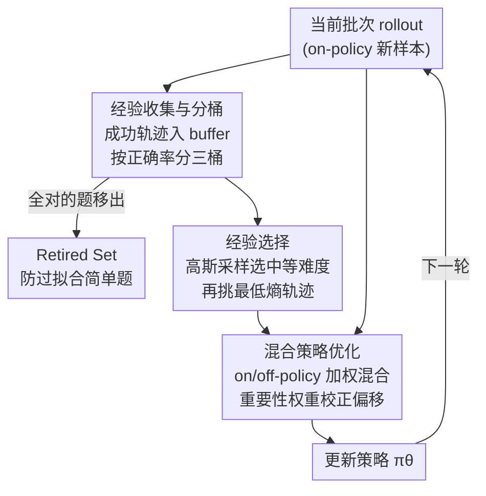

# ExGRPO: Learning to Reason from Experience

**会议**: ICLR 2026  
**arXiv**: [2510.02245](https://arxiv.org/abs/2510.02245)  
**代码**: [GitHub](https://github.com/RanranZhang/ExGRPO)  
**领域**: LLM推理/强化学习  
**关键词**: 经验回放, RLVR, 推理强化学习, 经验管理, GRPO

## 一句话总结
首次系统研究什么样的推理经验对RLVR最有价值，发现中等难度问题+低熵轨迹最有效，据此提出ExGRPO框架进行经验管理和混合策略优化，在数学推理上平均+3.5分，通用推理+7.6分。

## 研究背景与动机

**领域现状**：RLVR（强化学习+可验证奖励）已成为提升LLM推理能力的核心范式，GRPO等on-policy方法是主流。训练过程中模型生成大量推理轨迹（经验）。

**现有痛点**：标准on-policy训练在单次梯度更新后就丢弃rollout经验，导致计算资源浪费和训练不稳定。虽然传统RL中经验回放已被广泛研究，但在大模型RLVR场景中，什么样的经验最有价值这一基础问题尚未被深入探讨。

**核心矛盾**：大量经验被收集但并非等价——有些问题太简单（无学习信号），有些太难（噪声大）；有些轨迹推理正确，有些"蒙对答案"但推理错误。如何辨别和利用高价值经验是关键。

**本文目标**：(1) 什么构成有价值的推理经验？(2) 如何系统管理和复用这些经验？

**切入角度**：从问题难度和轨迹熵两个维度系统分析经验价值。发现中等难度（正确率25%-75%）提供最强优化信号，低熵轨迹对应更高质量的推理链。

**核心 idea**：按难度分桶管理经验，优先采样中等难度+低熵轨迹进行混合on-policy/off-policy优化。

## 方法详解

### 整体框架
ExGRPO要解决的是标准on-policy RLVR的一个浪费：每批rollout只用一次梯度更新就被丢掉，而其中真正有学习价值的成功轨迹没被复用。它的做法是在GRPO之上挂一个replay buffer存历史成功轨迹，并把"什么经验最有价值"拆成三步显式管理——先把成功轨迹**收集**进buffer并按问题难度**分桶**，再从buffer里**选择**中等难度问题下的低熵轨迹，最后把这些off-policy经验和当批on-policy新样本**混合优化**。更新后的策略产生下一批rollout，又有新的成功轨迹回流进buffer，形成闭环。整个流程的核心判断是：经验不等价，要让训练信号集中在中等难度、推理可靠的那部分轨迹上。

### 关键设计

**1. 经验收集与分桶：按正确率把问题分层，让不同强度的学习信号分开处理**

模型成功解出的轨迹被收进buffer，每个问题 $q^*$ 用它最近一轮的正确率 $\text{Acc}(q^*) = k/K$（K 次rollout中对了 k 次）打标签，分成三桶：Easy [75%, 100%)、Medium (25%, 75%]、Hard (0, 25%]。难度不同意味着学习信号强弱不同，太简单的题几乎没有梯度信号、太难的题噪声大，所以要分层后差异化采样。这里还有一个关键的清理机制——Retired Set：一旦某个问题的所有rollout全部答对，就把它移出buffer，避免模型反复在已经掌握的简单题上过拟合、白白消耗算力。

**2. 经验选择：先按难度分布挑问题，再在问题内挑最可靠的那条轨迹**

选择分两步。第一步按一个以 0.5 为中心的高斯分布给问题采样，概率 $p \propto \mathcal{N}(\text{Acc}(q^*); \mu=0.5, \sigma=1)$，于是正确率接近 50% 的中等难度问题被优先选中——实验证实这类问题提供最强的优化信号。第二步在选中的问题里，从当前策略下挑熵最低的那条轨迹 $o^* \leftarrow \arg\min_{o_i} H(o_i; \pi_\theta)$。之所以用低熵做代理，是因为高熵轨迹常常是"答案蒙对、推理过程其实错了"，如果反复把这种轨迹采样进训练，错误推理会被不断强化，形成"滚雪球效应"污染训练；低熵轨迹则对应更连贯可靠的推理链。

**3. 混合策略优化：on-policy 与 off-policy 联合训练，并用重要性权重校正分布偏移**

最终目标是把当批新样本和历史经验加权混合：

$$\mathcal{J}_{\text{ExGRPO}} = (1-\rho)\cdot\mathcal{J}_{\text{on}} + \rho\cdot\mathcal{J}_{\text{exp}}$$

混合比例 $\rho$ 控制经验样本的占比。off-policy 这部分因为轨迹是旧策略产生的，直接拿来优化会有分布偏移，所以用重要性权重 $w_t^*(\theta) = \frac{\pi_\theta(o_t^*|q^*)}{\pi_{\theta_{\text{past}}}(o_t^*|q^*)}$ 做校正，保证梯度估计无偏。之所以要"混合"而不是纯回放，是因为只回放低熵历史轨迹会压制探索，掺入on-policy新样本才能保住模型继续探索新解法的能力。

### 损失函数 / 训练策略
- 基于Dr.GRPO：去掉长度归一化和标准差归一化
- 混合比例 $\rho$ 控制经验样本占比
- Off-policy样本构建混合优势估计组：1个历史轨迹 + K-1个新rollout

## 实验关键数据

### 主实验
5个骨干模型(1.5B-8B)在数学和通用推理上的增益：

| 模型 | 数学平均增益 | 通用推理增益 | 说明 |
|------|------------|------------|------|
| Qwen2.5-Math-1.5B | +3-4分 | +7-8分 | 各benchmark |
| Qwen2.5-Math-7B | +3-4分 | +7-8分 | AIME/AMC等 |
| Llama-3.1-8B | 稳定训练 | 显著提升 | on-policy坍塌 |
| LUFFY模型 | 持续改进 | 持续改进 | on-policy坍塌 |

### 消融实验

| 配置 | 数学指标 | 说明 |
|------|---------|------|
| Full ExGRPO | 最优 | 完整方案 |
| w/o 难度分桶(随机采样) | 下降 | 中等难度优先很重要 |
| w/o 低熵选择 | 下降 | 低熵轨迹质量更高 |
| w/o 重要性权重 | 下降 | 分布偏移需要校正 |
| w/o Retired Set | 下降 | 过拟合简单题 |

### 关键发现
- ExGRPO在弱模型(Llama-3.1-8B)和强模型(LUFFY)上稳定训练，而on-policy GRPO崩溃
- 中等难度问题贡献最大，Hard组贡献最少但不应完全丢弃（提供互补信号）
- 高熵正确轨迹->推理错误但答案正确的"蒙对"现象在replay中被放大（滚雪球效应），低熵选择有效避免
- 经验回放使平均训练开销不增反降（因为复用历史rollout减少了生成次数）

## 亮点与洞察
- **经验价值的系统分析**：首次从问题难度和轨迹熵两个维度分析RLVR中经验的价值，发现简洁有力——中等难度+低熵。这个insight对整个RLVR领域都有指导意义。
- **"滚雪球效应"的发现**：高熵轨迹虽然答案对但推理错误，反复采样会污染训练。论文发现了模型学会"用代码块做数学题"的退化案例，直接归因到高熵经验。
- **Retired Set设计**：将已完全解决的问题移出buffer，简单但有效——防止过拟合简单题，让资源聚焦在有学习价值的中等难度问题上。

## 局限与展望
- 难度分桶的阈值(25%/75%)是固定的，随训练进行模型能力变化时应动态调整
- 熵作为轨迹质量代理指标并非完美——某些情况下高熵也可能有价值（如探索新解法）
- 仅在数学推理上验证，代码推理等其他领域的最优经验特征可能不同
- 经验的"过时"问题——历史轨迹在策略更新后可能已不再最优

## 相关工作与启发
- **vs GRPO**: ExGRPO在GRPO基础上增加经验管理，+3.5分数学/+7.6分通用推理
- **vs ReMix/RePO**: 这些方法也做经验回放但忽略数据质量，ExGRPO的分桶+低熵选择更精细
- **vs LUFFY**: LUFFY混合专家数据和on-policy，ExGRPO用模型自身历史经验，不需要额外数据

## 评分
- 新颖性: ⭐⭐⭐⭐ 经验值分析角度新颖，滚雪球效应发现有洞察力
- 实验充分度: ⭐⭐⭐⭐⭐ 5个骨干模型、数学+通用benchmarks、详细消融
- 写作质量: ⭐⭐⭐⭐ 动机分析清晰，preliminary study有说服力
- 价值: ⭐⭐⭐⭐⭐ 对RLVR训练实践有直接指导意义，insights可迁移

<!-- RELATED:START -->

## 相关论文

- [\[ICLR 2026\] Learning to Reason Efficiently with Discounted Reinforcement Learning](learning_to_reason_efficiently_with_discounted_reinforcement_learning.md)
- [\[ICLR 2026\] Reliability-Adjusted Prioritized Experience Replay](reliability-adjusted_prioritized_experience_replay.md)
- [\[ICLR 2026\] Learning to Reason as Action Abstractions with Scalable Mid-Training RL](learning_to_reason_as_action_abstractions_with_scalable_mid-training_rl.md)
- [\[ICLR 2026\] R1-Code-Interpreter: LLMs Reason with Code via Supervised and Multi-stage Reinforcement Learning](r1-code-interpreter_llms_reason_with_code_via_supervised_and_multi-stage_reinfor.md)
- [\[ICML 2026\] Agent Learning via Early Experience](../../ICML2026/reinforcement_learning/agent_learning_via_early_experience.md)

<!-- RELATED:END -->
