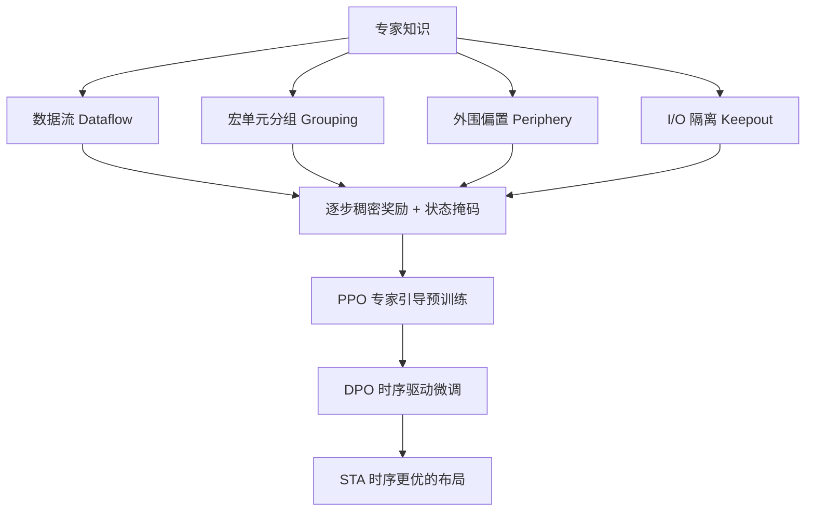

# Expertise Can Be Helpful for Reinforcement Learning-based Macro Placement

**会议**: ICLR 2026  
**代码**: [lamda-bbo/EXPlace](https://github.com/lamda-bbo/EXPlace)  
**领域**: 强化学习 / AI for EDA / 芯片宏单元布局  
**关键词**: 宏单元布局, 强化学习, EDA 专家知识, 数据流, 偏好优化, 时序优化  

## 一句话总结
EXPlace 把芯片布局工程师多年沉淀的四类专家知识（数据流、宏单元分组、外围偏置、I/O 隔离）显式编码成 RL 的稠密奖励与状态掩码，再用 DPO 模仿专家"基于后端 PPA 反馈迭代精修"的工作流做时序微调，让 RL 布局首次在 TNS/WNS 等真实 sign-off 指标上大幅领先解析式、黑盒和 RL 同行。

## 研究背景与动机
**领域现状**：自 AlphaChip 登上 Nature 后，强化学习把宏单元布局建模成 MDP（每步放一个宏单元），凭借优化效率和泛化潜力成为 EDA 自动布局的热门方向，后续工作在状态表示、稠密奖励等维度不断改进。

**现有痛点**：学术界的 RL 布局方法几乎都在优化"过度简化的代理目标"——宏单元半周长线长（HPWL）、矩形均匀线密度，却忽略了工业界用几十年验证出来的工程 know-how 与设计规则。论文用 Table 1 系统对比了主流方法对四类专家知识（数据流、宏单元分组、外围偏置、I/O 隔离）和时序指标的覆盖情况，发现现有方法要么只考虑单一专家规则（如 MaskRegulate 仅用外围约束），要么受黑盒形式所限难以精确建模专家规则，没有一个能完整覆盖这套工业知识。

**核心矛盾**：代理目标和最终 PPA 指标之间存在系统性鸿沟。直接优化时序等准确反馈是最直接的办法，但 PPA 评估（尤其静态时序分析 STA）代价高昂，导致绝大多数方法干脆过拟合代理目标、忽视后端反馈，最终产出的布局与人类专家方案差异巨大，难以进真实生产流程。

**本文目标**：让 RL 布局真正可用于工业，同时弥合自动布局与人工布局之间的差距，免去大量后续人工精修。

**核心 idea**：**专家知识注入 + 专家工作流模仿**。一方面把四类成熟布局经验拆解成与已放置布局对齐的逐步信号，注入 RL 的奖励和状态；另一方面用偏好优化（DPO）模拟专家"先搭原型、再依据后端时序反馈迭代精修"的流程，把它落成"预训练 + 微调"管线。论文借此呼应一个更大的 AI for EDA 范式：**把领域专长融入数据驱动学习是有益的**（与溯因学习 abductive learning 的思路一脉相承）。

## 方法详解

### 整体框架
EXPlace 在 MaskPlace 式的网格化 MDP 布局器基础上做两层加法：先把四类专家知识统一转写成"稠密奖励 + 状态掩码"喂给 PPO 预训练出一个"懂专家规则"的策略；再用 DPO 偏好优化对该策略做时序驱动的微调，让分布逐步向时序更好的轨迹偏移。关键巧思是这四类专家代价都能做**增量分解**——放下一个宏单元时只需累加它与已放宏单元的成对代价，天然给出每步稠密奖励，并能在整张画布上算出一张二维掩码作为状态特征。

### 关键设计

**1. 数据流引导：把 RTL 信息流转成方向感知的稠密掩码。** 数据流是寄存器传输级（RTL）的连接签名，能反映功能块之间信息流的强度与方向，且因为数据传输大多经组合逻辑或 flip-flop 中转，数据流路径天然与决定 WNS/TNS 的关键时序路径重合。EXPlace 在 netlist 层抽取数据流，去掉组合单元、把宏到宏的路径聚合成边权 $w(i,j)=\sum_{p\in P_{i,j}}\frac{1}{2^{N(p)}}$（路径越长、flip-flop 跳数 $N(p)$ 越多贡献越小），再定义数据流加权曼哈顿距离代价 $\text{cost}_{df}=\sum_{i\in M}\sum_{j\in M} w(i,j)\cdot\lVert pos_i-pos_j\rVert_1$。这个代价由独立成对项组成，放第 $t$ 个宏时只需累加它与前面已放宏的代价即得稠密奖励，并在每个候选格点算出期望奖励形成数据流掩码 $M^{df}_t$，作为带"梯度倾向"的状态特征引导策略把强数据流的宏放得更近。

**2. 宏单元分组：按层次复用结构鼓励同组宏紧凑共置。** 现代芯片普遍采用层次化设计，同一层次内常出现大量结构相似的复用宏（如 4KB 内存由四个相同 1KB 宏拼成），它们脚印一致、连接高度相似、频繁交换数据，专家习惯把它们成组共置以减线长、规则平铺、简化时钟树平衡与供电网络。EXPlace 采用比 Hier-RTLMP 更严的分组判据——同时满足"与同一 cell 簇共享超过 30 条 net、脚印相似、属于同一设计层次"才分组；若无显式层次则用 Louvain 聚类从 netlist 推断代理层次。分组代价取各组包围盒面积之和 $\text{cost}_g=\sum_{c_i\in C} w_i\cdot h_i$，同样可增量分解（放某宏只计入它所属组包围盒面积的增量），由此得到分组掩码 $M^g$ 注入状态。

**3. 外围偏置与 I/O 隔离：用两张几何掩码守住可布线性。** 把宏推向芯片外围是公认实践——宏占用低层金属（信号布线层），若挤在核心区会逼出标准单元、制造长绕线和拥塞，还妨碍解析式全局布局收敛与供电/时钟规划。外围代价定义为各宏到最近边界的 x/y 方向距离之和 $\text{cost}_{peri}=\sum_{i\in M}(d^i_x+d^i_y)$，每步算出外围掩码 $M^{peri}$。I/O 隔离则针对一个此前学习类布局器从未显式处理的问题：I/O 端口位于外围、信号需要缓冲驱动长互连，而宏又恰好爱往外围放、抢走 I/O 缓冲与布线资源。EXPlace 在 I/O 端口周围预留隔离区，用 $\text{cost}_{IO}=\sum_{i\in M}\text{overlap}(i, \text{I/O regions})$ 惩罚宏与隔离区的重叠面积，重叠对每个宏独立、可直接转成逐步奖励与掩码。所有奖励统一取掩码代价的负值并用首条轨迹统计的 max/min 归一化，加权求和时上调外围与分组、下调 I/O 隔离以保留灵活性。在 OpenROAD 上还启用基于 corner stitching 的受约束动作空间，把选中位置吸附到已放宏的角点或画布边界，进一步强化外围偏置与规则排布。

**4. 专家工作流模仿：用 DPO 把代理目标对齐到真实时序。** 专家先靠经验搭一个高质量布局原型，再依据后端反馈反复"评估—更新"直到满足规格——这正对应"预训练 + 微调"。EXPlace 用 PPO（带局部/全局双分支 CNN 策略网络）在专家稠密奖励上预训练出原型策略，再做时序驱动微调：每轮采样多条轨迹、按 STA 结果切成 preferred/rejected 偏好对 $D$，用 DPO 损失 $L_{DPO}=-\mathbb{E}_{(\tau_w,\tau_l)\sim D}\big[\log\sigma\big(\beta\log\frac{\pi_\theta(\tau_w)}{\pi_{ref}(\tau_w)}-\beta\log\frac{\pi_\theta(\tau_l)}{\pi_{ref}(\tau_l)}\big)\big]$ 提升优选轨迹、压低劣选轨迹的概率。轨迹级评估提高了样本效率，而依赖定性优劣信号也缓解了 STA 结果崎岖地形带来的噪声，反复自我改进后概率质量持续向时序更好的轨迹迁移。

## 实验关键数据

### 主实验表格
在 ICCAD 2015 Contest 八个 case 上，EXPlace（仅预训练、未时序微调，保证与 RL 同行公平比较）在六项指标的五项上拿到最佳平均排名：

| 指标 | DREAMPlace | MaskPlace | MaskRegulate | LaMPlace | EXPlace |
|------|-----------|-----------|--------------|----------|---------|
| rWL 平均排名 | 4.38 | 4.12 | 3.00 | 2.12 | **1.38** |
| WNS 平均排名 | 3.75 | 4.00 | 3.38 | 2.12 | **1.75** |
| TNS 平均排名 | 4.12 | 4.50 | 2.75 | 2.50 | **1.12** |
| NVP 平均排名 | 4.50 | 4.25 | 2.25 | 2.75 | **1.25** |

相对各指标的亚军方法，EXPlace 平均提升 rWL 3.41%、NVP 10.73%、WNS 7.74%、TNS 32.53%；其中相对整体亚军 LaMPlace 的 TNS 提升达 32.53%，可显著缓解实际设计中的时序收敛压力。唯一略逊的是 rOverflowV，因为 MaskRegulate 只盯外围代价、把宏极紧地压到边界，直接讨好了这一指标。

OpenROAD 基准（6 个 case，跑完整 OpenROAD 流程含 CTS/全局/详细布线）上 EXPlace 在 rWL、WNS、TNS、DRC、Power、Cell Area **所有指标**均取得最佳平均排名，全面领先 DREAMPlace、Hier-RTLMP 等。

### 消融实验表格
在三个代表性 ICCAD 2015 case 上逐一移除各专家组件（Table 6），每个组件都正向贡献，完整 EXPlace 最优：

| 配置 | rWL 排名 | WNS（superblue1） | TNS（superblue1） |
|------|---------|-------------------|-------------------|
| w/o Dataflow | 3.33 | -65.30 | -9.88 |
| 完整 EXPlace | 最佳 | -58.6 | -8.63 |

数据流引导和外围偏置影响最显著：去掉数据流引导后时序指标（WNS/TNS）大幅恶化，因为数据流路径与跨宏/flip-flop 的关键时序路径强相关；去掉外围偏置后布线溢出（rOverflowH/V）和线长（rWL）明显变差，印证外围放置对可布线性和线长的必要性；宏单元分组对线长和时序也有可观贡献。

### 关键发现
- 四类专家知识"全谱注入"比只用单一规则（MaskRegulate 仅外围）系统性更强，验证了完整覆盖工业 know-how 的价值。
- 增量可分解的代价设计是把高层专家指导落成 RL 稠密奖励的关键技术杠杆，让奖励既稠密又与已放布局对齐。
- 时序驱动 DPO 微调与预训练解耦，既能公平对比 RL 同行，又能在需要时进一步压低 WNS/TNS。

## 亮点与洞察
- **把"专家知识"做成可即插即用的 RL 组件**：四类知识统一转写为"掩码 + 稠密奖励"，对现有 RL 布局框架是低侵入的增量，复用性强。
- **增量分解是核心方法论**：成对/独立的代价结构让总代价 = 逐步奖励之和，这是稠密化的本质原因，也是论文优雅之处。
- **DPO 用在布局上很贴切**：STA 评估贵且地形崎岖，用轨迹级偏好对而非绝对奖励，既省评估又抗噪，把"专家迭代精修"这一行为成功形式化。
- **首次显式处理 I/O 隔离**：填补了学习类布局器对 I/O 拥塞这一现实问题的空白。
- **指向更大范式**：呼应"领域专长 + 数据驱动"（abductive learning 式）的 AI for EDA 主张，立意超出单一任务。

## 局限与展望
- 四类专家知识的奖励权重靠经验设定（上调外围/分组、下调 I/O），缺乏自适应或可学习的权重机制，换工艺/设计可能需重调。
- corner stitching 受约束动作空间只在 OpenROAD（宏形状统一、层次清晰）上启用，作者也承认严格外围放置并非普适，对不规则设计的适配性有待验证。
- 分组判据（>30 net、相似脚印、同层次）含若干硬阈值，对没有显式层次的设计依赖 Louvain 聚类的代理层次，鲁棒性未充分展开。
- 时序微调依赖 STA 评估，虽用 DPO 提升样本效率，但真实生产环境下 PPA 评估成本与微调迭代次数的权衡仍需更多研究。
- 实验集中在 ICCAD 2015 与 OpenROAD 两套基准，更大规模真实工业设计上的可扩展性与泛化仍待检验。

## 相关工作与启发
- **RL 布局谱系**：AlphaChip/DeepPlace/MaskPlace/ChiPFormer/MaskRegulate/EfficientPlace 等沿状态表示、稠密奖励、泛化等方向演进，EXPlace 接续 MaskPlace 的 wiremask 思路并把"掩码"扩展到四类专家知识。
- **专家知识融合**：IncreMacro（可微外围代价）、Hier-RTLMP（层次分组 + 模拟退火）、若干 BBO 方法引入数据流，但都覆盖不全或受黑盒所限；EXPlace 在 RL 内做了更完整的统一。
- **偏好优化**：直接把 LLM 对齐里的 DPO 迁移到布局微调，是 RLHF 式方法跨域到 EDA 的有趣案例，启发其他"评估昂贵 + 反馈崎岖"的优化任务。
- **AI for EDA 范式启示**：把人类工程经验编码为可微/可分解的学习信号，而非让模型从零数据中重新发现，是数据驱动方法走向工业落地的一条务实路径。

## 评分
- **新颖性**: ⭐⭐⭐⭐ — 单看 DPO、掩码、专家规则都非全新，但把四类工业专家知识系统化转写为可增量分解的 RL 稠密奖励、并用 DPO 模仿专家精修工作流，组合与立意都有新意，I/O 隔离更是首次显式处理。
- **实验充分度**: ⭐⭐⭐⭐ — 两大主流基准、三类代表性 baseline、完整 sign-off PPA 指标、逐组件消融齐全，相对亚军 TNS 提升 32.53% 说服力强；稍欠更大规模工业设计与权重敏感性分析。
- **写作质量**: ⭐⭐⭐⭐ — 动机—方法—实验逻辑清晰，Table 1 把"专家知识覆盖"对比讲得很直观，公式与掩码图配合到位。
- **价值**: ⭐⭐⭐⭐ — 直击 RL 布局难落地工业的真痛点，开源代码，对 AI for EDA 与"领域知识 + 学习"范式都有实践与启发价值。

<!-- RELATED:START -->

## 相关论文

- [\[ICLR 2026\] Use the Online Network If You Can: Towards Fast and Stable Reinforcement Learning](use_the_online_network_if_you_can_towards_fast_and_stable_reinforcement_learning.md)
- [\[ICLR 2026\] How Far Can Unsupervised RLVR Scale LLM Training?](how_far_can_unsupervised_rlvr_scale_llm_training.md)
- [\[ICML 2026\] You Can Learn Tokenization End-to-End with Reinforcement Learning](../../ICML2026/reinforcement_learning/you_can_learn_tokenization_end-to-end_with_reinforcement_learning.md)
- [\[NeurIPS 2025\] When Can Model-Free Reinforcement Learning be Enough for Thinking?](../../NeurIPS2025/reinforcement_learning/when_can_model-free_reinforcement_learning_be_enough_for_thinking.md)
- [\[ICLR 2026\] Prosperity before Collapse: How Far Can Off-Policy RL Reach with Stale Data on LLMs?](prosperity_before_collapse_how_far_can_off-policy_rl_reach_with_stale_data_on_ll.md)

<!-- RELATED:END -->
