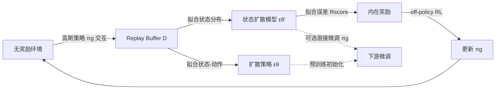

# Exploratory Diffusion Model for Unsupervised Reinforcement Learning

**会议**: ICLR 2026  
**OpenReview**: [https://openreview.net/forum?id=k0Kb1ynFbt](https://openreview.net/forum?id=k0Kb1ynFbt)  
**代码**: [https://github.com/yingchengyang/ExDM](https://github.com/yingchengyang/ExDM)  
**领域**: 强化学习 / 无监督预训练  
**关键词**: 无监督强化学习, 扩散模型, 内在奖励, 状态熵, 在线微调  

## 一句话总结
ExDM 首次把扩散模型引入无监督强化学习，用扩散模型拟合 replay buffer 中异质的状态分布，并以"拟合得不好的区域"作为 score-based 内在奖励驱动探索，同时给扩散策略设计了带收敛保证的高效在线微调算法。

## 研究背景与动机
**领域现状**：无监督强化学习（URL）希望在无奖励环境里预训练智能体，习得可迁移的技能或表示，从而快速适应各种下游任务。由于没有外部奖励，主流做法靠内在奖励引导探索，分为"最大化状态熵的探索流派"和"最大化技能-状态互信息的技能发现流派"两类。

**现有痛点**：探索过程收集到的数据高度异质（策略一直在变、不断访问新状态），但现有方法为了好训练、好采样，往往把预训练策略简化成高斯策略或离散技能策略。这类简单策略既无法捕捉 replay buffer 里多模态的多样行为，也限制了下游迁移的表达能力。

**核心矛盾**：URL 在预训练和微调两端都需要**强建模能力**——准确估计异质状态分布才能算出好的内在奖励，可越强的模型（如扩散策略）越受多步采样之苦，在线训练既不稳定又慢。**「表达力 vs 训练效率」**这对矛盾是 ExDM 要解的核心问题。论文还从理论上证明（Theorem 4.1）：即使在离散环境里，最大化状态熵的最优策略大概率也不是简单的确定性策略，从根上说明 URL 必须用强表达策略。

**本文目标**：用扩散模型同时解决"内在奖励设计"和"策略表达"两个建模瓶颈，并让预训练得到的扩散组件能在有限交互预算下稳定迁移到下游。

**核心 idea**：**「拟合误差即探索信号」** —— 不把扩散模型当生成器用，而是用它对 replay buffer 的拟合质量来定义内在奖励：拟合得差的状态就是没探索够的状态，奖励智能体去那里。同时用**「建模与行动解耦」**把昂贵的扩散采样从交互回路里摘出去。

## 方法详解

### 整体框架
ExDM 分预训练和微调两阶段。预训练阶段：用两个扩散模型 $\epsilon_{\theta'}$、$\epsilon_\theta$ 分别拟合 replay buffer 里的状态分布和状态-动作分布，由扩散模型的拟合误差导出 score-based 内在奖励 $R_{\text{score}}$；为避免扩散策略多步采样拖慢在线交互，真正下场探索的是一个轻量高斯行为策略 $\pi_g$，它用任意 off-policy 算法去最大化 $R_{\text{score}}$。微调阶段：既可以直接用 DDPG 微调高斯策略 $\pi_g$（与基线公平对比），也可以微调表达力更强的扩散策略 $\pi_d$，后者通过一套交替优化 + 能量引导蒸馏的算法实现，并有收敛与最优性保证（Theorem 4.2）。

### 关键设计

**1. Score-based 内在奖励：把扩散模型的拟合误差当探索罗盘。** 要最大化状态熵 $H(d^\pi)$，自然想用 $\log p_{\theta'}(s)$ 衡量某状态被访问的频繁程度，再把 $-\log p_{\theta'}(s)$ 作为奖励鼓励去稀有区域。但扩散模型的对数似然不可直接算，论文转而利用其 ELBO 上界 $-\log p_{\theta'}(s) \le \mathbb{E}_{\epsilon,t}[w_t\|\epsilon_{\theta'}(s_t|t)-\epsilon\|^2]+C$，进而定义内在奖励 $R_{\text{score}}(s)=\mathbb{E}_{\epsilon,t}[\|\epsilon_{\theta'}(s|t)-\epsilon\|^2]$。这个量本质就是扩散模型对该状态的去噪误差——拟合得好的状态误差小、奖励低，拟合得差或没见过的状态误差大、奖励高，于是智能体被自然推向欠访问区域。相比依赖单独密度网络或 RND 随机网络的做法，这里的奖励信号和"模型有没有学好这片分布"直接挂钩，随着 buffer 演化自适应更新。

**2. 建模与行动解耦：扩散负责建模，高斯负责跑腿。** 直接拿扩散策略去和环境交互要 5~15 步采样，在线场景下既慢又不稳。ExDM 把"用什么拟合分布"和"用什么采动作"拆开：扩散模型只在离线 buffer 上更新、提供奖励信号 $R_{\text{score}}$，真正与环境交互、采集数据的是一个高斯行为策略 $\pi_g$，它用任意 off-policy RL 算法（如 DDPG）最大化 $R_{\text{score}}$（见 Algorithm 1：交替进行"采样若干 buffer 数据更新两个扩散模型 + 算内在奖励 + 训 $\pi_g$"和"用 $\pi_g$ 与环境交互填 buffer"）。这样既保住扩散模型的建模强度，又把多步采样的开销挡在交互回路之外，让训练可扩展。

**3. 扩散策略的高效在线微调：交替优化 + 能量引导蒸馏。** 下游微调步数有限，论文把目标写成"最大化回报 + 不偏离预训练策略太远"的 KL 正则形式 $J_f(\pi)=\frac{1}{1-\gamma}\mathbb{E}_{s\sim d^\pi,a\sim\pi}[R(s,a)-\beta\log\frac{\pi(a|s)}{\pi_d(a|s)}]$。由于这个 surrogate reward 依赖策略自身、无法套用经典 RL 分析，ExDM 借鉴 soft RL 定义与策略耦合的 $Q^\pi$，并把求解拆成交替的两步：闭式最优策略形如 $\pi_n(a|s)\propto\pi_d(a|s)e^{Q_{n-1}(s,a)/\beta}$，可证明每步策略单调改进且收敛到最优（Theorem 4.2）。落地时，$Q$ 函数用 IQL（expectile 回归惩罚分布外动作）更新；而 $\pi_n$ 里那个难算的配分函数 $Z(s)$ 被绕过——把从 $\pi_n$ 采样看成对 $\pi_d$ 做能量引导采样，用对比能量预测（CEP）学引导项 $f_{\phi_{n-1}}$，最后通过 score 蒸馏 $\min_\psi\|\epsilon_\psi(a_t|s,t)-\epsilon_\theta(a_t|s,t)-f_{\phi_{n-1}}(s,a_t,t)\|^2$ 把微调后的策略蒸进一个可直接采样的扩散网络 $\epsilon_\psi$。

## 实验关键数据

### 主实验表格
Maze2d 状态覆盖率（0.01×0.01 格子访问比例，10 seeds 均值，越高越好）：

| 方法 | Square-c | Square-d | Square-tree | Square-bottleneck | Square-large |
|------|----------|----------|-------------|-------------------|--------------|
| RE3 | 0.73 | 0.74 | 0.73 | 0.62 | 0.46 |
| MEPOL | 0.96 | 0.77 | 0.89 | 0.62 | 0.59 |
| CIC | 0.86 | 0.74 | 0.89 | 0.58 | 0.47 |
| CeSD | 0.67 | 0.46 | 0.37 | 0.46 | 0.40 |
| **ExDM** | **0.98** | **0.78** | **0.91** | **0.75** | **0.71** |

在最复杂的 Square-bottleneck / Square-large 上，所有基线都卡在墙角附近、覆盖不全，ExDM 几乎探索整张迷宫，覆盖率最高比次优高出约 51%，并能用约 37% 的时间步达到可比性能。

URLB 下游适应（专家归一化分数，10 seeds，越高越好）：

| 设置 | 结论 |
|------|------|
| (a) DDPG 微调高斯策略，对比 12 个 URL 基线 | ExDM 在 mean/median/IQM/OG 四项均显著领先 SOTA |
| (b) 跨形态（cross-embodiment）URLB，对比含 PEAC 等 | ExDM 大幅超出所有基线 |
| (c) 微调扩散策略，对比 DQL/IDQL/QSM/DIPO | ExDM 明显优于现有扩散在线微调方法 |

### 消融实验表格

| 消融项 | 观察 |
|--------|------|
| 预训练步数（100k→2M） | ExDM 从 500k 步起就稳超所有基线，且随预训练步数增加持续提升，说明探索质量切实惠及下游 |
| Q 学习方式（IQL vs In-support Softmax） | 用 IQL 的 ExDM 明显优于 ExDM w/o IQL，验证 expectile 回归惩罚分布外动作的有效性 |
| 扩散采样步数（2~20） | 性能对采样步数较鲁棒，少步采样即可保持高分 |
| 微调温度 $\beta$（1/2.0、1/3.0、1/4.0） | 不同 $\beta$ 下表现稳定，$\beta$ 控制贴近预训练策略的强度 |

### 关键发现
- 扩散模型的拟合误差是个比 RND/uncertainty 更靠谱的探索信号，尤其在分支多、决策点密的复杂迷宫里优势被放大。
- 扩散策略微调虽明显超现有扩散基线，但仍略低于高斯策略微调，作者归因于微调交互步数有限——更高效的扩散在线微调是开放方向。

## 亮点与洞察
- **视角新**：扩散模型几乎都被当生成器用（追求采样保真度），ExDM 反其道而行，用它的去噪误差当"探索价值"信号，是对扩散模型用途的一次有意思的重新定位。
- **理论与工程兼顾**：Theorem 4.1 从状态熵最优策略的复杂性论证了"为什么 URL 需要强表达策略"，给引入扩散模型提供了硬理由；Theorem 4.2 又为扩散策略微调给了收敛与最优性保证。
- **解耦思想干净**：建模（扩散，离线、慢但准）与行动（高斯，在线、快）分工，绕开多步采样的在线瓶颈，是把扩散模型塞进在线 RL 的一种务实范式。

## 局限与展望
- 扩散策略微调性能仍逊于高斯策略微调，受限于有限交互预算，多步采样在线微调的效率问题没被彻底解决。
- 主要在 Maze2d 和 URLB 连续控制上验证，状态/动作维度相对低（迷宫是 $\mathbb{R}^2$），向高维像素观测或更复杂机器人任务的扩展性待考。
- 训练两个扩散模型 + 高斯策略 + IQL + CEP 引导，组件较多、超参（如 $\beta$）需调，整体流程偏重。

## 相关工作与启发
- **探索类内在奖励**（ICM/RND/RE3/MEPOL/LBS）：ExDM 的 $R_{\text{score}}$ 可看作把"用模型拟合误差衡量新颖性"的思路从随机网络/动态预测升级到扩散密度估计。
- **RL 中的扩散模型**（Diffusion Policy/Diffuser/DQL/IDQL）：以往多用于离线 RL 建模多模态行为或规划，ExDM 是首次把它用于无监督探索，并提供在线微调的可行方案。
- **能量引导采样与蒸馏**（CEP、score distillation）：微调阶段绕开配分函数、把引导项蒸进可采样网络的做法，对其它"想在线微调扩散策略"的工作有直接借鉴价值。

## 评分
- 新颖性: ⭐⭐⭐⭐⭐ 首次将扩散模型引入无监督 RL，"拟合误差即探索奖励"的视角与解耦设计都很新颖
- 实验充分度: ⭐⭐⭐⭐ Maze2d + URLB 单/跨形态 + 扩散微调三套设置、十余个基线、10 seeds，消融到位；但环境维度偏低、缺高维像素任务
- 写作质量: ⭐⭐⭐⭐ 动机—理论—方法—实验链条清晰，两个定理支撑有力；方法部分公式密集，对扩散+soft RL 背景要求较高
- 价值: ⭐⭐⭐⭐ 给"强表达模型 vs 在线效率"这一 URL 核心矛盾提供了可复制的解法范式，对探索奖励设计和扩散策略在线微调都有启发

<!-- RELATED:START -->

## 相关论文

- [\[ICLR 2026\] Revolutionizing Reinforcement Learning Framework for Diffusion Large Language Models](revolutionizing_reinforcement_learning_framework_for_diffusion_large_language_mo.md)
- [\[ICLR 2026\] MOBODY: Model-Based Off-Dynamics Offline Reinforcement Learning](mobody_model-based_off-dynamics_offline_reinforcement_learning.md)
- [\[ICLR 2026\] How Far Can Unsupervised RLVR Scale LLM Training?](how_far_can_unsupervised_rlvr_scale_llm_training.md)
- [\[ICLR 2026\] SUSD: Structured Unsupervised Skill Discovery through State Factorization](susd_structured_unsupervised_skill_discovery_through_state_factorization.md)
- [\[ICLR 2026\] One-Step Flow Q-Learning: Addressing the Diffusion Policy Bottleneck in Offline RL](one-step_flow_q-learning_addressing_the_diffusion_policy_bottleneck_in_offline_r.md)

<!-- RELATED:END -->
