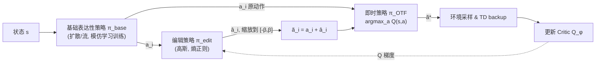

# EXPO: Stable Reinforcement Learning with Expressive Policies

**会议**: ICLR 2026  
**OpenReview**: [https://openreview.net/forum?id=aFjSjkB6CV](https://openreview.net/forum?id=aFjSjkB6CV)  
**代码**: [github.com/pd-perry/EXPO](https://github.com/pd-perry/EXPO)  
**领域**: reinforcement learning  
**关键词**: 表达性策略, 扩散策略, 在线 RL 微调, Offline-to-Online, 价值最大化, 动作编辑  

## 一句话总结
EXPO 用"基础表达性策略只做模仿学习 + 轻量高斯编辑策略最大化 Q 值 + 即时挑选最高价值动作"的组合，绕开了对扩散/流匹配策略直接做价值反传的不稳定问题，实现了样本效率 2-3 倍提升的在线 RL 微调。

问题落点很具体：给定一个**离线数据集**和（可选的）**预训练表达性策略**，如何用在线 RL 高效地继续提升它，而不被去噪链的梯度反传问题拖垮。

## 研究背景与动机
- **领域现状**：机器人领域靠在大数据集上用模仿学习训练**表达性策略**（diffusion policy、flow-matching policy）取得了显著进展，但模仿学习难以达到真实部署所需的高可靠性，自然的下一步是用在线 RL 做自我提升微调。
- **现有痛点**：主流在线 RL（PPO、TD3、SAC）是为简单高斯策略设计的，无法有效利用预训练的表达性策略。表达性策略由一条**很长的去噪链**参数化，当想把动作朝价值函数方向优化时，梯度从动作输出反传到策略参数极其不稳定、且随去噪步数增长开销爆炸。
- **核心矛盾**：表达性策略表达能力强（能刻画复杂多模态行为分布），但**稳定的价值最大化**几乎无法直接做。已有工作要么把多步扩散蒸馏成单步/两步弱策略、要么在中间去噪步插入价值监督，都没有真正解决在线微调下的稳定价值最大化。
- **本文目标**：设计一个高效、稳定、且**与策略参数化无关**的在线 RL 微调方法，能从任意预训练表达性策略起步。
- **核心 idea**：**【绕开直接优化】** 不让表达性基础策略去最大化价值，而是用稳定的模仿学习训练它；价值最大化交给一个**即时构造（on-the-fly）的 RL 策略**——一个轻量高斯编辑策略对基础动作做局部精修，再非参数地挑出价值最高的动作。

## 方法详解

### 整体框架
EXPO 维护两个策略：一个从离线预训练初始化、并在线用模仿学习目标持续训练的**表达性基础策略 $\pi_{base}$**（基础策略永远不被显式训练去最大化价值），以及一个用标准 RL 策略损失训练、负责把基础动作朝高 Q 值方向编辑的**轻量高斯编辑策略 $\pi_{edit}$**。二者在运行时被组合成一个即时策略 $\pi_{OTF}$：先从基础和编辑策略采样若干候选动作，再按 Q 值挑最优，这个最优动作同时用于环境采样**和** TD backup 的目标计算。

### 关键设计

**1. 通过动作编辑做价值最大化与探索：** 基础策略只用模仿学习训练，分布很稳但不会自然移向高价值区。EXPO 因此引入一个高斯编辑策略 $\pi_{edit}(\hat{a}\mid s,a)$，把基础策略采样的动作 $a$ 精修为 $\tilde{a}\leftarrow a+\hat{a}$（式 1）。编辑策略用标准熵正则策略损失训练：

$$L(\pi_{edit})=-\mathbb{E}_{(s,a)\sim D,\hat{a}\sim\pi_{edit}}[Q_\phi(s,a+\hat{a})-\alpha\log\pi_{edit}(\hat{a}\mid s,a)]$$

这既局部爬升 Q 函数又靠熵维持动作多样性——当基础策略行为分布很窄时这种多样性尤为关键。为防止编辑把动作推离行为分布太远，作者把 $\hat{a}$ 缩放到 $[-\beta,\beta]$，$\beta$ 可小（如 0.05，几乎只精修）也可大（如 0.7，需要大量探索时）。这把编辑策略限制在一个**更简单的局部优化问题**上，使它能远小于基础策略、训练既高效又稳定。

**2. RL 策略的即时（on-the-fly）参数化：** 有了基础和编辑两个策略，还需要一种方式同时利用基础策略的表达力和编辑的价值最大化。EXPO 不再显式蒸馏出一个策略网络，而是即时构造 $\pi_{OTF}(a\mid s,\pi_{base},\pi_{edit},\phi)=\arg\max_{a\in\bigcup_i\{a_i,\tilde{a}_i\}}Q_\phi(s,a)$：对 $N$ 个基础动作 $a_i$ 及其编辑版本 $\tilde{a}_i=a_i+\hat{a}_i$，直接挑 Q 值最高者。这个 $\tilde{a}^*$ **同时用于采样和 TD backup 目标**：

$$\min_\phi\mathbb{E}_{(s_t,a_t,s_{t+1})\sim D}[(r_t+\gamma Q_{\phi'}(s_{t+1},\tilde{a}^*_{t+1})-Q_\phi(s_t,a_t))^2],\quad \tilde{a}^*_{t+1}\sim\pi_{OTF}(\cdot\mid s_{t+1})$$

即时提取的好处是 Q 函数一旦更新，立刻反映到行为和 TD 目标里，不像标准策略提取需要缓慢的参数更新才能对齐到新 Q——这等价于用隐式策略做标准 Q-learning 更新，而非滞后的 SARSA。

**3. 数据受限场景的熵 backup：** 当离线数据集不够大或不够宽时，agent 需要更激进地在线探索。EXPO 把基础+编辑视作一个 OTF 策略并加入熵奖励，目标变为 $y=r_t+\gamma[Q_{\phi'}(s_{t+1},\tilde{a}^*_{t+1})-\alpha\log\pi_{OTF}(\tilde{a}^*_{t+1}\mid s_{t+1})]$（式 4-5）。但扩散等表达性策略没有闭式熵，作者改为构造一个软采样分布：先采 $N$ 个基础动作并编辑，再按 $\pi_{sampling}(a_i\mid s)=\frac{\exp\beta Q(s,a_i)}{\sum_k\exp\beta Q(s,a_k)}$ 的概率挑选，从而得到闭式的熵用于 backup。实验显示这在小离线集上能显著改善表现（甚至模仿学习成功率<10% 的数据也能学到近乎完美的策略）。

### 训练策略
实例化时基础策略用 DDPM 训练的扩散策略，目标为去噪误差 $\min_\psi\mathbb{E}\big[\lVert\epsilon-\epsilon_\psi(\sqrt{\bar\alpha_t}a+\sqrt{1-\bar\alpha_t}\epsilon,s,t)\rVert\big]$；编辑策略按 SAC 方式用带熵正则的高斯训练。整体是 off-policy、TD-based 算法（含 UTD ratio $G$ 的多步更新），框架对任意表达性策略类通用。

## 实验关键数据

### 评测设置
- **12 个稀疏奖励连续控制任务**，覆盖 4 个域：D4RL Antmaze（medium/large 迷宫导航）、D4RL Adroit（28-DoF 灵巧手转笔/开门/搬球）、Robomimic（7-DoF Franka 的 Lift/Can/Square）、MimicGen（Threading/Stack）。
- 两种设定：**纯在线 RL**（无预训练）与 **offline-to-online**（离线预训练后在线微调）。EXPO 在 offline-to-online 中**只用模仿学习预训练基础策略**，不预训练 Q 网络（区别于 IDQL/Cal-QL/DAC 同时离线预训练策略和价值），以保证能从任意预训练策略起步。

### 主实验发现

| 设定 | 对比基线 | EXPO 结果 |
|------|----------|-----------|
| 在线 RL（Fig.3） | RLPD、IDQL、DIPO、QSM | 几乎每个任务样本效率显著超过最佳基线，**且无需在离线数据上预训练**；唯一例外是数据极窄的 relocate-binary |
| Offline→Online（Fig.4） | IDQL、Cal-QL、DAC、RLPD | 样本效率与渐近性能整体最佳；操作类任务优势尤其大；**从预训练到微调几乎无性能掉落** |

关键对比：RLPD 靠过采样离线数据虽快但探索最优策略慢；IDQL 受策略约束目标束缚、在线难提升；QSM 用动作梯度匹配扩散损失但训练不稳常学不动；DAC 离线预训练强但在线快速崩溃。EXPO 因基础策略贴近行为分布、编辑只做局部扩张，把离线到在线的分布漂移控制得很小。

### 消融实验

| 消融维度 | 做法 | 结论 |
|----------|------|------|
| TD backup 中的即时提取（Fig.5） | 只在采样时挑最高 Q、backup 用单采样动作（退化为 SARSA） | 在 Can/Square 上去掉后性能与样本效率大幅下降，**价值最大化动作用于 TD backup 至关重要** |
| 动作编辑（Fig.6） | 去掉编辑、只从基础策略采样挑最高 Q | pen-binary 收敛到很差（无探索机制）；Square 也明显变差，**编辑对持续精修不可或缺** |
| 离线数据质量/规模（Fig.7） | Square 子采样不同数量演示 | 离线数据越好（模仿策略表现越高）EXPO 越好；但**带熵 backup 后即便模仿成功率<10% 也能学到近乎完美策略** |

## 亮点与洞察
- **"绕开"而非"硬刚"**：核心洞见是稳定价值最大化的最好办法是**不直接对表达性策略优化价值**，而把价值最大化外包给一个轻量、局部、可解析的编辑策略——一个很优雅的解耦。
- **即时（on-the-fly）策略提取**：把 Q 函数的变化即刻反映进行为和 TD 目标，避免标准策略提取的参数对齐滞后，让更新更接近 Q-learning 而非 SARSA。
- **策略参数化无关**：与大量只针对 diffusion 或 flow 的工作不同，EXPO 对基础策略类别无要求，能从任意预训练策略微调，工程通用性强。
- **编辑距离约束 $\beta$ 的巧思**：用一个简单的动作幅度裁剪，既限制编辑成简单局部问题、又给了"精修 vs 探索"一个直观可调旋钮。
- **离线到在线零掉落**：因基础策略始终贴近行为分布、编辑只局部扩张，分布漂移被天然压住，避免了多数 offline-to-online 方法切换时的性能崩塌。
- **熵 backup 的工程化**：用软 softmax 采样分布给无闭式熵的扩散策略凑出可用的熵项，是个实用的小补丁，专门救数据极窄的场景。

## 局限与展望
- **TD backup 计算开销大**：每个 batch 样本都要采样多个候选动作算 Q，计算成本高，如何提速留待未来。
- **依赖合理先验**：方法假设离线数据集或预训练策略提供了足够信号；对完全无信息先验的场景（如 relocate-binary 的极窄数据）效果会退化，需靠熵 backup 补救。
- **编辑策略仍是单步高斯**：局部精修能力受限于高斯假设与 $[-\beta,\beta]$ 裁剪，远距离的多模态跳转仍主要依赖基础策略与候选挑选。
- **仅在仿真任务验证**：实验全部在 D4RL/Robomimic/MimicGen 等仿真环境，真实机器人上的样本效率与多次采样开销是否可接受尚待验证。

## 相关工作与启发
- **带先验数据的 RL**：RLPD/Cal-QL 等用离线数据加速在线，但多停留在高斯策略；EXPO 把表达性策略的容量引入这一范式。
- **表达性策略 RL**：IDQL（加权 BC + 隐式采样）、DIPO/QSM（动作梯度引导扩散）、residual policy（Yuan/Ankile）等是直接对手；EXPO 区别在于通过独立编辑策略借用 Q 梯度、而非反传穿过表达性策略。
- **采样式价值最大化**：与 Ghasemipour、Hansen-Estruch 等"采样挑最高 Q"思路同源，但 EXPO 把最大动作选择同时用于 TD backup 和探索，并证明这对在线样本效率是关键。
- **价值梯度微调扩散**：Ding&Jin、Park 等靠蒸馏成单/双步策略避免长链反传；EXPO 从另一个角度——不动基础策略、另起编辑策略——达到同样的稳定性。

## 评分
- **新颖性**: ⭐⭐⭐⭐ — "用模仿学习训基础策略 + 轻量编辑策略 + 即时挑选"绕开价值反传的组合简洁而有效，解耦视角颇具启发，单个组件多有渊源但组装方式新。
- **实验充分度**: ⭐⭐⭐⭐ — 12 任务 4 域、在线与 offline-to-online 双设定、三项关键消融齐全；略憾主文以学习曲线图为主、缺数值汇总表。
- **写作质量**: ⭐⭐⭐⭐ — 动机与核心洞见讲得清晰，算法与公式完整，图示直观。
- **价值**: ⭐⭐⭐⭐ — 直击表达性策略在线微调的稳定性痛点，2-3 倍样本效率、策略无关、可从任意预训练策略起步，对机器人 RL 微调有较强实用价值。

<!-- RELATED:START -->

## 相关论文

- [\[ICLR 2026\] GEPO: Group Expectation Policy Optimization for Stable Heterogeneous Reinforcement Learning](gepo_group_expectation_policy_optimization_for_stable_heterogeneous_reinforcemen.md)
- [\[ICLR 2026\] R1-Reward: Training Multimodal Reward Model Through Stable Reinforcement Learning](r1-reward_training_multimodal_reward_model_through_stable_reinforcement_learning.md)
- [\[ICLR 2026\] Use the Online Network If You Can: Towards Fast and Stable Reinforcement Learning](use_the_online_network_if_you_can_towards_fast_and_stable_reinforcement_learning.md)
- [\[ICML 2026\] Fast and Highly Expressive Policy Learning for Offline Reinforcement Learning via Bootstrapped Flow Q-Learning](../../ICML2026/reinforcement_learning/fast_and_highly_expressive_policy_learning_for_offline_reinforcement_learning_vi.md)
- [\[ICML 2026\] Offline Reinforcement Learning with Generative Trajectory Policies](../../ICML2026/reinforcement_learning/offline_reinforcement_learning_with_generative_trajectory_policies.md)

<!-- RELATED:END -->
