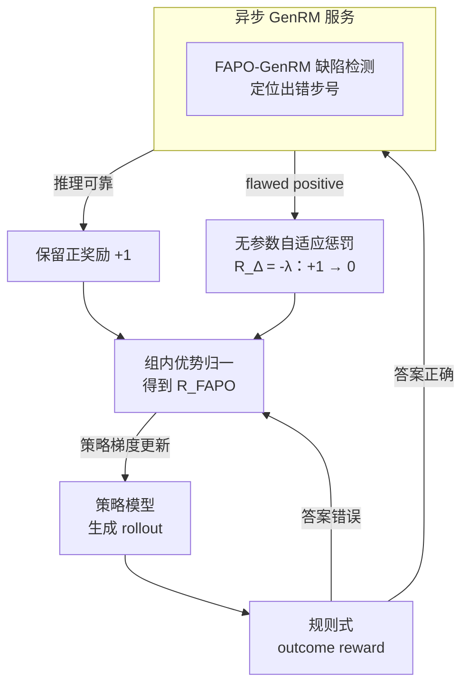

# FAPO: Flawed-Aware Policy Optimization for Efficient and Reliable Reasoning

**会议**: ICLR2026  
**arXiv**: [2510.22543](https://arxiv.org/abs/2510.22543)  
**代码**: [fapo-rl.github.io](https://fapo-rl.github.io)  
**领域**: 强化学习  
**关键词**: RLVR, flawed positives, reward shaping, generative reward model, process reward, GRPO

## 一句话总结
针对 RLVR 训练中"答案正确但推理有缺陷"的 flawed-positive rollout 问题，提出 FAPO 算法：用 GenRM 检测缺陷推理，通过无参数奖励惩罚机制实现"先利用后抑制"的自然学习轨迹，同时提升结果正确性、过程可靠性和训练稳定性。

## 背景与动机
RLVR（Reinforcement Learning with Verifiable Rewards）是当前提升 LLM 推理能力的主流范式，模型通过探索推理轨迹、利用正确答案作为正信号来优化策略。然而，标准的 rule-based outcome reward 仅检查最终答案是否正确，无法区分推理过程的质量。

这导致了一个严重问题：**flawed-positive rollouts**——模型通过猜答案（answer-guessing）或跳跃推理（jump-in-reasoning）等不可靠方式碰巧得到正确答案，却获得与完全正确推理相同的正奖励。这些缺陷推理模式在训练中被持续强化，最终限制模型的推理上限。

作者对 Qwen2.5-Math-7B、Llama3.3-70B 等模型的分析表明，flawed positives 在正确 rollout 中占比高达 20%–40%，且在整个 RL 训练过程中持续存在（约 30% 的比例几乎不变）。

## 核心问题
1. **Flawed positives 的双面性**：早期训练阶段，模型能力不足以产生完全正确的推理，flawed positives 作为"跳板"帮助快速获得能力增长；但后期它们阻碍模型向真正的问题求解能力进化
2. **如何检测 flawed positives**：现有模型要么过度批评（高 recall 低 precision），要么参数量过大不适合在线 RL 使用
3. **如何平衡利用与抑制的时机**：需要一个自适应机制，在热身阶段允许利用、在精炼阶段逐步抑制

## 方法详解

### 整体框架
FAPO 在标准 RLVR 训练环上挂载一个轻量的生成式奖励模型（GenRM）：每条答案正确的 rollout 先经 GenRM 判定是否属于"答案对、推理却有缺陷"的 flawed positive，再据此对原始 outcome reward 施加一个无参数的惩罚项，让模型在训练早期照常利用这些缺陷捷径快速涨能力、后期则自动把它们的优势值压到零以下而逐步抛弃。整套机制只新增一个检测器和一行奖励修正，不引入需要调的超参数。整个 pipeline 是一个闭环：策略采样 → 规则式判分 → 对答案正确的 rollout 做缺陷检测 → 奖励修正 → 组内优势归一 → 策略梯度更新。

### 关键设计

**1. FAPO-GenRM：把 flawed-positive 检测变成可学习的定位任务**
现有奖励模型在这件事上非此即彼——要么是参数巨大的 PRM 难以在线使用，要么是小模型"过度批评"，recall 高但 precision 低，把正常推理也判成缺陷。FAPO 在 Qwen3-4B-Instruct 上用 RL 训练 GenRM，奖励拆成结果项与过程项 $R_{\text{FAPO-GenRM}} = R_{\text{Outcome}} + R_{\text{Process}}$：结果项对预测正确/错误给 $+1/-1$，过程项只在确实检出 flawed positive 时生效，取 $-|\hat{t}_\theta - t^*|/n$，其中 $\hat{t}_\theta$ 是模型预测的出错步号、$t^*$ 是真实出错步号、$n$ 是总步数。这个过程惩罚的意义在于逼模型真正"指出错在第几步"而非泛泛地猜"有没有缺陷"，定位越准惩罚越小；同时它带来一种自然的奖励转移——训练早期结果项的 $-1\to1$ 增益主导优化，等结果判定饱和后过程项才接管，模型自动从"判对错"进化到"挑毛病"。训练数据 FAPO-Critic-85K 用 7B–70B 的 LLaMA/Qwen 系列模型在 DAPO-Math-17K 上采样 rollout、再由 Qwen3-32B 标注步骤级错误位置而来，最终这个 4B 检测器在 FlawedPositiveBench 和 ProcessBench 上反超了作为教师的 32B 模型。

**2. 无参数自适应惩罚：让"先利用后抑制"自然发生**
检测出 flawed positive 后，FAPO 不是简单丢弃样本，而是在原奖励上加一个修正项 $R_{\text{FAPO}}(o, a^* \mid \theta) = R_{\text{RLVR}}(o, a^*) + R_\Delta(o, a^* \mid \theta)$，其中被判为 flawed positive 时 $R_\Delta = -\lambda$、否则为 0，默认 $\lambda = 1$ 恰好把缺陷 rollout 的奖励从 $+1$ 拉到 $0$。关键在于为什么 $\lambda=1$ 不需要再调：设一批 rollout 中正样本占比 $\alpha$、负样本占比 $\beta$，记学习进度 $\rho = \alpha/\beta$。热身阶段模型弱、负样本居多即 $\rho<1$，此时被压到 0 的 flawed positive 相对组内基线仍是正优势，照样被利用当跳板；进入精炼阶段正样本变多即 $\rho>1$，同样的 0 奖励已低于组内均值，优势值转负，缺陷推理被自然抑制；$\rho>3$ 时正样本优势被进一步缩放，训练更稳。$\lambda=1$ 这个取值由 majority-guided 推导而来，使利用与抑制的转折点恰好落在 $\rho=1$，因此整个机制对训练阶段的切换是自适应的、零额外超参。

**3. 异步 GenRM 服务：把检测开销摊到训练之外**
在线 RL 里多塞一个评估器最怕拖慢主训练，FAPO 把 GenRM 作为独立 LLM 服务部署在集群上，和 rollout 推理、actor 更新异步解耦，前面用多 worker 加路由器做负载均衡，再用 overlong reward 策略和 checkpoint 选择把 GenRM 的 token 预算压住。结果是引入步骤级缺陷检测后总训练时间只增加不到 20%，让这套质量约束在实际大规模训练里可负担。

## 实验关键数据

### GenRM 检测性能
- FAPO-GenRM-4B 在 FlawedPositiveBench 和 ProcessBench 上超越了教师模型 Qwen3-32B
- 相比 Qwen3-4B-Instruct 基线和 Qwen2.5-Math-PRM-72B 等强基线均有显著提升
- 解决了现有模型"过度批评"（高 recall 低 precision）的问题

### 推理性能（Qwen2.5-Math-7B + GRPO 基线）
- **AIME24 / AIME25 / GPQA-Diamond** 三个基准上，FAPO 在几乎所有中间 checkpoint 上均优于基线
- Flawed-positive 比例显著降低（从约 30% 大幅下降）
- 训练曲线更平滑，后期无明显性能下降
- Token 预算未增加（不依赖更长的 response 获得提升）

### 消融实验
- 更强的 GenRM → 更好的最终 RL 性能（检测精度与最终性能正相关）
- 自我纠正分析：FAPO 在后期自然转向完全正确的 rollout，响应长度缩短，推理更高效
- Step-ratio reward（按正确步骤比例给分）会导致 reward hacking——模型只输出高置信度步骤，跳过不确定的步骤

## 亮点
1. **对 flawed positives 的系统性分析**：首次揭示其"早期跳板、后期障碍"的双面角色，为 RLVR 训练提供了新视角
2. **无参数的自适应机制**：$\lambda=1$ 由理论推导得出，不引入额外超参数，优化方向自然随训练进展转移
3. **紧凑高效的 GenRM**：4B 参数模型超越 32B 教师模型，且与 RL 训练异步解耦，仅增加不到 20% 训练时间
4. **全面的验证**：不仅报告最终性能，还展示全过程中间 checkpoint 的表现，充分说明训练稳定性

## 局限与展望
1. GenRM 引入额外推理开销，虽然目前控制在 20% 以内，但在更大规模系统中可能成为瓶颈
2. FlawedPositiveBench 基于 ProcessBench 构建，评价覆盖面有限
3. 实验主要在数学推理和通用 QA 上验证，对代码生成等更复杂的可验证任务尚未充分探索
4. GenRM 本身也可能被 reward hacking——虽然论文讨论了这一风险，但长期训练的稳健性有待进一步验证
5. 异步架构设计是工程妥协，全同步方案可能有更好的系统效率

## 与相关工作的对比

| 方法 | 奖励类型 | 是否处理 flawed positives | 是否无参数 | 特点 |
|------|----------|--------------------------|-----------|------|
| 标准 RLVR | 二值 outcome | 否 | 是 | 简单但强化缺陷推理 |
| PRM (判别式) | 步骤级分数 | 间接 | 否 | 密集奖励，易被 hacking |
| Step-ratio reward | 步骤比例 | 间接 | 否 | 导致跳跃推理 |
| **FAPO** | outcome + 惩罚 | **直接检测+自适应惩罚** | **是** | 自然学习轨迹，稳定高效 |

## 启发与关联
- FAPO 的"先利用后抑制"思路可推广到其他 RL 场景中错误信号的处理
- GenRM 的 step-wise RL 训练方法可用于提升任何过程级评估模型（如代码 review 模型）
- 论文对 reward hacking 的分析（step-ratio reward 的失败案例）对设计新的奖励信号有警示意义
- 异步 GenRM 架构为大规模 RL 系统引入外部评估器提供了实用参考

## 评分
- 新颖性: ⭐⭐⭐⭐ — 对 flawed positives 的系统分析和无参数惩罚机制有新意
- 实验充分度: ⭐⭐⭐⭐⭐ — 全 checkpoint 评估、多维度消融、人工验证、reward hacking 分析
- 写作质量: ⭐⭐⭐⭐ — 行文流畅，动机-分析-方法-实验环环相扣
- 价值: ⭐⭐⭐⭐ — 对 RLVR 训练质量提升有实际意义，GenRM 方案可直接集成

<!-- RELATED:START -->

## 相关论文

- [\[ACL 2026\] d-TreeRPO: Towards More Reliable Policy Optimization for Diffusion Language Models](../../ACL2026/reinforcement_learning/d-treerpo_towards_more_reliable_policy_optimization_for_diffusion_language_model.md)
- [\[ICLR 2026\] Boosting Multi-Domain Reasoning of LLMs via Curvature-Guided Policy Optimization](boosting_multi-domain_reasoning_of_llms_via_curvature-guided_policy_optimization.md)
- [\[ICLR 2026\] REA-RL: Reflection-Aware Online Reinforcement Learning for Efficient Reasoning](rea-rl_reflection-aware_online_reinforcement_learning_for_efficient_reasoning.md)
- [\[ICLR 2026\] Single-stream Policy Optimization](single-stream_policy_optimization.md)
- [\[ICLR 2026\] DuPO: Enabling Reliable Self-Verification via Dual Preference Optimization](dupo_enabling_reliable_self-verification_via_dual_preference_optimization.md)

<!-- RELATED:END -->
