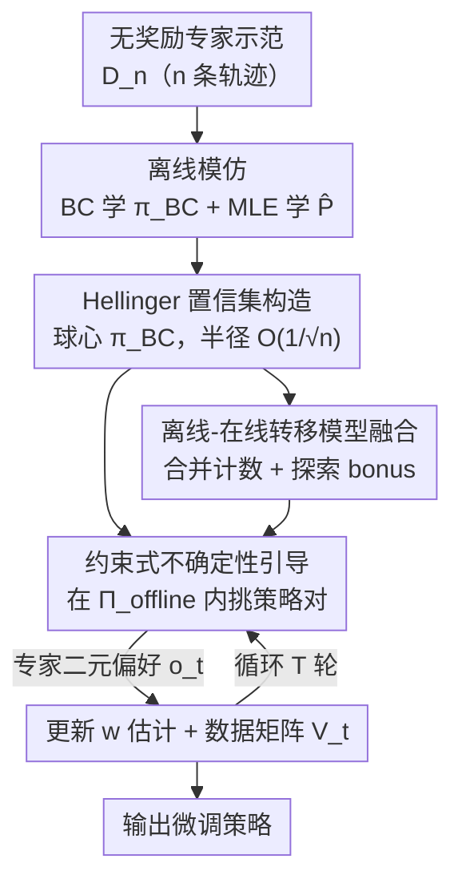

# Fine-tuning Behavioral Cloning Policies with Preference-Based Reinforcement Learning

**会议**: ICLR 2026  
**OpenReview**: [https://openreview.net/forum?id=oIiQZfnSxP](https://openreview.net/forum?id=oIiQZfnSxP)  
**代码**: https://github.com/pfriedric/bridge  
**领域**: 强化学习 / 偏好学习 / 离线到在线  
**关键词**: 行为克隆, 偏好强化学习, 离线到在线, 后悔界, Hellinger 置信集

## 一句话总结
这篇论文为"离线模仿 + 在线偏好微调"这一在 RLHF、机器人里被广泛使用却缺乏理论支撑的范式补上第一份严格分析：提出 BRIDGE 算法，先用专家示范在轨迹分布空间里构造一个半径以 $O(1/\sqrt{n})$ 收缩的 Hellinger 置信球，再把在线偏好探索约束在这个球内，证明在线后悔界随离线数据量 $n$ 增大而趋于零，并在离散/连续 MuJoCo 控制任务上验证后悔低于纯模仿和纯在线偏好 RL。

## 研究背景与动机
**领域现状**：在机器人、工业、医疗里部署 RL 的主流妥协，是把"离线模仿"和"在线偏好反馈"拼起来用——先用专家示范做行为克隆（BC）拿到一个安全的初始策略，再让人对成对轨迹做"哪个更好"的二元比较来在线微调。ChatGPT 的 SFT+RLHF、Christiano 等人的 Atari/MuJoCo 偏好 RL、Brown 等人的真机机械臂排序微调，都是这一套。

**现有痛点**：这套范式在实践上大获成功，理论却几乎空白。已有理论要么单独分析模仿学习、要么单独分析偏好 RL，从没把两者放在一起。于是三个最基本的问题没人能回答：离线示范到底**怎样**改善在线偏好学习？离线数据量和在线查询数之间的**精确权衡**是什么？这种组合**什么时候**可证明地优于单用其一？

**核心矛盾**：注意这里的设定和另一条热门路线有本质区别——大量"离线预训练 + 在线微调"的 hybrid RL 工作（Nair、Kostrikov 等）都假设在线阶段**能拿到真实奖励**，而且已有理论（Xie 等）指出对非专家离线数据，预训练在这种有奖励设定下并不带来统计收益。本文是**无奖励**（reward-free）设定：在线只有偏好比较、没有数值奖励。所以"离线数据是否带来可证明的统计优势"这个问题在偏好设定下需要重新回答。

**本文目标**：把"离线模仿 + 在线偏好微调"形式化成一个可分析的问题，给出能把离线数据量 $n$ 显式写进在线后悔界的严格界，并设计一个真能吃到这个理论红利的算法。

**切入角度**：作者的观察是——离线专家数据的真正价值不是给一个好的起点，而是能在策略空间里**圈出一个高概率包含专家策略的小集合**，从而把在线探索的搜索空间大幅压缩。数据越多，这个集合越小，在线越省查询。

**核心 idea**：用离线示范构造一个以 BC 策略为中心、半径 $O(1/\sqrt{n})$ 的 Hellinger 置信球，把在线偏好探索**约束**在球内，用"离线把搜索空间收紧"来换"在线后悔变小"。

## 方法详解

### 整体框架
BRIDGE（Bounded Regret with Imitation Data and Guided Exploration）是一个两阶段框架。输入是一份**无奖励**的专家示范数据集 $D_n^H=\{\tau_i\}_{i\in[n]}$（$n$ 条长度 $H$ 的轨迹，由专家策略 $\pi^*$ 在真实动力学 $P^*$ 下生成），输出是一个微调好的策略。

整条管线分三步：① **离线模仿**——用 BC 在示范上学到初始策略 $\pi_{BC}$，同时用 MLE 估计转移模型 $\hat P$；② **置信集构造**——以 $\pi_{BC}$ 为中心，在轨迹分布空间里用平方 Hellinger 距离画一个球，证明它以 $1-\delta$ 概率包含 $\pi^*$，且半径以 $O(1/\sqrt n)$ 收缩，得到离线策略置信集 $\Pi^{\text{offline}}_{1-\delta}$；③ **约束在线学习**——在这个球**内**做偏好 RL，每轮挑一对策略 $(\pi^1_t,\pi^2_t)$ 让专家比较、用 Bradley-Terry 模型接收二元偏好 $o_t$，更新对偏好权重 $w^*$ 的估计。约束在球内既阻止智能体探到不安全/极差的区域，又把每步探索方差从 $O(B)$ 压到 $O(B/\sqrt n)$，这正是离线数据降低在线后悔的数学入口。

偏好用 Bradley-Terry 建模：给定已知的轨迹嵌入 $\phi:\mathcal T\to\mathbb R^d$，比较结果服从 $P(\tau^1\succ\tau^2)=\sigma(\langle\phi(\tau^1)-\phi(\tau^2),w^*\rangle)$，其中 $\langle\phi(\tau),w^*\rangle$ 是轨迹的隐效用，$w^*$ 是要在线学的未知偏好向量。后悔用对专家最优策略的伪后悔（pseudo-regret）衡量。

### 关键设计

**1. Hellinger 置信球：把离线数据量翻译成可收缩的搜索空间**

这一步直接回答"离线数据怎样帮在线"。作者不在参数空间、而在**轨迹分布空间** $\mathcal P(\mathcal T)$ 里画球：先用对数损失 BC 求 $\pi_{BC}$（式 $\pi_{BC}=\arg\max_\pi\sum_i\sum_h\log\pi_h(a^i_h|s^i_h)$）、用 MLE 求 $\hat P$，再定义置信集 $\Pi^{\text{offline}}_{1-\delta}=\{\pi:\sqrt{H^2(P^\pi_{\hat P},P^{\pi_{BC}}_{\hat P})}\le \text{Radius}\}$。选 Hellinger 距离的关键好处是它等价于平方根密度之间的 $L_2$ 范数，于是置信集在密度嵌入空间里就是一个**欧氏球**——只用一个标量半径就能刻画，几何直观且分析可解。Theorem 4.2 给出半径

$$\text{Radius}=\frac{\alpha}{\sqrt n}+\frac{\beta}{\sqrt n}\left(1+\sqrt{H\left(1+\frac{2\alpha}{\gamma_{\min}\sqrt n}\right)}\right),$$

它整体以 $O(1/\sqrt n)$ 速率收缩。难点在于原始误差界依赖未知的真实动力学 $P^*$，作者通过界住**集中度系数** $C(\pi_{BC},\pi^*)$ 消掉这个依赖：Lemma 4.3 证明 $C(\pi_{BC},\pi^*)\le 1+\frac{2\sqrt R}{\gamma_{\min}}$。这里只需要一个比标准离线 RL 弱得多的假设——专家策略在它**访问到的**状态-动作上有最小访问概率 $\gamma_{\min}>0$（Assumption 3），而不是要求数据集对所有状态-动作都有覆盖。$\gamma_{\min}$ 越小代表专家越"专一"（偏好尖锐），$\gamma_{\min}$ 越大代表访问越均匀。

**2. 约束 + 不确定性引导的在线选择：离线半径如何注入在线后悔**

这是"桥"的核心。在线阶段沿用 Saha 等人的 GLM 偏好 RL 框架：每步算正则化 MLE 估计 $w_t^{MLE}$，再投影到合法集得 $w_t^{proj}$（式 $w^{proj}_t=\arg\min_{w}\|g_t(w)-g_t(w^{MLE}_t)\|_{V_t^{-1}}$）；数据矩阵 $V_t=\kappa\lambda I_d+\sum_{\ell}(\phi(\tau^1_\ell)-\phi(\tau^2_\ell))^{\otimes2}$ 一身二职——既定义包含 $w^*$ 的置信椭球，又通过 Mahalanobis 范数把探索导向不确定性最高的方向。BRIDGE 的改动是把策略选择**约束在 $\Pi^{\text{offline}}_{1-\delta}$ 内**（Algorithm 1 第 7 行），并在该球内挑一对最大化"偏好不确定性（$\|\cdot\|_{V_t^{-1}}$）+ 转移不确定性（bonus $\hat B_t$）"的策略。

为什么这能降后悔？后悔本质上由查询策略对的累计探索方差 $\text{tr}(\bar V_t)=\sum\|\phi(\pi^{t'}_1)-\phi(\pi^{t'}_2)\|_2^2$ 控制。Saha 等人只有最坏情况界 $\|\phi(\pi^1)-\phi(\pi^2)\|_2\le 2B$，方差随 $T$ 线性增长。本文证明只要 $\pi^1,\pi^2\in\Pi^{\text{offline}}_{1-\delta}$，就有

$$\|\phi_{\hat P}(\pi^1)-\phi_{\hat P}(\pi^2)\|_2\le \frac{4\sqrt2 B}{\sqrt n},$$

即离线样本量 $n$ 被**直接注入每一步的在线方差项**。这就是 $O(1/\sqrt n)$ 半径改善最终后悔界的传导链：Theorem 4.1 给出 $R_T\le\tilde O\big(\sqrt T\sqrt{\log(1+T/n)}+\frac{\sqrt T}{\sqrt n\,\gamma_{\min}}\big)$，$\sqrt T$ 项与 Saha 等人一致，但额外**反比依赖 $n$**，当 $n\to\infty$（固定 $T$）后悔趋于零。

**3. 离线-在线转移模型融合：让动力学估计也吃离线红利**

偏好学的是奖励，但策略嵌入 $\phi_{\hat P}(\pi)=\mathbb E_{\tau\sim P^\pi_{\hat P}}[\phi(\tau)]$ 依赖转移模型 $\hat P$，所以动力学估计的不确定性也会拖累后悔。作者把离线、在线两份数据**池化**：用离线 MLE（表格情形即计数估计）初始化，再每步用合并计数更新 $\hat P_t(s'|s,a)=\frac{N_{\text{off}}(s',s,a)+N_t(s',s,a)}{N_{\text{off}}(s,a)+N_t(s,a)}$。为如实反映这一估计的不确定性，探索 bonus 也改用合并计数：$\hat B_t(\pi,\eta,\delta)=\mathbb E_{\tau\sim P^\pi_{\hat P_t}}\big[\sum_h\min(2\eta,4\eta\sqrt{U_h/(N_{\text{off}}(s_h,a_h)+N_t(s_h,a_h))})\big]$，鼓励探到合并模型仍不确定的区域。这一设计让离线数据不仅缩小策略搜索空间（设计 1、2），还顺带提升了转移模型的样本效率，bonus 随合并计数变大而衰减得更快。

### 损失函数 / 训练策略
离线阶段是两个 MLE：BC 策略用对数损失 $\pi_{BC}=\arg\max_\pi\sum_{i,h}\log\pi_h(a^i_h|s^i_h)$，转移模型 $\hat P=\arg\max_P\sum_{i,h}\log P(s^i_{h+1}|s^i_h,a^i_h)$。在线阶段无显式损失，而是按 Algorithm 1 迭代 $T$ 轮：构造自适应在线置信集 $\Pi_t\subseteq\Pi^{\text{offline}}_{1-\delta}$（Lemma 4.5 保证 $\pi^*\in\Pi_t$），在其中挑最大化探索目标的策略对、采样轨迹、接收偏好、更新 $V_{t+1}$ 与 $\hat P_{t+1}$，最后用末轮 $w^{proj}_t$ 返回 $\Pi_T$ 里的最优策略。关键超参是置信集半径与正则项 $\lambda$。

## 实验关键数据

### 主实验
在两个离散环境（StarMDP、Gridworld）和两个连续控制环境（Reacher、Ant）上，以 Foster 等人的离线 BC、Saha 等人的在线偏好 RL（PbRL）为基线（两者原本都无公开实现，作者自行实现）。指标是累计后悔（当前"最优"策略与专家策略的期望奖励差）。

| 环境 | 类型 | 离线示范数 | 嵌入 | 结论 |
|------|------|-----------|------|------|
| StarMDP | 离散 | 2 | identity-short | BRIDGE 累计后悔低于 BC 与 PbRL |
| Gridworld | 离散 | 10 | state-counts | 同上 |
| Reacher | 连续控制 | 20 | average state-action | 同上（理论只覆盖表格，连续为实证扩展） |
| Ant | 连续控制 | 30 | average state-action | 同上 |

均为 20 个随机种子的均值与 95% 置信区间。Figure 3 进一步显示 BRIDGE 把策略搜索空间 $\Pi_t$ 收缩得比 PbRL 快得多。

### 消融实验
| 配置 | 关键发现 | 说明 |
|------|---------|------|
| 置信集半径 | 太大/太小都坏 | 半径太大约束不住搜索空间；太小会把 $\pi^*$ 排除在外、破坏理论保证（Lemma 4.5） |
| 离线数据量/质量 | 越多越优、越好越优 | 高质量轨迹越多球越小、性能越好；次优数据收缩变弱 |
| 嵌入 $\phi$ | 关键 | 与真实专家偏好越对齐的嵌入，本文和基线都明显更好 |
| 专家集中度 $\gamma_{\min}$ | 实证吻合理论 | $\gamma_{\min}$ 越小性能越差，与后悔界的 $1/\gamma_{\min}$ 依赖一致 |
| 反馈噪声 | 拖慢收敛 | 给 oracle 偏好注入噪声会延迟收敛、增大后悔 |

### 关键发现
- 离线数据的贡献是**可量化**的：后悔界里 $1/\sqrt n$ 项把"多收一条专家示范"和"少做一次在线查询"放在同一杆秤上，$n\to\infty$ 时在线后悔趋零。
- 性能对置信集半径呈"金发姑娘"曲线——存在一个既能压缩搜索又不排除 $\pi^*$ 的中间半径，这正是理论里半径需 $O(1/\sqrt n)$ 收缩、又要保证含 $\pi^*$ 的现实体现。
- 嵌入质量是隐含前提：偏好被假设为嵌入差的线性函数，嵌入不对齐时即便约束做对了也学不准（次优嵌入见 Figure 6，仍能勉强工作）。

## 亮点与洞察
- **把"离线价值"从直觉变成一个标量半径**：用 Hellinger 距离让置信集成为密度空间里的欧氏球，离线数据的全部贡献被压缩进一个随 $1/\sqrt n$ 收缩的半径，分析因此变得可处理——这是"几何化置信集"的漂亮一招。
- **后悔传导链清晰可复述**：$n$ 条离线数据 → 半径 $O(1/\sqrt n)$ → 球内任意策略对特征差 $\le 4\sqrt2B/\sqrt n$ → 每步在线探索方差被压低 → 后悔界多出 $1/\sqrt n$ 因子。这条链把"离线换在线"讲成了可证明的等式。
- **弱假设 $\gamma_{\min}>0$ 很实用**：只要求专家在它访问的状态上有最小访问概率，而非要求数据集全覆盖，比标准离线 RL 的覆盖假设宽松得多，更贴近"专家只走自己那条路"的现实。
- **可迁移**：这套"用离线数据在分布空间圈置信集、再约束在线探索"的思路，原则上可迁移到任何"离线模仿 + 在线交互"的设定（如 RLHF 里用 SFT 数据约束 RL 探索半径）。

## 局限与展望
- **理论只覆盖表格情形**：严格的后悔界只对有限状态/动作、有限策略类成立；连续控制只是实证扩展，需用 $\Pi$ 的有限近似来让"过滤 + 优化"两步（离散下分别是 $O(|\Pi^{\text{offline}}|^2)$、$O(|\Pi_t|^2)$）可算。完整连续理论留作未来工作。
- **强依赖离线数据质量与可实现性**：假设专家策略可实现、离线数据来自专家。数据若有噪声或次优，BC 球心就偏，置信集要么半径过大、要么干脆不含 $\pi^*$（Appendix A.1 的次优数据消融已确认过滤效果随噪声下降）。
- **线性偏好 + 已知嵌入是硬前提**：嵌入 $\phi$ 必须足够表达专家偏好；偏好未知时只能退回朴素嵌入，效果变差。作者提议未来用自监督目标从 $D_n^H$ 里**学**嵌入。
- 自评：后悔界含 $1/\gamma_{\min}$，对极度专一（$\gamma_{\min}$ 很小）的专家会变松，这类专家恰恰是离线数据最稀疏的，理论与现实在此处张力最大。

## 相关工作与启发
- **vs 行为克隆 / DAgger**：BC（Pomerleau、Foster 等）在示范流形外不鲁棒，DAgger 用持续可用的专家纠偏拿 no-regret 保证但要求专家随时在线。本文继承 BC 的简单，但把"在线专家"换成更省力的**偏好比较**，不需要专家随时给动作标注。
- **vs 有奖励的 hybrid 离线到在线 RL**（Nair、Kostrikov、Ball 等）：这条线在线阶段假设有真实奖励，且已有理论指出非专家离线数据在这种设定下无统计增益（Xie 等）。本文是无奖励偏好设定，反而证明专家离线数据带来**可证明的统计优势**，二者结论方向相反、设定互补。
- **vs Saha 等人的在线偏好 RL**：本文直接沿用其 GLM 框架与 $\sqrt T$ 后悔，但通过把探索约束进离线置信球，额外拿到 $1/\sqrt n$ 的离线红利——相当于在原框架上"加了一道离线护栏"。

## 评分
- 新颖性: ⭐⭐⭐⭐⭐ 首个为"离线模仿 + 在线偏好微调"无奖励范式给出严格后悔界，并把离线数据量显式写进界里。
- 实验充分度: ⭐⭐⭐⭐ 离散/连续四环境 + 五组消融验证理论依赖，但规模偏小、连续部分缺理论。
- 写作质量: ⭐⭐⭐⭐⭐ 从动机到后悔传导链层层递进，理论与直觉对照清晰。
- 价值: ⭐⭐⭐⭐ 为 RLHF 式系统设计提供了"离线换在线"的形式化指导，理论贡献扎实但落地仍受表格假设限制。

<!-- RELATED:START -->

## 相关论文

- [\[ICLR 2026\] Proximal Supervised Fine-Tuning](proximal_supervised_fine-tuning.md)
- [\[ICLR 2026\] SRFT: A Single-Stage Method with Supervised and Reinforcement Fine-Tuning for Reasoning](srft_a_single-stage_method_with_supervised_and_reinforcement_fine-tuning_for_rea.md)
- [\[ICLR 2026\] All Roads Lead to Likelihood: The Value of Reinforcement Learning in Fine-Tuning](all_roads_lead_to_likelihood_the_value_of_reinforcement_learning_in_fine-tuning.md)
- [\[ICLR 2026\] On-Policy RL Meets Off-Policy Experts: Harmonizing Supervised Fine-Tuning and Reinforcement Learning via Dynamic Weighting](on-policy_rl_meets_off-policy_experts_harmonizing_supervised_fine-tuning_and_rei.md)
- [\[ICLR 2026\] Sparse but Critical: A Token-Level Analysis of Distributional Shifts in RLVR Fine-Tuning of LLMs](sparse_but_critical_a_token-level_analysis_of_distributional_shifts_in_rlvr_fine.md)

<!-- RELATED:END -->
