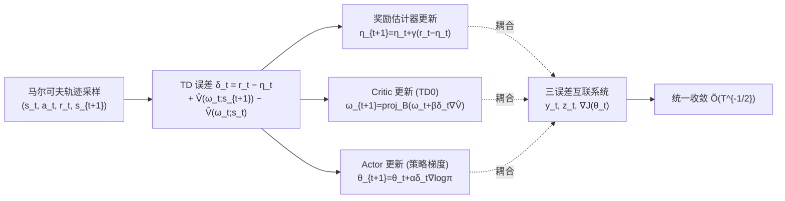

# Finite-Time Analysis of Actor-Critic Methods with Deep Neural Network Approximation

**会议**: ICLR 2026  
**OpenReview**: [https://openreview.net/forum?id=V05qqNqBpY](https://openreview.net/forum?id=V05qqNqBpY)  
**代码**: 待确认  
**领域**: reinforcement_learning / 强化学习理论  
**关键词**: Actor-Critic, 有限时间分析, 深度神经网络逼近, 单时间尺度, 时间平均奖励, 马尔可夫采样  

## 一句话总结
本文给出了**首个**在连续状态-动作空间、时间平均奖励设置下、对**单时间尺度神经 Actor-Critic** 算法的有限时间收敛分析，证明奖励/critic/actor 三类误差以 $\tilde{O}(T^{-1/2})$ 速率收敛到驻点，且收敛速率**不依赖网络宽度 $m$ 发散**。

## 研究背景与动机
**领域现状**：Actor-Critic（AC）是当今深度强化学习落地（四足/人形运动控制、无人机竞速等连续控制）的主力框架，实践中 actor 与 critic 都用深度神经网络逼近。但其有限时间收敛的理论分析却严重滞后于实践。

**现有痛点**：已有理论分析普遍依赖被过度简化的设定，主要表现在三方面——（1）**双环（double-loop）**方法对每个固定 actor 跑多步 critic 更新，虽便于解耦分析，却带来不切实际的高采样复杂度；（2）**双时间尺度（two-timescale）**方法令 actor 步长远小于 critic（步长比 $\lim_{t\to\infty}\alpha_t/\beta_t=0$），人为减慢 actor 来近似解耦，实践中几乎不用；（3）现有工作几乎都局限在**有限状态-动作空间 + 线性逼近**，唯一考虑神经网络的 Tian et al. (2024) 又有两个硬伤：仍限于有限状态-动作空间（此时线性逼近已足够，神经网络视角形同虚设），且收敛率为 $\tilde{O}(T^{-0.5}+m^{-0.5})$ 含一个**不随训练消失的 $m^{-0.5}$ 常数项**。

**核心矛盾**：实践用的是 **single-timescale**（actor 与 critic 同步更新、步长仅成常数比 $\alpha/\beta=c$），但此时 actor 与 critic 强耦合，前述解耦式分析过于保守、根本无法证明其收敛；而宽度 $m$ 在训练中是固定常数，理论上不该出现"收敛依赖 $m\to\infty$"这种由分析技术副产的伪依赖（NTK 理论还表明 $m\to\infty$ 会让网络退化为线性、削弱表达力）。

**本文目标**：在最贴近实践的设定下——连续状态-动作空间、time-average reward、actor 与 critic 均为深度网络、actor 与 critic 均为马尔可夫采样——给出单时间尺度神经 AC 的首个有限时间收敛保证，且收敛率**摆脱对 $m$ 的依赖**。

**核心 idea**：**(1) 算子框架处理连续域** —— 引入分布算子 $D_\theta$ 与一步转移算子 $P_\theta$ 把不可数状态空间上的误差分析装进函数内积空间；**(2) 把三类耦合误差当作互联系统整体分析** —— 不再逐项保守放缩，而是证明 critic 误差的"均值路径"会衰减，从而剥离 $m\to\infty$ 的要求。

## 方法详解

### 整体框架
本文分析的是一个标准、可直接落地的单时间尺度神经 AC 算法（Algorithm 1）：单条马尔可夫轨迹采样，每步同时更新三个量——奖励估计器 $\eta_t$（指数滑动平均估计 time-average reward $J(\theta)$）、critic 参数 $\omega_t$（半梯度 TD(0)，并投影回初始点邻域球内）、actor 参数 $\theta_t$（用 TD 误差 $\delta_t$ 近似 advantage 做策略梯度上升）。论文的真正贡献不在算法设计而在**分析技术**：把奖励误差 $y_t$、critic 误差 $z_t$、actor 误差 $\nabla J(\theta_t)$ 三者的传播看成一个相互耦合的动力系统，配合深度网络的正则性引理与马尔可夫噪声控制引理，证明三者同步以 $\tilde O(T^{-1/2})$ 收敛。

### 关键设计

**1. 算子框架统一刻画连续状态-动作空间：** 连续域上"对状态分布求期望"无法像有限情形那样写成矩阵-向量乘积，本文为此在实值函数类 $\mathcal F=\{f:\mathcal S\to\mathbb R\}$ 上引入两个线性算子，$(D_\theta f)(s):=\mu_\theta(s)f(s)$ 把函数按平稳分布 $\mu_\theta$ 加权，$(P_\theta f)(s):=\mathbb E_\theta[f(s_{t+1})\mid s_t=s]$ 给出一步前瞻；再配上函数内积 $\langle f,g\rangle=\int_{\mathcal S} f(s)g(s)\,ds$ 与诱导范数 $\|f\|^2=\langle f,f\rangle$。这套算子语言让"贝尔曼算子的不动点、误差的加权 L2 范数"等概念在不可数定义域上仍然成立，是把整套有限时间分析从线性/离散搬到连续/神经网络设定的几何脚手架。基于它，探索性假设也被写成 $\langle\hat V(\omega),D_\theta(I-P_\theta)\hat V(\omega)\rangle\ge\lambda_2\|\hat V(\omega)\|^2$——若策略探索不足、存在 $\mu_\theta(A)=0$ 的状态子集，该不等式即被破坏，从而把"充分探索"这一抽象条件落到可验证的算子不等式上。

**2. 单时间尺度同步更新 + 投影约束 critic：** 算法保持 $\alpha,\beta,\gamma$ 仅成常数比例（而非双时间尺度的比值趋零），每一步 actor 与 critic 并行更新，忠实复刻实践用法。其中 critic 走半梯度 TD(0)：以 $r_t-\eta_t+\hat V(\omega_t;s_{t+1})$ 作为未知 $V(s_t)$ 的自举目标得到 TD 误差 $\delta_t:=r_t-\eta_t+\hat V(\omega_t;s_{t+1})-\hat V(\omega_t;s_t)$，更新 $\omega_{t+1}=\mathrm{proj}_{B_{\omega_0}}(\omega_t+\beta\delta_t\nabla\hat V(\omega_t;s_t))$。这里的投影 $\mathrm{proj}_{B_{\omega_0}}$ 把参数约束在初始点 $\omega_0$ 半径为常数 $u_\omega$ 的球内——这是利用**过参数化网络的最优解就在初始化邻域**这一事实，既保证参数有界、又不会把最优点排除在外。actor 则直接用 $\delta_t$ 近似 advantage 函数 $\Delta_\theta=Q_\theta-V_\theta$，按 $\theta_{t+1}=\theta_t+\alpha\delta_t\nabla_\theta\log\pi_{\theta_t}(a_t|s_t)$ 做策略梯度上升。

**3. 神经网络正则性引理 + critic 均值路径衰减，摆脱 $m\to\infty$：** 神经网络逼近相比线性逼近多出一项"光滑性诱导误差"，它与 critic 误差纠缠在一起。Tian et al. (2024) 为绕开此项，保守地把 critic 误差用一个常数上界（这正是 $m^{-0.5}$ 残差的来源）。本文反其道而行：先在 Lemma 1 建立深度网络的一组正则性性质（在过参数化与 Lipschitz/光滑激活假设下，网络输出、梯度的有界性与稳定性），据此证明 critic 误差的**均值路径会持续衰减**（论文 Eq. (26) 的 mean-path 更新分析），而非被卡在常数。这一步直接移除了"收敛依赖 $m\to\infty$"的先验要求，使收敛率回到纯粹的 $\tilde O(T^{-1/2})$。

**4. 互联误差系统 + 马尔可夫噪声精细控制：** 真正困难在于奖励误差 $y_t:=\eta_t-J(\theta_t)$、critic 误差 $z_t:=\omega_t-\omega^*(\theta_t)$、actor 误差 $\nabla J(\theta_t)$ 三者强耦合，且深度网络逼近误差与马尔可夫采样噪声的交互比线性逼近或 i.i.d. 采样都更棘手。本文先为三类误差各自推出隐式、耦合的界，再把它们的传播视为一个相互连接的动力系统**整体求解**；针对单条轨迹的马尔可夫噪声，定义混合时间 $\tau_T:=\min\{i\ge0\mid\kappa\rho^{i-1}\le T^{-1/2}\}=O(\log T)$，并在 Lemma 7–10 发展精细的噪声分解与放缩，使要求 $T\ge2\tau_T$ 时 Markov 噪声被有效控制。最终在步长 $\alpha=c/\sqrt T,\ \beta=\gamma=1/\sqrt T$ 下得到主定理 Theorem 1：三类误差的时间平均均以 $O(\log^2 T/\sqrt T)+O(\epsilon_{\mathrm{app}})$ 收敛，其中 $\epsilon_{\mathrm{app}}$ 为 critic 的最优逼近误差，$\log$ 项源自混合时间（i.i.d. 采样下可消去）。

## 实验关键数据

### 主实验：MuJoCo 最终平均奖励（5 seed，mean±std）
线性 critic 与不同宽度/深度的神经 critic 在 6 个连续控制任务上的最终平均奖励：

| 配置 | Ant | HalfCheetah | Hopper | Humanoid | Swimmer | Walker2d |
|---|---|---|---|---|---|---|
| Linear | 797.1±66.0 | 299.2±61.9 | 61.4±25.2 | 186.9±14.7 | 35.9±4.7 | 810.9±290.6 |
| Width-64 | 1120.0±140.3 | 590.7±135.6 | 108.5±16.3 | 264.0±56.1 | 132.5±78.4 | 1215.3±192.6 |
| Width-128 | 1587.4±183.2 | 1425.8±161.7 | 533.8±64.7 | 291.1±63.9 | 220.5±41.8 | 1400.9±461.2 |
| Width-256 | 1245.2±126.7 | **2250.1±187.9** | 725.3±165.0 | 365.2±64.3 | **251.3±8.8** | 1390.9±324.9 |
| Width-512 | 949.2±75.4 | 1691.6±245.8 | **749.3±304.6** | 448.9±48.4 | 222.7±22.7 | 996.5±180.9 |

### 消融：网络深度扫描（固定 width=128）

| 配置 | Ant | HalfCheetah | Hopper | Humanoid | Swimmer | Walker2d |
|---|---|---|---|---|---|---|
| Depth-1 | 961.2±8.0 | 1205.8±293.5 | 174.6±34.4 | 219.0±24.3 | 173.6±101.1 | 1118.4±39.5 |
| Depth-2 | 1587.4±183.2 | 1425.8±381.7 | 533.8±64.7 | 291.1±63.9 | 201.2±54.2 | 1400.9±461.2 |
| Depth-4 | **1824.9±147.0** | **2144.2±229.6** | 465.6±95.6 | 385.0±50.0 | 182.6±26.8 | 865.1±196.5 |
| Depth-8 | 1021.0±58.3 | 1699.2±285.4 | 210.8±68.2 | **546.4±63.7** | 230.9±57.7 | 1136.9±45.0 |

### 关键发现
- **理论收敛率被实证验证**：在 Pendulum-v1 上估计 $E_T=\frac{1}{T-\tau_T}\sum_{t=\tau_T}^{T-1}\mathbb E\|\nabla J(\theta_t)\|^2$ 随 $T$ 的 log-log 斜率为 **−0.51**，与理论值 −0.5 高度吻合（warm-up 约 250 步后呈清晰线性）。
- **神经 critic 全面碾压线性 critic**：线性 critic（6 维 RBF 特征）在所有任务上都大幅落后，甚至在简单的 Pendulum 上都无法逼近真值函数，凸显了"分析神经 AC"的必要性——这也是本文区别于所有前作（无一附带实验）之处。
- **容量并非越大越好**：宽度/深度存在任务相关的最优点（如 HalfCheetah 偏好 width-256，Ant 偏好 depth-4，Humanoid 偏好 depth-8），过宽/过深反而下降，与 NTK 视角下"过参数化退化为线性"的直觉一致。

## 亮点与洞察
- **真正闭合理论-实践鸿沟**：表 1 中本文是唯一同时满足连续状态空间、连续动作空间、actor 与 critic 均马尔可夫采样、神经网络函数类、且**带实验验证**的工作；前作即便号称弥合 gap，却连 Pendulum-v1 都跑不了（受限于有限动作空间或需从平稳分布采样）。
- **摆脱 $m^{-0.5}$ 伪依赖是核心技术贡献**：把 critic 误差从"常数上界"升级为"均值路径衰减"，这一洞察让收敛率不再被网络宽度污染，回归到反映算法真实行为的 $\tilde O(T^{-1/2})$。
- **算子框架的普适性**：$D_\theta/P_\theta$ 算子把离散 MDP 分析里的"加权矩阵"概念无缝推广到连续域，为后续连续控制理论分析提供了可复用的工具。

## 局限与展望
- **仍是驻点收敛 + 依赖逼近误差 $\epsilon_{\mathrm{app}}$**：非凸设定下只能证明收敛到驻点，且误差含 $O(\epsilon_{\mathrm{app}})$ 项；$\epsilon_{\mathrm{app}}=0$（critic 能精确逼近）才完全消失，实际任务里这一项未必小。
- **假设较强**：需要最优 critic 的 Lipschitz/光滑性、网络正则性、充分探索、一致遍历性等一系列假设，验证这些假设在具体任务上是否成立并不容易。
- **过参数化与投影约束**：分析建立在"宽度为大常数、最优解在初始邻域球内"的过参数化前提上，与实践中宽度有限、且不显式投影的训练仍有差距。
- **展望**：放宽到折扣奖励/有限宽度的非渐近刻画、把驻点收敛升级为全局/样本复杂度最优、以及覆盖更现实的网络结构与不投影更新，都是自然的后续方向。

## 相关工作与启发
- **单时间尺度 AC 分析谱系**：Chen et al. (2021)、Olshevsky & Gharesifard (2023)、Chen & Zhao (2024) 给出 $O(T^{-0.5})$ 但限于线性/离散/i.i.d.；Tian et al. (2024) 首次引入神经网络却卡在有限状态空间且残留 $m^{-0.5}$ 项——本文正是对这条线的"最后一公里"补全。
- **过参数化与 NTK**：投影到初始邻域、网络近似线性等技术承袭 Du et al. (2019)、Jacot et al. (2018)、Liu et al. (2020) 的过参数化分析，但本文刻意避免让结论依赖 $m\to\infty$，反而把 NTK 的"宽则退化"作为反面动机。
- **启发**：把多个强耦合误差当成互联动力系统整体分析、用算子语言统一离散与连续——这套思路对其他"actor-critic 类双层耦合优化"（如 GAN、bilevel RL、约束 RL）的有限时间分析有迁移价值。

## 评分
- **新颖性**: ⭐⭐⭐⭐⭐ 首个连续状态-动作空间 + time-average reward + 双侧马尔可夫采样 + 深度网络的单时间尺度 AC 有限时间分析，并实质性消除了前作的 $m^{-0.5}$ 伪依赖。
- **实验充分度**: ⭐⭐⭐⭐ 不仅在 Pendulum 上直接验证理论斜率（−0.51 vs −0.5），还在 6 个 MuJoCo 任务做了宽度/深度消融——作为理论论文实验已属罕见且到位，唯任务规模与 baseline 仍偏轻。
- **写作质量**: ⭐⭐⭐⭐ 表 1 的设定对比一目了然，动机（为何要摆脱 $m$、为何 single-timescale 更难）讲得清楚；证明细节较重，主文给出 proof sketch 帮助理解。
- **价值**: ⭐⭐⭐⭐ 为实践中广泛使用的深度 AC 方法提供了理论背书，技术工具（算子框架、互联误差系统、均值路径衰减）具备可复用性，对 RL 理论社区有实在贡献。

<!-- RELATED:START -->

## 相关论文

- [\[ICLR 2026\] Neural+Symbolic Approaches for Interpretable Actor-Critic Reinforcement Learning](neuralsymbolic_approaches_for_interpretable_actor-critic_reinforcement_learning.md)
- [\[ICLR 2026\] Flow Actor-Critic for Offline Reinforcement Learning (FAC)](flow_actor-critic_for_offline_reinforcement_learning.md)
- [\[ICLR 2026\] Chunking the Critic: A Transformer-based Soft Actor-Critic with N-Step Returns](chunking_the_critic_a_transformer-based_soft_actor-critic_with_n-step_returns.md)
- [\[AAAI 2026\] Risk-Sensitive Exponential Actor Critic](../../AAAI2026/reinforcement_learning/risk-sensitive_exponential_actor_critic.md)
- [\[ICLR 2026\] Convergence of an actor-critic gradient flow for entropy regularised MDPs in general spaces](convergence_of_an_actor-critic_gradient_flow_for_entropy_regularised_mdps_in_gen.md)

<!-- RELATED:END -->
