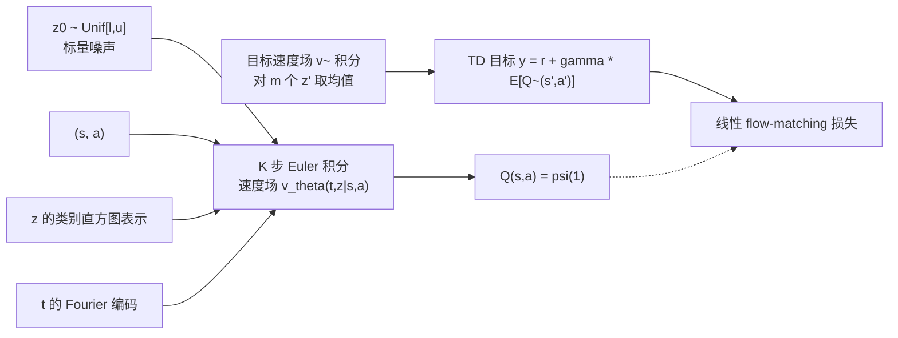

# floq: Training Critics via Flow-Matching for Scaling Compute in Value-Based RL

**会议**: ICLR 2026  
**OpenReview**: [https://openreview.net/forum?id=m14YNdmPAh](https://openreview.net/forum?id=m14YNdmPAh)  
**代码**: [https://github.com/CMU-AIRe/floq](https://github.com/CMU-AIRe/floq)  
**领域**: reinforcement learning  
**关键词**: 离线强化学习, 价值函数, TD-learning, flow-matching, 迭代计算, 算力扩展  

## 一句话总结
把 Q 函数从"单个网络一次性映射出标量"改写成"一个速度场经多步数值积分流向 Q 值"，用 flow-matching 给值学习引入逐步密集监督，从而能靠增加积分步数（而非单纯加深加宽）来扩展 critic 的容量，在离线 RL 难任务上把成功率拉到约 1.8 倍。

## 研究背景与动机
**领域现状**：现代生成模型（语言模型的 next-token、扩散/flow 模型的逐步去噪）有一个共同的成功配方——迭代式地构造输出，并在每个中间步骤上提供密集监督，从而让深网络能稳定地拟合复杂函数并良好泛化。而强化学习里的 Q 函数恰恰相反：标准 TD-learning 用一个单体（monolithic）网络把状态-动作直接映射成一个标量，没有任何迭代计算。

**现有痛点**：Q 函数本身高度复杂、难以精确拟合，TD-learning 又是出了名的"喂不动"深网络——加宽加深往往不涨反跌，得靠各种归一化、正则化技巧才勉强稳定，在只能从静态数据集学习的离线 RL 里这个问题更严重。即便用 ResNet 堆残差块做"迭代计算"，收益也很有限，因为它缺了让 transformer/扩散有效的那味关键调料：**每一步都有监督信号**。

**核心矛盾**：想给值学习引入"迭代计算+密集监督"，但 flow-matching 是为多维数据分布设计的，直接套到标量 Q 值上会**塌缩**——网络学会无视中间插值变量，退化回一个普通的单体 Q 网络，等于白做。同时 TD 的目标值一直在变（bootstrapping），又给 flow-matching 的训练带来非平稳难题。

**本文目标**：设计一种用 flow-matching 参数化并训练 Q 函数的方法，让 critic 的容量可以通过积分步数细粒度地扩展，并在离线 RL 与在线微调上都验证有效。

**核心 idea**：**用速度场表示 Q 函数**——把 Q 值看成从均匀噪声出发、沿一个状态-动作条件速度场积分到的终点；速度场用带 Bellman 自举目标的 flow-matching 损失训练，于是"积分步数 K"成了一个全新的、可独立于深度/宽度的算力扩展轴。

## 方法详解

### 整体框架
floq（flow-matching Q-functions）不直接输出 Q 值，而是学一个时间相关、状态-动作条件的标量速度场 $v_\theta(t, z \mid s, a)$。推断时从均匀噪声 $z_0 \sim \mathrm{Unif}[l,u]$ 出发，用 Euler 法做 $K$ 步数值积分，终点即为 Q 值样本 $Q(s,a,z) := \psi_\theta(1, z\mid s,a)$。训练时用线性 flow-matching 损失把速度场拟合到"从噪声指向 TD 目标"的位移上，而 TD 目标本身又由一个滑动平均的目标速度场积分、并对多个初始噪声取均值得到。为了让 flow 不塌缩，作者补了两个关键设计（噪声区间选择、插值变量的类别表示+时间的 Fourier 编码）。

### 关键设计

**1. 速度场参数化 Q 函数：让积分步数成为容量旋钮。** floq 把一维潜变量 $z\in\mathbb{R}$ 从 $\mathrm{Unif}[l,u]$ 出发，沿速度场积分 $K$ 步流向以真值 Q 为中心的 Dirac-Delta 分布，$\psi_\theta(j/K, z\mid s,a)=z+\frac{1}{K}\sum_{i=1}^{j} v_\theta\big(\tfrac{i}{K}, \psi_\theta(\tfrac{i-1}{K}, z\mid s,a)\mid s,a\big)$。它和 ensemble 看似都在"多次调用网络求平均"，但本质不同：每一步 $i$ 的输入依赖上一步 $i-1$ 的输出，是**递归式的串行迭代计算**，而 ensemble 是并行独立的。正因如此，调大 $K$ 就等价于增加模型"深度"、放大 Q 函数容量，而且实验证明这种扩展比单纯加 ensemble 数或堆 ResNet 块更划算。

**2. 带 Bellman 自举的 flow-matching 损失：处理"动来动去"的目标值。** flow-matching 通常拟合一个固定的目标分布，但 TD 的目标值一直在变。floq 引入一个目标速度场 $\tilde v_\theta$（主速度场的滑动平均，类比 target network），先对下一状态采动作 $a'\sim\pi(\cdot\mid s')$，积分目标流得到多个 Q 样本并取均值得到自举目标 $y(s,a)=r(s,a)+\gamma\frac{1}{m}\sum_{j=1}^{m}\psi_{\tilde\theta}(1, z'_j\mid s',a')$（注意这是期望 Q 回填，不是分布式 RL）。然后构造插值 $z(t)=(1-t)\,z + t\,y(s,a)$，用线性 flow-matching 损失训练速度场去匹配从噪声到目标的位移：$L_{\mathrm{floq}}(\theta)=\mathbb{E}_{z,t}\big[\|v_\theta(t, z(t)\mid s,a) - (y(s,a)-z)\|_2^2\big]$。这一思路与 TD-flows、$\gamma$-models 用自举目标训练生成式模型一脉相承。

**3. 防塌缩之噪声区间选择：让 flow 走出"弯路"才有额外容量。** 作者点出 floq 有效的根因——只有当流的轨迹是**弯曲**的，速度场才必须真正利用插值变量 $z(t)$ 和时间 $t$ 预测定制化速度，迭代计算才放大了容量；若轨迹是直线，预测一个恒定速度就够了，等于退回单体网络（但过弯又会放大积分误差，所以要找"恰到好处的弯度"甜点）。关键发现是：重缩放初始噪声不改变目标分布，却显著改变轨迹弯度。于是用启发式选 $[l,u]$：令 $u=Q_{\max}$（多数任务取 0），再尽量增大区间宽度 $u-l$（取 $\kappa\times(Q_{\max}-Q_{\min})$，默认 $\kappa=0.1$）同时保持稳定收敛。宽度太小则 $z(t)$ 变化范围太窄、网络学不会用它；区间与目标 Q 值范围太脱节则又退化成只预测大速度指向目标。

**4. 防塌缩之输入表示：用类别直方图+Fourier 时间编码扛非平稳。** 标准 TD 的非平稳出现在输出（Q 值从近零长大，可用激活归一化处理），而 floq 的非平稳出现在**输入**——插值变量 $z(t)$ 的幅度随训练增长，导致梯度和激活爆炸。借鉴 Farebrother 等的 HL-Gauss 编码，给 $z(t)$ 加标准差 $\sigma$ 的高斯噪声后转成跨 $N$ 个 bin 的类别直方图（输出仍是标量），且用更大的 $\sigma$ 让初始约 80% 的 bin 有非零质量、鼓励更广覆盖。同时把时间 $t$ 用 Fourier 基表示再喂给速度场，让不同积分步上的速度预测能有意义地变化。实现上 floq 搭在 FQL 之上（沿用其 flow-matching 策略以隔离差异来自 critic），并蒸馏一个 $Q^{\mathrm{distill}}_\psi$ 近似积分结果，避免策略提取时穿过整条积分链求梯度的高昂代价。

## 实验关键数据

### 主实验表格
OGBench 离线 RL 50 个任务（5 locomotion + 5 manipulation，各 5 task，3 seeds），成功率(%)：

| 环境 (各5任务) | BC | ReBRAC | SORL | FQL(1M) | FQL(2M) | floq(默认) | floq(最佳) |
|---|---|---|---|---|---|---|---|
| antmaze-large | 11 | 81 | 89 | 79 | 83 | 91 | 91 |
| antmaze-giant (Hard) | 0 | 26 | 9 | 22 | 27 | 36 | 51 |
| hmmaze-medium | 2 | 22 | 64 | 57 | 69 | 82 | 82 |
| hmmaze-large (Hard) | 1 | 2 | 5 | 9 | 16 | 28 | 28 |
| cube-double (Hard) | 2 | 12 | 25 | 29 | 25 | 47 | 47 |
| puzzle-3x3 (Hard) | 2 | 21 | – | 30 | 29 | 37 | 37 |
| puzzle-4x4 (Hard) | 0 | 14 | – | 17 | 9 | 21 | 28 |
| **全部环境均值** | 3 | 31 | – | 46 | 47 | **56** | **59** |
| **难环境均值** | 1 | 15 | – | 21 | 21 | **34** | **38** |

难环境上 floq 约为 FQL 的 1.8×；默认任务子集上对 DSRL（20% vs 45%）提升超 2×，并优于分布式 RL 基线 IQN。

### 消融实验表格
积分步数 K 对成功率的影响（部分任务）：

| 积分步数 K | 1 | 2 | 4 | 8 | 16 |
|---|---|---|---|---|---|
| HM-Large 成功率(%) | 0 | 14 | 24 | 52 | 56 |
| Antmaze-Giant 成功率(%) | 0 | 11 | 55 | 70 | 86 |

成功率随 K 单调上升，验证"积分步数=可扩展的容量轴"。把同等算力分给 Q-网络 ensemble 或 ResNet 都更差。

### 关键发现
- **扩展性是核心卖点**：相同甚至更多参数/更复杂架构的单体 critic 都被 floq 比下去，差距主要靠"沿积分步数扩展"而非加深加宽换来。
- **在线微调同样受益**：离线预训练 1M 步后在线微调 2M 步，floq 提供更强初始化、更快适应、更高最终性能（在 humanoidmaze、antmaze-giant、antsoccer 等最难任务上尤为明显）。
- 用 Agarwal 等的 IQM/性能曲线/$P(X>Y)$ 严格统计，floq 与 FQL 的置信区间无重叠。

## 亮点与洞察
- **把"算力扩展轴"从空间维度搬到时间维度**：以往扩 critic 只能加深加宽，floq 给出第三条路——加积分步数，且推断时还能动态调 K 换取性能。
- **一针见血的塌缩诊断**：作者明确指出"直线轨迹=没额外容量、弯轨迹=有额外容量、过弯=放大积分误差"，把一个看似玄学的工程问题讲成了可控的弯度甜点问题，两个防塌缩设计都围绕这一洞察。
- **干净的对照设计**：搭在 FQL 上、只换 critic，把性能差异干净地归因到 flow-matching Q 函数本身，而非策略侧的花活。

## 局限与展望
- **超参敏感**：噪声区间宽度 $\kappa$、积分步数 K、$\sigma$、bin 数等都需调，"最佳配置"按环境调过，默认配置虽已够强但与最佳仍有差距（如 antmaze-giant 36 vs 51）。
- **训练/推断成本上升**：多步积分 + 目标流多噪声采样平均 + 蒸馏 critic，相比单体网络计算开销明显更高。
- **仍依赖期望 Q 回填**：虽学到随机 Q 函数，但用的是期望目标，没有充分挖掘分布式信息；与真正分布式 RL 的结合是开放方向。
- 局限于状态型 OGBench 任务，像素输入、更大规模在线 RL 的可扩展性待验证。

## 相关工作与启发
- **生成模型在 RL 中的应用**多集中在策略侧（diffusion/flow 策略），本文反其道而行，专攻更具表达力的 **Q 函数**，与 FQL 的 flow 策略正交互补。
- **扩展 Q 函数**的已有路线（分类损失、ResNet 架构、正则化、TD scaling laws）都没找到清晰配方，floq 指出"密集中间监督"是关键缺失项。
- **扩展推断算力**（MPC/MPPI/MCTS 等规划方法）此前都用算力改进规划，从不用来更好地估计值函数；floq 是首个证明"多积分步是扩展 critic 算力的可行有效路径"的工作。
- 启发：凡是"一次性回归一个标量"的监督学习子模块，或许都能改写成"迭代流+密集步监督"来换取更好的容量利用与扩展性。

## 评分
- 新颖性: ⭐⭐⭐⭐⭐ 把 flow-matching 引入 critic 并开辟"积分步数"这条全新算力扩展轴，概念上很有原创性。
- 实验充分度: ⭐⭐⭐⭐ 50 个 OGBench 任务 + 在线微调 + 严格统计 + 多角度消融，覆盖充分；但限于状态型任务、像素/大规模未验证。
- 写作质量: ⭐⭐⭐⭐⭐ 动机类比清晰、塌缩诊断讲得透彻、设计选择层层递进，可读性强。
- 价值: ⭐⭐⭐⭐ 难任务上接近 1.8× 的提升和可扩展的容量旋钮对离线 RL 很有吸引力，代价是更高的计算与调参成本。

<!-- RELATED:START -->

## 相关论文

- [\[ICLR 2026\] The Art of Scaling Reinforcement Learning Compute for LLMs](the_art_of_scaling_reinforcement_learning_compute_for_llms.md)
- [\[ICLR 2026\] Reinforcement Learning via Value Gradient Flow](reinforcement_learning_via_value_gradient_flow.md)
- [\[ICLR 2026\] Q-Learning with Adjoint Matching](q-learning_with_adjoint_matching.md)
- [\[ICLR 2026\] Guided Flow Policy: Learning from High-Value Actions in Offline Reinforcement Learning](guided_flow_policy_learning_from_high-value_actions_in_offline_reinforcement_lea.md)
- [\[ICLR 2026\] One-Step Flow Q-Learning: Addressing the Diffusion Policy Bottleneck in Offline RL](one-step_flow_q-learning_addressing_the_diffusion_policy_bottleneck_in_offline_r.md)

<!-- RELATED:END -->
