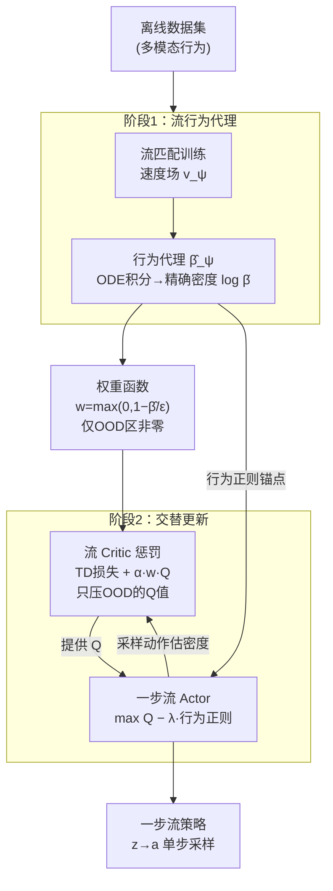

# Flow Actor-Critic for Offline Reinforcement Learning (FAC)

**会议**: ICLR 2026  
**arXiv**: [2602.18015](https://arxiv.org/abs/2602.18015)  
**代码**: 无  
**领域**: 强化学习  
**关键词**: 离线RL, 流匹配, Actor-Critic, OOD检测, 连续归一化流  

## 一句话总结
FAC 首次联合利用流模型（continuous normalizing flow）同时构建表达力强的 actor 策略和基于精确密度估计的 critic 惩罚机制，通过识别 OOD 区域对 Q 值进行选择性保守估计，在 OGBench 55 个任务上以 60.3 平均分大幅超越此前最佳的 43.6。

## 研究背景与动机

**领域现状**：离线 RL 数据集通常包含复杂的多模态行为分布。简单高斯策略表达力不足；扩散策略虽然表达力强但多步采样使策略优化不稳定。

**现有痛点**：(a) CQL 的保守惩罚是全局性的——对所有 OOD 动作一视同仁，导致过度保守；(b) SVR 用重要性采样比率识别 OOD，但当行为策略被高斯模型拟合不准时比率会爆炸；(c) 现有方法在 actor 设计和 critic 惩罚之间缺乏协同——它们分别独立设计。

**核心矛盾**：如何在保持策略表达力的同时精确识别 OOD 区域进行保守估计？

**切入角度**：流模型既能提供高表达力的策略（actor），又能提供精确的密度估计（critic OOD 惩罚），一石二鸟。

**核心 idea**：用一个流模型同时解决 actor 表达力和 critic OOD 检测两个问题。

## 方法详解

### 整体框架
FAC 想用同一个流模型把离线 RL 的两件难事一起办了：actor 要有足够表达力去拟合多模态行为，critic 要能精确认出哪些动作是数据集里没见过的 OOD 区域并对其保守。整体分两阶段：先用流匹配训练一个行为代理模型 $\hat{\beta}_\psi(a|s)$，它的好处是能通过 ODE 积分给出**精确**的对数密度 $\log\hat{\beta}_\psi(a|s)$；再拿这个密度构造权重函数，只在 OOD 区域压低 Q 值，同时用一个一步流网络当 actor 做策略优化。这样 actor 的表达力和 critic 的 OOD 检测都从同一个密度估计里长出来，不再各搞各的。

### 关键设计

**1. 流行为代理：用精确密度估计取代 VAE/扩散的近似**

离线 RL 的 OOD 检测好不好，取决于行为分布 $\hat{\beta}(a|s)$ 估得准不准——VAE 只能给 ELBO 下界、扩散模型只能给近似密度，二者都会在边界处误判，把分布内动作错当 OOD（或反之）。FAC 改用连续归一化流来建模行为分布，训练目标是流匹配损失 $\min_\psi \mathbb{E}[\|v_\psi(\tilde{a}_u; s, u) - (a-z)\|^2]$，其中插值点 $\tilde{a}_u = (1-u)z + ua$ 在噪声 $z$ 和真实动作 $a$ 之间线性过渡。流模型的关键好处是可逆：沿学到的速度场做 ODE 积分就能拿到**精确**的对数密度 $\log\hat{\beta}_\psi(a|s)$，这正是后面 critic 惩罚要依赖的前提。

**2. 流 Critic 惩罚：只罚真正 OOD 的区域，分布内保持无偏**

CQL 那类全局保守的做法对所有 OOD 动作一视同仁，结果连分布内的好动作也被压低，过度保守。FAC 拿上一步的精确密度构造一个权重函数 $w^{\hat{\beta}}(s,a) = \max(0, 1 - \hat{\beta}(a|s)/\epsilon)$：在数据支撑区域（$\hat{\beta} \geq \epsilon$）权重恒为零、完全不干预，只有当动作落进低密度的 OOD 区域时权重才线性增大。Critic 损失在普通 TD 项之外加上一项 $\alpha \cdot \mathbb{E}_{a \sim \pi}[w \cdot Q(s,a)]$，把这些 OOD 动作的 Q 值往下压。论文的 Proposition 1 保证了这种选择性惩罚的性质：在分布内仍是无偏的 Bellman 算子，只在 OOD 区域强力压制 Q 值，从而避开 CQL 的过度保守。

**3. 一步流 Actor：用单步映射换取策略优化的稳定**

多步扩散/流策略表达力强，但策略优化时要对一整条多步采样链路反传梯度，很不稳定。FAC 把 actor 简化成一步流——直接从噪声 $z$ 映射到动作 $a$，actor 损失为 $\max \mathbb{E}[Q(s,a)] - \lambda \cdot \|a_\theta(s,z) - a_\psi(s,z)\|^2$，即一边最大化 Q 值、一边用行为正则项把策略拉向行为代理。单步映射让梯度只经过一层网络，避免了多步链路的不稳定，同时靠行为正则保证策略不跑出数据支撑。

### 损失函数 / 训练策略
- 阶段 1：用流匹配损失预训练行为代理 $\hat{\beta}_\psi$。
- 阶段 2：交替更新 critic（TD 损失 + 流密度权重惩罚）和 actor（Q 值最大化 + 行为正则化）。

## 实验关键数据

### 主实验
OGBench（55 个任务，最具挑战性的离线 RL 基准）：

| 方法 | 状态基 平均分↑ | 方法类别 |
|------|---------------|---------|
| ReBRAC (Gaussian) | 31.0 | 高斯策略 |
| FQL (Flow) | 43.6 | 流策略（仅 actor） |
| **FAC** | **60.3** | 流策略（actor+critic） |

亮点：puzzle-3x3-play 100.0（vs FQL 29.6，+238%）；antmaze-large 92.6（vs FQL 78.6）。

D4RL Antmaze（6 任务）：平均 **90.5**（新 SOTA，此前最佳 FQL 83.5）。

### 消融实验

| 配置 | OGBench 平均↑ | 说明 |
|------|-------------|------|
| FAC 完整 | 60.3 | actor正则+critic惩罚 |
| 仅 actor 正则（=FQL） | 43.6 | 缺 critic 惩罚 |
| 仅 critic 惩罚 | ~48 | 缺 actor 正则 |
| 用 VAE 密度替代流密度 | 大幅下降 | 密度估计不准导致 OOD 检测失败 |

### 关键发现
- 流密度估计在 OOD 检测上显著优于 VAE/扩散模型（合成实验 Fig. 1 直观展示）
- Actor 正则化和 Critic 惩罚缺一不可，FAC 的联合方法比 FQL（仅 actor）提高 +16.7
- 一步流 actor 比多步流策略（FAWAC、FBRAC）更稳定
- 在 D4RL MuJoCo 上高斯方法（经过大量调参后）仍有竞争力，但在 OGBench 的复杂任务上差距巨大

## 亮点与洞察
- **一个模型两个用途**的设计非常优雅：流模型同时提供表达性策略和精确 OOD 密度估计，比分别设计更加高效和自洽。
- **密度阈值惩罚**（vs CQL 的全局惩罚）是一个重要改进——只在真正 OOD 的区域保守，分布内保持无偏，避免了 CQL 的过度保守问题。
- OGBench 上 60.3 vs 43.6 的巨大提升说明，在复杂多模态任务中，精确的 OOD 处理比策略表达力更关键。

## 局限与展望
- 两阶段训练（先预训练流模型再训练 actor-critic）增加了训练复杂度
- 密度评估需要 ODE 数值积分（10步 Euler），推理时有额外开销
- 阈值 $\epsilon$ 的选择是一个额外设计选择
- D4RL MuJoCo 上优势不如 OGBench 显著

## 相关工作与启发
- **vs FQL**: FQL 只用流做 actor，FAC 同时用于 critic 惩罚——OGBench 提升 +38%
- **vs CQL**: CQL 对所有 OOD 均匀惩罚导致过度保守，FAC 通过精确密度只在真正 OOD 处惩罚
- **vs DiffQL/IDQL**: 扩散策略的多步采样使策略优化不稳定，FAC 的一步流更稳定

## 评分
- 新颖性: ⭐⭐⭐⭐⭐ 首次联合利用流模型做 actor 和 critic，概念简洁但效果强大
- 实验充分度: ⭐⭐⭐⭐⭐ OGBench(55任务)+D4RL(15任务)+像素观测，覆盖全面
- 写作质量: ⭐⭐⭐⭐ 方法动机清晰，理论保证（Proposition 1）简洁
- 价值: ⭐⭐⭐⭐⭐ 在最具挑战性的离线 RL 基准上取得巨大突破

<!-- RELATED:START -->

## 相关论文

- [\[ICLR 2026\] Neural+Symbolic Approaches for Interpretable Actor-Critic Reinforcement Learning](neuralsymbolic_approaches_for_interpretable_actor-critic_reinforcement_learning.md)
- [\[ICLR 2026\] Convergence of an actor-critic gradient flow for entropy regularised MDPs in general spaces](convergence_of_an_actor-critic_gradient_flow_for_entropy_regularised_mdps_in_gen.md)
- [\[ICLR 2026\] Chunking the Critic: A Transformer-based Soft Actor-Critic with N-Step Returns](chunking_the_critic_a_transformer-based_soft_actor-critic_with_n-step_returns.md)
- [\[ICLR 2026\] Guided Flow Policy: Learning from High-Value Actions in Offline Reinforcement Learning](guided_flow_policy_learning_from_high-value_actions_in_offline_reinforcement_lea.md)
- [\[ICLR 2026\] Finite-Time Analysis of Actor-Critic Methods with Deep Neural Network Approximation](finite-time_analysis_of_actor-critic_methods_with_deep_neural_network_approximat.md)

<!-- RELATED:END -->
