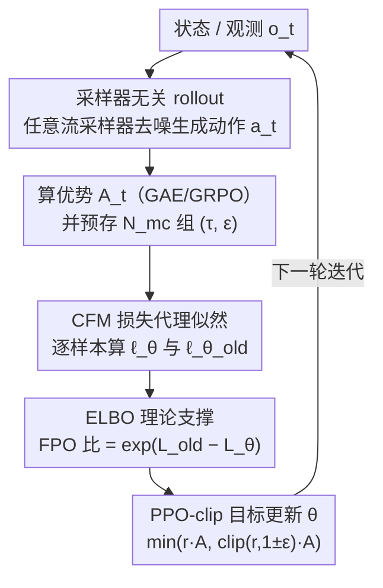

# Flow Matching Policy Gradients

**会议**: ICLR 2026  
**OpenReview**: [https://openreview.net/forum?id=eoEmoKoQpJ](https://openreview.net/forum?id=eoEmoKoQpJ)  
**代码**: 论文承诺开源（待确认）  
**领域**: 强化学习 / 扩散策略 / Flow Matching  
**关键词**: Flow Matching, 策略梯度, PPO, 扩散策略, 多模态动作分布

## 一句话总结
本文提出 **Flow Policy Optimization (FPO)**，把条件 flow matching 损失直接塞进 PPO-clip 框架，用「新旧策略 CFM 损失之差的指数」当作似然比的代理，从而能在不计算流模型精确似然、也不绑定任何采样器的前提下，用纯 on-policy 策略梯度从零训练扩散/流式策略，在连续控制和欠条件人形控制上达到甚至超过高斯策略。

## 研究背景与动机

**领域现状**：在连续控制强化学习里，策略 $\pi_\theta(a\mid o)$ 绝大多数情况下被参数化成一个对角高斯分布——因为高斯的对数似然 $\log\pi_\theta(a\mid o)$ 有解析解，可以直接代入策略梯度和 PPO 的似然比 $r(\theta)=\pi_\theta/\pi_{\text{old}}$。与此同时，扩散模型 / flow matching 已经成为图像、视频、机器人动作等高维连续分布建模的主力工具，表达能力远强于高斯。

**现有痛点**：想把这种表达力强的生成式策略用进 on-policy RL，最大障碍是**流模型的精确似然几乎算不出来**。精确算似然需要对速度场做散度估计（divergence estimation），计算代价高到不可行。于是 PPO 那套依赖精确似然比的机制直接失效。

**核心矛盾**：现有的扩散 RL 方法（DDPO、DPPO、Flow-GRPO）走了一条「绕路」——把去噪过程本身重写成一个马尔可夫决策过程（denoising MDP），把采样链上的每一步都当成一个高斯策略步来训练。这带来三个副作用：① horizon 被去噪步数（通常 10–50）成倍拉长，信用分配（credit assignment）变难；② 初始噪声被当成环境观测，凭空抬高了学习问题的维度；③ 这种构造**只能用随机采样器**，无法享受确定性 / 高阶快速采样器的好处。

**本文目标**：要一个既能保留流模型表达力、又能像高斯策略一样「即插即用」接进标准 PPO/actor-critic 框架，并且**对训练和推理时的采样方式完全无所谓**的策略梯度算法。

**切入角度**：作者抓住了一个被忽略的理论事实——条件 flow matching 损失（CFM loss）正好等于负的证据下界（ELBO），而 ELBO 又是对数似然的下界。既然 PPO 真正需要的只是「让高优势动作的似然变大」，那为什么不直接用容易计算的 CFM 损失去代理那个算不出来的似然？

**核心 idea**：用「旧策略 CFM 损失减新策略 CFM 损失」的指数 $\hat r_{\text{FPO}}=\exp(\hat L_{\text{CFM},\theta_{\text{old}}}-\hat L_{\text{CFM},\theta})$ 替换 PPO 里的似然比，把去噪损失当似然的代理，从而在不碰精确似然、不改采样器的情况下完成策略优化。

## 方法详解

### 整体框架

FPO 的目标和普通 PPO 完全一致——最大化优势加权的裁剪代理目标 $\min(\hat r\hat A,\ \mathrm{clip}(\hat r,1\pm\varepsilon)\hat A)$，唯一改动是把那个**算不出来的似然比 $r(\theta)$ 换成一个用 flow matching 损失现算的代理比 $\hat r_{\text{FPO}}$**。整条管线相对标准 PPO 只动了三处：rollout 时把高斯采样换成流采样（多步去噪）、把噪声动作和噪声步 $\tau$ 一起喂进网络、把 PPO 损失里的似然比换成 FPO 比。

具体一轮迭代是这样转的：先用**任意一个**流采样器跑 rollout 收集轨迹并算优势 $\hat A_t$；对每个状态-动作对，预先采好 $N_{mc}$ 组 $(\tau_i,\epsilon_i)$ 噪声-时间步对并存下来；进入优化 epoch 后，用同一批存好的 $(\tau_i,\epsilon_i)$ 分别在当前参数 $\theta$ 和冻结的 $\theta_{\text{old}}$ 下算出逐样本 CFM 损失，两者相减取指数得到 $\hat r_{\text{FPO}}$，代进 PPO-clip 损失反传更新；价值函数照标准 PPO 更新。

### 关键设计

**1. FPO 比：用 CFM 损失之差的指数代替似然比**

这是全文的核心。PPO 需要似然比 $r(\theta)=\pi_\theta(a_t\mid o_t)/\pi_{\text{old}}(a_t\mid o_t)$，但流模型的 $\pi_\theta$ 算不出来。FPO 不再去算似然，而是构造一个代理比：

$$\hat r_{\text{FPO}}(\theta)=\exp\!\big(\hat L_{\text{CFM},\theta_{\text{old}}}(a_t;o_t)-\hat L_{\text{CFM},\theta}(a_t;o_t)\big)$$

其中逐样本 CFM 损失就是标准的去噪重建项 $\ell_\theta(\tau_i,\epsilon_i)=\lVert\hat v_\theta(a_t^{\tau_i},\tau_i;o_t)-(a_t-\epsilon_i)\rVert_2^2$，带噪动作 $a_t^{\tau_i}=(1-\tau_i)a_t+\tau_i\epsilon_i$ 用 OT（最优传输）调度插值。直觉上，**让一个动作的 CFM 损失下降，几何上等于把概率流更多地「指向」这个动作**，也就让它在策略下更可能被采到——这恰好就是策略梯度想要的：把流导向高优势动作。这个 $\hat r_{\text{FPO}}$ 是似然比的 drop-in 替换，因此天然兼容 GAE、GRPO 等优势估计方法，也兼容预测噪声 $\epsilon$ 或预测干净动作 $a_t$ 的各种流/扩散实现。

**2. ELBO 理论支撑：为什么 CFM 损失能当似然用**

光说「损失下降就是似然上升」还不够，作者给了严格的理论依据。流模型常用 ELBO 作为对数似然的代理：$\mathrm{ELBO}_\theta(a_t\mid o_t)=\log\pi_\theta(a_t\mid o_t)-D_{\text{KL}}^\theta$，而前人（Kingma & Gao, 2023）证明了加权去噪损失（CFM 是其特例）正好等于负 ELBO 加一个与 $\theta$ 无关的常数：$L^w_\theta(a_t)=-\mathrm{ELBO}_\theta(a_t)+c$。把它代回 FPO 比，可以分解出：

$$r_{\text{FPO}}(\theta)=\underbrace{\frac{\pi_\theta(a_t\mid o_t)}{\pi_{\theta_{\text{old}}}(a_t\mid o_t)}}_{\text{真·似然比}}\cdot\underbrace{\frac{\exp(D_{\text{KL}}^{\theta_{\text{old}}})}{\exp(D_{\text{KL}}^\theta)}}_{\text{逆 KL gap 修正}}$$

也就是说，最大化 FPO 比同时做了两件好事：一是抬高真实似然比（鼓励正优势动作），二是收紧 KL gap（让 ELBO 更逼近真实对数似然）。这说明 FPO 不是凑出来的 trick，而是有明确变分推断含义的目标。

**3. 采样器无关的黑盒 rollout：摆脱 denoising MDP 的枷锁**

这是 FPO 相对 DDPO/DPPO/Flow-GRPO 的根本区别。那些方法把去噪过程拆成 MDP、每步当高斯策略，导致 horizon ×去噪步数、初始噪声进观测、只能用随机采样器。FPO 把**采样过程整个当黑盒**——rollout 时用什么采样器都行（确定性或随机、几步或几十步、低阶或高阶），因为 FPO 比的计算只依赖最终动作 $a_t$ 和重新采的 $(\tau,\epsilon)$，跟生成 $a_t$ 时走的具体采样路径无关。训练和推理可以用不同采样器，实现上也不需要自定义采样器或额外的环境步概念，因此「只需对标准 PPO 做很小改动」。配套地，FPO 比用 $N_{mc}$ 组蒙特卡洛 $(\tau,\epsilon)$ 估计，$N_{mc}$ 成了控制学习效率的有用超参；单样本估计虽然按 Jensen 不等式在期望上是真比的上界（有上偏），但用 log-derivative trick 可证**梯度方向是无偏的**，所以即便 $N_{mc}=1$ 也能训出超过高斯 PPO 的策略。

### 损失函数 / 训练策略

最终优化目标即 PPO-clip 形式（Algorithm 1）：对每个状态-动作对，用存好的 $(\tau_i,\epsilon_i)$ 算 $\hat r_\theta=\exp\!\big(-\tfrac{1}{N_{mc}}\sum_i(\ell_\theta(\tau_i,\epsilon_i)-\ell_{\theta_{\text{old}}}(\tau_i,\epsilon_i))\big)$，再代入 $L_{\text{FPO}}=\min(\hat r_\theta\hat A_t,\ \mathrm{clip}(\hat r_\theta,1\pm\varepsilon)\hat A_t)$。实现基于 Brax PPO，60M 环境步、batch 1024、每批 16 次更新、学习率 3e-4、10 步采样；关键超参 $\varepsilon_{\text{clip}}=0.05$（扫过 0.01–0.3，发现 FPO 偏好比高斯 PPO 更小的裁剪阈值）。

## 实验关键数据

实验覆盖三个难度递增的域：25×25 稀疏奖励 GridWorld（验证多模态）、MuJoCo Playground 10 个连续控制任务、Isaac Gym 高维 SMPL 人形 MoCap 跟踪（24 个关节 ×6 自由度）。

### 主实验

MuJoCo Playground 10 任务平均评估奖励对比（5 seed）：

| 方法 | 平均奖励 | 说明 |
|------|---------|------|
| Gaussian PPO | 667.8 ± 66.0 | 调参后的高斯基线 |
| Gaussian PPO†（默认超参） | 577.2 ± 74.4 | 用 Playground 默认配置 |
| DPPO（denoising MDP） | 652.5 ± 83.7 | 扩散策略 on-policy 基线 |
| **FPO‡** | **759.3 ± 45.3** | 8 组 $(\tau,\epsilon)$、$\epsilon$-MSE、$\varepsilon_{\text{clip}}=0.05$ |

FPO 在 10 个任务中的 8 个上奖励最高，整体超过 Gaussian PPO 和 DPPO。

### 消融实验

| 配置 | 平均奖励 | 说明 |
|------|---------|------|
| FPO（满配 8 对） | 759.3 ± 45.3 | 完整模型 |
| FPO, 4 个 $(\tau,\epsilon)$ | 731.2 ± 58.2 | 减蒙特卡洛样本数，掉点 |
| FPO, 1 个 $(\tau,\epsilon)$ | 691.6 ± 50.3 | 仅 1 对仍超过高斯 PPO |
| FPO, u-MSE | 664.6 ± 48.5 | 用 $u$-CFM 取代 $\epsilon$-CFM，明显变差 |
| FPO, $\varepsilon_{\text{clip}}=0.1$ | 623.3 ± 76.3 | 裁剪阈值偏大 |
| FPO, $\varepsilon_{\text{clip}}=0.2$ | 526.4 ± 76.8 | 裁剪阈值过大，崩 |

人形控制（不同目标条件，FPO vs Gaussian PPO）：

| 方法 | 目标条件 | 成功率↑ | 存活时长↑ | MPJPE↓ |
|------|---------|--------|----------|--------|
| Gaussian PPO | 全关节 | 98.7% | 200.46 | 31.62 |
| FPO | 全关节 | 96.4% | 198.00 | 41.98 |
| Gaussian PPO | Root+Hands | 46.5% | 142.50 | 97.65 |
| **FPO** | Root+Hands | **70.6%** | **171.32** | **62.91** |
| Gaussian PPO | Root | 29.8% | 114.06 | 123.70 |
| **FPO** | Root | **54.3%** | **152.90** | **73.55** |

### 关键发现
- **$(\tau,\epsilon)$ 采样数很重要但不致命**：样本越多奖励越高，但即便 $N_{mc}=1$ 也能超过高斯 PPO，印证了「梯度方向无偏」的理论分析——多样本只是降方差，不改方向。
- **$\epsilon$-CFM 优于 $u$-CFM**：把速度估计先转成 $\epsilon$ 噪声再算 CFM 损失，比直接在速度上算更好（759.3 vs 664.6）。作者猜测是因为 $\epsilon$ 的尺度对动作尺度不变，使 $\varepsilon_{\text{clip}}$ 的选择泛化更好。
- **欠条件场景是 FPO 的主场**：全关节条件下 FPO 与高斯 PPO 持平；但只给 root 或 root+hands 这种「欠条件」目标时，FPO 大幅反超（root 成功率 54.3% vs 29.8%）。高斯策略在缺关节指定时学不会稳定行走会摔倒，而流策略凭表达力能用单阶段训练「脑补」出物理上合理的缺失关节——前人要靠先训全条件 teacher 再蒸馏才能做到。
- **多模态**：GridWorld 鞍点状态上，FPO 学到的初始高斯演化成双峰分布，同一起点的轨迹能分别到达不同目标；高斯策略则更确定性，总是奔最近的目标。

## 亮点与洞察
- **把「损失」直接当「似然」用**：最让人「啊哈」的是它绕开了流模型 RL 最大的拦路虎（精确似然 / 散度估计），用人人都会算的去噪损失差当似然比代理，且有 ELBO=−CFM loss 的严格背书，不是 hack。
- **采样器解耦**：FPO 比只依赖最终动作和重采的 $(\tau,\epsilon)$，与生成动作的采样路径无关，这一点让它能用任意确定性/高阶采样器，是它比 denoising-MDP 系方法更优雅、更省的根因。
- **「梯度无偏、估计有偏」的洞察可迁移**：$N_{mc}=1$ 时比值估计上偏但梯度方向无偏的分析，给所有「用蒙特卡洛比值做策略梯度」的方法提供了一个省算力的理论安全垫。
- **drop-in 替换的工程价值**：只需在现成 PPO 上改三处（输入加噪声+时间步、换采样、换比值），就能把高斯策略升级成扩散策略，迁移成本极低，适合直接微调 VLA 等大型扩散策略。

## 局限与展望
- **作者承认**：尚未在真实机器人上验证 sim-to-real；也还没在大型预训练扩散策略（如 VLA 模型）上做微调，这是明确的未来方向；以及引入 mean-flow 等单步流方法以提效。
- **算力开销**：相比高斯单次似然，FPO 每个样本要算 $N_{mc}$ 次前向 CFM 损失（满配 8 次 ×新旧两套），rollout 还要多步去噪，单步成本高于高斯 PPO，论文未给出 wall-clock 对比。
- **全条件下无优势**：全关节条件人形任务上 FPO 略逊于高斯 PPO（MPJPE 41.98 vs 31.62），说明流策略的表达力红利主要体现在欠条件/多模态场景，条件充分时反而是「杀鸡用牛刀」。
- **超参敏感**：$\varepsilon_{\text{clip}}$ 从 0.05 到 0.2 奖励几乎腰斩（759→526），裁剪阈值的鲁棒性还需更系统的研究。

## 相关工作与启发
- **vs DPPO / DDPO / Flow-GRPO（denoising MDP 系）**：他们把去噪链重写成 MDP、每步当高斯策略训练，导致 horizon 膨胀、初始噪声进观测、只能用随机采样器；FPO 直接把 CFM 损失嵌进 PPO 比、把采样当黑盒，更简单、维度更低、采样器自由。MuJoCo 上 FPO 759.3 > DPPO 652.5。
- **vs Gaussian PPO**：本文是其 drop-in 升级——同一 PPO 框架，把对角高斯换成流策略、似然比换成 FPO 比。表达力更强，在多模态和欠条件场景显著胜出，全条件场景持平略逊。
- **vs Q-score matching（Psenka et al., 2023）等 off-policy 扩散策略**：那是 off-policy 路线；FPO 专注 on-policy，契合当下 RLHF/可验证奖励等主流后训练范式。
- **vs DeepMimic / PHC 的稀疏目标控制**：前人靠「先训全条件 teacher 再蒸馏」或额外编码器来做稀疏目标人形控制；FPO 用单阶段从零训练就拿到更高成功率，简化了 pipeline。

## 评分
- 新颖性: ⭐⭐⭐⭐⭐ 用 CFM 损失差代理似然比、把流策略无缝接入 PPO，思路简洁且有 ELBO 严格支撑
- 实验充分度: ⭐⭐⭐⭐ GridWorld+MuJoCo+高维人形三档覆盖到位，消融扎实，但缺真实机器人和算力开销对比
- 写作质量: ⭐⭐⭐⭐⭐ 理论推导清晰、动机层层递进，算法伪代码与直觉解释配合好
- 价值: ⭐⭐⭐⭐⭐ 给「表达力强的生成式策略 + on-policy RL」提供了简单通用的落地方案，对 VLA 微调有直接前景

<!-- RELATED:START -->

## 相关论文

- [\[ICLR 2026\] Bridging Successor Measure and Online Policy Learning with Flow Matching-Based Representations](bridging_successor_measure_and_online_policy_learning_with_flow_matching-based_r.md)
- [\[ICLR 2026\] Does “Do Differentiable Simulators Give Better Policy Gradients?” Give Better Policy Gradients?](does_do_differentiable_simulators_give_better_policy_gradients_give_better_polic.md)
- [\[ICLR 2026\] floq: Training Critics via Flow-Matching for Scaling Compute in Value-Based RL](floq_training_critics_via_flow-matching_for_scaling_compute_in_value-based_rl.md)
- [\[ICLR 2026\] ResT: Reshaping Token-Level Policy Gradients for Tool-Use Large Language Models](rest_reshaping_token-level_policy_gradients_for_tool-use_large_language_models.md)
- [\[ICLR 2026\] PolicyFlow: Policy Optimization with Continuous Normalizing Flow in Reinforcement Learning](policyflow_policy_optimization_with_continuous_normalizing_flow_in_reinforcement.md)

<!-- RELATED:END -->
