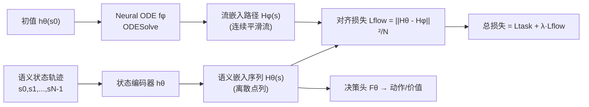

# Flowing Through States: Neural ODE Regularization for Reinforcement Learning

**会议**: ICLR 2026  
**OpenReview**: [https://openreview.net/forum?id=FHFDCsB9UC](https://openreview.net/forum?id=FHFDCsB9UC)  
**代码**: 待确认  
**领域**: 强化学习 / 表示学习  
**关键词**: Neural ODE, 表示学习, Actor-Critic, A2C, 隐空间正则化, MDP 动力学  

## 一句话总结
本文提出 **FlowReg**：用一个 neural ODE 在隐空间里拟合一条平滑连续的轨迹流，并以对齐损失逼迫智能体的状态编码器让相邻状态的隐表示沿着这条 ODE 流走，从而把"环境转移动力学"显式注入表示学习，在 Atari（A2C）和 MiniGrid（PPO）上获得显著性能提升。

## 研究背景与动机
- **领域现状**：序列决策（RL）里的神经网络都在隐空间上做决策，但环境的语义状态如何演化（转移动力学 $P(s'|s,a)$）通常只隐式地依赖任务损失自己慢慢学，隐空间的转移结构是"放任自流"的。
- **现有痛点**：感知任务的归纳偏置（CNN 的平移等变、局部性等）只刻画单个对象的局部结构，但序列决策需要的是"状态之间随时间如何关联"的**全局**结构。在**离散状态** MDP 中尤其严重——离散状态彼此孤立，没有先验的邻近/平滑概念，连续性必须在隐空间里"人为施加"，否则相邻状态的嵌入可能乱跳、互相穿越。
- **核心矛盾**：neural ODE 天然能描述"初始状态唯一决定后续轨迹"这一与 Markov 性质高度契合的连续流，但若直接拿 ODE 做推理则慢得离谱（依赖数值积分）、且语义状态的离散跳变会破坏其连续性假设，工程上不实用。
- **本文目标**：既要 ODE 连续流带来的全局拓扑结构（平滑、一致、确定性），又要常规前向网络的推理效率。
- **核心 idea**：**让 neural ODE 当"训练时的隐空间外挂正则器"而非推理模型**——训练一个 ODE 流模型描述隐空间动力学，再用一个对齐惩罚逼迫语义编码器去模仿 ODE 流的轨迹，二者互相塑形，推理时完全丢掉 ODE。

## 方法详解

### 整体框架
FlowReg 维护两个模型：目标智能体模型 $\theta$（含状态编码器 $h_\theta$ 与下游决策头 $F_\theta$）和流正则器 $\phi$（neural ODE 网络 $f_\phi$）。对一条状态轨迹 $s=s_0,\dots,s_{N-1}$，编码器直接产出"语义嵌入序列" $H_\theta(s)=\{h_\theta(s_i)\}$，而 ODE 以 $h_\theta(s_0)$ 为初值积分出一条"流嵌入路径" $H_\phi(s)$。训练时把二者对齐的损失加进任务损失，让编码器的离散点列贴合 ODE 的连续平滑路径；推理时只用 $\theta$。

### 关键设计

**1. 把 MDP 轨迹类比成 ODE 流，用 neural ODE 给隐空间装"全局确定性骨架"**——出发点是 MDP 的 Markov 性质与 ODE 的初值唯一性高度同构：当前状态完全决定后续。于是用 neural ODE $\frac{dh(t)}{dt}=f_\phi(h(t),t)$（在 Lipschitz 连续等温和条件下保证唯一连续轨迹）来定义隐空间的"流场"。由于 MDP 状态本身没有时间戳，需要给轨迹里每个状态人为指定积分时间 $\tau_i$；又因 Markov 性使底层 ODE 是自治（时不变）的，时间采样方式仍很关键：作者给出两种——索引采样 $\tau_i=i$，以及与智能体折扣因子一致的指数衰减 $\tau_i=\gamma^i$（把积分时间压在 $[0,1]$ 内，避免过大积分区间引发梯度不稳）。流嵌入由数值解给出：$H_\phi(s)=\text{ODESolve}(f_\phi, h_\theta(s_0), \{\tau_i\})$。

**2. 路径对齐（Path Alignment）：用一个 MSE 让编码器点列与 ODE 流互相塑形**——直觉是初始时 ODE 流只携带"曲率/拓扑"信息、语义编码器只携带"任务"信息，作者希望把两路信号融合。做法极简：直接最小化语义嵌入序列与采样流路径之间的均方误差
$$
L_{\text{flow}}(s) := \frac{\lVert H_\theta(s) - H_\phi(s)\rVert_2^2}{N}.
$$
妙处在于这个损失同时对 $\theta$ 和 $\phi$ 求导：它既训练编码器 $\theta$ 去跟随连续 ODE 流（继承平滑拓扑），又训练 ODE $\phi$ 反过来适配当前任务塑造的隐空间，是一种**双向对齐**而非单向蒸馏。比起只约束"相邻状态可预测"的方法（如 TACO），ODE 流的唯一性意味着状态从**任意**前驱都可预测，是更强的时间一致性约束。

**3. 总目标与"训练时外挂"定位：低频更新即可、推理零开销**——流损失以加权方式并入任务损失 $L(s,y)=L_{\text{task}}(F_\theta(H_\theta(s)),y)+\lambda L_{\text{flow}}(s)$；对 A2C 即 $L=L_{\text{actor}}+\beta L_{\text{critic}}+\lambda L_{\text{flow}}$。关键工程点是 **FlowReg 相对智能体更新的频率**——neural ODE 数值积分昂贵，但实验表明每 5~20 次智能体更新才做一次流正则就够，既保住增益又把训练开销压到与 baseline 可比；且 ODE **只在训练时**充当自适应正则器，推理时彻底移除，没有任何额外推理成本。

## 实验关键数据

### 主实验（Atari A2C，11 环境，10M steps，10 seeds）
不同时间采样模式下的最佳平均回合奖励（Table 1，16 回合×10 seed）：

| A2C Agent | Qbert | Riverraid | BeamRider |
|---|---|---|---|
| Base | 4374 ± 958 | 1862 ± 2400 | 961 ± 748 |
| FlowReg (Index) | **8306 ± 1753** | 2946 ± 2788 | 1591 ± 1033 |
| FlowReg (Exp-Decay) | 6903 ± 2158 | **2948 ± 2799** | **1593 ± 962** |

FlowReg 在全部 11 个环境上都优于 baseline，且两种时间采样模式都有效。

### 消融：更新频率（Qbert，U-m = 每 m 次智能体更新做一次流正则，Table 2）

| A2C Agent | Qbert (Index) | Qbert (Exp-Decay) |
|---|---|---|
| Base | 4374 ± 958 | 4374 ± 958 |
| FlowReg U-5 | **8306 ± 1753** | 5287 ± 1270 |
| FlowReg U-10 | 6570 ± 2646 | **6903 ± 2158** |
| FlowReg U-20 | 5986 ± 2756 | 6783 ± 1877 |

即便 U-20（流损失更新减半）仍有显著增益——说明流正则不必激进优化即可超越 baseline，训练成本友好。

### 隐空间平滑度（Table 3，按轨迹长度归一化，越小越平滑）

| Qbert | Path Length | Net Disp. | Accel. Energy | Reward |
|---|---|---|---|---|
| A2C | 34.39 | 0.44 | 4424.75 | 4374 |
| A2C+TACO | 6.13 | 0.03 | 106.38 | 2434 |
| A2C+FlowReg | **4.20** | 0.10 | **64.17** | **8306** |

### 关键发现
- **平滑且涨分**：FlowReg 让隐轨迹大幅平滑（路径长度/加速度能量骤降），同时性能不降反升。
- **平滑 ≠ 涨分，关键是"尊重转移动力学"**：TACO 也能把路径变平滑，但在两个环境上反而掉分；FlowReg 的对齐损失施加的是**微分同胚**结构，平滑的同时保住语义结构，故方差降低、增益稳定。
- **PPO + MiniGrid 也有效**：在 FourRooms、DynamicObstacles 上明显优于 baseline，DoorKey 上二者都基本解决环境（打平），验证方法跨算法（A2C→PPO）和跨更离散域的泛化。

## 亮点与洞察
- **"ODE 当正则器而非推理器"**这一定位很聪明：绕开了 neural ODE 推理慢、离散跳变破坏连续性的两大死穴，又拿到了连续流的全局拓扑红利。
- **双向对齐损失**让 ODE 与编码器互相适配，而不是把 ODE 当固定先验硬蒸馏，避免了"为平滑而平滑"破坏语义。
- 用平滑度三指标（path length / displacement / acceleration energy）量化隐空间几何，并通过与 TACO 对比剥离"平滑本身 vs 尊重动力学"两个因素，论证扎实有说服力。
- 方法对任务损失/架构几乎无侵入，只加一个外挂正则器，落地门槛低。

## 局限与展望
- 评测规模偏小：只在 A2C（11 Atari）+ PPO（3 MiniGrid）上验证，未触及 SAC、连续控制（MuJoCo）或更大规模 benchmark。
- 时间采样 $\tau_i$ 的设计偏启发式（index / exp-decay），缺乏自适应或理论指导，论文也承认其选择"相当影响性能"。
- ODE 数值积分仍带训练开销，靠降低更新频率缓解，但相对运行时开销与增益的权衡依环境而异。
- λ 简单设为 1，未充分探索权重调度；流损失对 reward 稀疏/高度随机环境的鲁棒性未知。

## 相关工作与启发
- **Neural ODE as 连续深度网络**（Chen et al. 2018；ResNet 的 Euler 离散视角）：本文换了视角——不看单层变换，而看"整个编码器作用于状态序列产生的隐轨迹"。
- **Neural ODE 做连续控制**（Jia & Benson 2019；Alvarez et al. 2020）：这些方法把 ODE 当主推理模型预测语义轨迹，难用于离散域；本文只把 ODE 当解耦正则器。
- **预测编码/对比表示**（TACO、SPR 等）：通过"从前驱可预测后继"塑形隐空间；FlowReg 借 ODE 流唯一性施加更强的"从任意前驱可预测"的一致性。
- **启发**：把"已知的领域结构（Markov→ODE 唯一流）"编码成一个可微分外挂正则器、训练时对齐、推理时丢弃，是一条把动力学先验注入表示学习的通用范式，可推广到时序预测、世界模型等场景。

## 评分
- **新颖性**: ⭐⭐⭐⭐ MDP↔ODE 流的类比加"ODE 仅作训练时正则器"的定位新颖且自洽，双向对齐损失设计巧妙。
- **实验充分度**: ⭐⭐⭐ 跨 A2C/PPO 两算法 + 平滑度剖析有说服力，但环境规模偏小、缺连续控制与更大 benchmark。
- **写作质量**: ⭐⭐⭐⭐ 动机—方法—实验逻辑清晰，几何分析与 TACO 对比把因果讲透。
- **价值**: ⭐⭐⭐⭐ 提供一个低侵入、推理零开销、跨算法可迁移的动力学先验正则范式，实用价值高。

<!-- RELATED:START -->

## 相关论文

- [\[ICLR 2026\] Neural+Symbolic Approaches for Interpretable Actor-Critic Reinforcement Learning](neuralsymbolic_approaches_for_interpretable_actor-critic_reinforcement_learning.md)
- [\[ICLR 2026\] From Ticks to Flows: Dynamics of Neural Reinforcement Learning in Continuous Environments](from_ticks_to_flows_dynamics_of_neural_reinforcement_learning_in_continuous_envi.md)
- [\[ICLR 2026\] Neural Predictor-Corrector: Solving Homotopy Problems with Reinforcement Learning](neural_predictor-corrector_solving_homotopy_problems_with_reinforcement_learning.md)
- [\[ICLR 2026\] Critique-RL: Training Language Models for Critiquing Through Two-Stage Reinforcement Learning](critique-rl_training_language_models_for_critiquing_through_two-stage_reinforcem.md)
- [\[ICLR 2026\] RESCHED: Rethinking Flexible Job Shop Scheduling from a Transformer-based Architecture with Simplified States](resched_rethinking_flexible_job_shop_scheduling_from_a_transformer-based_archite.md)

<!-- RELATED:END -->
