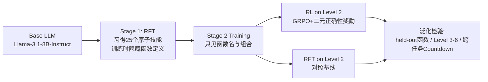

# From f(x) and g(x) to f(g(x)): LLMs Learn New Skills in RL by Composing Old Ones

**会议**: ICLR 2026  
**OpenReview**: [https://openreview.net/forum?id=jt7oCtYqHE](https://openreview.net/forum?id=jt7oCtYqHE)  
**代码**: 待确认  
**领域**: 强化学习 / LLM 后训练 / 组合泛化  
**关键词**: RLVR, 技能习得, 组合泛化, GRPO, easy-to-hard 泛化, 跨任务迁移  

## 一句话总结
论文用一个去污染的字符串变换合成任务证明：当 LLM 已通过预训练掌握"原子技能"后，**只要 RL 训练显式激励"组合"**，它就能真正学到原子技能无法解释的全新组合技能，并泛化到更深的嵌套层级乃至完全不同的任务——直接反驳了"RL 只是重排基座模型已有能力"的悲观观点。

## 研究背景与动机
- **领域现状**：RLVR（带可验证奖励的 RL）在数学/推理上效果显著，甚至能直接在 base model 上训练而无需 SFT 热身。但围绕"RL 到底教没教会模型新东西"存在激烈争论。
- **现有痛点**：悲观派的核心证据是 **pass@k 现象**——随着采样数 $k$ 增大，base model 与 RL 模型的差距收窄，由此推断 RL 只是把 base 已有的解法"重排"（reranking）到 pass@1，并未学到新技能；另有工作认为"aha moment"只是放大了 base model 已存在的认知行为。
- **核心矛盾**：这些结论都基于**模糊的"技能"定义**（用某种推理模式的出现频率当代理指标）和**混合难度的脏 benchmark**——base model 很可能在预训练阶段已见过类似数据，导致 RL 没有动机也没有空间去学新技能。无法把"真正习得新技能"和"激活已有能力"区分开。
- **本文目标**：构造一个能精确控制任务难度、彻底去污染、技能边界清晰的合成框架，干净地回答三个问题：(1) RL 是否教 LLM 新技能？(2) 若是，如何激励？(3) 学到的技能能否泛化？
- **核心 idea（RL 组合性假设）**：受认知科学 Anderson(1982) 启发——人类通过**组合并内化已有技能**来习得新认知技能。**作者假设：一旦模型通过 NTP 训练掌握了任务必需的原子（不可分解）技能，带有恰当激励的 RL 就能教会它把原子技能组合成更复杂的新能力**，而这种"会组合"本身就是认知科学意义上的新技能。

## 方法详解

### 整体框架
论文把"技能"严格定义为：给定输入字符串 $x$，推断变换函数 $f(x)$ 输出的能力。原子技能是单个不可分解的变换 $f(x)$，组合技能是嵌套组合 $h(x)=g(f(x))$。难度由嵌套深度（Level $n$ = $n$ 个函数复合）精确控制。整个研究采用**两阶段训练协议**把"原子技能习得"和"组合技能学习"彻底分离，再在 held-out 函数、更高难度、跨任务三个维度上检验泛化。

### 关键设计

**1. 去污染的字符串变换测试台：把"技能"变成可控变量。** 论文构造了 25 个独特的字符串变换函数（覆盖字符操作、重排、过滤、结构修改等），并给每个函数赋予**无意义的标识符**（如 `func_16`）使其无法从函数名推断功能；RL 阶段还把函数定义全部隐藏。这样设计的关键在于——这些任务在 LLM 预训练语料中不存在，且不经过本文的原子技能训练就**根本无法求解**，从而把数据污染、"base 已会"这些混淆因素全部排除。难度通过组合的嵌套深度连续可调：Level 1 的 `func_16(x)` 是原子任务，Level 2 的 `func_16(func_15(x))` 就要求组合推理，模型必须做演绎推理给出变换后的输出字符串。

**2. 两阶段训练协议：分离原子习得与组合学习。** Stage 1 用拒绝微调（RFT）让模型习得原子技能——数据收集时**给出**显式函数定义让模型生成正确推理轨迹，但微调时**删掉**这些定义，迫使模型仅凭函数标识符就能预测输出，即把函数行为"内化"为原子技能；这也是模型唯一一次接触函数实现的机会。Stage 2 模型只看到函数名与组合（如 `func_2(func_16(x))`），定义全部隐藏，迫使其依赖已内化的原子知识来学系统性组合。Stage 2 对比两条路线：**在线 RL** 用基于输出正确性的二元奖励、通过 **GRPO** 更新（检验 RL 是否为习得组合技能所必需）；**离线 RFT** 在组合问题的正确推理轨迹上做 NTP（检验仅靠"看过组合样例"能否学会组合）。

**3. 组合激励是 RL 学到新技能的必要条件。** 论文用三种 Stage 2 配置隔离"组合激励"的作用：RL Level 1（只在原子任务上训）、RL Level 2（只在两层组合上训）、RL Level 1+2（均匀混合）。结果显示只训原子技能（RL Level 1）在 Level 1 上能到 ~90%，但 Level 2 不足 25%、Level 3-6 几乎为零——**学原子技能本身不足以学会组合**。只有把组合数据纳入 RL，模型才能泛化到训练中未见的更深嵌套。这解释了为何 Sun et al.(2025) 会得出"RL 不促进组合泛化"的结论：他们的训练里**没有显式的组合激励**。

**4. 用细粒度难度切分破解"重排错觉"（reranking illusion）。** 悲观派的 pass@k 收窄现象，论文归因于两点：一是**在混合难度 benchmark 上评估**，某个具体技能（如组合）的提升会被其他瓶颈技能掩盖；二是 **RL 训练本身没有激励新技能**。本文的可控框架按难度逐级隔离技能，于是可以观察到：在 base 已经 pass@k 很高的简单问题（Level 1-2）上差距确实随 $k$ 收窄（符合重排叙事），但在 base 接近零的困难组合问题（Level 3-8）上，RL 模型的优势**随 $k$ 增大而扩大**——例如 Level 5 上对 RFT base 的 pass@k 差距从 pass@1 的 4% 涨到 pass@1024 的约 25%，这是新技能习得的明确证据。

## 实验关键数据

实验基座统一为 Llama-3.1-8B-Instruct（被近期工作认定为受数据污染影响较小的干净测试台）。

### 主实验：组合数据 + RL 教会泛化技能（held-out, Level 3-6）

| Stage 2 配置 | Level 1 | Level 2 | Level 3 | Level 4 |
|---|---|---|---|---|
| RL Level 1（仅原子） | ~90% | <25% | ~0% | ~0% |
| RL Level 2 / Level 1+2 | 高 | 强 | 5%→**~30%** | 1%→**~15%** |

Level 5 仍有非平凡增益，说明模型学到的是**可泛化的组合原理**而非记忆答案。

### RL vs RFT 对照（同样的 Level 2 数据）

| 方法 | Level 2 | Level 3 |
|---|---|---|
| 迭代 RFT | 仅 **15%** | 始终 <2.6% |
| RL Level 2 | **64%** | **27%** |

RFT 即使在与训练同难度的 held-out Level 2 上都泛化失败（仅 15%），证明**单纯看过组合样例不够，RL 才是关键因素**。

### 跨任务迁移（Countdown，无任何 Countdown RL）

| 模型配置 | Countdown 原子技能 | String 组合 RL | Countdown Lvl3 Avg@32 |
|---|---|---|---|
| String-Base + RL L1+2 | ✗ | ✓ | 完全失败 |
| Multi-Base（仅原子） | ✓ | ✗ | ~17% |
| Multi-Base + RL L1 | ✓ | 仅原子 RL | ~20% |
| Multi-Base + RL L1+2 | ✓ | ✓ | **~35%** |

在字符串任务上学到的组合技能迁移到 Countdown，Level 3 提升 >18%，Level 4 仍约 6%（其他模型近零）。但 String-Base + RL L1+2 完全失败，证明**目标任务的原子技能是迁移生效的先决条件**——组合技能像一种"元技能"，放大目标任务原子知识的利用率。

### 行为分析（Gemini-2.5-Pro 分类 Level 3 失败模式）
RFT Base / RFT Level 2 / RL Level 1 三者失败模式高度相似：>50% 直接忽略组合、>35% 误解组合结构。而 RL Level 2 模型**彻底消除了"忽略组合"错误**，正确率 28.1%，主要失败模式转为"原子错误"（55%）——即模型已能正确解析并执行组合计划，失败降级为低层执行误差。

### 关键发现
- **Takeaway 1**：组合数据上的 RL 教会的新技能能泛化到已知原子技能的未见组合。
- **Takeaway 2**：RFT 即便用组合数据也学不好组合；RL 是习得可泛化组合技能的另一关键因素。
- **Takeaway 3**：RL 学到的组合技能可迁移到模型已具备原子技能的不同任务。
- **Takeaway 4**："RLVR 只是利用 base 推理模式"的结论很可能是"在 base 已高 pass@k 的任务上评估/训练"造成的假象。
- **Takeaway 5**：RL 不只是提升准确率，而是**根本性地改变了模型行为**，让它真正理解并处理组合。

## 亮点与洞察
- **方法论范式价值**：把宏大争论（RL 教不教新技能）落到一个技能边界清晰、难度连续可控、彻底去污染的合成沙盒里，使"技能习得"第一次成为可因果归因的变量——这是本文最大的贡献，远超具体结论本身。
- **"重排错觉"的概念提炼**：指出混合难度 benchmark 会把不同类型能力混为一谈，从而掩盖真实的技能习得，给整个 pass@k 争论提供了优雅的统一解释。
- **对实践的启示**：组合技能可跨任务迁移、且依赖原子技能，解释了 Logic-RL（逻辑题训练提升数学）、Guru（预训练曝光多的领域跨任务收益大）等现象——主张 base model 开发与后训练策略应从"技能习得"视角协同设计。

## 局限与展望
- **合成任务的外推性**：字符串变换与 Countdown 都是高度结构化的合成任务，结论能否平移到开放域自然语言推理、真实代码/数学仍需验证。
- **充分性而非必要性**：论文证明"具备原子技能"是 RL 解锁组合能力的**充分条件**，但明确不主张它是严格必要的——没有原子技能时随机探索效率极低的问题留待后续。
- **模型与规模单一**：仅在 Llama-3.1-8B-Instruct 上验证，未覆盖不同规模、不同家族基座，组合技能习得是否随规模变化未知。
- **奖励形式简单**：只用二元正确性奖励 + GRPO，更复杂的奖励塑形/算法对组合技能习得的影响未探索。

## 相关工作与启发
- **悲观派**（Yue et al. 2025, Wu et al. 2025a）：pass@k 差距随 $k$ 收窄 → RL 只重排不学新技能。本文用细粒度难度切分反驳。
- **认知科学根基**：Anderson(1982) 的技能习得理论、Lake et al.(2016) 的组合性，是本文"组合即新技能"的理论支柱。
- **组合泛化**：Sun et al.(2025) 发现直接在原子技能上 RL 无法组合泛化（本文解释为缺组合激励）；Yin et al.(2025) 通过 ICL 而非 RL 实现组合提升。
- **启发**：构建 base model 时应有意识地植入必需的基础原子技能，后训练才能高效"组合"出新能力；评估新技能时务必做细粒度、按难度/领域分层的分析，避免被聚合指标误导。

## 评分
- **新颖性**: ⭐⭐⭐⭐⭐ —— 用干净合成框架把"RL 是否教新技能"这一悬而未决的大争论变成可因果验证的实验，并提出"重排错觉"概念，视角与方法论都极具原创性。
- **实验充分度**: ⭐⭐⭐⭐ —— 三个研究问题各有针对性实验（held-out / RL vs RFT / 跨任务 / pass@k / 行为分析）逻辑闭环严密；扣分在于仅单一基座单任务族，规模与开放域验证不足。
- **写作质量**: ⭐⭐⭐⭐⭐ —— 问题动机层层递进，图 1 总览清晰，五个 Takeaway 把论证主线串得明明白白，是一篇范本级的"立场+证据"论文。
- **价值**: ⭐⭐⭐⭐⭐ —— 直接回应了 LLM 后训练领域最核心的争议，对"预训练 vs 后训练"资源分配、base model 设计与 RL 策略协同有实质指导意义。

<!-- RELATED:START -->

## 相关论文

- [\[ICLR 2026\] RL Grokking Recipe: How Does RL Unlock and Transfer New Algorithms in LLMs?](rl_grokking_recipe_how_does_rl_unlock_and_transfer_new_algorithms_in_llms.md)
- [\[ICLR 2026\] RL Squeezes, SFT Expands: A Comparative Study of Reasoning LLMs](rl_squeezes_sft_expands_a_comparative_study_of_reasoning_llms.md)
- [\[ICLR 2026\] Principled RL for Diffusion LLMs Emerges from a Sequence-Level Perspective](principled_rl_for_diffusion_llms_emerges_from_a_sequence-level_perspective.md)
- [\[ICLR 2026\] Reinforcement Learning with Verifiable Rewards Implicitly Incentivizes Correct Reasoning in Base LLMs](reinforcement_learning_with_verifiable_rewards_implicitly_incentivizes_correct_r.md)
- [\[ICLR 2026\] Getting Your LLMs Ready for Reinforcement Learning with Lightweight SFT](getting_your_llms_ready_for_reinforcement_learning_with_lightweight_sft.md)

<!-- RELATED:END -->
