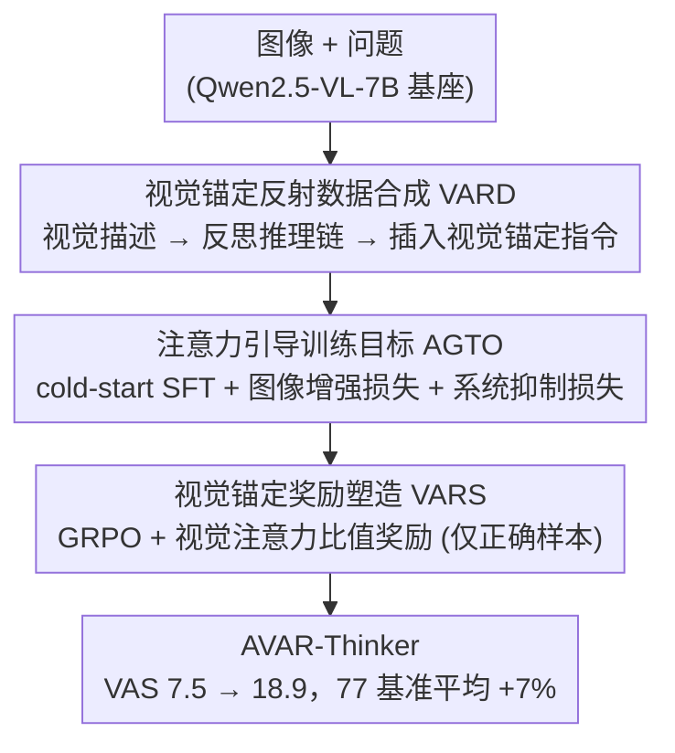

# From Narrow to Panoramic Vision: Attention-Guided Cold-Start Reshapes Multimodal Reasoning

**会议**: ICLR 2026  
**arXiv**: [2603.03825](https://arxiv.org/abs/2603.03825)  
**代码**: [https://github.com/lrlbbzl/Qwen-AVAR](https://github.com/lrlbbzl/Qwen-AVAR)  
**领域**: 强化学习  
**关键词**: 视觉注意力, 多模态推理, cold-start, 注意力引导训练, GRPO

## 一句话总结
发现多模态 LLM 的推理性能与视觉注意力分数（VAS）高度相关（r=0.96），提出 AVAR 框架通过视觉锚定数据合成、注意力引导训练目标和视觉锚定奖励塑造三个阶段提升 VAS，在 77 个基准上平均提升 7%。

## 研究背景与动机

**领域现状**：多模态 LLM（如 Qwen2.5-VL）在推理任务上取得显著进展，但研究发现它们的推理过程往往"懒于看图"——模型倾向于关注系统 token 而非视觉 token。

**现有痛点**：多模态 cold-start 训练后，模型的 Visual Attention Score（VAS）并未提升，甚至下降。VAS 衡量推理 token 对视觉 token 的注意力占比，低 VAS 意味着模型在推理时没有充分利用图像信息。

**核心矛盾**："Lazy Attention Localization"——模型学会了用文本描述和系统指令中的线索"偷懒"推理，而不是真正去看图像中的关键信息。

**本文目标** 如何在 cold-start 和 RL 阶段强制模型增加对视觉 token 的注意力？

**切入角度**：发现 VAS 与推理性能正相关（r=0.96），直接优化 VAS 作为训练信号。

**核心 idea**：通过注意力层面的显式监督——增强图像注意力 + 抑制系统注意力——迫使模型"回头看图"。

## 方法详解

### 整体框架

这篇论文要解决的是多模态 LLM "懒于看图"的问题：模型在推理时把注意力堆在系统 token 上，对图像 token 的关注（即 VAS）很低，而 VAS 又与推理性能高度正相关（r=0.96）。AVAR 的思路因此非常直接——既然 VAS 可度量、又和性能挂钩，那就把它当成训练信号一路优化下去。整体流程是一条从数据到训练目标再到奖励、层层加码的三阶段流水线：先用带"回头看图"指令的视觉锚定数据做 cold-start SFT，再在 SFT 损失里挂上两个直接作用于注意力图的正则项，最后在 GRPO 强化学习里把 VAS 折算成奖励，让模型自己探索更好的视觉关注策略。三个阶段对应 VAS 从 7.5 → 10.1 → 13.8 → 18.9 的逐级抬升。

### 关键设计

**1. 视觉锚定反射数据合成（VARD）：从数据层面教模型"回头看图"**

cold-start SFT 的成败取决于数据里有没有显式引用图像的推理示范，光靠纯文本推理链只会强化"偷懒"。VARD 用三阶段合成出这种数据：Stage 1 用 Gemini 2.5-Pro 生成高精度的视觉描述，把图像内容讲透；Stage 2 用 Qwen3-235B 在此基础上生成带反思的推理链；Stage 3 用 Qwen3-32B 往推理链里插入视觉锚定指令（如"回头看三角形的位置"）。这相当于给 Chain-of-Thought 加了一个视觉版本——推理过程中被反复要求回到图像取证，而不是凭文本线索硬猜。

**2. 注意力引导训练目标（AGTO）：直接在注意力图上施加约束**

VARD 只是从数据示范上间接引导，AGTO 则进一步在 SFT 损失里挂两个直接作用于注意力分布的正则项，把"多看图、少看系统提示"写进梯度。图像增强损失对所有层和所有注意力头，最大化推理 token 对图像 token 平均注意力的对数；系统抑制损失则反向最小化推理 token 对系统 token 平均注意力的对数。两者与语言建模损失加权相加构成总目标：

$$L = L_{\text{LM}} + 0.15 \cdot L_{\text{enhance-img}} + 0.15 \cdot L_{\text{suppress-sys}}$$

直接在注意力图上动手，比绕一圈靠数据增强来"暗示"模型看图要有效得多——加上 AGTO 后 cold-start 的 VAS 从 7.5 一路抬到 13.8。

**3. 视觉锚定奖励塑造（VARS）：在 RL 阶段让模型自主探索视觉关注策略**

SFT 阶段模型只能模仿训练数据里的注意力模式，触不到示范之外更优的策略；VARS 把 VAS 折进 GRPO 的奖励里，让模型在强化学习中自己摸索。对于回答正确的样本，奖励为

$$r = r_{\text{accuracy}} + 0.3 \cdot r_{\text{visual}} + 0.1 \cdot r_{\text{format}}$$

其中 $r_{\text{visual}}$ 取推理 token 对图像 token 与对系统 token 的注意力比值——比值越高说明模型越在意图像。关键的一点是视觉奖励**只在回答正确时发放**，否则会把错误答案配套的注意力模式也一并强化。VARS 是三个组件里贡献最大的（+3.5%），说明在优化注意力模式这件事上 RL 比 SFT 更有空间。

## 实验关键数据

### 主实验（77 个基准平均）

| 模型 | MathVision | MMMU | HallusionBench | 总平均 |
|------|-----------|------|---------------|-------|
| Qwen2.5-VL-7B | 25.2% | 58.1% | 50.7% | 49.1% |
| **AVAR-Thinker** | **37.4%** | **63.8%** | **59.5%** | **56.1%** |
| 提升 | +12.2% | +5.7% | +8.8% | +7.0% |

### 消融实验

| 组件 | VAS | 性能 |
|------|-----|------|
| Baseline | 7.5 | 49.1% |
| +VARD 数据 | 10.1 | 51.0% |
| +AGTO 注意力引导 | 13.8 | 52.6% |
| **+VARS 奖励塑造** | **18.9** | **56.1%** |

### 关键发现
- VAS 与推理性能的 Pearson 相关系数高达 0.96，说明视觉注意力是多模态推理的关键瓶颈
- VARS（RL 阶段）贡献最大（+3.5%），说明 RL 比 SFT 更适合优化注意力模式
- 在数学推理和幻觉检测上提升最显著，这些任务最依赖视觉信息
- 三个组件互补且递进，缺一不可

## 亮点与洞察
- **VAS 作为可优化指标**：将抽象的"模型是否在看图"量化为具体可微的 VAS 指标，并直接优化它。这种"先度量再优化"的思路值得借鉴。
- **注意力层面的显式约束**：大多数方法只在输入/输出层面优化，本文直接在注意力图上施加约束，更直接。
- **三阶段递进设计**：数据(VARD) -> 训练目标(AGTO) -> 奖励(VARS)，从浅到深地引导模型增加视觉注意力。

## 局限与展望
- 注意力引导损失对所有层和头施加相同约束，不同层/头的最优注意力分布可能不同
- VARD 数据依赖 Gemini 2.5-Pro 和 Qwen3-235B，合成成本较高
- 只在 Qwen2.5-VL-7B 上验证，对更大模型的效果未知
- VAS 指标假定更高的视觉注意力总是更好，但某些纯文本推理步骤可能不需要视觉注意力

## 相关工作与启发
- **vs Qwen2.5-VL**: 本文以其为基座模型，证明了 cold-start 训练的不足
- **vs GRPO**: 本文在标准 GRPO 上增加了视觉注意力奖励，是 RLVF 的有趣探索

## 评分
- 新颖性: ⭐⭐⭐⭐⭐ VAS 与推理性能的相关性发现 + 注意力引导训练是新颖的
- 实验充分度: ⭐⭐⭐⭐⭐ 77 个基准的大规模评测非常有说服力
- 写作质量: ⭐⭐⭐⭐⭐ 动机链清晰，VAS 的分析令人信服
- 价值: ⭐⭐⭐⭐⭐ 揭示并解决了多模态 LLM 的视觉注意力不足问题

<!-- RELATED:START -->

## 相关论文

- [\[ACL 2026\] Visually-Guided Policy Optimization for Multimodal Reasoning](../../ACL2026/reinforcement_learning/visually-guided_policy_optimization_for_multimodal_reasoning.md)
- [\[ICLR 2026\] Unveiling the Cognitive Compass: Theory-of-Mind-Guided Multimodal Emotion Reasoning](unveiling_the_cognitive_compass_theory-of-mind-guided_multimodal_emotion_reasoni.md)
- [\[ACL 2026\] AttnPO: Attention-Guided Process Supervision for Efficient Reasoning](../../ACL2026/reinforcement_learning/attnpo_attention-guided_process_supervision_for_efficient_reasoning.md)
- [\[AAAI 2026\] Vision-Language Reasoning for Geolocalization: A Reinforcement Learning Approach](../../AAAI2026/reinforcement_learning/vision-language_reasoning_for_geolocalization_a_reinforcement_learning_approach.md)
- [\[ICLR 2026\] Spotlight on Token Perception for Multimodal Reinforcement Learning](spotlight_on_token_perception_for_multimodal_reinforcement_learning.md)

<!-- RELATED:END -->
