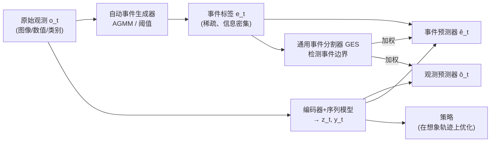

# From Observations to Events: Event-Aware World Models for Reinforcement Learning

**会议**: ICLR 2026  
**OpenReview**: [https://openreview.net/forum?id=OWkkFaq1IZ](https://openreview.net/forum?id=OWkkFaq1IZ)  
**代码**: [https://github.com/MarquisDarwin/EAWM](https://github.com/MarquisDarwin/EAWM)  
**领域**: reinforcement learning  
**关键词**: 模型基强化学习, 世界模型, 事件感知表征, 样本效率, 视觉泛化  

## 一句话总结
受认知科学"人类把连续感知流切分成离散事件"启发，本文提出通用框架 EAWM，让世界模型在预测未来观测之外**额外预测"事件"**（亮度/数值/类别的显著变化），从而学到紧凑的运动学表征，把 DreamerV3、Simulus 等强基线在 Atari/Craftax/DMC 等 benchmark 上提升 10%–45%。

## 研究背景与动机
- **领域现状**: 模型基强化学习（MBRL）通过学习世界模型从原始观测预测未来状态、在想象轨迹上优化策略，显著提升了样本效率。主流方法（DreamerV3、Transformer 系的 TWISTER、RetNet 系的 Simulus、扩散系的 DIAMOND）都把训练目标放在**观测空间**——尽可能精确地重建/生成下一帧。
- **现有痛点**: 观测空间目标带来三个问题：①长程预测误差累积；②观测里塞满了对策略无用的冗余信息（纹理、颜色、背景）；③在随机环境中预测原始像素本就是病态问题（"硬币落地前无法预测正反面"）。结果是模型对结构相似但视觉变化（纹理/色彩偏移）的场景泛化很差。
- **核心矛盾**: 世界模型把算力都花在"重建每一帧每一个像素"上，而真正驱动决策的是**动态变化**而非静态外观——这两者的目标错配导致策略学习低效、不鲁棒。
- **本文目标**: 不改世界模型骨架的前提下，给任意世界模型注入"事件感知"，让表征空间聚焦于有意义的时空转移，无需任何手工标注。
- **核心 idea**: **【事件即决策单元】** 借鉴神经生物学发现（上丘 SC 神经元只对视觉场景的变化响应，并把速度等动态特征映射到动作轨迹），把"事件"（亮度对数的显著变化、数值/类别的跳变）定义为可算法化生成的离散信号，让世界模型**预测事件**而非只预测观测——事件预测天然比观测预测简单，因为它通过信息瓶颈抽掉了冗余的低层变化。

## 方法详解

### 整体框架
EAWM 把现代世界模型拆成两部分：**WM 部分**（序列模型、表征模型、动力学预测器、奖励/续集预测器、观测预测器——几乎所有主流世界模型都有这五件套）和新增的 **EA 部分**（事件预测器 + 通用事件分割器 GES）。EA 部分只用 WM 部分的输出做后处理，因此可像插件一样接到 DreamerV3、Simulus 等任意架构上，分别得到 EADream 和 EASimulus。整个流程是：自动事件生成器从原始观测算出事件标签 → 事件预测器在隐空间预测这些事件 → GES 检测"事件边界"动态调节事件/观测两路损失的权重。

### 关键设计

**1. 自动事件生成器：把"变化"算法化成无标注监督信号。** 方法的根基是给三类模态各定义一套无需人工标注的事件生成规则。对视觉输入，朴素定义是亮度对数 $L_t(x,y)=\log I_t(x,y)$ 超过对比阈值 $C_I$ 即触发事件；但为抑制噪声和缓慢光照变化带来的误报，作者改用**自适应高斯混合模型（AGMM）**：每个像素维护 $K$ 个高斯分量 $p(L_t)=\sum_k w_k\mathcal{N}(L_t;\mu_k,\Sigma_k)$，计算新观测到各分量的马氏距离 $D_{k}=(L_{t+1}-\mu_k)^\top\Sigma_k^{-1}(L_{t+1}-\mu_k)$，当模型"惊讶"（$D_k$ 大）或"不确定"（匹配到的分量权重过低）时才生成事件。对有序数据（关节角、速度）按相对变化幅度过阈值 $C_o$ 触发，对名义数据（离散类别）按类别跳变触发。由此事件流稀疏却信息密集，对无关噪声和慢速光照变化远比原始观测鲁棒。

**2. 事件预测器：用预测事件这一辅助任务塑形表征空间。** 对每个模态设一个独立解码器，估计每个事件位置的类别概率 $p(\hat e_{t,i}|\text{sg}(y_t),y_{t+1},\hat z_t,z_t)\in[0,1]$，其中对目标用 stop-gradient $\text{sg}(\cdot)$ 防止梯度回传造成损失尖峰、迫使表征更可预测。损失按模态选择：有序数据用交叉熵，视觉/名义数据因事件极度稀疏（类别不平衡）改用 focal loss，再按权重 $\beta_e^{(m)}$ 加权求和。关键在于：事件预测只是塑形表征的辅助目标，**对策略训练没有直接影响**——推理时事件预测器和观测预测器都可省去，不增加策略学习的计算开销。

**3. 通用事件分割器 GES：检测事件边界并动态再分配注意力。** 人类在"事件边界"（一段有意义片段的起止时刻，如一次颠簸）处预测与记忆能力会下降，此时强行预测事件反而有害。GES 据此检测边界：对每个模态统计事件占比 $\alpha_t^{(m)}=\frac{1}{N^m}\sum_i \mathbb{I}(e_{t,i}^{(m)}\text{发生})$ 作为边界指标，且**不引入任何可训练参数**，直接实现为确定性函数 $g(\alpha_t^{(m)},\alpha_{thr}^{(m)})$（EADream 中简化为 $\mathbb{I}(\alpha_t<\alpha_{thr})$）。当检测到边界（$g=0$）时抑制事件预测损失：$L_e=\sum_m\beta_e^{(m)}g(\cdot)L_e^{(m)}$；同时通过事件感知观测损失把注意力从事件拉回原始观测：$L_o=L_o'+\sum_m\sum_i \omega\, g(\cdot)[\mathbb{I}(e_{t,i})-1]L_o'(o_{t,i},\hat o_{t,i})$，用权重 $\omega$ 平衡整体观测与事件发生处的注意力。

**4. 统一公式 + RSSM-OP：证明框架的普适性。** 作者给"看似不同"的世界模型架构写出统一公式（式 3），论证 EA 部分总能由 WM 部分输出推得，因而框架对 DreamerV3（RSSM）和 Simulus（RetNet）甚至无模型 RL 都适用。落地时 EADream 把观测预测器改为从先验状态直接预测 $\hat o_t\sim p_\theta(\hat o_t|y_t,\hat z_t)$（记为 RSSM-OP，区别于 DreamerV3 从后验 $z_t$ 解码）；EASimulus 则把 GES 设计成随事件变稀疏而增大的形式 $g=\mathbb{I}(\alpha_t<\alpha_{thr})/\text{arsinh}(\text{clip}(\alpha_t/\alpha_{thr},\epsilon_\alpha,1))$ 以更好地突出稀疏事件。总损失为 $L=L_{WM}+\beta_o L_o+\beta_e L_e$。

## 实验关键数据

### 主实验表格

| Benchmark | 基线 | EAWM 变体 | 关键指标 |
|---|---|---|---|
| Atari 100K | DreamerV3 (Mean 1.222) / Simulus (Mean 1.609) | EADream / EASimulus | EASimulus Mean **1.818**、IQM **1.004**（首次达超人 IQM），EADream Mean 1.290 |
| Craftax 1M | Best-TWM / Simulus | EASimulus | 得分 **7.23%**（对最大分占比），刷新记录 |
| DMC 500K (10 hard tasks) | TD-MPC2 (559.2) / DreamerV3 (606.3) | EADream | Mean **723.8** / Median **805.3**，全 RL 方法 SOTA |
| DMC-GB2 500K | DreamerV3 / SADA | EADream | 大幅超 DreamerV3，且无需配对增强图即超过专门设计的 SADA |

整体提升幅度：Atari 100K +13%、Craftax 1M +10%、DMC 500K +19%、DMC-GB2 500K +45%。单任务最大增益如 Breakout +55%、Acrobot Swingup +115%。

### 消融实验表格

| 消融配置 | 现象 | 结论 |
|---|---|---|
| w/o Event Predictor | 两个世界模型 Mean HNS 各降约 0.4 | 事件预测带来的表征学习是核心，尤其在 Breakout/Krull 等"事件即奖励信息"的任务 |
| w/o GES | Median HNS 增长缓慢、波动大 | GES 稳定训练，在连续控制机器人任务（单次错误动作需长序列纠正）尤为关键 |
| w/o Observation Prediction（只预测事件） | 4 个 DMC 任务 Mean 从 737.2 降到 519.5 | 事件预测与观测预测紧耦合，缺一不可 |
| DreamerV3 + RSSM-OP（仅换解码方式） | 提升有限 | 增益主要来自观测与事件的联合建模，而非 RSSM-OP 本身 |

### 关键发现
- 想象帧即使在物体位置上偏离 ground truth，事件预测器仍能准确定位空间边界——说明事件预测比观测预测本质更简单、更抗扰动。
- 多模态事件感知（Craftax 的地图+状态）能直接促进策略学习，验证框架对多模态观测的适配性。
- 强泛化（DMC-GB2 抗视觉干扰）可在不依赖额外监督/配对增强图的情况下取得。

## 亮点与洞察
- **跨架构通用插件**：不是又一个独立世界模型，而是给 DreamerV3、Simulus 等"五件套"世界模型统一加 EA 模块的框架，迁移成本极低，这是相比 DyMoDreamer（把帧差当输入）的本质区别——EAWM 是去**预测**事件而非把差分喂进去。
- **零参数 GES**：用确定性的事件占比函数实现事件边界检测，不增可训练参数，工程上极简却带来训练稳定性的实质收益。
- **认知科学 → 计算框架的干净落地**：把"上丘只对变化响应""人脑只预测事件不预测观测"这类发现转译成可算法化的事件生成 + 事件预测辅助任务，论证链条完整。
- **推理零开销**：事件/观测预测器对策略训练无直接影响，部署时可丢弃，不拖慢策略。

## 局限与展望
- **GES 过于简化**：当前为效率把 GES 实现成确定性阈值函数，作者承认可用神经网络直接建模事件边界（如基于重建误差变化）以兼顾表达力，但需避免冗余。
- **跨任务知识共享未解决**：EADream/EASimulus 虽用固定超参跨域训练，但"一个统一模型解多任务、共享通用知识"仍是开放难题。
- **未结合大模型**：与大规模预训练 VLM 结合以增强泛化和跨模态 grounding 是有前景但尚未探索的方向。
- 视觉事件生成依赖 AGMM 与阈值 $C_I/C_o$，虽固定跨 benchmark，但对超出测试分布的极端模态是否稳健仍待验证。

## 相关工作与启发
- **MBRL 谱系**：从 World Models、Dreamer 系（RSSM）、Transformer 世界模型（IRIS/TWM/TWISTER）到 RetNet 系 Simulus、扩散系 DIAMOND，主线都在观测空间精细建模；TD-MPC2 改预测状态但难直接用于图像；本文站在这条线之外，提供正交的"事件感知"增量。
- **RL 表征学习**：UNREAL 的辅助任务、对比学习、图像增强、深度/运动预测都试图抽取任务相关结构，但多需静态视觉或额外标签；本文把**事件预测作为无标注辅助任务**，让 agent 无监督地捕捉任务相关动态。
- **启发**：当"预测原始信号"成为病态或冗余目标时，退一步预测"信号的显著变化（事件）"往往是更紧凑、更可学、更易泛化的代理目标——这一思路可迁移到视频预测、机器人感知、时序异常检测等任意"连续流 → 决策"的场景。

## 评分
- 新颖性: ⭐⭐⭐⭐ 把事件相机/认知科学的"事件"概念系统引入世界模型并形式化为通用框架，角度新颖且非简单帧差。
- 实验充分度: ⭐⭐⭐⭐ 覆盖 Atari/Craftax/DMC/DMC-GB2 四套 benchmark、55 个任务、两种异构架构、5 seeds，消融剥离了 RSSM-OP 的混淆，较扎实。
- 写作质量: ⭐⭐⭐⭐ 动机—生物学—公式—实验逻辑清晰，统一公式与多模态定义表述严谨。
- 价值: ⭐⭐⭐⭐ 即插即用、推理零开销、跨架构涨点 10%–45%，对 MBRL 社区有较强可复用价值。

<!-- RELATED:START -->

## 相关论文

- [\[ICLR 2026\] Mixture-of-World Models: Scaling Multi-Task Reinforcement Learning with Modular Latent Dynamics](mixture-of-world_models_scaling_multi-task_reinforcement_learning_with_modular_l.md)
- [\[ICLR 2026\] Learning to Be Uncertain: Pre-training World Models with Horizon-Calibrated Uncertainty](learning_to_be_uncertain_pre-training_world_models_with_horizon-calibrated_uncer.md)
- [\[ICLR 2026\] WIMLE: Uncertainty-Aware World Models with IMLE for Sample-Efficient Continuous Control](wimle_uncertainty-aware_world_models_with_imle_for_sample-efficient_continuous_c.md)
- [\[ICLR 2026\] Learning Massively Multitask World Models for Continuous Control](learning_massively_multitask_world_models_for_continuous_control.md)
- [\[ICLR 2026\] Object-Centric World Models from Few-Shot Annotations for Sample-Efficient Reinforcement Learning](object-centric_world_models_from_few-shot_annotations_for_sample-efficient_reinf.md)

<!-- RELATED:END -->
