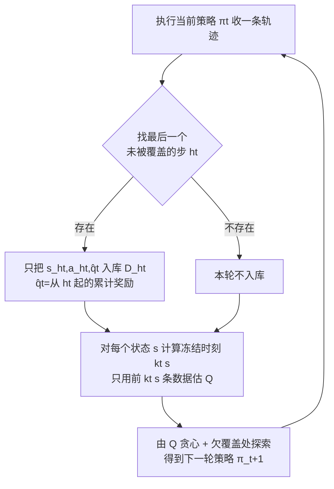

# Frozen Policy Iteration: Computationally Efficient RL under Linear $Q^{\pi}$ Realizability for Deterministic Dynamics

**会议**: ICLR 2026  
**OpenReview**: [https://openreview.net/forum?id=kW0SudrQEQ](https://openreview.net/forum?id=kW0SudrQEQ)  
**代码**: 待确认  
**领域**: 强化学习理论 / 线性函数逼近  
**关键词**: linear $Q^\pi$ realizability, policy iteration, online RL, regret bound, deterministic dynamics  

## 一句话总结
在「任意策略的 Q 函数都线性可表示」（linear $Q^\pi$ realizability）这一温和假设下，本文提出 **Frozen Policy Iteration (FPI)**——第一个无需 simulator、既计算高效又统计高效的在线 RL 算法，对确定性转移 MDP 达到 $\tilde O(\sqrt{d^2 H^6 T})$ 的 regret，回答了 Weisz et al. (2023) 留下的开放问题。

## 研究背景与动机
**领域现状**：用线性特征逼近 RL 价值函数时，理论上有两类核心结构假设。一类是 **linear Bellman completeness**（线性 Q 函数的 Bellman backup 仍线性），它自然适配 value-iteration 类算法（如 FQI），近年已有一系列工作填上了它的「计算–统计」鸿沟。另一类是 **linear $Q^\pi$ realizability**（任意策略 $\pi$ 的 $Q^\pi$ 都线性于给定特征），它适配 policy-iteration 类算法（如 LSPI）。

**现有痛点**：$Q^\pi$ realizability 有一个 Bellman completeness 没有的好性质——**单调性**：往特征里加维度永远不会破坏可表示性（而 Bellman completeness 加特征反而可能失效，Chen & Jiang 2019 指出）。这对动辄上亿参数神经网络的现代 RL 极为重要。但矛盾的是，$Q^\pi$ realizability 下的「计算–统计」鸿沟几乎无人攻克：Weisz et al. (2023) 给出了首个多项式样本复杂度算法，却依赖维护庞大复杂的 version space，**计算不可行**；Mhammedi (2025) 依赖一个最坏情况下 NP-hard 的代价敏感分类 oracle；其余多项式时间算法（Du 2019、Lattimore 2020、Yin 2022、Weisz 2022）则统统要求 **(local) access to a simulator**——能从任意访问过的状态重启重采样。

**核心矛盾**：simulator 重采样是这些 policy-iteration 算法的命根子。它们在把 $(s,a)$ 加入数据集前，要从 $(s,a)$ 反复 rollout 确认后继状态都已充分探索；一旦冒出新的欠探索状态就整体重启。但在**初始状态随机的在线 RL** 中，状态空间一大，整个学习过程可能**连同一个状态都见不到第二次**，重采样根本无法实现。

**本文目标**：在 online RL 设定下（随机初始态、随机奖励、确定性转移），给出第一个既计算高效又统计高效、且**不需要 simulator** 的 $Q^\pi$ realizability 算法。

**核心 idea**：**「冻结 + 只用高置信片段」**——只把轨迹中高置信度的部分喂给数据集，并对已充分探索的状态**冻结**其策略，使得算法用到的所有数据在整个学习过程中始终保持「有效 on-policy」，从而绕开重采样需求。

## 方法详解

### 整体框架
FPI 沿用近似 policy iteration 的骨架（维护逐 step 的数据集 $D_h$、用最小二乘估计 $Q$、贪心导出策略），但在两处做了关键改造来消除离策略数据：**(1) 入库时只保留轨迹中第一个「欠探索」的状态-动作对**，丢弃其余；**(2) 一旦某状态被数据集充分覆盖，就冻结其策略不再更新**。论文先给出 PAC 版（Algorithm 1，作为热身），再升级为带多精度层（accuracy levels）的 regret 最小化版（Algorithm 2）。

### 关键设计

**1. 椭圆置信覆盖判定（Cover）：用谁可信、该探索谁的统一尺子。** 给定 step $h$ 的数据集 $D=\{(s_i,a_i,q_i)\}_{i=1}^n$，定义正则化经验协方差 $\Sigma=\lambda I+\sum_i \phi(s_i,a_i)\phi(s_i,a_i)^\top$，并把「可信区域」刻画为椭圆范数小的状态-动作对：$\mathrm{Cover}(D,\varepsilon)=\{(s,a):\|\phi(s,a)\|_{\Sigma^{-1}}\le\varepsilon\}$。直观上 $\mathrm{Cover}$ 里的 $(s,a)$ 其最小二乘估计误差大约被 $\varepsilon$ 控住。策略 $\pi_t$ 据此定义：若某状态 $s$ 的**所有**动作都落在 $\mathrm{Cover}$ 内，就对估计的 $Q_t$ 取贪心；否则必存在某动作 $(s,a)\notin\mathrm{Cover}$，就选这个动作去**探索**。这把「该信任的地方贪心、该探索的地方探索」用一把椭圆尺子统一了。

**2. 只入库高置信片段、丢弃其余：从根上避免离策略污染。** 收到轨迹后，取 $h_t=\max\{h:(s_h^{(t)},a_h^{(t)})\notin\mathrm{Cover}(D_{t,h},\varepsilon)\}$，即轨迹上**最后一个**欠覆盖的步。只把 $(s_{h_t}^{(t)},a_{h_t}^{(t)},\hat q_t)$ 加进 $D_{h_t}$，其中 $\hat q_t=\sum_{h\ge h_t} r_h^{(t)}$ 是从 $h_t$ 起的累计奖励；其余步一概不入库。原因是：对所有 $h>h_t$ 的步，由 $\pi_t$ 的定义它们的所有动作都已被覆盖，意味着 $\pi_t$ 在这些后继状态上已近最优、累计奖励 $\hat q_t$ 才是对 $(s_{h_t},a_{h_t})$ 这条「目标」的可信估计；而 $a_{h_t}^{(t)}$ 本身可能是次优探索动作，所以只留它一个。配合标准椭圆势引理（elliptical potential lemma），每个 $D_h$ 的大小被 $D=\tfrac{2d}{\varepsilon^2}\ln(1+4\varepsilon^{-4}/\lambda^2)$ 上界（Lemma 1），保证空间/时间多项式。

**3. 冻结高置信状态：让历史数据「永远 on-policy」。** 即便只入高置信片段，若用 $D_{t,h}$ 的**全部**数据做最小二乘，被覆盖状态的策略仍可能在后续轮被改写，导致数据集混入不同策略的回报。FPI 的新招是对每个状态 $s$ 定义**冻结时刻**：

$$k_t(s)=\min\Big\{k:(s,a)\in\mathrm{Cover}\big(\{(s_{h,i},a_{h,i},q_{h,i})\}_{i=1}^{k},\varepsilon\big)\ \forall a\in A\Big\}\wedge|D_{t,h}|,$$

即第一次让 $s$ 的所有动作都被覆盖的那条数据的下标。然后**只用前 $k_t(s)$ 条数据**估 $Q_t(s,a)=\tilde Q_{k_t(s)}(s,a)$，其中 $\tilde Q_k(s,a)=\langle\phi(s,a),\Sigma_{h,k}^{-1}\sum_{i\le k}\phi_{h,i}q_{h,i}\rangle$。这等价于一旦 $s$ 被充分覆盖就**冻住**它的策略不再变。Lemma 2 证明：一个 $(s,a)$ 入库后，其在任意后续策略 $\pi_{t'}$ 下的 $Q$ 值都不变——这正式化了「所有数据始终有效 on-policy」的直觉，是后续 concentration（Lemma 3-4）和次优性分析（Lemma 5-6）成立的关键。

**4. 多精度层升级到 regret 最小化（FPI-Regret）。** PAC 版用固定精度 $\varepsilon$，不足以得到 $\sqrt{T}$ regret。Algorithm 2 改为维护一组按精度层 $l$ 索引的数据集 $D_h^{(l)}$ 与策略 $\pi_t^{(l)}$（覆盖阈值取 $2^{-l}$），沿轨迹逐层检验覆盖条件 $I_t^{(l)}$，在第一个不满足的层上探索、在满足的层上冻结贪心。借助类似 He et al. (2021) 的 accuracy-level 框架（但他们是 value-iteration、本文是 policy-iteration），最终得到 $\tilde O(\sqrt{d^2 H^6 T})$ 的 regret（$H=1$ 时退化为线性 contextual bandit 的**最优**界），并可进一步扩展到 Uniform-PAC 保证与有界 eluder 维数的函数类。

## 实验关键数据

### 主实验设置
- 环境：OpenAI Gym 的 **CartPole-v1** 与 **InvertedPendulum-v4**（确定性动力学、随机 reset，恰好契合假设）。
- 特征：tile coding，每维 4 个 tile；InvertedPendulum 动作离散成 4 个、每 episode 60 步。
- 超参：$\lambda=10^{-3}$、$\varepsilon=1$；为省内存每个 $h$ 只保留最近 20 个 $\Sigma_{h,k}$。结果对 5 个随机种子平均，阴影为 95% 置信区间。

### 消融实验（冻结的作用）

| 环境 | FPI（带冻结） | w/o freezing（用全量数据估 Q） |
|------|--------------|-------------------------------|
| CartPole-v1 | 收敛到更高 reward（曲线上行至约 300） | 明显更低、更不稳定 |
| InvertedPendulum-v4 | 更高、更稳的 reward | 偏低 |

### 关键发现
- **冻结操作确有用**：去掉冻结后两个任务的学习曲线都明显变差，验证了「冻结让数据保持 on-policy」不只是理论上的需要，也带来经验上的性能提升。
- 这是一个 **proof-of-concept** 实现，目的在于印证算法可落地并隔离冻结的贡献，而非刷 SOTA。

## 亮点与洞察
- **绕开 simulator 的范式转换**：以往 policy-iteration 算法靠「重采样同一状态」保证 on-policy，本文用「只取高置信片段 + 冻结」从数据构造层面保证 on-policy，把对 simulator 的硬依赖彻底去掉，这是方法论上的关键突破。
- **回答了 open problem**：Weisz et al. (2023) 明确把「$Q^\pi$ realizability 下多项式时间算法」列为开放问题，本文在确定性转移下给出肯定回答。
- **界的紧致性**：$H=1$ 时退化到线性 contextual bandit 的最优 regret，说明对 $T$ 和 $d$ 的依赖是对的。
- **理论与实现的简洁统一**：算法足够简单到能直接在 Gym 上跑，理论分析（Lemma 1-6）也环环相扣、可读性强。

## 局限与展望
- **强依赖确定性转移**：分析的命脉是「入库 $(s,a)$ 后整条后继轨迹都落在高置信区域」，随机转移下一条轨迹无法保证这点，推广到 stochastic dynamics 是 non-trivial 的硬骨头。
- **对 $H$ 的依赖偏高**：regret/Uniform-PAC 中 $H^6$ 主要来自多精度层下「保证每个状态最优动作在所有精度层都被保留」引入的额外 $H$ 因子，改进 $H$ 依赖是 future work。
- **实验仅 proof-of-concept**：只在两个简单控制任务上验证，未与深度 RL baseline 大规模对比；tile coding 特征也较简陋。
- **仍需随机初始态做覆盖**：算法允许对抗性初始态，但探索效率仍仰赖初始分布带来的状态多样性。

## 相关工作与启发
- **Linear $Q^\pi$ realizability 谱系**：Du 2019、Lattimore 2020、Yin 2022、Weisz 2022（需 generative model / local access）、Weisz 2023（online 但计算不可行）、Mhammedi 2025（oracle 可能 NP-hard）——本文在 Table 1 中以「online RL + 计算高效 + regret 保证」独占一格。
- **Linear Bellman completeness**：Zanette 2020、Wu 2024、Golowich & Moitra 2024 等填补其计算–统计鸿沟的工作，是本文的对照与灵感来源，但 Bellman completeness 缺乏单调性。
- **Uniform-PAC 与 accuracy-level 框架**：He et al. (2021) 的 value-iteration 框架被本文借用并改造到 policy-iteration 语境。
- **Eluder 维数**：Russo & Van Roy (2013) 的有界 eluder 维数让结果从线性逼近推广到更一般函数类。
- **启发**：「用置信覆盖 + 冻结来人为维持 on-policy 性」是一个可迁移的思路——凡是 simulator 不可得、又怕离策略漂移的场景，都值得借鉴这种「只信高置信、对已学透的部分上锁」的数据治理策略。

## 评分
- **新颖性**: ⭐⭐⭐⭐⭐ 解决了 Weisz et al. (2023) 的公开难题，「freezing + 高置信片段」绕开 simulator 是真正的方法论创新。
- **实验充分度**: ⭐⭐⭐ 仅两个简单控制任务的 proof-of-concept 消融，足以印证理论但规模有限（理论工作可接受）。
- **写作质量**: ⭐⭐⭐⭐⭐ 动机、对比表（Table 1）、引理链条都交代得清晰严谨，可读性强。
- **价值**: ⭐⭐⭐⭐ 在 RL 理论核心问题上推进了计算–统计前沿，对 policy-iteration 类方法的在线化有长期意义，确定性转移的限制略压低落地价值。

<!-- RELATED:START -->

## 相关论文

- [\[ICLR 2026\] Information-based Value Iteration Networks for Decision Making Under Uncertainty](information-based_value_iteration_networks_for_decision_making_under_uncertainty.md)
- [\[NeurIPS 2025\] Computational Hardness of Reinforcement Learning with Partial $q^\pi$-Realizability](../../NeurIPS2025/reinforcement_learning/computational_hardness_of_reinforcement_learning_with_partial_qπ-realizability.md)
- [\[ICLR 2026\] Guided Policy Optimization under Partial Observability](guided_policy_optimization_under_partial_observability.md)
- [\[ICLR 2026\] A Unifying View of Coverage in Linear Off-Policy Evaluation](a_unifying_view_of_coverage_in_linear_off-policy_evaluation.md)
- [\[ICLR 2026\] Breaking Safety Paradox with Feasible Dual Policy Iteration](breaking_safety_paradox_with_feasible_dual_policy_iteration.md)

<!-- RELATED:END -->
