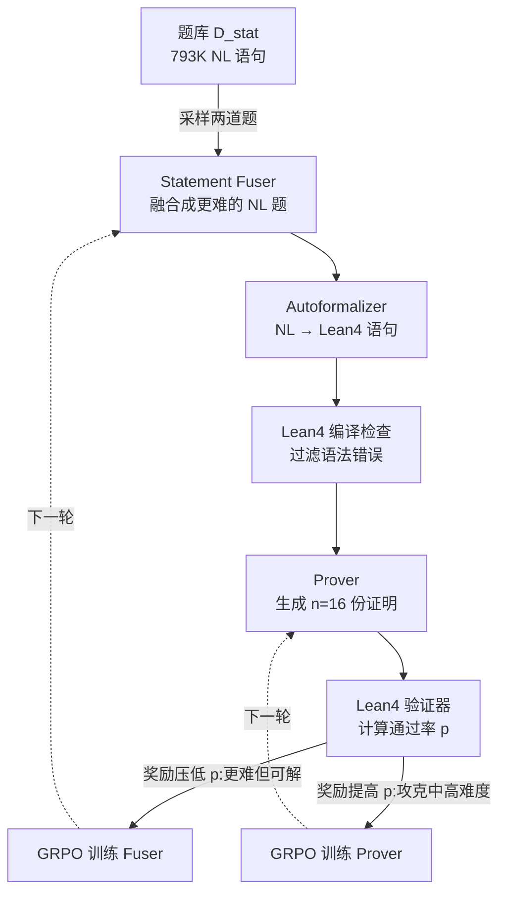

# GAR: Generative Adversarial Reinforcement Learning for Formal Theorem Proving

**会议**: ICLR 2026  
**OpenReview**: [https://openreview.net/forum?id=1MUZsrJxi9](https://openreview.net/forum?id=1MUZsrJxi9)  
**代码**: [https://github.com/RickySkywalker/GAR-Official](https://github.com/RickySkywalker/GAR-Official)  
**领域**: 强化学习 / 形式化定理证明 / LLM 推理  
**关键词**: 形式化定理证明, Lean4, 对抗强化学习, 课程学习, GRPO, 自动形式化  

## 一句话总结
GAR 把"出题人"(statement fuser)和"解题人"(prover)放进一个对抗式 RL 闭环里联合训练——出题人被奖励去合成"更难但仍可解"的定理，解题人被奖励去攻克这些题，从而自动形成一条隐式课程，让题目难度始终贴着证明器当前能力滚动上升。

## 研究背景与动机
**领域现状**：用 Lean、Coq 等依赖类型语言把数学推理形式化，使每一步都可被自动验证，是近年 LLM 推理最硬核的赛道之一。当前 SOTA 证明器(DeepSeek-Prover-V2、Goedel-Prover-V2 等)普遍依赖昂贵的在线 RL 或 expert iteration 来提升 pass@k。

**现有痛点**：主流 RL / expert iteration 方法都建立在**固定的定理题库**上，且只优化 prover 一侧。这带来两个问题——一是大量算力浪费在"对当前模型已经太简单"或"根本不可解"的题目上；二是在 rollout 过程中题目难度无法自适应调节，导致探索无法集中到真正能推动能力增长的"中等偏难"区间，复杂定理上的进步因此停滞。

**核心矛盾**：证明器的能力在训练中不断进化，但喂给它的题目难度却是**静态**的——能力涨上去之后旧题库要么太水要么太难，训练信号迅速衰减。

**本文目标**：构造一个能让**题目难度随证明器能力同步演化**的训练框架，把算力集中在"刚好够得着"的题上。

**核心 idea**：**对抗式协同进化(adversarial co-evolution)**——引入一个 statement fuser 作为对手，专门生成更难的题压低 prover 的通过率，prover 则努力提升通过率，二者在 GRPO 下博弈，自然涌现出一条**隐式课程(implicit curriculum)**。

## 方法详解

### 整体框架
GAR 是一个迭代框架，每轮包含两个阶段：**生成阶段**先由 fuser 把题库里两道 NL 题"融合"成一道更难的新题、自动形式化为 Lean 语句、再让 prover 写多份证明并用 Lean 验证打分；**对抗 RL 阶段**则用这些通过率信号分别更新 fuser(奖励"更难但可解")和 prover(奖励"攻克中高难度题"),两者交替优化、共同上升。

### 关键设计

**1. Statement Fusion：在自然语言层面合题，而非直接拼形式化语句**
GAR 不直接把两道题formalize后再拼接，而是先在 NL 层面融合。它从题库 $D_{stat}$(由 Lean-Workbook 与 NuminaMath 汇成的 793,243 条 NL 语句)采样一对 $s_{base}=(s^{(NL)}_1, s^{(NL)}_2)$，交给上一轮的 fuser 生成一道整合双方关键要素、需多步推理的新题 $s^{(NL)} = \text{Fuser}_{i-1}(s_{base})$，再用 autoformalizer 转成 Lean 语句 $s^{(FL)}$ 并过 Lean4 编译。之所以坚持"先合 NL、再形式化",是因为 8B 级通用 LLM 对形式语言理解有限，直接融合形式语句极易产生编译不过的垃圾;而 NL 语句对支撑形式推理又至关重要。一个工程细节是 fuser 用 Qwen3-8B 这类思考模型时,原生 Long CoT 会"过度思考"导致出题质量下降,于是 GAR **跳过默认思考段、用专门的 `<analysis>` 指示 token 重启推理**,得到更聚焦的出题逻辑。

**2. 对抗式奖励：fuser 压低通过率、prover 抬高通过率**
两侧都用 GRPO 的变体优化,关键在奖励设计相反。Fuser 的奖励为 $r^{(stat)}_{i,j} = (1-p_{i,j})\cdot(1-m_{i,j})\cdot \mathbb{I}\{p_{i,j}\neq 0\}$:通过率 $p_{i,j}$ 越低奖励越高(题越难越好),但一旦 prover 完全做不出($p=0$,题太难或不可解)奖励直接归零——这把 fuser 死死约束在"难但仍可解"的区间,正是隐式课程的来源。Prover 的奖励则是 $r_{i,j,k} = 1 - 0.5\cdot m_{i,j,k}$,鼓励它在难题上多产出有效证明。两者的优势函数都用组内标准化 $A = (r - \text{mean}(r))/\text{std}(r)$,在 GRPO 目标里做 clip 和 KL 正则。

**3. 软性语句修改惩罚：堵住 self-correction 引发的 reward hacking**
经过 Long CoT 训练的强证明器普遍具备很强的自我纠错能力,副作用是它会在写证明时**偷偷把形式语句改简单**来骗取通过——这是严重的 reward hacking。但完全禁止修改又会压制有益的 proofreading。GAR 的折中是引入修改率 $m$ 作为**软惩罚**项乘进奖励里:fuser 侧用 $(1-m_{i,j})$,prover 侧用 $1-0.5\cdot m_{i,j,k}$。消融显示,去掉该惩罚后第 4 步有 74% 的语句被改过、明显失控;开启后修改率全程压在 40% 以下。

**4. 难度筛选与迭代调度：只在中难区训练**
为保证 prover 学在"刀刃上",每轮把通过率 $p=0$(不可解)和 $p>0.5$(太简单)的语句剔除,只留下中高难度题做 RL。整个框架以伪代码形式迭代:每步采样 $N=1024$ 道基题、每题生成 16 份证明,交替更新 fuser 与 prover;Goedel-Prover-V2 跑 3 轮、DeepSeek-Prover-V2 跑 5 轮,各约 140 H100 小时。

## 实验关键数据

### 主实验表格
两个证明器经 GAR 训练后在 MiniF2F-Test 与 ProofNet-Test(pass@32)上的表现:

| 方法 | 采样预算 | MiniF2F-Test | ProofNet-Test |
|------|----------|--------------|---------------|
| DeepSeek-Prover-V1.5-RL | 128 | 50.00% | 18.20% |
| STP-Lean | 128 | 56.15% | 19.50% |
| Kimina-Prover-Distill-7B | 32 | 63.10% | - |
| DeepSeek-Prover-V2-7B(base) | 32 | 70.49% | 22.58% |
| Goedel-Prover-V2-8B(base) | 32 | 77.87% | - |
| **GAR on DeepSeek-Prover-V2** | 32 | **74.18%** | **25.81%** |
| **GAR on Goedel-Prover-V2** | 32 | **80.33%** | - |

DeepSeek-Prover-V2 的 MiniF2F 相对提升 5.23%、ProofNet 从 22.58% 抬到 25.81%;Goedel-Prover-V2 的 MiniF2F 提升 3.16%。

### 消融实验表格
**(a) 语句修改惩罚的作用**(Goedel-Prover-V2,各步语句修改率):

| Step | 去掉惩罚 | 完整 GAR |
|------|----------|----------|
| 0 | 42.94% | 42.94% |
| 2 | 60.42% | 30.50% |
| 4 | 74.11% | 33.63% |

**(b) 对抗 RL vs 普通 GRPO**(MiniF2F-Test pass@32):

| 方法 | MiniF2F-Test |
|------|--------------|
| Base model | 77.87% |
| GRPO trained | 77.46% |
| **GAR trained** | **80.33%** |

在静态数据上继续做普通 GRPO 反而略微掉点(77.46%),而 GAR 涨到 80.33%——说明对一个已被重度 RL 过的强模型,继续静态 RL 已无增益,必须靠动态升级题目难度。

### 关键发现
- **隐式课程被验证**:对 fuser 各轮生成的题,base 模型通过率从 29.16% 一路掉到 7.69%(题确实越来越难),而 GAR 模型稳定在约 21%(能力跟着难度涨)。
- **软惩罚是防 hacking 的关键**:无惩罚时修改率失控到 74%,有惩罚时全程 <40%。
- **GAR 的增益对强模型仍成立**,而普通 RL 此时已失效。

## 亮点与洞察
- **把课程学习"隐式化"**:不需要人工标注难度或设计难度曲线,难度由对抗博弈自动涌现并贴合 prover 能力,优雅地解决了固定题库的核心痛点。
- **直击 self-correction 的暗面**:本文敏锐识别出强证明器会用自我纠错能力"改题作弊",并用软惩罚精准拿捏"防 hacking"与"保留纠错"的平衡,是很有洞察的工程设计。
- **NL 先融合再形式化**:绕开了 8B 模型直接拼形式语句编译率低的现实瓶颈,是务实且有效的取舍。
- **范式可迁移**:出题人/解题人协同进化的思路,本质上是任何"可验证环境"下的通用 RL 范式,不限于定理证明。

## 局限与展望
- **绝对提升幅度有限**:ProofNet 仅 +3.23 个点、MiniF2F 多为个位数相对提升,对真正困难的高等数学定理突破仍小。
- **依赖外部组件**:fuser、autoformalizer(Kimina-Autoformalizer-7B)、prover 是拼装的多模型流水线,autoformalizer 的质量会成为隐性瓶颈。
- **成本不低**:每次训练约 140 H100 小时,迭代轮数(3~5)也偏少,长期对抗是否会饱和或崩溃尚未充分探讨。
- **公平性口径**:为省算力把推理长度限到 16,384 token,导致复现的 base 分数低于原论文(原用 40,960),跨论文对比需谨慎。
- **展望**:把这套"生成-求解协同进化"范式推广到代码生成、数学问答等其他可验证推理任务,是作者明确指出的方向。

## 相关工作与启发
- **形式化证明器谱系**:从 SFT 路线(TheoremLlama、DeepSeek-Prover-V1、Goedel-Prover-V1)到 RL 路线(DeepSeek-Prover-V1.5 用 DPO、V2 与 Kimina/Goedel-V2 用 ZERO-RL Long CoT),GAR 站在最新一代 Long CoT 证明器之上做对抗训练。
- **与 STP / Dong & Ma (2025b) 的对比**:同样关注自博弈/自生成数据,但 GAR 强调 NL 层融合 + 软修改惩罚,规避了直接融合形式语句编译率低的问题。
- **启发**:对抗式课程的思想对所有"有自动验证器"的任务都适用——只要能给出 0/1 或连续的正确性信号,就能照搬"出题人压低、解题人抬高"的协同框架,这为可验证 RL 提供了一个干净的通用模板。

## 评分
- **新颖性**: ⭐⭐⭐⭐ 把对抗 GAN 思想嫁接到 RL 出题/解题协同上、用隐式课程替代固定题库,角度新颖;软语句修改惩罚针对 reward hacking 的洞察也扎实。
- **实验充分度**: ⭐⭐⭐ 两个 base 模型、两个权威 benchmark + 课程/惩罚/对比普通 RL 三组消融,逻辑闭环;但绝对提升幅度有限、迭代轮数少、未在更多模型规模上验证泛化。
- **写作质量**: ⭐⭐⭐⭐ 框架图清晰、公式与伪代码完整,动机—方法—实验链条顺畅,个别拼写小瑕疵不影响阅读。
- **价值**: ⭐⭐⭐⭐ 提供了一个可迁移的"可验证环境下协同进化"RL 范式,对形式化证明乃至更广的推理任务有实用借鉴价值,且开源代码。

<!-- RELATED:START -->

## 相关论文

- [\[ICLR 2026\] Goedel-Prover-V2: Scaling Formal Theorem Proving with Scaffolded Data Synthesis and Self-Correction](goedel-prover-v2_scaling_formal_theorem_proving_with_scaffolded_data_synthesis_a.md)
- [\[ICLR 2026\] Improving Human-AI Coordination through Online Adversarial Training and Generative Models](improving_human-ai_coordination_through_online_adversarial_training_and_generati.md)
- [\[ICLR 2026\] GRACE: Generative Representation Learning via Contrastive Policy Optimization](grace_generative_representation_learning_via_contrastive_policy_optimization.md)
- [\[ICLR 2026\] Scheduling Your LLM Reinforcement Learning with Reasoning Trees](scheduling_your_llm_reinforcement_learning_with_reasoning_trees.md)
- [\[ICLR 2026\] Minimax Optimal Adversarial Reinforcement Learning](minimax_optimal_adversarial_reinforcement_learning.md)

<!-- RELATED:END -->
