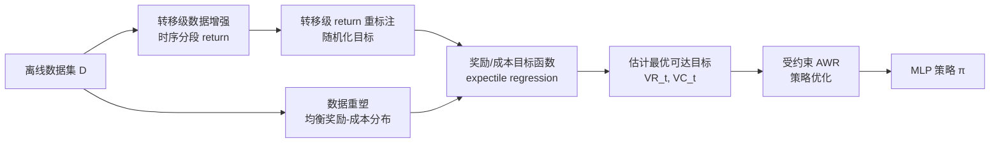

# GAS: Enhancing Reward-Cost Balance of Generative Model-assisted Offline Safe RL

**会议**: ICLR 2026  
**OpenReview**: [https://openreview.net/forum?id=sGrrKMK0cn](https://openreview.net/forum?id=sGrrKMK0cn)  
**代码**: 待确认  
**领域**: 强化学习 / 离线安全 RL  
**关键词**: Offline Safe RL, 生成式模型, 轨迹拼接, 目标函数, Expectile Regression, 奖励-成本权衡  

## 一句话总结
GAS 用「目标函数 + 转移级数据增强/重标注 + 数据重塑」给生成式模型驱动的离线安全 RL 补上了轨迹拼接能力，把用户随手指定的（可能不靠谱的）奖励-成本目标，自动校准成数据集里真正可达且满足约束的最优目标，从而在紧约束下更安全、在松约束下奖励更高。

## 研究背景与动机
**领域现状**：离线安全 RL（OSRL）要在只有预采集数据、不能在线探索的前提下，学一个既高回报又满足安全约束的策略。近年一类主流做法是把决策重写成「条件生成」问题——以 Decision Transformer 为代表的生成式模型（GM）把奖励 return-to-go $R_t$ 和成本 return-to-go $C_t$ 当条件输入，让模型生成满足这对目标的动作。这套做法绕开了传统 RL 里 Bellman backup 带来的 OOD 外推问题，而且因为目标是输入而非写死的约束，测试时可以不重训就适配不同安全阈值，非常灵活。

**现有痛点**：但生成式方法在带约束的场景下有两个硬伤。其一是**没有轨迹拼接能力**——它本质是「目标条件行为克隆」，靠注意力把前若干步的历史当上下文一起记忆，给它一段次优历史它就照抄次优动作，无法像传统 RL 那样把不同轨迹里的好片段缝合出更优策略。论文还实测发现，把 CDT 的记忆长度从 $K=1$ 加到 $K=10$，三种约束下性能几乎不变，说明为 NLP 设计的注意力根本没在 MDP 的时序转移上发挥作用。其二是**不会平衡奖励最大化与约束满足**——CDT 只是把 $\hat R$ 和 $\hat C$ 拼接成上下文，没有任何机制判断这对目标是否可行、也没法优先保约束；用户若指定了过高回报配过严约束，策略就会崩。

**核心矛盾**：生成式方法的灵活性来自「目标完全由人指定」，但人指定的目标往往与数据集真正可达的最优目标错位，错位又因为缺拼接能力无法被自我纠正——灵活性反而成了不稳定性的来源。

**本文目标**：在保留生成式方法绕开 Bellman backup、可零样本适配阈值的优点前提下，补上拼接能力，并自动把人指定目标校准成可达的最优奖励-成本目标。

**核心 idea**：**【用目标函数当中介】** 不再让策略直接去够人给的目标，而是先用一组「目标函数」从数据里估计——在给定状态和目标下、满足约束所能达到的最优奖励 return-to-go 及其对应成本 return-to-go，再用这个估计出的最优目标去引导策略；目标函数靠 expectile regression 训练，全程不依赖 Bellman backup。

## 方法详解

### 整体框架
GAS 抛弃 CDT 的注意力结构，只用一个 MLP 做纯粹的「转移级拼接」。流程分三步：先对离线数据做**转移级的增强与重标注**，让同一状态能从其它转移里借到「更高奖励、更低成本」的片段，喂给目标函数更丰富的拼接素材；再用 **expectile regression 训练奖励/成本目标函数**，估出满足约束的最优可达目标，并以「受约束的 AWR」把这对最优目标灌进策略；最后用**数据重塑**把高度失衡的奖励-成本分布拉均匀，稳住训练。

### 关键设计

**1. 时序分段 return 增强：把好片段从「整条轨迹」拆到「任意区间」** 标准的 $R_t$、$C_t$ 都是从当前步累计到轨迹末端的回报，但真正有价值的好转移往往只发生在一小段窗口里。GAS 因此把每个转移扩展成一族不同窗口长度的累计回报：$(s_t,a_t,R_t,C_t)\to\{(s_t,a_t,R_{t:\Gamma},C_{t:\Gamma})\mid \Gamma=t,\dots,T\}$，其中 $R_{t:\Gamma}=r_t+\dots+r_\Gamma$、$C_{t:\Gamma}=c_t+\dots+c_\Gamma$。这样一来，采样某个状态时，只要满足 $\Gamma-t=T-t'$，GAS 就能在相同状态下从别的转移里找到 $R_{t:\Gamma}>R_{t'}$ 且 $C_{t:\Gamma}\le C_{t'}$ 的更优片段去拼。它既成倍扩充了训练数据（纳入各种时长的转移），又通过提供多样的时间区间让跨时间步的拼接更灵活。

**2. 转移级 return 重标注：让目标函数见过失衡且离谱的目标** 生成式方法的行为克隆本性决定了：测试时人指定的奖励-成本目标若与训练输入错位，性能就掉。GAS 把 CDT 的轨迹级重标注细化到转移级——对采样到的转移，把它的奖励/成本目标按 $\hat R_{t:\Gamma}=U((1-\delta)R_{t:\Gamma},(1+\delta)R_{t:\Gamma})$、$\hat C_{t:\Gamma}=U(C_{t:\Gamma},C_{\max})$ 在一定范围内随机扰动（$U$ 为均匀分布，$\delta\in(0,1)$，$C_{\max}$ 为最大成本回报），再把这些随机化目标喂给目标函数。如此目标函数在训练中就见过大量失衡、激进的奖励-成本组合，测试时对人乱给的目标更鲁棒。关键是 GAS 并不用这些重标注值直接更新策略，而是让它们经由目标函数转成「中间最优目标」再去更新策略，从而在保鲁棒性的同时不损害奖励最大化与约束满足。

**3. 带 expectile regression 的目标函数：估「满足约束的最优可达回报」而非「运气值」** 概念上最优奖励目标应是 $V^R_t(s,\hat R,\hat C)=\max_{(s_t=s,a_t,R_t,C_t)\sim D}R_t\cdot\mathbb{1}(C_t\le\hat C)$，对应成本目标取这个 argmax 处的 $C_t$。但直接取 max 会被数据里偶发的「高奖励低成本」幸运转移带偏、高估目标。GAS 改用分布视角的 expectile regression：先定义奖励优势 $A^R_{t:\Gamma}=\mathbb{1}(V^C_{t:\Gamma}<\hat C_{t:\Gamma})\cdot R_{t:\Gamma}-V^R_{t:\Gamma}$，把违约或低回报的转移降权，损失 $L^R=\mathbb{E}_{\hat D}[|\alpha-\mathbb{1}(A^R_{t:\Gamma}<0)|\cdot(A^R_{t:\Gamma})^2]$ 使 $V^R$ 收敛到「满足约束的最大奖励 return-to-go」的 $\alpha$-expectile。成本目标函数则换一套权重，目标是估「最优奖励目标对应的成本」而非最小成本：$A^C_{t:\Gamma}=C_{t:\Gamma}-V^C_{t:\Gamma}$，$L^C=\mathbb{E}_{\hat D}[|\alpha-\mathbb{1}(A^R_{t:\Gamma}<0)|\cdot(A^C_{t:\Gamma})^2]$，复用奖励侧的指示项，让高奖励转移获得更大权重。两者在同一优化框架下联合推导、带理论保证。

**4. 受约束 AWR 的目标引导策略 + 数据重塑** 拿到目标函数估出的最优奖励/成本目标 $V^R_{t:\Gamma}$、$V^C_{t:\Gamma}$ 后，GAS 把它们也作为策略输入，用受约束版本的 Advantage Weighted Regression 训练：$L_\pi=\mathbb{E}_{\hat D}[\mathbb{1}(V^C_{t:\Gamma}<\hat C_{t:\Gamma})\cdot|\alpha-\mathbb{1}(A^R_{t:\Gamma}<0)|\cdot(\pi(a\mid s_t,\hat R_{t:\Gamma},\hat C_{t:\Gamma},V^R_{t:\Gamma},V^C_{t:\Gamma},t')-a_t)^2]$，只对「满足约束且高奖励」的转移加权回归。另一方面，数据集里绝大多数转移都挤在「低奖励低成本」的保守区，理想的「低成本高奖励」转移极少；GAS 据此做数据重塑——估计在给定成本回报下的奖励分布，挑出每个成本下奖励排名前 $q\%$ 的转移构成 $D_q=\{(s,a,R,C)\sim D\mid P^c(R\mid C)>1-q\}$，训练时以概率 $\epsilon$ 采 $D_q$、$1-\epsilon$ 采原始 $D$，把分布拉得更均衡，提升训练稳定性与效率。

## 实验关键数据

### 主实验表格
在 Bullet-Safety-Gym 与 Safety-Gymnasium 两个基准、12 个场景、对比 8 个 baseline（CPQ / COptiDICE / WSAC / VOCE / CDT / FISOR / CAPS / CCAC）。每个数值为 10 评估回合 × 5 种子 × 3 阈值的平均，归一化成本阈值设为 1（$C\le 1$ 即安全）。

| 设置 | 指标 | CPQ | COptiDICE | CDT | FISOR | GAS |
|------|------|------|-----------|-----|-------|-----|
| 紧约束(10/20/30%) | 奖励 R↑ | 0.39 | 0.59 | 0.67 | 0.36 | **0.66** |
| 紧约束(10/20/30%) | 成本 C↓ | 1.42 | 2.26 | 1.12(违约) | **0.03** | **0.67(安全)** |
| 松约束(70/80/90%) | 奖励 R↑ | 0.52 | 0.63 | 0.80 | 0.36 | **0.86** |
| 松约束(70/80/90%) | 成本 C↓ | 0.60 | 0.50 | 0.76 | 0.03 | 0.87(安全) |

紧约束下只有 GAS 在全部任务上同时做到「安全且最优」；CDT 奖励虽高但多场景违约（$C>1$），FISOR 安全却奖励被严重压低。松约束下 GAS 奖励 0.86 显著高于 CDT 的 0.80，验证拼接带来的奖励最大化优势。

### 消融实验表格
论文消融围绕三大组件（时序分段增强、转移级重标注、数据重塑）与目标函数展开，结论是：去掉拼接相关组件后紧约束安全性下降、去掉数据重塑后训练稳定性变差。CDT 在 $K=1$ 与 $K=10$ 记忆长度下性能几乎不变，反证注意力时序建模在 OSRL 中无效，为「用拼接替代注意力」提供了动机依据。

### 关键发现
- 紧约束下相对 CDT 的安全性提升来自拼接能力——GAS 能把跨时间步、跨轨迹的安全转移缝合起来；松约束下相对 CDT 约 **6% 的奖励提升**来自更强的奖励最大化。
- 把记忆长度 $K$ 从 1 加到 10，CDT 性能几乎不动，说明 OSRL 里长时序注意力没用，纯 MLP 拼接反而更对路。
- GAS 保留了生成式方法的零样本阈值适配能力，能鲁棒应对失衡、人指定的奖励-成本目标。

## 亮点与洞察
- **把「人给的目标」和「数据可达的最优目标」解耦**：用目标函数当中介，是这篇最干净的洞察——既不用 Bellman backup（保住了不 OOD 的好处），又补上了拼接，避开了「直接信任用户目标」的脆弱性。
- **expectile regression 的双重用法**：同一个 $\alpha$-expectile 框架，奖励侧估「满足约束的最大回报」、成本侧借奖励侧的指示项估「最优回报对应的成本」，两者联合而非各练各的，设计很紧凑。
- **「注意力无用」的实证反驳**：用 $K=1$ vs $K=10$ 的训练曲线直接证伪「更长记忆更好」，给「丢掉 Transformer、回到 MLP」提供了说服力，而非拍脑袋简化。
- **数据重塑切中数据失衡痛点**：明确区分保守/激进/理想三类转移并定向上采样理想转移，针对性强。

## 局限与展望
- 引入了 $\delta$（重标注扰动幅度）、$\alpha$（expectile）、$q$、$\epsilon$（重塑比例与采样概率）等多个超参，调参成本与对各超参的敏感性论文披露有限。
- 评测集中在 Bullet-Safety-Gym / Safety-Gymnasium 的仿真控制任务，向自动驾驶、机器人等高维真实安全场景的迁移性待验证。
- 目标函数的理论保证建立在数据集覆盖度的隐含假设上，当理想转移在数据里极度稀缺时，估计出的「最优可达目标」可能仍偏保守。
- 与并发工作 COPDT（把奖励目标作为成本目标的条件生成、面向多约束多任务）的正面对比缺位，多约束扩展是自然的下一步。

## 相关工作与启发
GAS 处在「生成式离线 RL + 安全约束」的交叉点。生成式离线 RL 一侧，Decision Transformer 系列把决策当 return-conditioned 生成，QDT/WT/ADT/Reinformer 等用 Q 值重标注、子目标或 expectile 估 RTG 来补拼接，但都面向无约束设定；安全离线 RL 一侧，CDT 把 OSRL 转成目标条件生成、FISOR 用可行性引导扩散保严格约束、CQDT 靠为每个约束训大量 RL 策略（极低效）。GAS 的差异在于「彻底丢掉注意力、只用 MLP 做转移拼接，并由鲁棒的奖励/成本目标函数引导」，把拼接能力专门移植进了带约束的 OSRL。它给人的启发是：当条件生成范式遇到「用户目标不可信」的场景，与其加强生成器去硬够目标，不如插一层从数据估计「可达最优」的中介层来校准目标。

## 评分
- 新颖性: ⭐⭐⭐⭐ 「目标函数当中介校准人指定目标 + 转移级拼接替代注意力」组合在 OSRL 里是新颖且自洽的，且有实证反驳支撑设计动机。
- 实验充分度: ⭐⭐⭐⭐ 2 基准 12 场景 8 baseline、紧/松约束分别评测、含动机性实证，较扎实；缺与并发多约束方法的直接对比、超参敏感性披露有限。
- 写作质量: ⭐⭐⭐⭐ 动机—方法—实验逻辑清晰，公式与图示配合到位，三类转移、目标函数双用法等关键概念讲得明白。
- 价值: ⭐⭐⭐⭐ 给生成式 OSRL 补拼接、解决「人给目标不可信」是真实痛点，方法简洁可复用，对安全决策落地有参考价值。

<!-- RELATED:START -->

## 相关论文

- [\[ICLR 2026\] Enhancing Generative Auto-bidding with Offline Reward Evaluation and Policy Search](enhancing_generative_auto-bidding_with_offline_reward_evaluation_and_policy_sear.md)
- [\[ICLR 2026\] P-GenRM: Personalized Generative Reward Model with Test-time User-based Scaling](p-genrm_personalized_generative_reward_model_with_test-time_user-based_scaling.md)
- [\[ICLR 2026\] ROMI: Model-based Offline RL via Robust Value-Aware Model Learning with Implicitly Differentiable Adaptive Weighting](model-based_offline_rl_via_robust_value-aware_model_learning_with_implicitly_dif.md)
- [\[ICLR 2026\] R1-Reward: Training Multimodal Reward Model Through Stable Reinforcement Learning](r1-reward_training_multimodal_reward_model_through_stable_reinforcement_learning.md)
- [\[ICLR 2026\] BA-MCTS: Bayes Adaptive Monte Carlo Tree Search for Offline Model-based RL](bayes_adaptive_monte_carlo_tree_search_for_offline_model-based_reinforcement_lea.md)

<!-- RELATED:END -->
