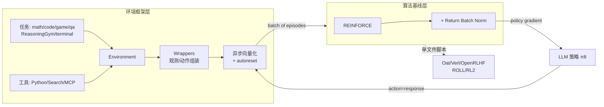

# GEM: A Gym for Agentic LLMs

**会议**: ICLR 2026  
**OpenReview**: [https://openreview.net/forum?id=vsqQ1lG52a](https://openreview.net/forum?id=vsqQ1lG52a)  
**代码**: [https://github.com/axon-rl/gem](https://github.com/axon-rl/gem)  
**领域**: 强化学习 / Agentic LLM / RL 环境框架  
**关键词**: agentic LLM, RL environment, multi-turn RL, REINFORCE, return normalization, tool use  

## 一句话总结
GEM 是面向 LLM 智能体时代的开源"环境模拟器"——对标 OpenAI-Gym，提供统一的环境-智能体接口、异步向量化执行、丰富工具与 24 个标准化多轮环境，并配套提出可兼容稠密分步奖励与任意折扣因子的 REINFORCE + Return Batch Normalization (ReBN) 基线算法。

## 研究背景与动机
**领域现状**：LLM 的训练范式正从静态数据集转向"经验式学习"——智能体通过与复杂环境交互来习得技能。RL 已经成为提升 LLM 推理能力的主流手段（OpenAI o1、DeepSeek-R1 等），但当前绝大多数研究都聚焦在**单轮任务**上，比如解一道数学题或检索一条信息。

**现有痛点**：单轮设定严重简化了真实的多轮交互。最关键的后果是——在单轮设定下表现优异的算法（尤其是 GRPO）**根本无法应用到完整的多轮问题**。GRPO 依赖对同一状态采样一组轨迹做组内归一化，多轮场景下若要在每个 turn（状态）都这么采样会导致指数级复杂度爆炸。业界常见的妥协是"把整段交互当作一个动作"，但这会强行把折扣因子固定为 $\gamma=1$（丧失"尽快解题"的激励），并且只能用单一的轨迹级奖励，丢掉了细粒度的分步信用分配。

**核心矛盾**：要训练能做长程规划、试错、迭代改进的 agentic LLM，就必须迁移到支持多轮交互的测试平台；但既有 RL 基础设施（环境标准、算法）都是为单轮/contextual bandit 量身定做的，缺一个像 OpenAI-Gym 那样的统一底座。

**本文目标**：为 LLM 智能体时代提供"基础设施"——统一的环境接口 + 标准化环境套件 + 与主流训练框架的无缝集成 + 一个真正兼容多轮全 RL 设定的简单强基线。

**核心 idea**：**(1) 环境侧标准化**——复刻 OpenAI-Gym 的 `reset()`/`step()` 接口，把"任务 × 工具"组合成环境，配异步向量化与模块化 wrapper；**(2) 算法侧回归 action=response 视角**——不走"整段交互当动作"的妥协路线，而是用 REINFORCE 在 response 粒度上做策略梯度，再叠加 Return Batch Normalization 这一轻量归一化，从而同时兼容稠密分步奖励和任意 $\gamma$。

## 方法详解

### 整体框架
GEM 由两层构成：**环境框架层**提供 Gym 风格的标准接口、七大类任务、三类工具（Python/Search/MCP）、异步向量化执行与可堆叠 wrapper；**算法基线层**给出 REINFORCE+ReBN 这一兼容完整多轮 RL 的策略梯度方法。两层解耦——环境侧负责"造经验"，训练侧可对接 Oat/Verl/OpenRLHF/ROLL/RL2 五大框架，每个框架都配单文件示例脚本。

### 关键设计

**1. Gym 风格统一接口 + 任务×工具的环境组装：把异构 LLM 任务收敛到一套 `reset/step`** —— GEM 严格沿用 OpenAI-Gym 的主接口，一次 `env.reset()` 拿到初始观测后，循环 `next_obs, reward, terminated, truncated, info = env.step(action)` 即可。它把环境拆成"任务 + 可选工具集"两个正交部件：任务覆盖 Math、Math-with-image、Code、Game（改编自 TextArena 的多轮文字游戏）、QA、ReasoningGym（统一封装 100+ 个可验证单轮任务）、Terminal（容器化终端）七大类；工具则有 Python（解析执行代码块返回 stdout）、Search（对外部引擎检索）、MCP（任意符合 Model Context Protocol 的外部服务）。关键巧思在于——**给单轮任务挂上工具就自动变成多轮任务**：原本一步出答案的 Math/ReasoningGym，一旦能调用 Python 工具，就变成"调工具→看输出→再决策"的多轮交互。新任务集成也很轻：Math/Code/QA 只需给新数据集，游戏类继承基类定义状态转移和奖励逻辑即可。

**2. 异步向量化 + autoreset：高吞吐采样且天然保证 critic 学习的正确性** —— 为了高效收集经验，GEM 通过异步工具调用并行执行向量化环境，按 batch 收集 episode。autoreset 机制让环境在某条轨迹 `terminated` 后自动重置并无缝衔接下一条 episode，用户只需在初始化时跑一次 `.reset()`，之后持续 `.step()` 就能源源不断产数据，省去了手工追踪每条 episode 是否结束的繁琐逻辑。更重要的是，返回的 `terminated` 标志被用来**阻止价值自举跨越 episode 边界**——即不会让 critic 把上一条 episode 末尾的回报错误地 bootstrap 到下一条 episode 开头，从而保证多轮 critic 学习的正确性。

**3. action=response 视角 + REINFORCE：绕开"整段交互当动作"的两个妥协** —— 论文系统对比了三种把 LLM-环境交互纳入 RL 的视角：① action=单 token（episode 超长、每个 token 都要定奖励、难评估）；② action=response（一个完整回复当一个动作，episode 长度退化为 1，变成 contextual bandit，GRPO 可高效应用，但多轮下要在每个 turn 重采样会指数爆炸）；③ action=整段交互（mask 掉工具输出，让 GRPO 能用，但被迫 $\gamma=1$ 且只能轨迹级奖励）。GEM 的选择是回到**视角②但保留多轮结构**：把每个 response 当一个动作，用最朴素的 on-policy 策略梯度 REINFORCE 优化
$$J_{\text{REINFORCE}}(\theta)=\frac{1}{N}\sum_{n=1}^{N}\sum_{t=0}^{T^{(n)}-1} G_t^{(n)}\log\pi_\theta(a_t^{(n)}\mid s_t^{(n)}),\quad G_t=\sum_{k=t}^{T-1}\gamma^{k-t} r_k$$
其中 $s_t$、$a_t$ 本身都是 token 序列，回报 $G_t$ 支持任意 $\gamma\le 1$ 和分步稠密奖励——这正是 GRPO（其优势 $A_{\text{GRPO}}$ 在整条轨迹所有 turn 共享一个常数估计）做不到的。

**4. Return Batch Normalization (ReBN)：不学 critic、不指数采样就拿到稳定细粒度的优势估计** —— 朴素 REINFORCE 的原始回报 $G_t$ 对奖励 shaping 敏感，容易收敛到次优；A2C/PPO 路线虽然能用 GAE 做细粒度优势，但需要额外学一个 critic，而 critic 难以稳健学准。ReBN 的思路是用**整个 batch 内所有 transition 的回报**做标准化作为优势：
$$A_{\text{ReBN},t}^{(n)}=\frac{G_t^{(n)}-\text{mean}(\mathcal{G})}{\text{std}(\mathcal{G})},\quad \mathcal{G}=\{G_t^{(n)}\}_{n\in[1,N],\,t\in[1,T^{(n)}-1]}$$
它本质上是"advantage normalization"在多轮设定的实例化：既保留了 REINFORCE 对任意 $\gamma$ 和分步奖励的兼容性，又获得了类似 critic 的稳定细粒度优势信号，且**不引入额外网络、不需要 tree-like 重采样**。算法在数据收集与策略更新两阶段间交替迭代，落地极简。

## 实验关键数据

### 主实验：8 环境算法基准（Qwen3-Base）
在 GEM 的 8 个代表性环境上做苹果对苹果的 GRPO / PPO / REINFORCE / REINFORCE+ReBN 对比：

| 算法 | 单轮 (rg) | 多轮稠密奖励 (GuessTheNumber/Sudoku) | 综合表现 |
|------|-----------|--------------------------------------|----------|
| GRPO | 表现尚可，单轮可验证奖励下站得住 | **明显落后**（全轨迹共享常数优势，信用分配差） | 仅适合单轮 |
| PPO (turn-level) | 一般 | 长程 Sudoku 拿到最佳回报（critic 学好时） | critic 难稳健学（Minesweeper 上崩） |
| 朴素 REINFORCE | 强基线 | 易收敛到次优（如两个 Sudoku） | 对 reward shaping 敏感 |
| **REINFORCE+ReBN (Ours)** | 强 | **大幅超越朴素 REINFORCE** | **所有环境上 ≥ PPO/GRPO，无额外开销** |

### 折扣因子 γ 与工具集成
- **γ 的作用**（GuessTheNumber，1-50 猜数，最优策略=二分查找）：更小的 $\gamma$ 自然激励更少轮次，收敛到最优轮数 $\log_2(50)\approx 5.6$——这只有二分查找能达到。而 GRPO 因被迫 $\gamma=1$ 无法获得此激励，只能靠手调最大轮数硬凑。

- **Math 工具集成**（Qwen3-4B-Base，math:Orz57K 训练，Pass@1 平均）：

| 配置 | AIME24 | AMC | MATH500 | 平均 |
|------|--------|-----|---------|------|
| Base (无工具) | 10.0 | 39.8 | 61.0 | 35.3 |
| Base (有工具) | 6.7 | 50.6 | 62.4 | 36.2 |
| Base+RL (无工具) | 16.7 | 49.4 | 67.4 | 41.4 |
| **Base+RL (有工具)** | **30.0** | **67.5** | **71.0** | **49.8** |

- **QA 工具集成**（Qwen3-4B，7 个 QA 环境平均 Pass@1）：Base 10.2 → Base+RL 无工具 23.9 → **Base+RL 有 Search 工具 45.5**；混合环境训练（HotpotQA + NaturalQuestions）略优于单环境。

### 关键发现
- **GRPO 在多轮稠密奖励上根本性受限**：所有 turn 共享常数优势，奖励越非稀疏（game 类）落后越明显；qa/math 因奖励较稀疏差距小一些。
- **ReBN 一致性增益**：在 Figure 1/4 全部环境上稳定大幅改进朴素 REINFORCE，且不需要 critic 学习或大量 rollout。
- **工具 + RL 双增益**：RL 微调显著提升性能，叠加工具（Python/Search）在每个环境都拿到最高分。
- **跨环境泛化**：仅在 game:sudoku-v0-easy 上训练，能泛化到 ReasoningGym 的 circuit_logic / needle_haystack / mini_sudoku。
- **框架无关 + 异步加速**：五大框架训练曲线趋势一致（验证实现等价性）；RL2 开启异步 rollout 直接带来 2× wall-clock 加速。

## 亮点与洞察
- **"环境侧标准化"是被忽视的卡点**：业界都在卷训练框架（Verl/OpenRLHF…），但环境接口各家自造、难以公平对比。GEM 把 OpenAI-Gym 在传统 RL 里的角色复刻到 LLM agent 时代，抓住了真正的基础设施空白。
- **"任务×工具→多轮化"的设计很优雅**：不需要为多轮单独造任务，给单轮任务挂个工具就自动升维成多轮交互，极大复用了已有的可验证任务（ReasoningGym 100+）。
- **算法选择的"返璞归真"**：当所有人都在 GRPO 上叠 trick 时，作者论证了 GRPO 在多轮场景的根本不兼容，转而用最老的 REINFORCE + 一个轻量归一化就拿到最强基线——把"为什么不用 GRPO"讲得很透。
- **γ 的实证最有说服力**：用 GuessTheNumber 二分查找这个干净例子，定量展示 $\gamma<1$ 才能恢复最优策略，直接坐实了"action=整段交互"妥协路线的代价。
- **同时是训练环境又是评测工具**：GEM 还能当统一评测接口测 GPT-5/Gemini-2.5-Pro/Claude-Sonnet-4 在 MCP/终端任务上的表现，一套基础设施两用。

## 局限与展望
- **ReBN 是工程化的归一化技巧而非全新理论**：它本质是 advantage normalization 在多轮 batch 上的实例化，与已有 advantage norm 工作关系密切，理论新意有限；其优势更多来自"绕开 GRPO 局限"的定位而非算法本身的深度。
- **critic 路线未被充分挖掘**：PPO 在长程 Sudoku 上其实拿到最佳回报，但 critic 难稳健学（Minesweeper 崩盘）。如何稳健学多轮 critic 仍是开放问题，论文把它留给未来工作。
- **评测对 grader 敏感**：Math 分数对 math_verify 的细微实现差异高度敏感，所有数值只能横向比较不能当绝对值——这也反过来论证了统一基准的必要性，但也说明跨论文数值不可直接对照。
- **泛化结果偏初步**：跨环境泛化只给了一个 Sudoku→ReasoningGym 的"鼓励性初步结果"，系统的泛化研究尚缺。
- **长程能力的上限未触及**：虽支持 100+ turn，但主实验环境的最优解仍相对结构化（二分、数独），距离"写整个软件模块/做科学发现"的宏大愿景还有距离。

## 相关工作与启发
- **OpenAI-Gym（Brockman 2016）**：直接精神原型——靠统一接口和标准环境催化了传统 RL 的繁荣，GEM 想在 LLM agent 上复刻这件事。
- **GRPO（Shao 2024）/ DeepSeek-R1**：单轮可验证奖励 RL 的代表，本文系统论证其在多轮稠密奖励下的根本局限，是主要对标对象。
- **TextArena（Guertler 2025）/ ReasoningGym（Stojanovski 2025）**：GEM 的 game 与 rg 任务来源，体现"复用已有可验证任务库"的集成思路。
- **REINFORCE（Williams 1992）/ A2C/GAE（Schulman 2015）**：算法基线层的理论根基；ReBN 是在 REINFORCE 上叠加 advantage normalization 的轻量变体。
- **五大训练框架（Oat/Verl/OpenRLHF/ROLL/RL2）**：GEM 通过单文件脚本与之解耦集成，启发"环境与训练分层、各自可替换"的工程范式。
- **启发**：对做 agentic RL 的研究者，GEM 提供了"换算法不换环境、换框架不换接口"的实验底座；ReBN 则提示——多轮 RL 不必死磕 GRPO，回到 response 粒度的策略梯度 + batch 归一化往往更兼容也更强。

## 评分
- **新颖性**: ⭐⭐⭐⭐ —— 环境框架本身是"工程整合型"创新（接口/任务/工具/框架集成），ReBN 算法新意中等；但"系统论证 GRPO 多轮不兼容并回归 REINFORCE"的视角切换有真知灼见。
- **实验充分度**: ⭐⭐⭐⭐⭐ —— 24 环境基线、4 算法苹果对苹果对比、γ/工具/泛化/五框架多维度消融，覆盖面与严谨度都很高。
- **写作质量**: ⭐⭐⭐⭐ —— 三种 RL 视角的对比讲得清晰透彻，动机层层递进；图表丰富，但环境/工具细节较多稍显信息密集。
- **价值**: ⭐⭐⭐⭐⭐ —— 填补 LLM agent 时代"统一环境基础设施"的空白，开源 + 五框架集成 + 评测两用，对社区基础设施价值很高。

<!-- RELATED:START -->

## 相关论文

- [\[ICLR 2026\] Learn the Ropes, Then Trust the Wins: Self-imitation with Progressive Exploration for Agentic Reinforcement Learning](learn_the_ropes_then_trust_the_wins_self-imitation_with_progressive_exploration_.md)
- [\[ICLR 2026\] Reasoning Boosts Opinion Alignment in LLMs](reasoning_boosts_opinion_alignment_in_llms.md)
- [\[ICLR 2026\] Routing, Cascades, and User Choice for LLMs](routing_cascades_and_user_choice_for_llms.md)
- [\[ICLR 2026\] Reward is Enough: LLMs are In-Context Reinforcement Learners](reward_is_enough_llms_are_in-context_reinforcement_learners.md)
- [\[ICLR 2026\] The Art of Scaling Reinforcement Learning Compute for LLMs](the_art_of_scaling_reinforcement_learning_compute_for_llms.md)

<!-- RELATED:END -->
