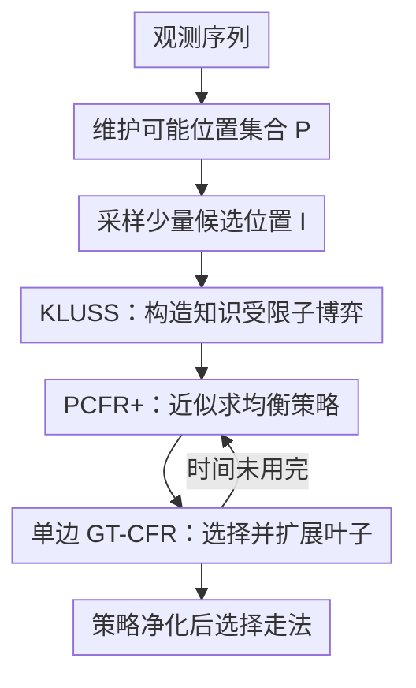

# General search techniques without common knowledge for imperfect-information games, and application to superhuman Fog of War chess

**会议**: ICLR2026  
**OpenReview**: [https://openreview.net/forum?id=afaakBqkvb](https://openreview.net/forum?id=afaakBqkvb)  
**论文**: [OpenReview](https://openreview.net/forum?id=afaakBqkvb)  
**代码**: 无公开代码  
**领域**: 强化学习 / 不完美信息博弈搜索  
**关键词**: 不完美信息博弈, 子博弈求解, Fog of War chess, CFR, 博弈搜索  

## 一句话总结
本文提出 Obscuro，通过不枚举共同知识集合的知识受限子博弈搜索、单边 GT-CFR 扩展和策略净化，把实时不完美信息搜索扩展到 Fog of War chess，并首次在该游戏中达到超人水平。

## 研究背景与动机
**领域现状**：游戏一直是 AI 搜索能力的标尺。完全信息棋类里，搜索的边界很清楚：当前棋盘状态天然定义一个子博弈，minimax、MCTS 或神经网络引导搜索都能围绕这个状态向前展开。德州扑克这类不完美信息博弈也已经有了实时子博弈求解的成功范例，Libratus、DeepStack 等系统说明，只要能构造合适的公共子博弈并在决策时重新求解，搜索可以显著提升策略质量。

**现有痛点**：Fog of War chess 的难点不是普通棋类搜索本身，而是“看不见”带来的知识层级。玩家只能看到己方棋子可合法移动到的格子，因此同一个观测可能对应成千上万种真实局面；更麻烦的是，子博弈求解通常需要知道双方共同知道什么。传统安全子博弈求解会围绕共同知识集合构造 gadget game，可在 FoW chess 中共同知识集合可能达到 $10^{18}$ 量级，甚至判断两个历史是否同属共同知识集合都可能很难。也就是说，过去在扑克里可行的“先枚举公共状态，再求解”的路线，在这里直接失效。

**核心矛盾**：强 FoW chess 智能体同时需要三件事：第一，像国际象棋一样做战术前瞻；第二，像扑克一样维持混合策略与诈唬能力；第三，在信息集快速膨胀和收缩时实时决策。这三者互相拉扯：只看自己的可能局面会忽略对手知道什么，只假设对手全知又会丢掉诈唬空间，完整处理共同知识则完全不可扩展。

**本文目标**：作者希望设计一套更通用的不完美信息搜索技术，使智能体不用枚举共同知识集合，也能在大规模回合制零和游戏中进行实时子博弈求解。具体到 FoW chess，目标是维护己方可能局面集合，从中采样少量代表状态，构造可求解的近似不完美信息子博弈，并在有限时间内输出既有战术深度又保留随机性的行动分布。

**切入角度**：论文的关键观察是，高阶“我知道你知道我知道……”并不总是对当前决策同等重要。若某些状态已经处在足够远的知识层级之外，实际搜索时可以把它们当作不相关部分剪掉。这样做会牺牲最坏情形下的安全性，但能把不可枚举的共同知识问题转化为可控阶数的知识受限子博弈。

**核心 idea**：用“知识受限但可重新优化的子博弈”替代“完整共同知识子博弈”，再用 CFR 与有选择的树扩展在实时预算内求近似均衡，从而让不完美信息搜索能在 FoW chess 这种远大于扑克的游戏上运行。

## 方法详解
### 整体框架
Obscuro 是一个纯实时搜索智能体。它在每一步维护两个对象：当前观测下所有可能真实棋盘位置集合 $P$，以及上一手遗留下来的部分搜索树 $\hat{\Gamma}$ 和近似策略。轮到自己走棋时，它不会对整个 $P$ 做深搜，而是从中抽取最多几百个候选位置，围绕这些位置与旧搜索树构造一个知识受限子博弈，在该子博弈里交替做 PCFR+ 求解和 GT-CFR 风格的叶子扩展，最后从求得的混合策略里经过净化后落子。

这条流程的核心不是“把国际象棋引擎套到暗棋上”，而是把完美信息评估函数放在一个不完美信息博弈搜索壳里。Stockfish 只负责评估新展开叶子的完美信息价值；真正决定对手不确定性、混合策略、诈唬机会与风险控制的是 KLUSS、Resolve/Maxmargin gadget、PCFR+ 和树扩展策略。

### 关键设计
**1. KLUSS：用二阶知识子博弈绕开共同知识枚举**

传统不完美信息子博弈求解会从当前信息集出发，沿着双方信息集连接关系找到共同知识集合 $I^\infty$，再在这个集合上构造安全的子博弈。FoW chess 中这个集合太大，论文改为只保留当前信息集附近的低阶知识区域：若某个旧树节点已经满足“我们知道对手知道我们知道它不是真实局面”这类足够高阶排除条件，就把它从当前子博弈中删除。这样得到的 KLUSS（knowledge-limited unfrozen subgame solving）本质上是假设二阶知识区域 $I^2$ 已经包含当前决策最相关的战略互动。

与旧方法 KLSS 的重要区别在于“unfrozen”。KLSS 会把距离当前信息集一层之外的己方节点冻结成上一轮蓝图策略，相当于不允许这些潜在诈唬分支在当前子博弈里重新学习。Obscuro 则保留这些节点并让 CFR 一起优化它们。这样虽然仍没有最坏情形安全保证，却能让系统把更深的诈唬机会和对手误判空间留在搜索树里，而不是一旦过了局部 horizon 就被丢掉。

**2. Resolve/Maxmargin 与非均匀根分布：让近似子博弈更稳定**

Obscuro 仍借鉴经典 Resolve 和 Maxmargin gadget：对手在子博弈根部可以选择进入某个信息集，或者拿到 alternate value 后退出；求解目标是不要让对手在这些根信息集上的应对价值变得更好。一般写作里会用最优反应值 $u^*(x\mid J)$ 作为 alternate value，但论文改用当前策略剖面下的 $u(x,y\mid J)$，gift 估计也用当前 counterfactual value 而不是 counterfactual best response。原因很实际：Obscuro 的“蓝图”只是上一手留下的深度受限策略，深层节点质量并不稳定，直接用最优反应值可能把局部误差放大成过度悲观的约束。

Resolve 的根信息集分布也不再均匀。设 $m$ 是当前子博弈中对手根信息集数，$y(J)$ 是上一轮策略给信息集 $J$ 的到达概率，论文使用

$$
\alpha(J)=\frac{1}{2}\left(\frac{y(J)}{\sum_{J'} y(J')}+\frac{1}{m}\right).
$$

这个分布一半相信旧策略认为更可能的对手信息集，一半保留对所有信息集的正概率覆盖。它的作用很像在可扩展性与稳健性之间做折中：系统不会把搜索预算平均浪费在大量几乎不可能的根状态上，也不会完全忽略某个低概率但潜在危险的状态。

**3. 单边 GT-CFR：只扩展对均衡路径可能有用的叶子**

求解器部分使用 PCFR+，但 Obscuro 不先固定一棵完整树再求解，而是边求均衡边长树。叶子扩展来自 GT-CFR 思路：选择一个玩家作为 exploring player，另一个玩家按当前 CFR 策略走；探索方用当前支持集策略和 PUCT 风格探索项混合得到 $\tilde{x}^t$，再按 $(\tilde{x}^t,y^t)$ 采样一条路径并扩展叶子。PUCT 项大致形如

$$
\bar{Q}(I,a)=u(x^t,y^t\mid I,a)+C\sigma^t(I,a)\frac{\sqrt{N^t(I)}}{1+N^t(I,a)}.
$$

这里 $u(x^t,y^t\mid I,a)$ 偏向当前看起来有价值的动作，访问次数与方差项鼓励尚不确定的动作。论文只让一方使用探索策略，而不是双方同时探索，这一点很关键：如果某个树节点双方当前策略都不会到达，那么它对当前均衡证明没有帮助，有限时间里不必急着展开。作者还在附录中说明，在有限二人零和博弈里，给足时间后这种单边 GT-CFR 仍会收敛到近似 Nash 均衡，因为任何被单方以正概率到达的未展开节点最终都会被扩展。

**4. 策略净化：保留必要随机性但压制瞬时抖动**

FoW chess 不能像普通棋类那样完全确定性落子。若对手知道你采用纯策略，它就能把隐藏信息几乎还原成普通国际象棋，诈唬和诱导都不存在了。因此 Obscuro 必须保留混合策略。但 CFR 在有限时间内的最后若干轮会有抖动，直接按全分布采样又容易把低质量瞬时动作走出来。

论文的净化规则是只在算法认为策略“安全”时混合，并且最多只在 $m\leq 3$ 个最高概率动作之间采样；若使用 Resolve 或当前 margin 不安全，就直接选择最高概率动作。除最高概率动作之外，候选动作还必须在后半段搜索迭代中持续出现在支持集里，才算 stable action。这个设计把随机性从“每个有微小概率的动作都可能走”收缩成“少数长期稳定的候选动作之间混合”，因此既能防止被对手完全预测，也能减少 CFR 未收敛噪声造成的低级失误。

### 一个完整示例
可以把一次 Obscuro 决策想象成一个中局局面：己方根据此前可见格子、吃子信息和合法行动约束枚举出 $P$，其中可能有一万多个棋盘位置。它先从 $P$ 中抽取例如 256 个代表位置，并把上一手留下的旧搜索树中仍与当前观测一致的节点接回来。接着，KLUSS 会删除那些双方低阶知识已经排除的旧节点，只保留当前信息集及其附近二阶知识区域；对于新采样位置，如果对手信息还未知，就临时假设对手在该位置上具有完美信息，并用 Stockfish 评估值与上一轮期望值设置 alternate value。

随后 PCFR+ 在这个子博弈里更新双方策略。若当前策略认为某条暗中进攻路线有稳定收益，单边 GT-CFR 会更频繁地把搜索树扩展到这条路线，同时仍保留对其他未探索走法的 PUCT 式检查。新叶子展开时，Stockfish 14 在完美信息棋盘上给所有子节点估值；若这个叶子对应一个新信息集，局部 regret minimizer 初始时会把概率放在 Stockfish 认为最好的动作上，而不是均匀随机。搜索预算结束后，如果最高概率动作之外还有两个长期稳定的诈唬候选，Obscuro 可能在这三个动作中混合；如果当前子博弈还不安全，就只走最高概率动作。

### 损失函数 / 训练策略
这篇论文没有训练神经网络，也没有端到端强化学习损失。Obscuro 的“优化目标”是决策时在构造出的不完美信息子博弈中近似求 Nash 均衡：PCFR+ 通过反事实遗憾更新策略，Resolve/Maxmargin gadget 通过 alternate value 约束对手根信息集价值，GT-CFR 则把搜索预算分配到可能影响均衡的叶子上。

实现上，主循环并行运行一个 CFR 线程和两个树扩展线程，共享同一棵搜索树。扩展线程用锁避免重复扩展同一节点，CFR 线程只读已经展开的部分，因此不加锁。时间预算由棋钟剩余时间启发式决定；预算快结束时先停扩展线程，再给 CFR 线程额外一点时间，让它在不再变化的树上多做几轮均衡更新。

## 实验关键数据

### 主实验
论文用三类对局验证 Obscuro：对上一代 FoW chess SOTA AI ZS21、对不同水平的人类玩家、以及对当时 chess.com Fog of War blitz 排名第一的人类棋手。结果显示，Obscuro 不只是比旧 AI 强，而且在公开强人类玩家上也达到超人表现。

| 对手 / 设置 | 对局数 | Obscuro 战绩 | 得分率 / 结论 |
|--------|------|------|----------|
| ZS21 前 SOTA AI | 1000 | +834 =33 -133 | 85.1%，显著强于旧 AI |
| 人类玩家 1450-2006 分 | 100 有效局 | +97 =0 -3 | 97%，明显强于该水平人类 |
| 世界排名第 1 人类玩家 | 20 | +16 =0 -4 | 80%，约 +241 Elo，$p=0.0118$ |
| 随机对手 | 1000 | +1000 =0 -0 | sanity check，无意外失败 |

时间尺度实验进一步说明，搜索本身确实带来增益。更长思考时间的 Obscuro 稳定击败更短思考时间版本，但收益递减；例如 $1/8$s 每步版本对 $1/16$s 版本得分 56.4%，$16$s 每步版本对 $8$s 版本得分 52.3%。这与围棋、普通国际象棋中“搜索时间越长越强，但边际收益变小”的经验一致。

### 消融实验
作者逐项关闭关键技术，让完整 Obscuro 与被削弱版本对战。所有结果都高度显著，说明提升不是单个评估函数或单个 trick 的偶然效果，而是多个搜索组件叠加出来的。

| 配置 | 对局数 | 完整 Obscuro 得分 | 说明 |
|------|---------|------|------|
| 关闭策略净化 | 1000 | 70.2% (+662 =79 -259) | 不限制混合支持集会明显变弱 |
| 关闭 KLUSS，退回冻结策略 | 1000 | 58.0% (+532 =96 -372) | 重新优化二阶知识区域很重要 |
| 关闭单边 GT-CFR，使用双边扩展 | 10000 | 53.3% (+4535 =1583 -3882) | 单边扩展带来小但稳定收益 |
| 关闭非均匀 Resolve 根分布 | 10000 | 53.3% (+4595 =1478 -3927) | 更合理的根权重有稳定贡献 |
| 只保留双边 GT-CFR，对 ZS21 | 1000 | 72.6% (+711 =30 -259) | 新树搜索框架本身已强于旧 LP + iterative deepening |
| Stockfish 换成简单评估函数 | 1000 | 81.9% (+787 =63 -150) | 评估函数很重要，但搜索算法仍是核心 |

还有一个很有意思的结果：simple-eval Obscuro 只用材料差和可见格子数作为评估函数，仍然在 10000 局中以 55.0% 击败 ZS21。这说明本文的贡献不只是借用了 Stockfish 的棋力；即使底层叶子评估很粗糙，新的不完美信息搜索框架也能带来可见提升。

### 关键发现
- KLUSS 是最有分量的算法改动之一。关闭它后完整版本能拿到 58.0%，说明把二阶知识区域中的己方节点解冻并重新优化，确实让智能体捕捉到了旧 KLSS 留不住的长期诈唬和信息操纵机会。
- 策略净化的贡献也很大。FoW chess 需要混合策略，但“混合”不是越多越好；把随机性限制在少数稳定动作里，可以防止有限时间 CFR 的瞬时噪声变成真实落子错误。
- 搜索时间曲线验证了实时搜索的价值。即使没有大规模训练和集群推理，消费级 CPU 上的搜索预算增加仍会稳定转化为棋力提升。
- FoW chess 的对局波动很高。作者指出，很多强对局最终看起来像一方“白送子”，但这不一定是低级失误，而是隐藏信息博弈里计算风险、诈唬和 equilibrium play 的自然结果。

## 亮点与洞察
- 最大亮点是把“不枚举共同知识”变成了可操作的搜索算法。许多不完美信息方法在论文里默认公共状态可构造，但本文正面处理了公共知识集合爆炸的问题，并给出在真实大游戏里跑通的系统。
- KLUSS 的思想很朴素但有效：不追求最坏情形安全，转而保留当前决策最相关的低阶知识互动。这种工程化取舍很适合那些没有扑克特殊结构、但又需要实时决策的游戏与安全博弈。
- 单边 GT-CFR 的视角也很实用：有限时间里不必扩展双方都不会到达的树节点。它把“求解”和“扩树”结合起来，让搜索预算集中在当前近似均衡附近，而不是均匀铺开。
- 策略净化体现了不完美信息 AI 的一个微妙点：强智能体既不能完全确定，也不能随便随机。随机性必须服务于隐藏信息和反利用，而不是把求解噪声伪装成策略多样性。
- 这篇论文对 RL 社区的启发是，面对 POMDP、多智能体对抗和信息不对称任务时，不一定只能走端到端模型学习路线。若能维护候选状态集合和局部博弈结构，决策时搜索仍然可能非常强。

## 局限与展望
- KLUSS 和 KLSS 一样没有最坏情形安全保证。论文承认，删除的高阶知识区域在某些构造游戏里可能仍影响正确决策，因此它更像一个经验上有效、博弈论上有动机的近似，而不是严格安全子博弈求解。
- Obscuro 仍依赖维护完整可能位置集合 $P$。FoW chess 的实际信息集通常能放进内存，但更复杂的战争模拟、战略游戏或现实安全任务可能无法枚举所有候选状态，需要粒子滤波、学习式状态采样或生成模型辅助。
- 叶子评估强依赖 FoW chess 与普通国际象棋的相似性。Stockfish 可以给隐藏棋盘状态提供很强的完美信息估值，但在没有成熟完美信息引擎的领域，需要学习评价函数或把本文搜索与深度强化学习结合。
- 当前系统不显式建模对手强弱，而是近似打 equilibrium play。面对弱对手时，这可能比专门 exploit 的策略保守，甚至会保留一些对强对手必要、对弱对手却多余的风险。
- 实验虽然对 FoW chess 很充分，但“通用不完美信息搜索技术”的外推还需要更多游戏验证，尤其是包含随机事件、多玩家、非零和收益或巨大动作空间的任务。

## 相关工作与启发
- **vs 传统完全信息棋类搜索**: Turochamp、Deep Blue、AlphaZero 等系统可以把当前棋盘当作完整状态搜索；本文面对的是真实状态不可见且双方知识不对称的局面，必须在信息集和策略分布上搜索。
- **vs Libratus / DeepStack / Pluribus**: 扑克系统依赖公共牌、私牌结构和可管理的公共状态集合，能够做较安全的子博弈求解；Obscuro 的贡献是把搜索带到共同知识集合不可枚举的游戏，通过 KLUSS 舍弃部分高阶知识换取可扩展性。
- **vs Zhang & Sandholm 2021 的 KLSS FoW chess AI**: ZS21 已经提出不依赖完整共同知识的 FoW chess 子博弈搜索，但会冻结部分己方节点，且使用 LP 式均衡计算与较旧的扩展策略；本文用 KLUSS、PCFR+、单边 GT-CFR 和净化策略显著提升强度。
- **vs Student of Games / GT-CFR**: Student of Games 展示了 growing-tree CFR 在完美与不完美信息游戏中的统一潜力；Obscuro 把这一思路改成单边扩展，并直接作用在游戏树而不是公共树上，以适应公共知识很弱的 FoW chess。
- **vs 纯深度 RL 游戏智能体**: AlphaStar、OpenAI Five、Stratego 等系统主要依靠大规模学习；本文展示了在某些结构化对抗任务里，几乎不训练、主要靠实时搜索和强评估函数，也能达到超人水平。

## 评分
- 新颖性: ⭐⭐⭐⭐⭐ 共同知识不可枚举时如何做实时不完美信息搜索是硬问题，KLUSS 与单边 GT-CFR 的组合很有辨识度。
- 实验充分度: ⭐⭐⭐⭐⭐ 既有旧 AI、人类高手、世界第一玩家对战，也有多项 1000 到 10000 局量级消融和时间尺度实验。
- 写作质量: ⭐⭐⭐⭐ 方法主线清楚，附录细节扎实；但算法组件较多，读者需要在正文和附录之间来回对照。
- 价值: ⭐⭐⭐⭐⭐ 它不仅解决 FoW chess，还给大规模不完美信息搜索提供了一个可迁移的工程范式。

<!-- RELATED:START -->

## 相关论文

- [\[ICLR 2026\] Look-ahead Reasoning with a Learned Model in Imperfect Information Games](look-ahead_reasoning_with_a_learned_model_in_imperfect_information_games.md)
- [\[ICLR 2026\] Reevaluating Policy Gradient Methods for Imperfect-Information Games](reevaluating_policy_gradient_methods_for_imperfect-information_games.md)
- [\[ICLR 2026\] Chessformer: A Unified Architecture for Chess Modeling](chessformer_a_unified_architecture_for_chess_modeling.md)
- [\[ICLR 2026\] Nearly-Optimal Bandit Learning in Stackelberg Games with Side Information](nearly-optimal_bandit_learning_in_stackelberg_games_with_side_information.md)
- [\[ICLR 2026\] TIPS: Turn-Level Information-Potential Reward Shaping for Search-Augmented LLMs](tips_turn-level_information-potential_reward_shaping_for_search-augmented_llms.md)

<!-- RELATED:END -->
