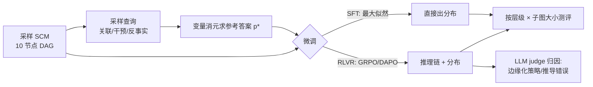

# Generalization of RLVR Using Causal Reasoning as a Testbed

**会议**: ICLR 2026  
**OpenReview**: [https://openreview.net/forum?id=DZjbL9BuHs](https://openreview.net/forum?id=DZjbL9BuHs)  
**代码**: [https://github.com/zhichul/rlcausal](https://github.com/zhichul/rlcausal)  
**领域**: 强化学习 / RLVR 泛化  
**关键词**: RLVR, GRPO, 因果推断, 泛化, SFT 对比, 推理先验  

## 一句话总结
本文用"在因果图模型上做概率推断"这一可严格验证的任务当显微镜，系统拆解 RLVR（可验证奖励强化学习）相比 SFT 的泛化优势到底何时出现，结论是：RLVR 的好处只在模型已具备足够初始推理能力时才浮现，并集中体现为改善边缘化策略、减少中间概率推导与计算错误。

## 研究背景与动机
- **领域现状**：RLVR 已成为后训练 LLM 解决复杂推理（数学、定理证明、代码、生化）的主流范式，靠的是领域里"可靠 verifier 给出的自动正确性信号"。但它在多大程度上能**泛化到训练分布之外**，一直缺乏受控研究。
- **现有痛点**：已有工作（如 Chu et al. 2025）比较过 RL 与 SFT 在文本/视觉推理变体上的泛化，但缺一个能同时沿"难度类型"和"难度量级"两个正交轴精确切分、且 ground truth 可精确计算的 testbed。自然语言因果题（如 CLadder）又把"识别题型、形式化因果表达式"和"实际推导计算"混在一起，难以单独探针后者。
- **核心矛盾**：要研究 RLVR 泛化，既需要任务难度**可分层、可调控**，又需要答案**可精确验证**，还要能把"推理步数"作为连续旋钮——三者很难兼得。
- **本文目标**：构造一个完全指定（full SCM 参数化）的因果推断任务 RLCausal，沿因果阶梯三层（关联 / 干预 / 反事实）与相关子图大小两个轴分层，在 Qwen2.5-Instruct 3B/7B/32B 上对比 RLVR 与 SFT 的层内/跨层泛化。
- **核心 idea**：**用因果推断当"可控可验证的泛化探针"**——三层查询对应不同推理模式（abduction / deduction / 二者复合），相关子图大小直接对应所需推理步数，从而把"RLVR 何时泛化、为什么泛化"拆成可测量的小问题。

## 方法详解

### 整体框架
论文不提新算法，而是搭建一条"合成因果数据 → RLVR/SFT 微调 → 多维度泛化测评 → 推理轨迹归因"的实证流水线。输入是一张完全参数化的二值变量 SCM（10 节点）加一个查询；RLVR 模型先输出推理链再给出概率分布 $\hat p$，SFT 模型直接输出 $\hat p$；参考答案 $p^\star$ 由变量消元（variable elimination）精确算出。随后沿模型规模、训练查询层级两条轴扫实验，再用 LLM judge 对推理轨迹做策略与错误类型标注。

### 关键设计

**1. 双轴难度分层：把"泛化"拆成可测量的层内 × 跨层四象限。** 任务沿两条正交轴切分：一是查询的**因果层级**——关联 $p(v_i\mid v_j=v_j)$ 需要 abduction（对后验里的祖先求和），干预 $p(v_i(v_j=c))$ 需要 deduction（固定 $v_j$ 后再消祖先），反事实 $p(v_i(v_j=c)\mid v_k=v_k)$ 需要先 abduction 再 deduction；二是查询的**结构复杂度** $|V_{rel}|$，即与查询相关的子图节点数（观测变量或查询变量的祖先）。这样既能用"训练层级≠测评层级"测跨层泛化，又能在同一层级内按子图大小看难度曲线。值得注意的是，因为本文给了完整 SCM 参数化，难度序从经典因果阶梯的"关联<干预"反转为"关联>干预"——求后验通常比固定取值更费步骤。

**2. 可验证奖励设计：用 total variation 距离把概率分布答案变成 0/1 信号。** RLVR 优化 $\mathbb{E}_{x\sim T}\mathbb{E}_{y\sim p_\theta(x)}[r(y)]$，奖励是格式与准确率的组合 $r(y)=0.8\cdot r_{ans}(\hat p_y,p^\star_x)+0.2\cdot r_{format}(y)$。准确率项 $r_{ans}(p,q)=\mathbf{1}[D(p,q)<t]$ 用总变差距离 $D(p,q)=\frac12\int_x|p(x)-q(x)|\,dx$，答案与参考都四舍五入到两位小数、阈值 $t=0.01$；格式项奖励"可抽取"和"长度正确"。这套设计让连续概率输出也能得到一个干净、可严格验证的二元奖励，正是 RLVR 能在该任务跑起来的前提。SFT 基线则直接最大化参考答案的条件似然 $\mathbb{E}_{x\sim D}\log p_\theta(y^\star_x\mid x)$。

**3. 精确可控的合成数据生成：四步采样器保证 ground truth 可精确算且训练/测试 SCM 不重叠。** 数据生成走 D1 图采样器（按 Lampinen 2023 流程生成 10 节点随机 DAG，每个新节点随机连 1~2 个父节点）→ D2 机制采样器（对每个父变量赋值组合从单纯形均匀采样二值分布，把噪声分布直接映射成条件概率表的每一行）→ D3 查询采样器（按层级采目标/条件/干预变量）→ D4 求解器（把查询规约为修改后 SCM 上的精确推断，用变量消元算 $p^\star$）。选二值变量是为了让 NP-hard 的精确推断在实践中可算；每层各 8000/2000/8000 训练/开发/测试，且三套的 SCM 互不相交，从根上杜绝记忆泄漏。

**4. 推理轨迹归因：用 LLM judge 把"准确率涨没涨"细化成"哪种子能力被改善"。** 仅看准确率无法解释 RLVR 的增益来源，于是用 o4-mini 对每层 80 条轨迹标注两类标签：**边缘化策略**（增量式 / 暴力枚举 / 邻居 / 不做边缘化）和**概率推导错误**（是否存在丢依赖、混淆干预与观测等抽象错误），并辅以计算错误统计。这把黑箱的分数变化翻译成"RLVR 把策略推向增量式边缘化、减少推导与计算错误"的机制性解释，是全文归因的关键工具。

## 实验关键数据

### 主实验：RLVR vs SFT 的层内/跨层泛化（基于 fig.3/fig.4）

| 维度 | 结论 |
|------|------|
| 层内泛化 | RLVR 仅在**部分**(规模, 查询层级)组合上胜 SFT：在关联、干预查询上、模型 ≥7B 时显著优于 SFT |
| 层内泛化（弱区） | 3B 模型在所有层级、以及反事实层级在所有规模下，RLVR 都**不及** SFT |
| 跨层泛化 | 训练层级≠测评层级时，RLVR 在 ≥7B 上全面优于 SFT |
| 规模效应 | 规模越大，in-level 与 out-of-level 性能差越小（RLVR、SFT 皆然）→ 跨层泛化随规模改善 |
| 精度 | RLVR 往往比 SFT 更精确，且在更复杂查询上优势更明显（fig.6）|

### 关键归因实验（基于 fig.4 底/fig.5）

| 现象 | 数据/观察 |
|------|-----------|
| 推理先验的价值 | 32B 零样本"被提示去推理"的模型，胜过同样 32B 但被微调成"直接出答案"的模型 |
| 规模与推理 | 3B 微调前后都不会推理；≥7B 微调后仍坚持显式边缘化 |
| 策略迁移 | 初始能力足够时，RLVR 把边缘化策略推向**增量式边缘化**（fig.5 上）|
| 错误减少 | RLVR 减少抽象概率/因果推导错误（丢依赖、混淆干预与观测）与计算错误（fig.5 下、fig.27）|

### 关键发现
- **RLVR 不是万能放大器，而是"有条件的精修器"**：只有当基座已有足够初始推理成功率，RLVR 才把分数显著拉高，否则（如 3B）反而退化为"直接预测答案、放弃显式边缘化"，呼应了 RLVR 后训练里的 cold-start 问题。
- **反事实层级是公认硬骨头**：模型在微调前后都不会构造 twin-network 或对外生变量做推断；即便在系统提示里给出 twin-network 解法 hint（oracle 实验），准确率也几乎没变——说明瓶颈是底层推理范式缺失，而非奖励信号不足。

## 亮点与洞察
- **把"泛化"从口号变成可解剖的实验对象**：双轴（层级 × 子图大小）+ 精确 ground truth 让"何时泛化"能被定位到具体的(规模, 层级, 复杂度)单元格，而非笼统下结论。
- **机制性归因而非只报分数**：用 LLM judge 把准确率变化拆成"边缘化策略迁移 + 推导/计算错误减少"，直接回答"RLVR 改善了哪种子能力"。
- **难度序反转的洞见**：在 full-SCM 输入设定下，关联反而比干预更难（求后验比固定取值费步骤），提醒研究者因果阶梯的"难度直觉"高度依赖输入设定。
- **对实践的直接启发**：RLVR 想见效，先确保基座在目标任务上已有非零的"显式推理成功率"，否则该先做能力冷启动（如蒸馏/SFT 注入推理范式）。

## 局限与展望
- **结论的领域特异性**：从 Qwen2.5-Instruct 出发，3B 的失败可能更多反映"因果域冷启动不足"，而非 RLVR 本身的普遍上限；换更强或专门推理调过的基座结论可能改变。
- **任务简化假设**：观测/干预都只作用在单个变量、变量均为二值，尚未覆盖向量值干预、多基数变量与连续机制，扩展后难度与结论可能变化。
- **反事实瓶颈未解**：给 hint 也救不动反事实，说明需要显式引入 twin-network 等推理范式，而非单纯加奖励或加数据。
- **judge 依赖**：策略/错误标注由 o4-mini 完成，存在 judge 偏差，每层仅 80 样本，统计粒度有限。

## 相关工作与启发
- **RLVR 后训练**：DeepSeek-R1、Tülu 3、GRPO/DAPO 等确立了"可验证奖励 + GRPO 类算法"的后训练范式；本文把它放进可控因果 testbed 做诊断。
- **RL vs SFT 泛化之争**：Chu et al. 2025 等比较 RL 与 SFT 在文本/视觉变体的泛化，本文补上"因果推断 + 精确验证 + 双轴分层"的受控证据。
- **LLM 因果推理评测**：CLadder 提供自然语言因果阶梯基准，本文剥离语言理解、聚焦推导计算，并扩到更大随机图；与 Kıcıman 2024、Tu 2024 在常识/连续机制设定下更乐观的结论形成对照。
- **启发**：这套"合成可验证任务 + 双轴难度分层 + 轨迹归因"的方法论，可迁移到其他想严格诊断 RLVR 泛化的领域（如组合优化、规划）。

## 评分
- **新颖性**: ⭐⭐⭐⭐ — 不提新算法，但把"RLVR 泛化"做成可精确分层、可验证、可归因的 testbed，问题设定与诊断视角新颖。
- **实验充分度**: ⭐⭐⭐⭐ — 覆盖三层级 × 三规模 × RLVR/SFT × 子图复杂度，并配 LLM judge 轨迹归因与 oracle/hint 消融，证据链完整。
- **写作质量**: ⭐⭐⭐⭐ — 结构清晰，难度序反转、cold-start 等洞见解释到位；图表偏多、信息密度大需细读。
- **价值**: ⭐⭐⭐⭐ — "RLVR 是有条件的精修器、需足够初始推理能力"这一结论对后训练实践有直接指导意义，testbed 也可复用。

<!-- RELATED:START -->

## 相关论文

- [\[ICLR 2026\] Controllable Exploration in Hybrid-Policy RLVR for Multi-Modal Reasoning](controllable_exploration_in_hybrid-policy_rlvr_for_multi-modal_reasoning.md)
- [\[ICML 2026\] Safety Generalization Under Distribution Shift in Safe Reinforcement Learning: A Diabetes Testbed](../../ICML2026/reinforcement_learning/safety_generalization_under_distribution_shift_in_safe_reinforcement_learning_a_.md)
- [\[ICLR 2026\] Exploration vs Exploitation: Rethinking RLVR through Clipping, Entropy, and Spurious Reward](exploration_vs_exploitation_rethinking_rlvr_through_clipping_entropy_and_spuriou.md)
- [\[ICLR 2026\] PROS: Towards Compute-Efficient RLVR via Rollout Prefix Reuse](pros_towards_compute-efficient_rlvr_via_rollout_prefix_reuse.md)
- [\[ACL 2026\] Semantic-Space Exploration and Exploitation in RLVR for LLM Reasoning](../../ACL2026/reinforcement_learning/semantic-space_exploration_and_exploitation_in_rlvr_for_llm_reasoning.md)

<!-- RELATED:END -->
