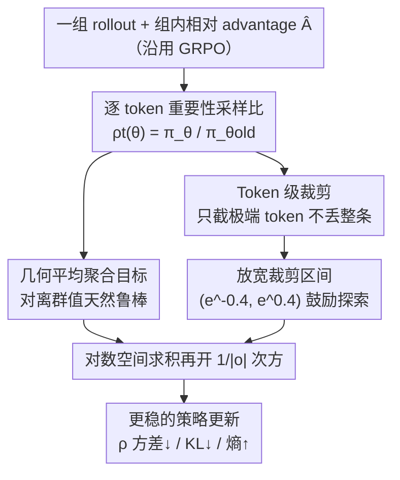

# Geometric-Mean Policy Optimization

**会议**: ICLR 2026  
**OpenReview**: [https://openreview.net/forum?id=nCEs0tSwc2](https://openreview.net/forum?id=nCEs0tSwc2)  
**代码**: https://github.com/callsys/GMPO  
**领域**: 强化学习 / LLM 推理  
**关键词**: GRPO, 策略优化, 几何平均, 重要性采样, 训练稳定性

## 一句话总结
把 GRPO 优化 token 级奖励"算术平均"换成"几何平均"，靠几何平均对离群值天然不敏感的特性压住极端重要性采样比，从而在不损失探索能力的前提下让策略更新更稳，数学推理上 Pass@1 比 GRPO 最高提升 4.1%。

## 研究背景与动机
**领域现状**：以 GRPO（Group Relative Policy Optimization）为代表的可验证奖励强化学习已成为提升大模型推理能力的主流后训练手段——对每个问题采样一组 rollout，用组内相对奖励估计 advantage，省掉昂贵的 value 模型，在数学、代码、多模态推理上都拿到了强结果。

**现有痛点**：GRPO 的优化目标是 token 级重要性加权奖励 $\rho_t(\theta)\hat{A}$ 的**算术平均**，而算术平均对离群值极其敏感。训练中只要某个 token 的重要性采样比 $\rho_t(\theta)=\frac{\pi_\theta(o_t\mid q,o_{<t})}{\pi_{\theta_{old}}(o_t\mid q,o_{<t})}$ 偏离 1 很远（出现极端值），就会驱动一次过于激进的策略更新，进一步放大 $\rho_t$ 的方差，形成"越训越不稳"的恶性循环。

**核心矛盾**：为了压制极端比值，GRPO 只能用很窄的 clip 区间 $(\epsilon_{low},\epsilon_{high})$（如 0.8~1.2）硬截断，但窄 clip 又会限制探索、让策略过早收敛成确定性策略，反过来阻碍 test-time scaling。**稳定性与探索性之间被 clip 这个钝工具绑死了**。

**切入角度**：作者观察到不稳定的根源不在 clip 的松紧，而在于**聚合算子选错了**——算术平均放大离群值。如果换一个对离群值天然鲁棒的聚合算子，就能在源头上把重要性采样比的分布收窄，从而既稳又能放开 clip 去探索。

**核心 idea**：用 token 级奖励的**几何平均**替代算术平均作为优化目标（plug-and-play，只改聚合方式），几何平均对离群值不敏感、产生方差更低的重要性采样比分布，进而允许使用比 GRPO/DAPO 都更宽的 clip 区间。

## 方法详解

### 整体框架
GMPO 不改 GRPO 的采样与 advantage 估计流程，只在"如何把一条 rollout 里所有 token 的重要性加权奖励聚合成一个序列目标"这一步动刀：GRPO 把它们做算术平均，GMPO 改成几何平均。围绕几何平均，作者再配两个工程上的关键设计——把 clip 从序列级移到 token 级、并把 clip 区间显著放宽——三者共同把"稳定 + 探索"同时拿到手。

整条目标函数为（取对的优化方向用 $\mathrm{sgn}(\hat{A}_i)$ 保证）：

$$J_{GMPO}(\pi_\theta)=\mathbb{E}\left[\frac{1}{G}\sum_{i=1}^{G}\left(\prod_{t=1}^{|o_i|}\min\big(\rho_{i,t}(\theta)\hat{A}_i,\ \mathrm{clip}(\rho_{i,t}(\theta),\epsilon_{low},\epsilon_{high})\hat{A}_i\big)\right)^{\frac{1}{|o_i|}}\mathrm{sgn}(\hat{A}_i)\right]$$

实现上为数值稳定，连乘与开方都在对数空间完成（求和后除以有效 token 数再取 exp）。

### 关键设计

**1. 几何平均聚合：用对离群值鲁棒的算子从源头收窄重要性采样比**

这是 GMPO 的核心。GRPO 目标里 token 级奖励是算术平均 $\frac{1}{|o_i|}\sum_t \rho_{i,t}(\theta)\hat{A}_i$，一旦某个 $\rho_{i,t}$ 极端偏大/偏小，整条序列的目标和梯度都会被它带飞。GMPO 改为几何平均 $\big(\prod_t \rho_{i,t}(\theta)\hat{A}_i\big)^{1/|o_i|}$，几何平均对离群值天然不敏感，能把重要性采样比的分布方差压低。

作者从两个角度论证它更稳。其一是**取值范围更窄**：由不等式可证 $|J^*_{GMPO}(\pi_\theta)|\le|J^*_{GRPO}(\pi_\theta)|$，更窄的目标取值范围意味着优化过程方差更低。其二是**梯度更均衡**：两个目标的梯度都是各 token 策略梯度的加权和，区别在权重——GRPO 中 token $o_{i,t}$ 的权重是它自己的 $\rho_{i,t}(\theta)$，单个极端值就能让该 token 梯度过大或过小；而 GMPO 中权重是整条序列所有比值的几何平均 $\big(\prod_k \rho_{i,k}(\theta)\big)^{1/|o_i|}$，相当于让一条序列里的 token 共享一个被"平滑"过的更新信号，对离群值更鲁棒。

**2. Token 级裁剪：只截掉极端 token，而不是一触发就丢整条序列**

几何平均目标里出现的连乘项 $\prod_t \rho_{i,t}(\theta)$ 也是 DeepSeek-R1 序列级奖励的形式，自然的做法是像 R1 那样在**序列级**做 clip，即对 $\prod_t\rho_{i,t}(\theta)$ 整体截断。但作者发现 token 级 clip 更优，原因有二：序列级 clip 后的重要性采样比范围反而更大（如 Figure 3 所示 GMPO-seq-clip 的范围明显宽于 token 级），更容易在优化中制造极端梯度；而且序列级 clip 太"一刀切"——一旦触发就把整条序列里所有 token 的梯度清零，连同 rollout 中那些信息量丰富、本该贡献有效梯度的部分一起丢掉。token 级 clip 只对真正越界的单个 token 生效，既更稳又保住了有价值的更新信号。

**3. 放宽裁剪区间：几何平均腾出的稳定性预算用来换探索**

DAPO 指出窄 clip 会限制探索、导致策略过早确定化，于是把上界从 1.2 微调到 1.28。GMPO 因为几何平均已经从源头收窄了 $\rho_t$ 的分布，可以更大胆地放宽 clip。作者可视化每步训练的最大/最小重要性采样比后发现：训练越久 GRPO 的 $\rho_t$ 范围越宽（更激进、更不稳），而 GMPO 始终保持更窄的范围；但 clip 也不能无限放开，从 $(e^{-0.2},e^{0.2})$ 放到 $(-\infty,+\infty)$ 会重新引入不稳定。权衡后将 $(\epsilon_{low},\epsilon_{high})$ 设为 $(e^{-0.4},e^{0.4})$，这个区间显著大于 GRPO 和 DAPO，带来更强探索并提升性能。

### 损失函数 / 训练策略
最终损失即 $-\hat{A}\cdot\exp\big(\frac{1}{|o|}\sum_t \text{(token 级 clip 后的带符号 log-ratio)}\big)$，全程在 log 空间计算。语言任务沿用 Dr.GRPO 设置（MATH Level 3–5 共 8523 题训练，每题 8 个 rollout，最大回复 3000 token，旧策略每轮产 1024 个 rollout、当前策略以 batch 128 更新 8 次），数学奖励为可验证的 0/1。

## 实验关键数据

### 主实验
在五个不同难度的数学推理基准（AIME24 / AMC / MATH500 / Minerva / OlympiadBench）上，GMPO 全面超过 GRPO，且越强的 base 模型增益越大：

| 模型 / 设置 | 基准 | GMPO | GRPO | 提升 |
|--------|------|------|------|------|
| DeepSeek-R1-Distill-Qwen-7B | 数学五基准 Avg. | 63.4 | 59.3 | +4.1% |
| Qwen2.5-Math-7B | 数学五基准 Avg. | 52.7 | 51.2 | +1.5% |
| Qwen2.5-Math-1.5B | 数学五基准 Avg. | 43.9 | 42.5 | +1.4% |
| Qwen3-32B (MoE) | MATH500 | 96.7 | 94.6 | +2.1% |
| Qwen2.5-VL-7B | Geometry3K（多模态） | 54.7 | 53.3 | +1.4% |
| Qwen2.5-Instruct-1.5B | ALFWorld（agentic） | 85.9 | 72.8 | +13.1% |

与 SOTA 方法横向比较中，GMPO-7B（R1-Distill）的 63.4% 也超过 Oat-Zero-7B 的 61.5%，在 AMC（78.3）、MATH500（91.4）、OlympiadBench（62.5）上领先尤为明显。

### 消融实验
Table 3 拆解 GMPO 相对 GRPO 的各项修改（同训练设置，Qwen2.5-Math-7B 五基准 Avg.）：

| 配置 | Avg. | 说明 |
|------|------|------|
| ① GRPO（算术平均） | 51.2 | 基线 |
| ② GMPO 去掉 clip | 52.3 | 无裁剪也优于 GRPO，但比完整版掉 0.4% |
| ③ GMPO 序列级 clip | 52.6 | 性能近似但 $\rho_t$ 范围更宽、更不稳 |
| ④ GMPO 去掉 $1/|o|$ 归一化 | 52.0 | 掉 0.7%，归一化项很关键 |
| ⑤ GMPO（完整） | 52.7 | 几何平均 + token 级 clip + 归一化 |

clip 区间敏感性（Table 4）：$(e^{-0.2},e^{0.2})$=52.4、$(e^{-0.4},e^{0.4})$=52.7（最佳）、$(e^{-0.8},e^{0.8})$=52.1、$(-\infty,+\infty)$=52.3——太窄限制探索、太宽引入不稳，$(e^{-0.4},e^{0.4})$ 是稳定与探索的甜点。

### 关键发现
- **几何平均是首功**：仅把算术平均换成几何平均（其他不变）就带来 +1.5% 的主增益，验证"聚合算子选择"才是稳定性的根因。
- **稳定性的可观测证据**：训练曲线上 GMPO 全程保持更高 token 熵（持续探索、不早熟塌缩）、更小的梯度波动、对参考模型更低的 KL 散度——三项一致指向更稳的学习过程。
- **越不稳的场景增益越大**：MoE（Qwen3-32B）这类对稳定性更敏感的设置、以及 agentic 的 ALFWorld（+13.1%）上 GMPO 优势最突出，说明它解决的确实是"稳定性瓶颈"。
- **归一化不可省**：去掉 $1/|o|$ 项（类似 Dr.GRPO 的做法）反而掉 0.7%，说明几何平均的长度归一化对维持最优性能是必要的。

## 亮点与洞察
- **最"啊哈"之处是问题诊断的角度**：大家都在 clip 的松紧、baseline 估计、奖励整形上打补丁，GMPO 直接指出不稳定来自"算术平均放大离群值"这一聚合算子层面的根因，换一个鲁棒算子就解决，思路干净且正交于已有 GRPO 变体。
- **plug-and-play 极易落地**：伪代码只有十几行，核心就是把对数比值求和取均值再 exp（log 空间几何平均），可直接接入 verl 等现成框架，迁移成本极低。
- **"稳定性预算换探索"的设计哲学可复用**：先用鲁棒算子把分布方差压下来，腾出的稳定性余量再用来放宽 clip 鼓励探索——这种"先稳后放"的思路可迁移到其他需要在保守约束与探索之间权衡的 RL 目标设计。

## 局限与展望
- 增益幅度与 base 模型强相关：弱模型（1.5B）仅 +1.4%，强模型（R1-Distill-7B）才到 +4.1%，方法的收益依赖于"已经有较强推理底子、但训练不稳"的场景。
- 论文主要在可验证 0/1 奖励的数学/几何/agentic 任务上验证，对带噪声奖励或连续奖励、开放式生成任务的几何平均是否仍鲁棒，未充分探讨。
- clip 区间 $(e^{-0.4},e^{0.4})$ 是经验最优，换数据集/模型规模时是否仍最优需重新调，方法并未给出自适应确定 clip 区间的机制——这是一个自然的改进方向。
- 几何平均要求乘积项符号一致（靠 $\mathrm{sgn}(\hat{A})$ 处理），当 advantage 的符号语义更复杂时需要额外小心。

## 相关工作与启发
- **vs GRPO**：同样用组内相对奖励估 advantage、省 value 模型，区别在 token 级奖励的聚合——GRPO 用算术平均（对离群值敏感、被迫用窄 clip），GMPO 用几何平均（鲁棒、可放宽 clip），是对 GRPO 稳定性的正交补强。
- **vs DAPO**：DAPO 也针对窄 clip 限制探索的问题，但手段是把上界从 1.2 微调到 1.28（clip-higher），治标；GMPO 从聚合算子层面收窄分布，从而能把区间放得比 DAPO 更宽，治本。
- **vs Dr.GRPO**：Dr.GRPO 去掉长度归一化以缓解 length bias，而 GMPO 的消融显示去掉 $1/|o|$ 归一化反而掉点，说明在几何平均框架下归一化项是必要的，两者对归一化的取舍方向不同。
- **vs OPO / BNPO / GRPO-lead**：它们分别从更优 baseline、奖励归一化、奖励整形角度提升稳定性，GMPO 提供的是"鲁棒聚合算子"这一互补且正交的视角。

## 评分
- 新颖性: ⭐⭐⭐⭐ 把稳定性问题归因到聚合算子并用几何平均解决，角度清新且与已有变体正交。
- 实验充分度: ⭐⭐⭐⭐ 覆盖语言/多模态/agentic、dense/MoE，含理论分析与熵/KL/梯度等稳定性证据，消融完整。
- 写作质量: ⭐⭐⭐⭐ 动机—理论—实验链条清晰，图表对照到位。
- 价值: ⭐⭐⭐⭐ plug-and-play、十行可落地，对做 RLHF/推理后训练的实践者有直接价值。

<!-- RELATED:START -->

## 相关论文

- [\[ICLR 2026\] Single-stream Policy Optimization](single-stream_policy_optimization.md)
- [\[ICLR 2026\] GRACE: Generative Representation Learning via Contrastive Policy Optimization](grace_generative_representation_learning_via_contrastive_policy_optimization.md)
- [\[ICLR 2026\] SHAPO: Sharpness-Aware Policy Optimization for Safe Exploration](shapo_sharpness-aware_policy_optimization_for_safe_exploration.md)
- [\[ICLR 2026\] Mean Flow Policy with Instantaneous Velocity Constraint for One-step Action Generation](mean_flow_policy_with_instantaneous_velocity_constraint_for_one-step_action_gene.md)
- [\[ICLR 2026\] Group Verification-based Policy Optimization for Interactive Coding Agents](group_verification-based_policy_optimization_for_interactive_coding_agents.md)

<!-- RELATED:END -->
