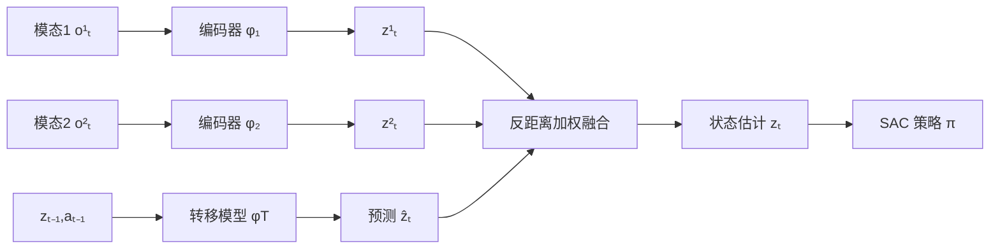

# Geometry of Uncertainty: Learning Metric Spaces for Multimodal State Estimation in RL

**会议**: ICLR 2026  
**OpenReview**: [https://openreview.net/forum?id=rw0vvcHZPe](https://openreview.net/forum?id=rw0vvcHZPe)  
**代码**: [https://github.com/reichlin/MetricMultiModal](https://github.com/reichlin/MetricMultiModal)  
**领域**: reinforcement learning  
**关键词**: 状态表示学习, 多模态传感融合, 度量空间, 不确定性估计, POMDP, 噪声鲁棒性  

## 一句话总结
把"不确定性估计"重新表述为度量空间里的几何问题——构造一个让欧氏距离等于"两状态间最少动作数"的潜空间，再用反距离加权融合多模态传感，从而无需任何噪声假设、也无需在噪声下训练，就实现了对未见传感损坏的鲁棒状态估计。

## 研究背景与动机
**领域现状**：在 RL 中从高维、含噪、多模态观测里估计环境状态是核心难题。经典做法是贝叶斯滤波（Kalman 滤波、粒子滤波），它在理论上能给出带不确定性的最优估计，但要么把状态分布限制成高斯形式，要么要昂贵的蒙特卡洛，且都需要预先知道观测模型和噪声的函数形式。深度学习路线（变分方法、Recurrent State Space Model、神经过程）虽能处理高维观测，却仍然需要在噪声数据上训练来学习不确定性，并且大多假设噪声的已知形式。

**现有痛点**：① 需要显式的噪声/观测模型与先验假设，换一种噪声就泛化不动；② 想鲁棒就得在训练时注入噪声增强，但这要求事先知道损坏类型，还拖慢探索、压低渐近回报；③ 多模态融合困难——贝叶斯滤波天然难处理多个传感模态，朴素拼接/线性组合在某个模态崩坏时会被错误信号带偏。

**核心矛盾**：要"对任意噪声鲁棒"，传统范式却要求"先知道噪声长什么样"。这两者本质冲突——显式概率建模把不确定性的负担压在了"假设正确"上。

**本文目标**：学一个状态表示，既能对接任意 RL 算法，又能对训练时从未见过的传感损坏保持高回报，且全程不需要噪声样本、不需要噪声分布先验。

**核心idea**（**几何化不确定性**）：作者主张转移模型的误差"在动力学诱导的空间里是局部的"——预测状态只会落在"需要相似动作序列才能到达"的邻域内。于是把潜空间构造成一个度量空间，使欧氏距离正比于"两状态间最少动作数"（temporal distance）；这样一来，一个观测编码离转移预测越近就越可信，不确定性就被读成了"距离"，无需任何概率建模。

## 方法详解

### 整体框架
METRICMM 给每个模态配一个编码器 $\phi_i: O_i \to Z$，外加一个潜空间转移模型 $\phi_T: Z \times A \to Z$。训练时用对比时序距离损失把潜空间塑造成"距离=最少动作数"的度量空间，并用不变性损失把各模态对齐到同一空间；推理时先用转移模型预测 $\hat z_t$，再用各模态编码到 $\hat z_t$ 的距离做反距离加权融合，得到当前状态估计 $z_t$，最后把 $z_t$ 喂给标准 RL 算法（SAC）端到端联合优化。

### 关键设计
**1. 度量空间假设：把转移误差关进一个 ε-球。** 方法的地基是一条几何假设——真实状态 $z_t$ 一定落在转移预测周围的小球里：$z_t \in B(\phi_T(z_{t-1}, a_{t-1}), \epsilon)$，其中 $B(z,\epsilon)=\{z': d(z,z')\le\epsilon\}$。直觉是转移模型虽有误差，但误差只把状态推到"动作距离相近"的邻居上，而不会跳到动力学上遥远的地方。为此作者把潜空间定义成度量空间 $M=(Z, \|\cdot\|_2)$，距离对应最少动作数（temporal distance）。由于用范数做距离天然对称，这只能逼近 $\min\{d(s_1,s_2), d(s_2,s_1)\}$ 这样的对称化距离，但借助 MDP Homomorphism 的形式化，这个对称度量已足够支撑后续的几何推理。

**2. 反距离加权传感融合：用距离当置信度，免去噪声建模。** 既然假设观测越靠近转移预测就越可信，融合就顺理成章地用"到预测的距离的倒数"做权重：

$$z_t = \left(\sum_i \frac{1}{\|z_t^i - \hat z_t\|_2 + \delta}\right)^{-1} \sum_i \frac{z_t^i}{\|z_t^i - \hat z_t\|_2 + \delta}$$

其中 $\hat z_t = \phi_T(z_{t-1},a_{t-1})$、$z_t^i = \phi_i(o_t^i)$、$\delta=10^{-5}$。被噪声污染的模态编码会偏离预测、距离变大、权重自动衰减；可靠模态则距离小、权重大。这正好对应一个 MAP 原则——和转移模型越一致的估计获得越高权重，于是不需要任何显式噪声分布就拿到了自适应的鲁棒融合。

**3. 三损失塑造度量结构，且训练全程无噪声。** 用各模态编码均值 $\bar z_t = \frac1N\sum_i \phi_i(o_t^i)$（无噪声时等价于融合估计）来定义三个损失。**对比时序距离损失**把相邻状态拉近、随机状态推远：正项 $L^+ = \mathbb{E}[(\|\bar z_{t+1}-\bar z_t\|_2 - 1)^2]$ 让一步转移的距离趋近于 1，负项 $L^- = \mathbb{E}[-\log(\|\bar z_r - \bar z_t\|_2)]$ 防止表示坍缩；在 $L^+$ 作为局部约束、$L^-$ 尽量铺开所有状态的配合下，三角不等式会把非相邻状态对的时序距离也一并恢复出来。**潜转移损失** $L_T = \mathbb{E}[(\phi_T(\bar z_t, a_t)-\bar z_{t+1})^2]$ 保证转移模型预测准确。**多模态不变性损失** $L_{inv} = \mathbb{E}[(\phi_i(o_t^i)-\phi_j(o_t^j))^2]$ 把所有模态对齐到同一度量空间。总损失 $L = L_T + \lambda_1 L^+ + \lambda_2 L^- + \lambda_3 L_{inv}$ 与 RL 目标端到端联合优化。整个训练不需要任何含噪样本——这是它"对任意噪声鲁棒"却"不需要知道噪声"的关键。

## 实验关键数据
评测覆盖两个套件：MuJoCo（Hopper/HalfCheetah/Ant/Walker2d/Humanoid/InvertedPendulum，配同步 RGB+深度流）与 Fetch（7-DoF 机械臂抓取，RGB+深度+点云）。统一在表示模块上端到端训练 SAC，5 个种子取均值±标准差。测试时注入 7 类训练时从未见过的损坏（Gaussian、Salt-and-Pepper、Patches、Puzzle、Texture、Failure、Hallucination）。

### 主实验表格
Fetch–PickAndPlace 上对**两个模态同时**施加 Patch 损坏、随损坏概率递增的回报：

| 模型 | 0.1 | 0.25 | 0.5 | 0.75 | 0.9 | 0.99 |
|------|-----|------|-----|------|-----|------|
| LinearComb | -0.89 | -1.99 | -1.76 | -2.57 | -2.67 | -2.17 |
| Concat | -0.04 | -1.13 | -2.84 | -2.06 | -2.53 | -2.43 |
| CURL | 1.43 | -1.55 | -3.76 | -3.51 | -3.40 | -2.58 |
| GMC | -0.01 | -0.91 | -2.04 | -1.95 | -1.88 | -2.41 |
| α-MDF | 2.20 | 0.93 | -1.04 | -1.75 | -2.16 | -2.34 |
| CORAL | -0.36 | -0.86 | -1.51 | -1.23 | -1.38 | -1.47 |
| **MetricMM** | **1.91** | **1.87** | **1.43** | **0.92** | -0.91 | -1.47 |

Fetch–Slide 上对两模态同时施加 Failure 损坏：MetricMM 在概率 0.5 时仍有 **5.95** 回报、0.75 时 **4.55**，而所有基线在 0.5 时已普遍跌到 0 附近或负值（最好的 ConCat 仅 4.01@0.5、0.06@0.75）。

### 消融/分析实验

| 分析维度 | 结论 |
|----------|------|
| 单模态损坏（MuJoCo） | MetricMM 降级斜率最平缓，是唯一在高频扰动下仍维持稳定回报的估计器 |
| 高自由度任务（Humanoid/HalfCheetah） | 随扰动频率上升，MetricMM 与最强基线差距进一步拉大 |
| 训练注噪（Hopper, 图2） | 注噪会拖慢探索、压低渐近回报，重噪甚至延迟学习启动——而 MetricMM 不注噪即鲁棒 |
| 点云利用（Table 3, 0.99 概率单模态损坏） | 仅损坏点云时多数基线几乎不掉分，暴露对 RGB/深度的过度依赖；MetricMM 敏感度分布更均匀，说明每个模态都被真正利用 |
| 时序相关噪声（图4，连续 3/10 帧持续失效） | MetricMM 仍是最可靠方法 |

### 关键发现
- **优雅衰减 vs 直接崩塌**：基线在损坏概率上升时回报迅速转负，MetricMM 则逐步缓降，能在剩余可靠模态上重新分配权重。
- **多数模态被污染仍可用**：即使三个传感通道里有两个被破坏，MetricMM 仍保持显著更高回报。
- **不需要、甚至不应该在噪声下训练**：注噪需要预知损坏类型且增加计算，几何化的距离权重天然吸收了观测不确定性。

## 亮点与洞察
- **范式转换**：把"估计不确定性"换成"度量距离"，绕开了贝叶斯滤波必须假设噪声形式这一根本约束——这是本文最锋利的一刀。
- **融合公式即 MAP**：反距离加权不是工程 trick，而能被解释成"与转移模型越一致越可信"的 MAP 原则，理论与直觉自洽。
- **零噪声训练却对任意噪声鲁棒**：把鲁棒性从"数据增强"转移到"空间几何"，省掉了对损坏类型的先验依赖，也避免了注噪带来的训练副作用。
- **可插拔**：表示与 RL 算法解耦，$z_t$ 可喂给任意策略优化器，工程落地友好。

## 局限与展望
- **对称度量的天花板**：用范数导致只能逼近对称化的 temporal distance，无法表达 POMDP 中真实存在的非对称可达性（去 vs 回的动作数不同），Wang et al. 的 quasimetric 在这点上更通用。
- **ε-球假设的脆弱性**：方法成立的前提是转移误差始终局部；若转移模型在长程或高随机环境里发生大跳变，几何置信度会失真。
- **转移确定性假设**：背景里假定 $T$ 确定，对强随机动力学的适配性未充分验证。
- **融合对"全员被骗"无解**：当所有模态都偏离预测同一方向时，反距离加权无法判别——融合本质仍依赖"至少有可靠模态在预测附近"。
- **评测以仿真为主**：MuJoCo/Fetch 的合成损坏与真实传感失效仍有差距，真机验证待补。

## 相关工作与启发
- **状态表示学习**：早期用重构损失或对比方法（CURL）学低维不变表示，但会丢失状态空间结构、难泛化到新扰动；本文用度量结构保留几何。
- **贝叶斯滤波 / 可微滤波**：Kalman/粒子滤波给最优解但假设苛刻；α-MDF 用 Transformer 注意力替代 Kalman Gain 处理多模态——本文与之相反，不显式估计不确定性，因而对噪声类型不可知。
- **RL 中的度量学习**：Steccanella & Jonsson 提出 POMDP 下的 temporal distance，Eysenbach、Park、Wang 等用（拟）度量做规划、探索、离线 RL 的值函数；这些都把度量用于"策略/规划"，本文首次把度量空间用于"多模态噪声下的不确定性估计"，是一个有新意的迁移。

## 评分
- **新颖性**: ⭐⭐⭐⭐ — 把不确定性估计几何化、用反距离加权当 MAP 融合，是对"度量学习用于策略"这一线索的清新再利用，视角独特。
- **实验充分度**: ⭐⭐⭐⭐ — 两套件 8 任务、7 类未见损坏、单/双模态损坏、时序相关噪声、训练注噪对比、点云利用分析，维度相当全面；扣分在仅仿真、无真机。
- **写作质量**: ⭐⭐⭐⭐ — 动机—假设—方法—损失的逻辑链清晰，公式与直觉交替推进，可读性好。
- **价值**: ⭐⭐⭐⭐ — 给"无噪声先验的多模态鲁棒状态估计"提供了一个可插拔、可解释的方案，对机器人/具身控制有现实意义。

<!-- RELATED:START -->

## 相关论文

- [\[ICLR 2026\] Improving and Accelerating Offline RL in Large Discrete Action Spaces with Structured Policy Initialization](improving_and_accelerating_offline_rl_in_large_discrete_action_spaces_with_struc.md)
- [\[ICLR 2026\] Sample Efficient Offline RL via T-Symmetry Enforced Latent State-Stitching](sample_efficient_offline_rl_via_t-symmetry_enforced_latent_state-stitching.md)
- [\[ICLR 2026\] Information-based Value Iteration Networks for Decision Making Under Uncertainty](information-based_value_iteration_networks_for_decision_making_under_uncertainty.md)
- [\[ICLR 2026\] EUBRL: Epistemic Uncertainty Directed Bayesian Reinforcement Learning](eubrl_epistemic_uncertainty_directed_bayesian_reinforcement_learning.md)
- [\[ICLR 2026\] Peng's Q($\lambda$) for Conservative Value Estimation in Offline Reinforcement Learning](pengs_qlambda_for_conservative_value_estimation_in_offline_reinforcement_learnin.md)

<!-- RELATED:END -->
