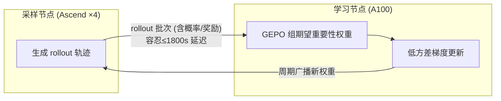

# GEPO: Group Expectation Policy Optimization for Stable Heterogeneous Reinforcement Learning

**会议**: ICLR 2026  
**OpenReview**: [https://openreview.net/forum?id=movNwgQtDt](https://openreview.net/forum?id=movNwgQtDt)  
**代码**: [https://github.com/HanlardResearch/Hetero-RL](https://github.com/HanlardResearch/Hetero-RL)  
**领域**: 强化学习 / LLM 后训练  
**关键词**: 异步 RL, 重要性采样, 方差缩减, 去中心化训练, 策略陈旧性  

## 一句话总结
针对去中心化、高网络延迟环境下 LLM 强化学习训练易崩溃的问题，本文提出把重要性权重的粒度从 token / sequence 级粗化到 **group 级**（用组内期望概率作分母），在理论上对高 KL 散度指数级压低重要性权重方差，从而在 1800 秒延迟下仍只掉 3% 性能。

## 研究背景与动机
- **领域现状**：单中心算力逼近功耗上限，跨地理分布、异构硬件（如 NVIDIA + Ascend 混部）的去中心化训练成为必然趋势；而 RL 又是 LLM 在数学推理等复杂任务上做后训练的关键手段。
- **现有痛点**：传统 RL 框架（GRPO、PPO 系）把 rollout 采样和参数更新**紧耦合**，要求严格同步。这在去中心化场景下有两个致命瓶颈——一是同步等待让 GPU 因等待最慢节点（如生成超长推理链）而空转；二是网络延迟造成采样器策略 $\pi_{\theta_k}$ 与学习器策略 $\pi_{\theta_{k+\tau}}$ 之间出现**策略陈旧性**（policy staleness）$\tau$。
- **核心矛盾**：作者的分析揭示，高延迟会显著抬高采样器与学习器策略之间的 KL 散度，而 KL 散度一大，**重要性权重 $\frac{p(y|x)}{q(y|x)}$ 的方差就会爆炸**，直接导致训练不稳定甚至 reward 崩塌。GRPO 的 token 级、GSPO 的 sequence 级重要性权重在这种大散度下都会失效。
- **本文目标**：构建一个能容忍任意网络延迟、在异构算力网络上稳定训练 LLM 的异步 RL 体系，并从根因（方差爆炸）上而非打补丁地解决不稳定问题。
- **核心 idea**：**【解耦架构 + 粗粒度重要性权重】** 系统层用 HeteroRL 解耦采样与学习；算法层用 GEPO 把重要性权重分母换成组内期望概率 $\hat{\mathbb{E}}_q[q(y|x)]$，让分母不再依赖任何单条样本的概率，从而对高 KL 区域指数级降方差。

## 方法详解

### 整体框架
HeteroRL 把 RL 流水线中两个最重计算的阶段——rollout 采样与参数学习——拆到物理/逻辑独立的异构节点上：4 个采样节点（如 Ascend 910a）持续生成推理轨迹，1 个学习节点（如 A100）异步消费这些数据更新参数，二者通过互联网以星形拓扑通信，谁都不等谁，模型 checkpoint 与 rollout 批次容忍高达 1800 秒延迟。算法核心 GEPO 就运行在学习节点上，沿用 GRPO 的组采样范式，但把重要性权重的统计粒度从单 token / 单序列上升到**整组共享**。

### 关键设计

**1. 组期望重要性权重（GEIW）：把分母从单样本换成组内期望，斩断方差源头。** 标准重要性权重 $\frac{p(y|x)}{q(y|x)}$ 的不稳定根源在于分母 $q(y|x)$ 可能趋近于零，导致权重数值爆炸。GEPO 借鉴 GRPO 的组采样：对每个 prompt $x$ 生成一组 $G$ 条响应，用这组样本估计「期望提议概率」并替换分母。由于 top-P/top-K 采样下 $\sum_i q(y_i|x) \gg 1$，朴素算术平均会因忽略相对采样概率而有偏，作者改用组内归一化概率 $\tilde{q}(y_i|x)=\frac{q(y_i|x)}{\sum_j q(y_j|x)}$ 加权，得到 $\hat{\mathbb{E}}_q[q(y|x)] \approx \sum_{i=1}^{G}\tilde{q}(y_i|x)\cdot q(y_i|x)=\frac{\sum_i q(y_i|x)^2}{\sum_i q(y_i|x)}$，最终权重为 $w_{\text{GEIW}}(y|x)=\frac{p(y|x)}{\hat{\mathbb{E}}_q[q(y|x)]}$。这个分母与任何单条 $q(y|x)$ 解耦，即便个别提议概率趋零也不会产生极端权重——相比 clip 把越界梯度直接置零（等于丢弃该数据点、梯度无效），GEIW 保留了有效梯度。代价是引入一点偏差（$w_{\text{GEIW}}$ 是有偏估计），但换来高 KL 区域大幅降低的方差，是一个有意为之的「偏差换稳定」权衡。

**2. 指数级方差缩减的理论保证（Theorem 1）：把稳定性写成 KL 的函数。** 论文证明存在常数 $C$ 使得 $\text{Var}\big[\frac{p(y|x)}{q(y|x)}\big]-\text{Var}\big[\frac{p(y|x)}{\hat{\mathbb{E}}_q[q(y|x)]}\big]\ge \exp(D_{\text{KL}}(p\|q))-C$，即当 $D_{\text{KL}}(p\|q)>\log C$ 时，GEIW 的权重方差严格小于标准重要性采样，且差距随 KL 散度**指数级**拉大。这正好命中高延迟导致的大 KL 区域——恰是 GRPO / GSPO 崩溃的地方。作者在 Bernoulli 与 Gaussian 两族分布上可视化验证：高 KL 区方差被显著压低，仅在 $p,q$ 极接近的小片区域（KL 很小）GEIW 方差略增，而那本就不是训练失稳的危险区。

**3. 粒度递进的梯度视角：token→sequence→group 越粗越稳。** 从梯度公式看，三种算法只差在重要性权重分母的共享范围：GRPO 每个 token $y_t^i$ 用自己的 $q_{i,t}$ 作分母（token 级，最细、方差最大）；GSPO 让序列 $i$ 内所有 token 共享 $q_i=q(y_i|x)$（sequence 级）；GEPO 进一步让**整组所有序列所有 token 共享同一个分母** $\hat{\mathbb{E}}_q[q(y|x)]$（group 级，最粗）。这条「越粗的重要性权重粒度→越低的梯度方差」的递进，在实现上只需把系数 `coef_1` 从 `learner_token_p / sampler_token_p` 改成 `learner_seq_p / (hat_q * sampler_seq_p).sum()`，改动极小却让训练在大策略散度下保持鲁棒。

## 实验关键数据

设置：Qwen3-1.7B/8B，在 MATH level 3–5（8290 样本）上 RL 训练，评测 MATH500 / AMC23 / AIME24 / AIME25 的 Pass@1（8 次采样平均）。对比 GRPO、GSPO、BNPO、Dr.GRPO，分别在零延迟（Online RL）与高延迟（Hetero RL，最大延迟 64 步 / 1800 秒）下评估。

### 主实验表格（Online RL，Qwen3-8B 平均分）

| 方法 | AMC23 | AIME24 | AIME25 | MATH500 | 平均 |
|------|-------|--------|--------|---------|------|
| Qwen3-8B（基座） | 70.6 | 32.4 | 26.1 | 87.1 | 54.1 |
| BNPO | 78.8 | 44.1 | 29.3 | 91.4 | 60.9 |
| Dr.GRPO | 77.5 | 41.0 | 27.7 | 91.6 | 59.4 |
| GRPO | 81.3 | 42.6 | 31.3 | 92.0 | 61.8 |
| GSPO | 77.8 | 41.8 | 31.3 | 90.9 | 60.5 |
| **GEPO（本文）** | **85.6** | **44.1** | **37.5** | **92.6** | **65.0** |

即便在零延迟理想设置，GEPO 也比最强基线 GRPO 高 3.2 分、比 GSPO 高 4.1 分，AIME2025 上 +6.2 分（相对提升 20%），说明组级重要性权重本身就改善梯度质量，并非只在异步下有用。

### 消融/稳定性表格（Hetero RL，Qwen3-8B，best/last 平均分）

| 方法 | best | last | best→last 退化 |
|------|------|------|----------------|
| GRPO | 56.6 | 55.8 | 0.8 |
| GSPO | 58.4 | 46.4 | **12.0（崩塌）** |
| **GEPO（本文）** | **62.6** | **60.8** | **1.8** |

GEPO 在 best 上超 GSPO 7.2%，并把 best-to-last 退化幅度比 GSPO 缩小 85%（Δ=1.8 vs 12.0）。GSPO 的 last 分数在 500–700 步剧烈崩塌，而 GEPO 全程维持近峰值。

### 关键发现
- **延迟鲁棒性**：从 online 到 1800 秒延迟，GEPO 性能仅掉约 3%，远稳于基线。
- **方差—梯度—奖励三联证据**：训练曲线显示 GEPO 的重要性权重方差始终最低（图 4a），梯度范数变化更平缓，训练 reward 不下降，机理上印证了 Theorem 1。
- **token 级方法同质**：BNPO、Dr.GRPO 与原始 GRPO 几乎无差，因为三者都用 token 级权重；真正拉开差距的是权重粒度。

## 亮点与洞察
- **把「系统问题」翻译成「统计问题」**：作者没有止步于「延迟导致不稳定」，而是定位到根因——延迟→高 KL→重要性权重方差爆炸，再用方差缩减给出原理性而非打补丁的解法。
- **极简实现、强理论**：核心改动只有两行系数计算，却配有指数级降方差的定理与 Bernoulli/Gaussian 可视化，理论与工程都站得住。
- **系统与算法协同**：HeteroRL（解耦 + 容延迟）与 GEPO（容大散度）是配套的——架构制造了大 KL 场景，算法专治这个场景。
- **「偏差换方差」的清醒权衡**：明确承认 GEIW 有偏，但论证在危险区（高 KL）偏差的代价远小于方差的收益。

## 局限与展望
- **偏差未被量化控制**：GEIW 是有偏估计，论文给了方差上界却没给偏差的可控边界，极端分布下偏差是否会反噬收敛方向尚不清楚。
- **任务/规模单一**：只在数学推理（MATH 系）和 Qwen3-1.7B/8B 上验证，代码生成、通用对话、更大模型上的普适性待证。
- **小 KL 区方差略增**：在 $p,q$ 接近时 GEIW 方差反而略高，纯 online、低延迟场景下增益可能边际递减。
- **拓扑假设**：实验是 1 学习 + 4 采样的星形拓扑，更复杂的多学习节点 / mesh 拓扑下的稳定性未探讨。

## 相关工作与启发
- **承接 GRPO/GSPO 谱系**：GEPO 是 GRPO（token 级）→ GSPO（sequence 级）这条「粒度上升」路线的自然延伸（group 级），把「共享分母降方差」的思路推到极致。
- **异步/陈旧策略 RL**：与处理 off-policy 与 policy staleness 的工作（如经验回放、importance weight clipping）对话，但 GEPO 用统计聚合代替截断，避免了梯度被置零。
- **去中心化 LLM 训练**：呼应跨数据中心、异构硬件训练的系统工作，为大规模分布式 RL 后训练提供了算法基座。
- **启发**：当某个估计量的方差由「单点分母趋零」主导时，用一组样本的期望替换单点，是一种通用的稳健化手段，可迁移到其他重要性采样密集的场景（如离线 RL、推荐系统纠偏）。

## 评分
- **新颖性**: ⭐⭐⭐⭐ 把重要性权重粒度推进到 group 级、并配指数级降方差定理，是对 GRPO/GSPO 谱系干净而有原理的一步延伸。
- **实验充分度**: ⭐⭐⭐⭐ 覆盖 online/hetero 两种设置、两个模型规模、四个 benchmark、多基线，并有方差/梯度/奖励三联曲线佐证机理；但任务域偏窄（仅数学推理）。
- **写作质量**: ⭐⭐⭐⭐ 从系统瓶颈到统计根因再到定理与实现，逻辑闭环、图表清晰。
- **价值**: ⭐⭐⭐⭐ 为去中心化、异构算力下的 LLM RL 后训练提供了即插即用、改动极小的稳定化方案，工程落地价值高。

<!-- RELATED:START -->

## 相关论文

- [\[ICLR 2026\] Heterogeneous Agent Q-weighted Policy Optimization](heterogeneous_agent_q-weighted_policy_optimization.md)
- [\[ICLR 2026\] Group Verification-based Policy Optimization for Interactive Coding Agents](group_verification-based_policy_optimization_for_interactive_coding_agents.md)
- [\[ICLR 2026\] Revisiting Group Relative Policy Optimization: Insights into On-Policy and Off-Policy Training](revisiting_group_relative_policy_optimization_insights_into_on-policy_and_off-po.md)
- [\[ICLR 2026\] Jackpot: Align Actor-Policy Distribution for Scalable and Stable RL for LLM](jackpot_align_actor-policy_distribution_for_scalable_and_stable_rl_for_llm.md)
- [\[ICLR 2026\] EXPO: Stable Reinforcement Learning with Expressive Policies](expo_stable_reinforcement_learning_with_expressive_policies.md)

<!-- RELATED:END -->
