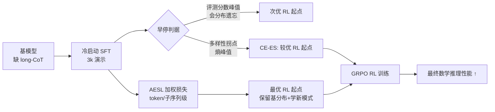

# Getting Your LLMs Ready for Reinforcement Learning with Lightweight SFT

**会议**: ICLR 2026  
**OpenReview**: [https://openreview.net/forum?id=yezWGJmODg](https://openreview.net/forum?id=yezWGJmODg)  
**代码**: [https://github.com/LXXXXR/AESL](https://github.com/LXXXXR/AESL)  
**领域**: 强化学习 / LLM 后训练  
**关键词**: cold-start SFT, RLVR, 分布遗忘, 多样性早停, GRPO, 数学推理  

## 一句话总结
本文揭示 RL 冷启动阶段中「最优 SFT 检查点」与「最佳 RL 起点」并不一致——评测分数还在涨时模型已因**分布遗忘**丧失 RL 潜力，进而提出用多样性指标（熵 / self-BLEU）做早停，并设计 token / 子序列级自适应加权损失 AESL 平衡新模式学习与基模型分布保留。

## 研究背景与动机
**领域现状**：RL（尤其是基于可验证奖励的 RLVR + GRPO）已成 LLM 后训练主流范式，但其效果高度依赖基模型质量。为让基模型先具备长链思维（long-CoT）等推理模式，主流 pipeline（DeepSeek-R1 等）普遍在 RL 之前加一段 SFT「冷启动」，用少量演示数据注入推理模式以提升后续 RL 的样本效率。

**现有痛点**：冷启动该训多久、SFT 的目标（模仿演示）是否真的对齐「为 RL 做准备」这个目的，一直没有答案。常规做法是选 SFT 后评测分数最高的检查点接着做 RL——但本文发现这恰恰是错的。

**核心矛盾**：作者通过扫描不同冷启动步数下的 post-RL 性能（图 1b）发现一个反直觉现象：SFT 评测分数仍在上升的「再适应」阶段，对应的 post-RL 性能反而开始下降。也就是说 **RL 潜力的衰退发生在 SFT 过拟合之前**，根因是模型过度偏离基模型分布（distribution forgetting），丢掉了 RL 探索所需的多样性。冷启动目标（把模型推向好的 RL 起点）与 CE 损失目标（最大化演示模仿）存在根本错位。

**本文目标**：找到对齐 RL 准备的早停准则与损失函数，让冷启动真正把 LLM 送到更优的 RL 初始化点。

**核心 idea**：**[判据替换]** 用响应多样性（熵 ↑ / self-BLEU ↓）的峰值/拐点替代评测分数作为早停信号；**[损失重塑]** 进一步把冷启动目标从「完全模仿」重构为「学新模式 ↔ 保基模型分布」的自适应权衡，按 token 和子序列粒度动态控制。

## 方法详解

### 整体框架
方法分两层递进：先在分析层证明「多样性拐点 = RL 潜力甜点」，由此得到最简单的改进——**多样性早停**（CE-ES，仍用 CE 损失但在多样性拐点停）；再把数据集级的统一早停细化为 token / 子序列级的自适应加权损失 **AESL**，对不同 token 按其「已被模型掌握的程度」差异化地降低学习强度，从而在保留基分布与适应新演示之间做细粒度权衡。

### 关键设计

**1. 诊断分布遗忘：多样性而非评测分数才是 RL 潜力的信号。** 作者对 Qwen2.5-7B-Instruct 在不同冷启动步数下分别接 RL，画出 before-RL 与 after-RL 两条曲线，发现 SFT 经历「先掉分再恢复」的 shift-and-readaptation 过程；关键是 readaptation 阶段评测分数继续涨而 post-RL 分数已掉头向下。同步测量的熵在某一步（如 step 100）达到峰值、self-BLEU 达到谷值，这个多样性甜点恰好对应最佳 RL 潜力。直观解释是：此时模型同时保留了基模型分布与新数据集模式的「双分布」特征，既学会了 long-CoT 又没丢掉探索所需的输出多样性。由此得到第一条可落地结论——**选多样性拐点的检查点，而非评测最优检查点**。

**2. AESL 的 token 级自适应加权：对已掌握的 token 自动松手。** 标准冷启动用交叉熵 $L_{CE}(\theta)=-\mathbb{E}_{q,s^*\sim D_{SFT}}[\log\pi_\theta(s^*_t|q,s_{<t})]$ 一视同仁地逼近所有演示 token。AESL 给每个 token 乘一个自适应权重，得到 $L_{Ada\text{-}stop}(\theta)=-\mathbb{E}[p(q,s^*_t,\pi_\theta)\cdot\log\pi_\theta(s^*_t|q,s_{<t})]$，其中权重 $p(q,s^*_t,\pi_\theta)=1-\mathrm{softmax}\!\left[\frac{y(s^*_t|q,s_{<t})}{-t_{scaling}\cdot\frac{1}{|t|}\sum_{i=1}^t\log\pi_\theta(s^*_i|q,s_{<i})}\right]$。当 ground-truth token 在当前策略下已是高概率时，权重自动减小、损失贡献被压低——相当于对「模型已经会了」的 token 提前早停，避免反复强化导致分布过度偏移，从而在 token 粒度上保留基模型知识。

**3. 子序列级缩放：把多样性的来源对准高概率前缀。** 仅靠 token 级权衡还不够，因为 RL 准备的本质是要能生成多样且合理的推理路径。作者用熵的链式分解 $H(s_t|q)=\sum_{s_{t-1}}\pi(s_{t-1}|q)H(s_t|s_{t-1})+H(s_{t-1}|q)$ 说明：跟在高概率前缀后面的 token 对整体多样性贡献更大。于是权重 (4) 式的分母用前缀的平均 log 概率 $\frac{1}{|t|}\sum_{i=1}^t\log\pi_\theta(s^*_i|q,s_{<i})$ 做缩放——当前缀已经高度贴合数据集分布时更倾向保留基分布。这样 AESL 把「该松手的地方」精准定位到对多样性影响最大的子序列，使冷启动后的输出既贴近基模型又具备更高熵。

## 实验关键数据

**设置**：基模型 Qwen2.5-7B-Instruct 与 Qwen2.5-Math-7B；冷启动从 Openr1-Math-46k 子采样 3k 条 R1 长 CoT 演示，RL 用全部 46k question + GRPO；评测 AIME24/25、AMC23、MATH-500、Minerva、OlympiadBench（AIME/AMC 报 avg@64，其余 pass@1）。

### 主实验（post-RL Avg. 宏平均，↑）

| 方法 | Qwen2.5-7B-Instruct +RL | Qwen2.5-Math-7B +RL |
|------|:---:|:---:|
| Base + RL（直接 RL） | 38.09 | 44.67 |
| CE（评测最优）+ RL | 40.19 | 48.60 (CE-ES) |
| CE-ES（多样性早停）+ RL | 41.54 | — |
| GEM + RL | 40.53 | 49.42 |
| PSFT + RL | 40.64 | 48.02 |
| **AESL + RL** | **42.26** | **50.04** |

### 多样性 & 鲁棒性

| Qwen2.5-7B-Instruct 冷启动后 | Entropy(↑) | Self-BLEU(↓) |
|------|:---:|:---:|
| CE | 0.326 | 0.710 |
| CE-ES | 0.530 | 0.696 |
| **AESL** | **0.553** | **0.694** |

不同冷启动数据规模（1k/3k/6k）下 AESL + RL 均稳定优于 CE-(ES) + RL，例如 1k 时 AESL 达 41.14 vs CE-ES 40.80。

### 关键发现
- **多样性早停本身就有效**：CE-ES 虽然冷启动后评测分更低，但 post-RL 反超 CE（41.54 vs 40.19），印证「冷启动不该只盯演示模仿/评测分」。
- **AESL 保留基分布**：AESL 与基模型输出的 BLEU 更高（0.140 vs CE 0.135），说明保留了更多基知识，RL 时能更有效从基分布采样。
- **数据越少越关键**：当冷启动数据有限时，保留基模型能力比多模仿演示更重要。

## 亮点与洞察
- **反直觉的诊断**：把「post-RL 性能下降发生在 SFT 过拟合之前」这件被忽视的现象量化出来，并归因到分布遗忘，给冷启动早停提供了全新视角。
- **判据可即插即用**：用熵 / self-BLEU 拐点选检查点（CE-ES）几乎零成本，就能稳定提升 post-RL 性能，实用价值高。
- **轻量且原理清晰**：AESL 只是给 CE 损失加一个自适应权重，无需额外模型或数据，且 token + 子序列两级设计都从熵分解推导而来，动机自洽。

## 局限与展望
- 实验仅覆盖数学推理 + Qwen2.5 两个 7B 基模型，能否推广到代码、agent 等其他 RLVR 任务与更大/更小模型尚待验证。
- AESL 引入 $t_{scaling}$ 等超参，权重 (4) 式的设计带一定启发式色彩，缺乏对最优权衡的理论刻画。
- 多样性拐点的检测仍需在训练中持续测熵 / self-BLEU，对在线早停的工程开销与稳定性着墨不多。

## 相关工作与启发
- **冷启动 SFT for RL**：DeepSeek-R1、Tulu 等 pipeline 把 SFT 冷启动作为 RL 前置；本文首次系统质疑其「评测最优 = RL 最优」假设。
- **改良 SFT 损失**：与 GEM、PSFT 等保留分布/防过拟合的 SFT 变体同属一脉，但 AESL 显式面向「RL 准备」目标并做 token/子序列级控制。
- **启发**：把后训练当作整体优化（SFT 起点服务于 RL 终点）而非孤立调 SFT 评测分，是一个值得推广的思路；多样性指标作为「为探索保留容量」的代理信号，可能迁移到其他 cold-start / continual learning 场景。

## 评分
- **新颖性**: ⭐⭐⭐⭐ — 「RL 潜力衰退早于 SFT 过拟合」的诊断与「多样性早停」判据是新颖且反直觉的观察，AESL 损失设计也有原理支撑。
- **实验充分度**: ⭐⭐⭐ — 两个基模型 + 多个数学 benchmark + 数据规模消融较完整，但任务域单一（仅数学推理），缺跨任务/跨规模验证。
- **写作质量**: ⭐⭐⭐⭐ — 从动机观察到方法推导逻辑顺畅，图 1b/图 2 的现象呈现清晰，公式与直觉解释配合到位。
- **价值**: ⭐⭐⭐⭐ — 几乎零成本的早停判据 + 轻量损失就能稳定提升 post-RL 性能，对正在做 RLVR cold-start 的团队有直接实操价值。

<!-- RELATED:START -->

## 相关论文

- [\[ICLR 2026\] Scheduling Your LLM Reinforcement Learning with Reasoning Trees](scheduling_your_llm_reinforcement_learning_with_reasoning_trees.md)
- [\[ICLR 2026\] RL Squeezes, SFT Expands: A Comparative Study of Reasoning LLMs](rl_squeezes_sft_expands_a_comparative_study_of_reasoning_llms.md)
- [\[ICLR 2026\] On the Generalization of SFT: A Reinforcement Learning Perspective with Reward Rectification](on_the_generalization_of_sft_a_reinforcement_learning_perspective_with_reward_re.md)
- [\[ICLR 2026\] Reinforcement Learning with Verifiable Rewards Implicitly Incentivizes Correct Reasoning in Base LLMs](reinforcement_learning_with_verifiable_rewards_implicitly_incentivizes_correct_r.md)
- [\[ICLR 2026\] ReTool: Reinforcement Learning for Strategic Tool Use in LLMs](retool_reinforcement_learning_for_strategic_tool_use_in_llms.md)

<!-- RELATED:END -->
