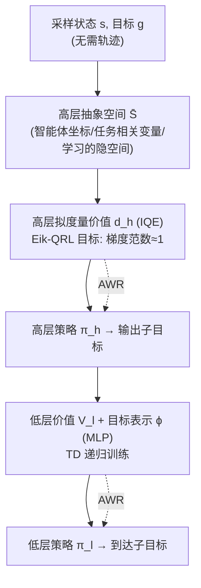

# Goal Reaching with Eikonal-Constrained Hierarchical Quasimetric Reinforcement Learning

**会议**: ICLR 2026  
**OpenReview**: [https://openreview.net/forum?id=5WhsCB0Vty](https://openreview.net/forum?id=5WhsCB0Vty)  
**代码**: 待确认（camera-ready 承诺开源）  
**领域**: 强化学习 / 目标条件 RL  
**关键词**: Goal-Conditioned RL, Quasimetric RL, Eikonal PDE, PINN, Hierarchical RL, Offline RL  

## 一句话总结
把 Quasimetric RL 的离散逐转移局部约束改写成连续时间的 Eikonal 偏微分方程约束（梯度范数为 1），让价值学习变得"无需轨迹、只需采样状态和目标"，再套一层分层结构缓解复杂动力学下的失效，在 OGbench 导航任务上拿到 SOTA。

## 研究背景与动机

**领域现状**：目标条件强化学习（GCRL）通过"到达任意目标"来替代手工奖励设计，而其最优价值函数 $V^*(s,g)$ 正好等于状态 $s$ 到目标 $g$ 的最短可行路径长度，因此天然构成一个**拟度量（quasimetric）**。Quasimetric RL（QRL）正是利用这一几何性质，把价值函数限制在满足三角不等式的拟度量空间里学习，从而把假设空间从"任意函数"收窄到"与最短路径任务对齐的结构化子集"。

**现有痛点**：QRL 的局部一致性是通过**离散的、基于轨迹的约束**来强制的——它在数据集里采样真实转移 $(s,s')$，惩罚 $\max(d_\theta(s,s')-\text{cost},0)^2$。这带来两个问题：（1）必须依赖数据集中真实出现的转移对，本质上离不开轨迹；（2）约束只沿着观测到的转移方向起作用，对分布外（OOD）的状态-目标对泛化能力弱，在大环境和需要"轨迹拼接（stitching）"的离线场景里尤其吃力。

**核心矛盾**：离散时间视角虽然实现方便，但对很多场景而言并没有本质优势——价值函数的局部一致性本就可以在**连续时间**下用偏微分方程刻画。历史上 PDE 难解限制了它在 RL 里的应用，但物理信息神经网络（PINN）借助自动微分把 PDE 约束直接塞进训练目标，这一障碍正在被打破。

**本文目标**：用连续时间的 PDE 约束替换 QRL 的离散轨迹约束，让价值学习变成"无轨迹（trajectory-free）"，同时获得 PDE 作为隐式正则带来的稳定性与 OOD 泛化收益。

**核心 idea**：**[连续时间重构]** 先把 QRL 的局部约束推导成 HJB 偏微分方程，再在单位速度、各向同性动力学假设下把它简化为 **Eikonal 方程**（即价值函数梯度范数恒为 1），得到 Eik-QRL；**[分层补救]** 针对复杂动力学下 Eikonal 假设失效的问题，把 Eik-QRL 嵌入一个高/低层分层架构 Eik-HiQRL。

## 方法详解

### 整体框架

方法分两层推进。第一层 Eik-QRL 是核心理论贡献：从 QRL 的离散局部约束出发，经三角不等式 + 一阶泰勒展开导出连续时间的 HJB 不等式，再用各向同性动力学假设把它收缩成一个干净的 Eikonal 梯度约束，使整个训练只需要 i.i.d. 采样的 $(s,g)$ 对。第二层 Eik-HiQRL 解决一个现实问题：高维、接触不连续的动力学（如 antmaze）会破坏 Eikonal 所依赖的 Lipschitz 正则性，于是用一个高层在低维抽象空间里跑 Eik-QRL 生成子目标、一个低层用 TD 递归跟随子目标的分层设计，把拟度量结构的好处保留下来、把它的失效域绕过去。

### 关键设计

**1. 从离散约束到 HJB 不等式：连续时间的桥**。出发点是 QRL 的局部约束 $\mathbb{E}[\max(d_\theta(s,s')-1,0)^2]\le\epsilon^2$，它本质在要求 $d(s,s')\le c(s,g)\Delta t+o(\Delta t)$。把这一项代入三角不等式 $d(s,g)\le d(s,s')+d(s',g)$，再对 $d(s',g)$ 做一阶泰勒展开 $d(s',g)=d(s,g)+\nabla_s d(s,g)^\top f(s,a)\Delta t+o(\Delta t)$，两边减去 $d(s,g)$、除以 $\Delta t$ 并令 $\Delta t\to 0$，就得到静态 HJB 不等式 $0\le c(s,g)+\nabla_s d(s,g)^\top f(s,a)$。在最优解 $d^*$ 处对动作取极小，它收紧为等式 HJB-PDE。这一步的意义在于：原本"沿真实转移惩罚距离"的离散约束，被翻译成了一个关于价值函数**梯度**的微分方程，从而打开了 PINN 式的训练通道。

**2. Eikonal 简化：让训练彻底摆脱轨迹**。直接用 HJB 残差当约束（即 HJB-QRL，公式 7）在实践中很难优化——内积 $\nabla_s d_\theta(s,g)^\top(s'-s)$ 在高维状态空间里病态，而且它仍然依赖转移对 $(s,s')$，没真正甩掉轨迹。本文的关键一招是对动力学施加**单位速度、各向同性**假设 $f(s,a)=a,\ \|a\|\le 1$。此时最优动作 $a^*=-\nabla_s d(s,g)/\|\nabla_s d(s,g)\|$，HJB 约束塌缩成一个纯粹的**单位斜率条件**，于是 Eik-QRL 的目标写成
$$\max_\theta\ \mathbb{E}_{s,g}\big[\zeta(d_\theta(s,g))\big]\quad\text{s.t.}\quad \mathbb{E}_{s\sim P_\text{state},\,g\sim P_\text{goal}}\big[(\|\nabla_s d_\theta(s,g)\|-1)^2\big]\le\epsilon^2.$$
约束里只剩下 $s$ 和 $g$，不再出现 $s'$——这正是"无轨迹"的来源：导航里 $s,g$ 可以直接从占据地图的自由位姿里均匀采样，操作任务里可以从无碰撞工作空间里采目标位姿。而且每个采样对都贡献一个完整梯度向量 $\nabla_s d_\theta\in\mathbb{R}^k$，把所有坐标方向耦合起来，比 QRL 只沿观测转移方向约束更能促成全局一致性。

**3. 理论保证与它的边界**。本文证明在单位速度积分器动力学 + 单位运行代价下，最优价值 $d^*(\cdot,g)=-V^*(\cdot,g)$ 在可行集上是 **1-Lipschitz** 的（Lemma 4.7），等价于 $\|\nabla_s d^*\|=1$，即 $d^*$ 本身就满足 Eik 约束，因此通用拟度量逼近器能恢复 $d^*$（Theorem 4.8，高概率近似恢复）。但作者诚实地点出边界：在 antmaze 这类接触点不连续、Lipschitz 假设无法验证的环境里，纯 Eik-QRL 会退化。好在最短路径几何在 Lipschitz 函数的正比缩放下是保持的，而策略梯度对价值尺度不敏感，所以即便假设不严格成立、Eik-QRL 在实践中仍有竞争力——这构成了引入分层的动机。

**4. Eik-HiQRL：用分层把 Eikonal 假设"圈"在低维空间里**。复杂高维状态空间下强制拟度量结构本身就难（逼近误差随维度指数增长），而各向同性假设也不再成立。分层设计同时解决三件事：（1）**降维**——高层只在一个低维抽象空间 $\bar S$（如智能体坐标、任务相关物体坐标，或端到端学习的隐空间 $\nu(s)$）上做拟度量投影，让 Eik-QRL 的正则假设近似成立；（2）**Eikonal 正则**——高层价值 $d_h$ 用 IQE 参数化并按 Eik-QRL 目标训练，生成更好的子目标；（3）**改善信噪比**——长程任务里直接估 $V(s,g)$ 信噪比极低，高层产出子目标、低层（价值 $V_l$ + 目标表示 $\phi$，TD 训练）只需跟随近距离子目标，缓解了这一问题。高低层策略都用优势加权回归（AWR）训练。对操作任务，抽象隐空间通过 MLP $\nu:S\to Z$ 端到端学习，梯度从全局关系损失和 Eikonal 局部约束一起回传，**不额外加任何显式几何约束损失**。

## 实验关键数据

实验全部在 Offline GCRL 设定下进行（基于 OGbench），因为固定数据集更便于评估 OOD 泛化。除成功率 $R$ 外还专门引入**碰撞率 $\kappa$**（智能体与障碍物碰撞的时间步占比）作为指标。

### 主实验：四种 QRL 形式对比（节选 Table 1，R↑ / κ↓）

| 环境 | 数据集/规模 | Eik-HiQRL | Eik-QRL | HJB-QRL | QRL |
|---|---|---|---|---|---|
| pointmaze | navigate-giant | 73 / 14 | 82 / 18 | 83 / 17 | 69 / **60** |
| pointmaze | stitch-giant | 62 / 28 | 73 / 19 | 70 / 19 | 51 / 61 |
| antmaze | navigate-medium | **93** / 18 | 84 / 25 | 31 / 35 | 82 / 25 |
| antmaze | navigate-large | **86** / 25 | 74 / 25 | 28 / 36 | 54 / 38 |
| antmaze | stitch-medium | **94** / 19 | 70 / 32 | 37 / 38 | 66 / 26 |
| antmaze | stitch-large | **81** / 23 | 23 / 31 | 13 / 36 | 15 / 39 |

在理想各向同性的 pointmaze 上，三种 PDE 约束形式表现接近，且碰撞率远低于 QRL（QRL 的高成功率靠"贴墙滑行"换来，大环境下失效）。在高维复杂动力学的 antmaze 上，纯拟度量方法集体退化，但 Eik-QRL 始终优于 HJB-QRL（印证公式 7 的数值优化困难），而 Eik-HiQRL 全面领先。

### 非规则环境与强基线对比（节选 Table 2，best eval）

| 环境 | 数据集 | Eik-HiQRL | Eik-HIQL | HIQL | QRL | CRL |
|---|---|---|---|---|---|---|
| antsoccer | navigate-arena | **61** | 19 | 60 | 10 | 24 |
| antsoccer | stitch-arena | **32** | 2 | 17 | 2 | 1 |
| cube | single-play | 12 | 25 | 31 | 11 | **32** |
| scene | play | **55** | 52 | 52 | 8 | 35 |

humanoidmaze 的学习曲线（Fig. 4）显示 Eik-HiQRL 在长程 large/giant-stitch 上对最强基线有统计显著优势（Welch t 检验 $t=11.7,p\approx10^{-9}$ 与 $t=22,p\approx10^{-14}$），作者称在该 benchmark 上达到 SOTA。

### 关键发现
- **数据拼接（stitch）是 PDE 约束收益最明显的场景**：正则化效应让价值在 OOD 状态-目标对上更准。
- **碰撞率揭示了 QRL 的隐藏缺陷**：高成功率可能建立在"撞墙"策略上，PDE 约束显著降低碰撞。
- **操作任务（cube/scene）收益不稳定**：接触事件常以类别/模式切换变量表示，引入价值函数的尖锐不连续，与 PDE 假设的平滑拓扑冲突，Eik-HiQRL 只能持平基线。

## 亮点与洞察
- **把"模型自由 RL 的价值学习"与"PINN/PDE 求解"接上了线**：HJB → Eikonal 的推导把抽象的连续时间最优控制变成一个可自动微分的训练约束，提供了介于 model-free 与 model-based 之间的"混合"视角。
- **"无轨迹"是真正可落地的性质**：只需采样状态-目标对，对有地图的导航、有无碰撞工作空间的操作、有车道中心线的自动驾驶都直接适用。
- **诚实的局限分析**：作者明确标注了各向同性假设的代价、以及接触不连续动力学下的失效原因，而不是回避。
- **评估协议引入碰撞率**：纠正了 RL 文献只看成功率、忽视"过程是否安全"的盲点。

## 局限与展望
- **各向同性 + 单位速度假设较强**：把解空间限制在一类特定 MDP 上，未必对所有动力学最优；作者把"超越各向同性同时保留数值优势"列为未来工作。
- **接触丰富的操作任务收益有限**：混合/不连续动力学与 PDE 平滑假设根本冲突，需要专门为 contact-rich 设计的 PDE 约束。
- **抽象空间的设计仍是手工/端到端两套权宜**：导航靠坐标、操作靠学习隐空间，如何系统地学出"既满足 PDE 正则又利于控制"的表示是开放问题。
- **理论保证依赖难验证的正则条件**：1-Lipschitz 性在 antmaze 等任务上无法核实，实践有效性更多靠经验支撑。

## 相关工作与启发
- **直接前身 QRL**（Wang et al. 2023）：本文是它的连续时间重构，把离散轨迹约束换成 PDE 约束。
- **PINN / HJB 求解**（Raissi et al. 2019；Bansal & Tomlin 2021 DeepReach；Shilova et al. 2023）：提供了把 PDE 塞进训练目标的技术底座，但此前多限于简单/低维动力学。
- **PDE 正则化价值估计**（Lien et al. 2024；Giammarino et al. 2025 Eik-HIQL）：之前是把 PDE 当作"加性正则项"，本文把它升级为约束式的核心结构。
- **分层 GCRL**（HIQL, Park et al. 2024b）：本文在其高层引入拟度量 + Eikonal 价值，超越单一价值设计。
- **启发**：当某个学习问题的最优解具有明确的几何/微分性质（这里是 1-Lipschitz / Eikonal），与其用大量数据沿观测方向"逼"出来，不如把这个性质直接写成可微约束注入训练——这套"几何先验即约束"的思路对其他结构化学习问题也有借鉴意义。

## 评分
- **新颖性**: ⭐⭐⭐⭐⭐ 把 QRL 离散约束重构为 Eikonal PDE 约束、做到无轨迹学习，是 GCRL 与 PINN 交叉的清晰原创贡献，并配有理论保证。
- **实验充分度**: ⭐⭐⭐⭐ OGbench 多套件（pointmaze/antmaze/humanoidmaze/antsoccer/cube/scene）、10 seeds、引入碰撞率指标、含统计检验与多组消融；但操作任务上优势不明显，部分结论偏导航域。
- **写作质量**: ⭐⭐⭐⭐⭐ 推导链条（离散→HJB→Eikonal）清晰，假设、保证与局限交代诚实，图表组织得当。
- **价值**: ⭐⭐⭐⭐ 在导航类离线 GCRL 上达 SOTA 且提供可迁移的"PDE 约束 + 分层"范式；对接触丰富操作任务的适用性仍待后续工作打通。

<!-- RELATED:START -->

## 相关论文

- [\[ICLR 2026\] Multistep Quasimetric Learning for Scalable Goal-Conditioned Reinforcement Learning](scaling_goal-conditioned_reinforcement_learning_with_multistep_quasimetric_dista.md)
- [\[ICLR 2026\] Dual Goal Representations](dual_goal_representations.md)
- [\[ICLR 2026\] Off-Policy Safe Reinforcement Learning with Constrained Optimistic Exploration](off-policy_safe_reinforcement_learning_with_cost-constrained_optimistic_explorat.md)
- [\[ICLR 2026\] Strict Subgoal Execution: Reliable Long-Horizon Planning in Hierarchical Reinforcement Learning](strict_subgoal_execution_reliable_long-horizon_planning_in_hierarchical_reinforc.md)
- [\[ICLR 2026\] Occupancy Reward Shaping: Improving Credit Assignment for Offline Goal-Conditioned Reinforcement Learning](occupancy_reward_shaping_improving_credit_assignment_for_offline_goal-conditione.md)

<!-- RELATED:END -->
