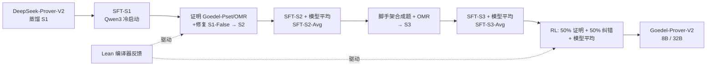

# Goedel-Prover-V2: Scaling Formal Theorem Proving with Scaffolded Data Synthesis and Self-Correction

**会议**: ICLR 2026  
**OpenReview**: [https://openreview.net/forum?id=j4C0nALrgK](https://openreview.net/forum?id=j4C0nALrgK)  
**代码**: [https://github.com/Goedel-LM/Goedel-Prover-V2](https://github.com/Goedel-LM/Goedel-Prover-V2)  
**领域**: 强化学习 / 形式化定理证明 / LLM 推理  
**关键词**: 自动定理证明, Lean, 专家迭代, 强化学习 (GRPO/DAPO), 自我纠错, 数据合成, 模型平均  

## 一句话总结
通过"脚手架式数据合成 + 编译器反馈驱动的自我纠错 + 模型平均"三件套，把开源 Lean 定理证明器做到新 SOTA：8B 模型超过 671B 的 DeepSeek-Prover-V2，32B 模型在 MiniF2F 上 pass@32 达 90.4%，参数量小 20 倍而算力预算大幅更低。

## 研究背景与动机
- **领域现状**：自动定理证明（ATP）要求 LLM 生成能通过 Lean 编译器验证的完整形式化证明。闭源前沿模型（AlphaProof、Seed-Prover）已达 IMO 奖牌水平，但需要极端算力且训练细节不透明；开源阵营（DeepSeek-Prover-V2、Kimina-Prover）借助 long-CoT 推理取得不错结果。
- **现有痛点**：(1) 开源模型为了刷高准确率严重依赖巨大采样预算（pass@8192）或 test-time RL，推理成本高；(2) DeepSeek-Prover-V2 这类模型被反复训练后已**丢失自我纠错能力**，而 Qwen3 这类通用模型又不会写形式化证明；(3) 训练数据质量差——Goedel-Pset-v1 中超 80% 未解问题其实是**形式化错误**，而非真的难。
- **核心矛盾**：训练后期模型会"过拟合"导致**输出多样性下降**——pass@1 上升但 pass@N（N 大）反而下降，单纯做专家迭代/RL 难以兼顾准确率与多样性。
- **本文目标**：用计算高效、可复现的开源模型逼近形式化证明的前沿，同时显著降低推理时的采样预算。
- **核心 idea**：**[训练-数据-推理三层协同]** 框架层引入编译器反馈做自我纠错、数据层用脚手架合成"难度恰当"的题目、训练层用模型平均找回多样性。

## 方法详解

### 整体框架
整体是一条围绕 Qwen3 冷启动的**专家迭代 + RL** 流水线：先用 DeepSeek-Prover-V2 蒸馏数据冷启 Qwen3 获得初代证明器，再循环"大规模推理收集正确证明 → SFT → 模型平均 → 收集脚手架合成数据 → 再 SFT → 最后 RL"。三个关键创新分别嵌在数据合成、框架（自我纠错）和训练（模型平均）三处。

### 关键设计

**1. 脚手架式数据合成（Scaffolded Data Synthesis）：用难度恰当的题喂出更好的学习信号。** 当训练在人工题目上改进停滞时，证明器为自己合成难度递增的新题。一条路是**基于规则**：当证明失败时，用 Lean 的 `extract_goal` 战术把不完整证明里的未解子目标抽出来——即使整体证明错了，子目标往往是合法的简单引理；由于抽出的命题不保证可证，作者同时把它的**否定式**也加入训练，让模型学会识别真/假命题。另一条路是**基于 LLM**：对已解题让 Qwen3-32B 生成更难的变体、对未解题生成更简单的子问题，再用 Goedel-Formalizer-V2 形式化，并用 LLM 过滤器评估正确性与难度（丢弃平凡题、把错误题的否定式入库）。配套的 Goedel-Formalizer-V2 引入推理能力，在 300 道 Omni-MATH 题上形式化通过 228/300，远超 Kimina-Autoformalizer 的 161。

**2. 编译器反馈驱动的自我纠错（Verifier-guided Self-Correction）：把 Lean 报错喂回模型迭代修证明。** 传统 whole-proof 生成是"一次性端到端"，而人类写 Lean 也要反复改。本文在生成循环里显式引入验证器反馈：首轮证明失败后，解析 Lean 编译器的错误信息，作为纠错指引拼回模型输入，模型据此生成证明修订，形成迭代纠错。关键在于把这套机制融进 **long-CoT** 推理。消融显示：去掉具体编译器错误信息（w/o Error Messages）会显著掉点，证明报错文本是有效修订的核心；而去掉前几轮的 CoT 几乎不掉点，意味着可以省掉历史 CoT 来降低 per-task 开销。

**3. RL 难度课程 + 模型平均（Model Averaging）：兼顾准确率与采样多样性。** RL 用混合 GRPO 方案：按 Dr.GRPO 去掉 group normalization 以消除长度偏置，吸收 DAPO 的 clip-higher、overlong penalty 与动态采样，并去掉 KL 正则项以鼓励探索；多任务设置下 50% 输入做完整证明、50% 做自我纠错。一个关键观察是**题目难度严重影响 RL**，于是动态采样只保留通过率落在 $(0, 0.75]$ 的题目参与优化。针对 SFT/RL 后期多样性下降（pass@1↑ 但 pass@N↓），在每个阶段做模型平均：用基模型参数 $\theta_0$ 与微调参数 $\theta$ 组合为 $(1-\alpha)\theta_0 + \alpha\theta$，主实验取 $\alpha=0.8$，简单却能显著恢复 pass@N 的特征多样性。

## 实验关键数据

### 主实验表格（MiniF2F test，pass@N 准确率）

| 模型 | 参数量 | pass@32 | pass@8192 |
|---|---|---|---|
| DeepSeek-Prover-V2 | 671B | 82.4% | 88.9% |
| Kimina-Prover | 72B | 84.0% (pass@32) | 87.7% (pass@1024) |
| **Goedel-Prover-V2-8B** | 8B | **84.6%** | 90.2% |
| Goedel-Prover-V2-8B w/ 自我纠错 | 8B | 86.7% | — |
| **Goedel-Prover-V2-32B** | 32B | **88.1%** | 92.2% |
| **Goedel-Prover-V2-32B w/ 自我纠错** | 32B | **90.4%** | 92.6% |

8B 模型即以 80× 更小的体量在 MiniF2F 上超过 671B DeepSeek-Prover-V2。

### 消融实验表格

| 设置 | 效果 |
|---|---|
| 完整自我纠错 | MiniF2F pass@32 +约 2 个百分点；PutnamBench pass@32 多解 14 题 |
| 去掉编译器错误信息 (w/o Error Messages) | 显著掉点（报错文本是关键） |
| 去掉历史 CoT (w/o Previous CoTs) | 几乎不掉点（可省以提效） |
| DeepSeek-Prover-V2-7B（未训练纠错） | 自我纠错仅 75.8%→76.2%（几乎无效） |
| 扩展上下文至 128k + 至多 5 轮修订 | pass@32 达 92.7%，反超无纠错的 pass@8192（92.2%） |

### 关键发现
- **PutnamBench**：32B 自我纠错模式 pass@184 解 **86 题**，登顶开源榜，比 DeepSeek-Prover-V2 的 47 题（pass@1024）多 39 题，模型小约 20×、算力大幅更低。
- **样本高效**：仅需 N=32/64 的小预算即达高 pass@N，说明强推理策略在训练阶段已内化，无需依赖巨大采样或 test-time RL。
- **自我纠错只对会读编译器反馈的模型有效**：未经纠错训练的模型几乎不受益。
- 总算力：数据生成约 12k H100 GPU 小时；32B 的 SFT/RL 分别 9.2k/3.9k，8B 为 2.3k/1.3k GPU 小时。

## 亮点与洞察
- **"难度恰当"才是数据合成的胜负手**：脚手架不是堆量，而是用 `extract_goal` 和 LLM 变体生成模型当前刚好能学的题，外加把错误命题的否定式纳入，让模型同时学会证真与证伪。
- **自我纠错的价值被"是否训练过读反馈"门控**：把 Lean 报错喂回去本身不够，必须在训练中让模型学会解读编译器反馈，否则增益微乎其微——这解释了为何同样喂反馈，本文模型涨 2 点而 DeepSeek-Prover-V2-7B 几乎不动。
- **模型平均是对抗 RL/SFT 多样性坍塌的廉价解药**：只用 $(1-\alpha)\theta_0+\alpha\theta$ 一行式插值，就把"pass@1 涨但 pass@N 跌"扳回来，对依赖大 N 采样的证明任务尤其关键。
- **小模型 + 自我纠错 ≈ 大模型 + 海量采样**：128k 上下文 + 5 轮修订的 pass@32（92.7%）反超无纠错 pass@8192，把"采样换算力"变成"迭代修订换算力"，更高效。

## 局限与展望
- LLM 过滤器在数据合成中可能误判，丢弃部分有效题目，是吞吐与质量的权衡。
- 自我纠错主实验仅 2 轮、40k token；扩到 128k/5 轮虽更强但推理成本上升，长上下文修订的收益-成本曲线仍待系统刻画。
- 与闭源 Seed-Prover（PutnamBench 解 331 题）相比仍有明显差距，开源前沿与闭源前沿之间的鸿沟尚未填平。
- 方法重度依赖 Lean 编译器反馈与既有数据集（OMR、Goedel-Pset），向其他证明助手（Coq、Isabelle）或更高难度（IMO 级 MathOlympiadBench）的迁移性有待验证。

## 相关工作与启发
- **开源证明器**：DeepSeek-Prover-V2、Kimina-Prover 用 long-CoT 推理刷高 benchmark；本文在其基础上补上自我纠错与数据合成，并显著降低采样预算。
- **编译器反馈纠错**：First et al. (2023) 在定理证明、Olausson/Chen et al. 在代码生成中已用验证器反馈纠错；本文首次把它系统融入 long-CoT 证明器并配套训练。
- **模型平均**：Model Soups (Wortsman et al., 2022) 等表明权重插值能提升泛化/多样性，本文将其用于缓解证明器训练后期的多样性坍塌。
- **RL 算法**：综合 Dr.GRPO（去 group norm 消长度偏置）、DAPO（clip-higher / 动态采样 / overlong penalty），并按通过率 $(0,0.75]$ 做难度课程，对其他长推理 RL 任务有借鉴意义。

## 评分
- **新颖性**: ⭐⭐⭐⭐ —— 单点创新（脚手架合成 / 编译器纠错 / 模型平均）多为已有思路的迁移，但三者在 ATP 上的系统组合与"难度门控"细节扎实且有效。
- **实验充分度**: ⭐⭐⭐⭐⭐ —— 覆盖 MiniF2F / PutnamBench / MathOlympiadBench / FIMO / ProverBench 多基准，含 scaling、自我纠错、模型平均多组消融与去污染说明。
- **写作质量**: ⭐⭐⭐⭐ —— 流水线（Figure 3）与每步数据/模型流转交代清晰，框架↔数据↔训练三层逻辑连贯。
- **价值**: ⭐⭐⭐⭐⭐ —— 开源新 SOTA，8B 超 671B、32B 以 20× 更小体量登顶 PutnamBench，模型/代码/数据全开源，对社区推进形式化证明价值很高。

<!-- RELATED:START -->

## 相关论文

- [\[ICLR 2026\] GAR: Generative Adversarial Reinforcement Learning for Formal Theorem Proving](gar_generative_adversarial_reinforcement_learning_for_formal_theorem_proving.md)
- [\[ICLR 2026\] Webscale-RL: Automated Data Pipeline for Scaling RL Data to Pretraining Levels](webscale-rl_automated_data_pipeline_for_scaling_rl_data_to_pretraining_levels.md)
- [\[ICLR 2026\] R-Zero: Self-Evolving Reasoning LLM from Zero Data](r-zero_self-evolving_reasoning_llm_from_zero_data.md)
- [\[ICLR 2026\] Beyond Pass@1: Self-Play with Variational Problem Synthesis Sustains RLVR](beyond_pass_1_self-play_with_variational_problem_synthesis_sustains_rlvr.md)
- [\[ICML 2026\] ORLoopBench: Solver-in-the-Loop Benchmarks for Self-Correction and Behavioral Rationality in Operations Research](../../ICML2026/reinforcement_learning/orloopbench_solver-in-the-loop_benchmarks_for_self-correction_and_behavioral_rat.md)

<!-- RELATED:END -->
