# GoldenStart: Q-Guided Priors and Entropy Control for Distilling Flow Policies

**会议**: ICLR 2026  
**OpenReview**: [https://openreview.net/forum?id=UqF3d6yM0S](https://openreview.net/forum?id=UqF3d6yM0S)  
**代码**: [https://github.com/ZhHe11/GSFlow-RL](https://github.com/ZhHe11/GSFlow-RL)  
**领域**: reinforcement learning  
**关键词**: flow-matching policy, policy distillation, offline-to-online RL, Q-guided prior, entropy regularization, conditional VAE  

## 一句话总结
GoldenStart（GS-flow）给单步蒸馏的流匹配策略做两件事：用一个 Q 引导的条件 VAE 把生成的"起跑噪声"挪到高价值区域（"黄金起点"），再用熵正则把确定性 actor 改成可控随机分布，从而在保持单步推理速度的同时同时解决"精准利用"和"在线探索"两大难题。

## 研究背景与动机
**领域现状**：流匹配 / 扩散类生成式策略能刻画复杂多模态动作分布，在连续控制中潜力很大，但迭代去噪带来高推理延迟。近期 FQL 等工作用**单步蒸馏**（student 网络一次前向模拟整段去噪）解决了延迟问题，成为离线 RL 上很强的 SOTA。

**现有痛点**：单步蒸馏方法把生成过程的两块潜力浪费了。其一，生成总是从**固定、无信息的标准高斯噪声**起步——而图像生成领域已表明初始噪声本身是可引导生成的关键变量；其二，给定噪声后蒸馏 student 学的是**确定性的"点到点"映射**（一个噪声向量 → 一个确定动作），天然缺乏随机性，导致在线探索无从谈起。

**核心矛盾**：单步蒸馏要的是"快 + 准"（确定性利用），而在线 RL 微调要的是"会探索"（受控随机）——两者在确定性 actor 里互相打架。同时，无信息高斯起点让策略要绕远路才能到达高价值动作，在多模态、易高估 Q 的环境里尤其吃亏。

**本文目标**：在不牺牲单步推理速度的前提下，让蒸馏策略既能精准命中高价值动作模式，又能在 offline-to-online 阶段做有原则的探索。

**核心 idea**：**(1) Q 引导生成先验**——不从无信息噪声起步，而用轻量条件 VAE 学一个"优势噪声"分布，把起跑点重定位到高 Q 区域；**(2) 熵正则蒸馏**——把"点到点"映射升级为"点到分布"，student 输出带均值+方差的高斯，并用熵正则在线动态调节随机性。

## 方法详解

### 整体框架
GS-flow 在标准 actor-critic 框架里跑**两阶段训练**：阶段一 **Q-Guided Prior Learning** 先解决"起点不好"的问题——用 Advantage Noise Selection 模块挑出能产出高价值动作的"优势噪声"，再训一个条件 VAE 去拟合这些优势噪声的状态条件分布；阶段二 **Entropy-Regularized Distillation** 用学到的先验喂给 teacher 和 student，把 student 训成带熵正则的随机策略。推理时只用 VAE decoder + student actor 两个轻量模块：decoder 给出优势先验 → student 产出动作分布，在线探索时采样、评估时取均值。

```mermaid
flowchart TD
    S[状态 s] --> ANS[Advantage Noise Selection<br/>teacher 生成 N 个候选动作<br/>用 Critic Q 选最高分的噪声 x_adv]
    ANS --> CVAE[条件 VAE<br/>学 p&#40;x_adv 给定 s&#41;]
    CVAE -->|采样优势先验 x̂_adv| T[Teacher 策略 π_φ<br/>生成目标动作 a_teacher]
    CVAE -->|x̂_adv| ST[Student 策略 π_φ<br/>双头输出 μ, σ]
    T -->|L2 蒸馏| ST
    Q[Critic Q] -->|价值最大化 L_Q| ST
    ST -->|熵正则 H| ST
    ST --> OUT[在线:采样探索 / 评估:取均值 μ]
```

### 关键设计
**1. Advantage Noise Selection：把"哪个起点好"变成一次在线打分**。流匹配 teacher $\pi_\phi$ 是确定映射，给定噪声就给定动作，所以"找好起点"等价于"找好噪声"。对每个状态 $s$，先用 teacher 配 $N_{\text{cand}}$ 个不同高斯噪声生成一批候选动作 $A_{\text{cand}}=\{\pi_\phi(s,x_j)\mid x_j\sim\mathcal N(0,I)\}$，再用 critic 给它们打分，取产出最高 Q 动作的那个噪声作为该状态的优势噪声：$x_{\text{adv}}(s)=\arg\max_{x_j} Q(s,\pi_\phi(s,x_j))$。这一步在每个训练步用最新 teacher 现算，得到训练对 $B_{\text{adv}}=\{(s,x_{\text{adv}}(s))\}$。候选数越多挑得越准（$N_{\text{cand}}=15$ 收敛最快），但作者权衡计算开销取 $N_{\text{cand}}=10$；即便只用 5 个候选也明显超过 FQL（相当于 $N_{\text{cand}}=0$ 的退化情形）。

**2. State Conditional VAE：把离散选出的优势噪声拟合成可采样的连续先验**。逐状态挑噪声只能给出离散样本，要在推理时随机生成"黄金起点"得有个生成模型。作者用条件 VAE（编码器 $E_{\xi_1}$、解码器 $D_{\xi_2}$）拟合状态条件分布 $p_{\xi_2}(x_{\text{adv}}\mid s)$，损失为重构 + KL 正则 $L_{\text{VAE}}=L_{\text{recon}}+\lambda_{\text{KL}}L_{\text{KL}}$，其中 $L_{\text{KL}}=\mathbb E[D_{\text{KL}}(q_{\xi_1}(z\mid x_{\text{adv}},s)\,\|\,\mathcal N(0,I))]$ 把隐空间压向标准正态。选 VAE 而非简单高斯是因为优势噪声分布天然多模态——MultiCrescent 可视化显示，离线阶段先验落在数据集内的高价值模式，在线微调后密度自适应迁移到新发现的全局最优模式上。

**3. Entropy-Regularized Distillation：把"点到点"蒸馏改成"点到分布"**。student $\pi_\phi(a\mid s,\hat x_{\text{adv}})$ 用双头结构同时输出均值 $\mu_\phi$ 和标准差 $\sigma_\phi$，探索动作走重参数化 $a_\phi=\mu_\phi+\sigma_\phi\odot\epsilon,\ \epsilon\sim\mathcal N(0,I)$。actor 总损失三项平衡：$L_{\text{Actor}}=\mathbb E[\alpha_1 L_{\text{L2-Distill}}+L_Q-\alpha_2 H(\pi_\phi)]$。其中蒸馏项 $L_{\text{L2-Distill}}=\mathbb E[\|\mu_\phi(s,\hat x_{\text{adv}})-\pi_\phi(s,\hat x_{\text{adv}})\|^2]$ **只锚定 student 的确定性均值到 teacher**、且 teacher/student 共享同一优势噪声 $\hat x_{\text{adv}}$，两个细节都为了降方差、稳训练；价值项 $L_Q=-Q(s,a_\phi)$ 仿 SAC 用采样动作；熵项温度 $\alpha_2$ 通过匹配目标熵 $H_{\text{target}}$ 自动学习（$L_{\alpha_2}=\mathbb E[\alpha_2(H(\pi_\phi)-H_{\text{target}})]$），熵低于目标就多探索、足够就多利用。这让 student 在线阶段能动态调随机性，把生成式策略的高质量和 Gaussian 策略的可控探索合到一起。

## 实验关键数据
在 OGBench、D4RL AntMaze、Visual Environments 上评测，覆盖 Gaussian（BC/IQL/ReBRAC）、Diffusion（IDQL/SRPO/CAC）、Flow（FAWAC/FBRAC/IFQL）策略及 SOTA 蒸馏方法 FQL；offline-to-online 另比 Cal-QL、RLPD。

### 主实验（离线，节选平均分，5 seeds）

| Benchmark | 最强 baseline | Ours (GS-flow) |
|---|---|---|
| OGBench 平均 | FQL 38.5 | **47.1** |
| D4RL AntMaze 平均 | FQL 83.5 | **86.1** |
| Visual Environments 平均 | FQL 65.4 | **70.9** |
| Cube Double Play（多模态） | FQL 36 | **51.3** |
| Puzzle-3x3 Play | FQL 16 | **25.2** |

多模态 / 多局部最优任务上优势最明显；单模态的 Cube Single Play 上与 FQL 持平。

### Offline-to-Online（节选平均分，"离线→在线"）

| Benchmark | FQL | RLPD | Ours |
|---|---|---|---|
| OGBench 平均 | 34.0 → 67.6 | 0.0 → 41.6 | **49.4 → 88.6** |
| D4RL AntMaze 平均 | 74.8 → 95.2 | 0.0 → 95.7 | **86.2 → 96.8** |
| Adroit Cloned 平均 | 13.2 → 110.0 | 0.8 → 88.0 | **20.5 → 111.5** |
| Puzzle-4x4 Play | 8 → 38 | 0 → 100 | **17 → 100** |

Puzzle-4x4 是公认难探索任务，GS-flow 从 17% 涨到 100%，追平专门的在线方法 RLPD，而在 AntSoccer、Cube Double 等任务上还反超 RLPD。

### 消融实验

| 设置 | 现象 |
|---|---|
| 候选数 $N_{\text{cand}}$=5/10/15 | 越多越好；$N_{\text{cand}}=0$ 退化为 FQL；5 已超 FQL，主实验取 10 |
| Ours w/o CE（去掉可控熵） | 在线效率显著下降，Puzzle-4x4 在线表现退回 FQL 水平 |
| 推理耗时 | Ours 0.51ms ≈ FQL 0.42ms ≪ IFQL 0.97ms（多步） |
| 训练耗时 | Ours 3.10ms > FQL 1.90ms（Advantage Noise Selection 的额外推理） |

### 关键发现
- Q 引导先验的收益集中在**多模态、易 Q 高估**的任务，单模态任务上提升有限；
- 可控熵是在线探索的核心组件，去掉后基本退回确定性蒸馏的探索能力；
- 额外开销几乎全压在一次性训练阶段，推理仍保持单步蒸馏的速度。

## 亮点与洞察
- **"换起点"而非"换网络"**：把图像生成里"初始噪声可引导"的洞察迁移到 RL 蒸馏，用 critic 当裁判选噪声、VAE 拟合成可采样先验，几乎零推理代价地给策略一个"黄金起点"。
- **"点到点 → 点到分布"**：仅靠双头 + 熵正则就把确定性蒸馏 actor 改造成会探索的随机策略，简单却补上了蒸馏策略最大的短板。
- **两块创新各管一头**：先验管离线"精准利用"，熵控管在线"有效探索"，消融清晰地把两者收益拆开，逻辑自洽。

## 局限与展望
- **训练开销上升**：Advantage Noise Selection 每步要 teacher 多生成 $N_{\text{cand}}$ 个候选并过 critic，训练耗时约为 FQL 的 1.6 倍，大动作空间 / 大候选数下成本会更高。
- **依赖 critic 质量**：优势噪声靠 Q 值挑选，若 critic 在未见区域高估，挑出的"黄金起点"可能误导先验，论文用 MultiCrescent 缓解但未给出对 critic 误差的鲁棒性分析。
- **高斯随机假设**：student 输出仍是对角高斯，虽用 VAE 多模态先验补偿，但单步输出分布本身的多模态表达力仍受限。
- **评测范围**：集中在连续控制（OGBench/D4RL/Visual），未在 VLA 等真实机器人或更高维任务上验证。

## 相关工作与启发
- **生成式策略加速**：相对 FQL 等只做单步蒸馏、忽略噪声先验的工作，本文把先验作为可优化变量；与同样学先验的 DSRL（学高斯先验做在线适配）相比，GS-flow 用更灵活的 VAE 先验且推理开销可忽略。
- **生成式策略的在线探索**：相比在去噪过程注入随机性、或用 GMM 估熵（计算贵）的路线，以及训练额外 Gaussian edit policy 的 EXPO，本文把熵控制直接嵌进蒸馏损失，更轻量。
- **启发**：当生成式模型被蒸馏成单步策略时，"起点设计"和"输出分布形态"是两个常被忽视、却低成本高回报的可调旋钮——这一视角可推广到其他单步生成式控制 / VLA 加速场景。

## 评分
- **新颖性**: ⭐⭐⭐⭐ — 把"初始噪声可引导"从图像生成迁到 RL 蒸馏、并配上熵正则把点到点改成点到分布，两个想法都不算颠覆但组合巧妙、动机清晰。
- **实验充分度**: ⭐⭐⭐⭐ — 覆盖 OGBench/D4RL/Visual 三大 benchmark + offline-to-online，baseline 横跨 Gaussian/Diffusion/Flow，消融拆清两块创新与计算开销；缺真实机器人 / 高维任务验证。
- **写作质量**: ⭐⭐⭐⭐ — 动机与方法叙述顺畅，MultiCrescent 玩具环境可视化把"先验迁移"讲得很直观，公式与算法流程完整。
- **价值**: ⭐⭐⭐⭐ — 在保持单步速度下同时改善利用与探索，对生成式策略落地（实时控制 / VLA 加速）有实用参考价值，且代码开源。

<!-- RELATED:START -->

## 相关论文

- [\[ICLR 2026\] Regret-Guided Search Control for Efficient Learning in AlphaZero](regret-guided_search_control_for_efficient_learning_in_alphazero.md)
- [\[ICLR 2026\] Multimodal LLM-assisted Evolutionary Search for Programmatic Control Policies](multimodal_llm-assisted_evolutionary_search_for_programmatic_control_policies.md)
- [\[ICLR 2026\] Entropy Regularizing Activation: Boosting Continuous Control, Large Language Models, and Image Classification with Activation as Entropy Constraints](entropy_regularizing_activation_boosting_continuous_control_large_language_model.md)
- [\[ICML 2026\] Noise-Guided Transport: Imitation Learning from Random Priors](../../ICML2026/reinforcement_learning/noise-guided_transport_for_imitation_learning.md)
- [\[ICLR 2026\] Safe Exploration via Policy Priors](safe_exploration_via_policy_priors.md)

<!-- RELATED:END -->
