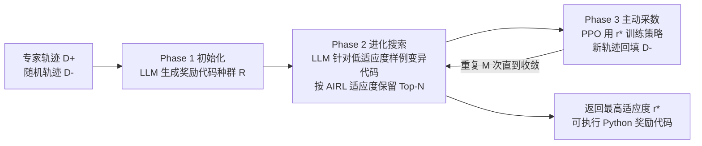

# GRACE: A Language Model Framework for Explainable Inverse Reinforcement Learning

**会议**: ICLR 2026  
**OpenReview**: [https://openreview.net/forum?id=uW9FoHBuoQ](https://openreview.net/forum?id=uW9FoHBuoQ)  
**代码**: 待确认  
**领域**: 强化学习 / 逆强化学习  
**关键词**: 逆强化学习, 奖励即代码, 大语言模型, 进化搜索, 可解释性  

## 一句话总结
GRACE 把逆强化学习的奖励模型从黑箱神经网络换成"可执行 Python 代码"，用代码 LLM 在进化搜索里仅凭专家轨迹（无任务描述、无真值奖励）反推出一个可读、可验证的奖励函数。

## 研究背景与动机
- **领域现状**：现代 RL 智能体的性能高度依赖奖励函数质量，但真实场景里环境易得、奖励缺失。逆强化学习（IRL）试图从专家演示中反推奖励，深度 IRL（如 AIRL、GAIL）用神经网络表示奖励并以对抗训练做分布匹配。
- **现有痛点**：神经网络奖励是**不透明黑箱**，难以解释、验证和调试；同时 IRL 通常需要大量数据，恢复出的奖励还可能不准。另一条"奖励即代码"路线（EUREKA、Reward-As-Code）虽然可读，但 **EUREKA 假设能拿到真值奖励信号来评估进化，Reward-As-Code 依赖显式任务描述或目标状态及手写流水线**。
- **核心矛盾**：可解释性（代码表示）与"纯 IRL 设定"（只有演示、没有任务描述、没有真值奖励）此前从未被同时满足——能写出可读奖励代码的工作都偷偷用了额外监督信号。
- **本文目标**：在最严格的 IRL 设定下——只给专家演示、不给任务描述、不给环境源码、不给真值奖励——高效地推断出一个**可执行、可解释、可验证**的代码奖励函数。
- **核心 idea**：**【奖励即代码 + 进化搜索】** 把奖励写成 `def reward(state)->float` 的 Python 程序，由于代码不可微，放弃梯度法，改用 LLM 驱动的进化搜索；LLM 反复"自省"专家与负样本状态，针对性 debug 低适应度样例来变异代码，逐步逼近能区分专家/非专家的奖励。

## 方法详解

### 整体框架
GRACE（Generating Rewards As CodE）是一个三阶段闭环：LLM 先分析专家轨迹 $D^+$ 与随机轨迹 $D^-$ 生成初始奖励代码种群（Phase 1）；进化搜索用 LLM 针对低适应度样例变异代码、保留高适应度个体（Phase 2）；用当前最优奖励训练 PPO 策略采集新轨迹、回填进负样本集以暴露边界情况（Phase 3），再回到 Phase 1/2 迭代。

### 关键设计
**1. 奖励即代码的种群初始化：把 IRL 的搜索空间从权重换成程序。** Phase 1 中，LLM 被喂入专家轨迹 $D^+$ 的随机子集（以及可选的环境信息如源码或工具签名），直接生成一组初始奖励函数 $R_{init}$，每个都是形如 `def reward(state) -> float` 的 Python 代码，目标是给专家状态 $S_e$ 高值、给负状态 $S_n$ 低值。这一组代码构成后续进化的"种群"。可选的数据清洗步骤让 LLM 自己判定哪些专家状态真正"解决了任务"作为正样本 $S_e$，其余的 $S_n = \{D^+ \setminus S_e\} \cup D^-$ 全当负样本——这一步在专家演示带噪声/次优时尤为重要。

**2. AIRL 适应度 + LLM 针对性变异：用可迁移损失给程序打分，再让 LLM 当 debugger。** 适应度沿用 AIRL 损失以保证奖励可迁移：

$$f(r) = \mathbb{E}_{s\sim S_e}[\log D_r(s)] + \mathbb{E}_{s\sim S_n}[\log(1-D_r(s))]$$

其中判别器 $D_r(s) = \frac{\exp(r(s))}{\exp(r(s)) + \pi(a|s)}$ 由奖励函数参数化。变异算子 $m(r) = \text{LLM}(\text{source}(r), \text{context}, \text{prompt})$ 不是盲目随机扰动，而是把**父代奖励源码、低适应度的"错样例" $s_w$、当前函数对这些样例的输出值 $r(s_w)$**（以及可选的环境信息和 LLM 自定义的 `debug(s, D+, D-)` 中间打印）一并喂回去，让 LLM 像调试程序一样定点修复失败 case。这把"奖励学习"变成了"代码 debug"，可解释性与可优化性兼得。

**3. 适应度加权的进化循环：softmax 选亲代 + Top-N 截断。** 每轮迭代按适应度的 softmax 分布 $\frac{\exp(f(r))}{\sum_{r'}\exp(f(r'))}$ 采样亲代奖励，对其施加变异生成新一批候选，再从"现有种群 + 新变异"的并集里只保留适应度最高的 $N$ 个。$K$ 轮后返回单个最高适应度的 $r^* = \arg\max_r f(r)$。这套 EVOSEARCH 是无梯度优化，恰好补上"代码不可微"的缺口。

**4. RL 主动采数闭环：用训练出的策略暴露奖励盲区。** 仅靠静态演示推出的 $r^*$ 可能在某些边界状态判错。Phase 3 用 PPO 在预设交互预算 $N$ 内（而非训到收敛）训练策略 $\pi_{r^*}$，把它采到的新轨迹加进 $D^-$——这些往往包含奖励此前没考虑到的边界情况，回填后再进 Phase 2 精修。当离线适应度好但在线 RL 表现差时，还会做**额外奖励整形**：把完整专家轨迹连同每个状态的当前奖励值喂给 LLM，要求重塑奖励使其沿专家轨迹单调递增，缓解奖励稀疏/形状差的问题。

## 实验关键数据
在 BabyAI（程序化推理）、MuJoCo（连续控制）、AndroidWorld（真实设备 UI 控制）三个领域评测，**全程不给 GRACE 任何环境描述或源码**以保证公平。

### 主实验表格（MuJoCo 平均回报，5 seeds）

| 任务 | PPO(真值) | GRACE w/ GPT-4o | GRACE w/ Qwen3-Coder-30B | GAIL 200traj | AIRL 200traj |
|---|---|---|---|---|---|
| Hopper | 2212±54 | 2143±80 | 2106±76 | 2056±92 | 2028±82 |
| Walker | 2675±292 | 2072±576 | 2229±600 | 1982±101 | 2108±293 |
| Ant | 6239±237 | 5707±210 | 6085±804 | 5521±674 | 4308±306 |
| Humanoid | 6455±302 | 5809±106 | 5921±301 | 6521±337 | 6512±291 |

GRACE 用代码奖励训出的策略普遍逼近真值 PPO oracle，并匹配或超过 GAIL/AIRL（后者用 200 条轨迹）。

### 消融/对比实验表格（BabyAI 部分关卡成功率，GRACE 仅 8 条专家轨迹 vs GAIL 2000 条）

| 关卡 | PPO | GAIL(2000) | GRACE(8) |
|---|---|---|---|
| GoToRedBall | 1.00 | 0.35 | 1.00 |
| PickupLoc | 0.21 | 0.00 | 0.26 |
| OpenTwoDoors | 1.00 | 0.37 | 1.00 |
| OpenMatchingDoor (new) | 0.79 | 0.20 | 0.35 |
| Multi-task | 0.95 | 0.31 | 0.92 |

### 关键发现
- **样本极省**：BabyAI 单条演示即有非平凡表现，仅 8 条专家轨迹就能把奖励准确率刷到 1.0；甚至 1 条负轨迹（配足够专家轨迹）也能达 0.95 准确率。
- **收敛快**：多任务设定下 GRACE 在不到 100 代进化、且不加在线数据（M=1）就稳定收敛到高适应度奖励。
- **GAIL 在低数据下崩溃**：多处 GAIL 完全失败（成功率掉到 0），而 GRACE 用百分之一的数据匹配真值 PPO。
- **多任务涌现模块化奖励 API**：进化搜索在多任务里自然长出可复用的奖励函数库，支持跨任务高效泛化。

## 亮点与洞察
- **把 IRL 重新表述为"程序合成"**：奖励远比最大化它的策略简单（Ng & Russell 的经典观察），所以用代码表示奖励、用 LLM 做程序合成是天然契合的，且符号化表示带来隐式正则。
- **"代码 debug"式变异**是点睛之笔：把错样例、奖励值、自定义 debug 输出喂回 LLM，让变异从随机搜索变成定向修复，这是它样本效率碾压 GAIL 的关键。
- **最严格 IRL 设定下的可解释性**：相比 EUREKA（要真值奖励）、Reward-As-Code（要任务描述），GRACE 仅凭演示就产出可读、可验证的奖励，工程落地价值高。

## 局限与展望
- **依赖代码 LLM 的能力上界**：复杂连续控制（如 Walker 方差大）下奖励质量受 LLM 程序合成能力制约。
- **状态需可被代码解析**：BabyAI 用 (h,w,3) 数组、Android 用 XML 视图层级——对纯像素/高维非结构化状态，如何让代码奖励直接消费仍是开放问题。
- **LLM 调用成本**：每个任务平均约 2000 次 LLM 调用，进化搜索的吞吐与成本是规模化瓶颈。
- **奖励整形仍需人工触发**：离线好、在线差时才启动额外整形，自动判定何时整形的机制可进一步系统化。

## 相关工作与启发
- **奖励即代码**：EUREKA（用真值奖励进化）、Reward-As-Code（依赖任务描述）——GRACE 去掉了这两类额外监督。
- **深度 IRL**：GAIL（对抗分布匹配）、AIRL（可迁移解耦奖励）——GRACE 借用 AIRL 损失当适应度，但表示与优化方式（代码 + 进化）根本不同。
- **进化 + LLM 程序合成**：FunSearch、AlphaEvolve 等用 LLM 在进化框架里搜程序，GRACE 把这一范式落到 IRL 奖励恢复上。
- **启发**：当目标函数不可微但可执行时，"LLM 定向 debug + 进化截断"是替代梯度优化的一条实用路径，可推广到其他需要可解释符号目标的学习问题。

## 评分
- **新颖性**: ⭐⭐⭐⭐ 首次在"无任务描述、无真值奖励"的纯 IRL 设定下产出可执行代码奖励，"代码 debug 式变异"切入角度新颖。
- **实验充分度**: ⭐⭐⭐⭐ 覆盖符号/连续/真实 UI 三类域，含样本效率、负样本数、收敛代数等多维消融，与 PPO/GAIL/AIRL 充分对比。
- **写作质量**: ⭐⭐⭐⭐ 三阶段框架 + Algorithm 1 表述清晰，图表完整。
- **价值**: ⭐⭐⭐⭐ 可解释、可验证、样本极省的奖励恢复对真实场景 RL 落地有实际意义。

<!-- RELATED:START -->

## 相关论文

- [\[ICLR 2026\] Revolutionizing Reinforcement Learning Framework for Diffusion Large Language Models](revolutionizing_reinforcement_learning_framework_for_diffusion_large_language_mo.md)
- [\[AAAI 2026\] Distilling Deep Reinforcement Learning into Interpretable Fuzzy Rules: An Explainable AI Framework](../../AAAI2026/reinforcement_learning/distilling_deep_reinforcement_learning_into_interpretable_fuzzy_rules_an_explain.md)
- [\[ICLR 2026\] GRACE: Generative Representation Learning via Contrastive Policy Optimization](grace_generative_representation_learning_via_contrastive_policy_optimization.md)
- [\[ICLR 2026\] Toward Efficient Exploration by Large Language Model Agents](toward_efficient_exploration_by_large_language_model_agents.md)
- [\[ICML 2026\] Distributional Inverse Reinforcement Learning](../../ICML2026/reinforcement_learning/distributional_inverse_reinforcement_learning.md)

<!-- RELATED:END -->
