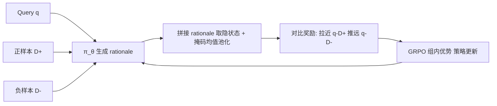

# GRACE: Generative Representation Learning via Contrastive Policy Optimization

**会议**: ICLR 2026  
**OpenReview**: [https://openreview.net/forum?id=hs9lwjH1bJ](https://openreview.net/forum?id=hs9lwjH1bJ)  
**代码**: [https://github.com/GasolSun36/GRACE](https://github.com/GasolSun36/GRACE)  
**领域**: 强化学习 / 表示学习 / 文本嵌入  
**关键词**: 文本嵌入, 对比学习, 策略优化, GRPO, 可解释表示, LLM 编码器  

## 一句话总结
GRACE 把对比学习信号从"要最小化的损失"重新理解成"引导生成策略的奖励"，让 LLM 先对输入文本写出可读的"理解理由"再对其隐状态做均值池化得到嵌入，并用 GRPO 类策略梯度去最大化 query–正样本相似、最小化 query–负样本相似，从而在 MTEB 上既显著提升嵌入质量又保住了模型的生成与推理能力。

## 研究背景与动机
- **领域现状**：把 LLM 当通用文本编码器、用对比损失（InfoNCE）微调出嵌入，是当前检索、聚类、推荐等任务的主流做法（LLM2Vec、Echo、E5 等）。
- **现有痛点**：这一范式把 LLM 当成黑箱函数 $f_\theta: X \to \mathbb{R}^d$，强行让一个"会生成、会推理"的模型只吐静态向量，**生成与推理能力被压制甚至破坏**；而且相似性判断发生在不透明的隐空间里，模型说两段文本相似，人却无法知道"为什么相似、抓住了哪些语义特征"。
- **核心矛盾**：判别式对比目标天然抹掉了 LLM 最值钱的可解释性与生成性，二者似乎不可兼得——本文实测也显示标准 CL 微调会让 GSM8K/MMLU/HumanEval 等通用能力几乎归零（崩到 0 分）。
- **本文目标**：让一个 LLM 既是强嵌入器、又保留可读推理痕迹与通用能力，把表示学习与文本生成统一起来。
- **核心 idea**：**【把对比信号当奖励而非损失】** 不再用梯度下降去最小化对比损失，而是把"query 和正样本该相似、和负样本该不相似"当成奖励，交给策略梯度（GRPO）去优化一个**先生成 rationale、再从 rationale 取嵌入**的生成策略。

## 方法详解

### 整体框架
GRACE 把表示学习重述成一个序列决策问题：LLM 作为策略 $\pi_\theta$，对 query $q$、正文档 $d^+$、负文档 $d^-$ 各自生成一段显式的自然语言"理解理由"(rationale)，把"指令+输入+rationale"一起喂回模型取最后一层隐状态、做掩码均值池化得到嵌入；然后用对比相似度构造奖励，用 GRPO 做策略更新——拉近 $q$ 与 $d^+$、推远 $q$ 与 $d^-$。整个过程没有额外的生成监督，却让 rationale 成为人可检视的决策痕迹。

### 关键设计

**1. 理由生成策略 + 从理由到表示：让嵌入"长在"一段可读推理上。** 对任意输入 $x \in \{q, d^+, d^-\}$，先用提示函数 $P(\cdot)$ 拼上表示指令，策略采样出 rationale $r \sim \pi_\theta(\cdot \mid P(x))$，要求它点出关键语义特征、核心概念与潜在关系。随后把指令化输入与 rationale 拼接 $E = \pi_\theta(P(x) \oplus r) \in \mathbb{R}^{L\times d}$，再做**掩码均值池化**只保留正文部分、排除系统提示 token：$h = \frac{1}{|M|}\sum_{t\in M} E_t,\ M=\{t: L_{sys}<t\le L,\ \text{mask}_t=1\}$。这样嵌入被"锚定"在一段显式推理上，既语义更丰富，又天然可解释——这是它和直接池化黑箱嵌入的根本区别。

**2. 非对称 rollout：把算力花在最该探索的正样本上。** 对每条训练样本 $(q_i, d_i^+, d_i^-)$，正文档 $d^+$ 做 $K$ 次随机 rollout 生成多样化理由，去探索同一内容的不同解读视角；而 query 和负文档只单次采样，作为奖励计算的**固定锚点**。这种"正样本多采、锚点单采"的设计，在保留探索多样性的同时把生成开销压下来，多条正样本 rollout 也正好喂给 GRPO 的组内优势估计。

**3. 四项协同的复合奖励：把对比目标翻译成可执行的策略信号。** 核心是对比奖励 $R_{CL}^{(i,k)} = \text{sim}(h_{q_i}, h_{d_i^+}^{(k)}) - \sum_{m} \text{sim}(h_{q_i}, h_{d_{i,m}^-})$，拉正推负；再叠加**一致性奖励** $R_{consist}=\frac{1}{K-1}\sum_{j\ne k}\text{sim}(h^{(k)},h^{(j)})$ 让同一文档的多条理由表示彼此靠拢，避免解读发散；以及**难负样本挖掘** $R_{hard}=-\frac{1}{B-1}\sum_{j\ne i}\max_l \text{sim}(h_{q_i}, h_{d_j^+}^{(l)})$，把 batch 内其他实例里"假装很像"的最强干扰项当负样本压下去。三者按 $R_{total}=R_{CL}+\lambda_1 R_{consist}+\lambda_2 R_{hard}$ 合成，再做温度缩放 $\hat R = R_{total}/\tau$ 锐化优势分布、稳住训练。消融显示模型对 $\lambda_2$（难负权重）远比对 $\lambda_1$ 敏感，说明难负判别是性能主导项。

**4. GRPO 式策略优化 + 无监督扩展：去标准差的组内优势，且不依赖标注对。** 优势按组内基线计算但**去掉标准差归一化**：$A^{(i,k)} = R_{final}^{(i,k)} - \frac{1}{K}\sum_l R_{final}^{(i,l)}$，目标为优势加权的对数似然 $L = -\mathbb{E}\big[\sum_i\sum_k A^{(i,k)}\log\pi_\theta(y_{d_i^+}^{(k)}\mid P(d_i^+))\big]$；因为是 on-policy，省去重要性采样。当只有原始文本没有 query–文档对时，仿照 SimCSE：把同一文本的 anchor 解读当正样本、对其 $K$ 条 rollout 求自对齐奖励 $R_{self}=\text{sim}(h^{anchor}_{x_i}, h^{(k)}_{x_i})$，一致性与难负项沿用监督版定义，于是同一套框架平滑覆盖有监督与无监督两种场景。

## 实验关键数据

### 主实验表格（MTEB 56 数据集 7 类任务，平均分 Avg.）

**有监督设置**（四个 backbone，Base→w/reasoning→w/CL→GRACE）：

| Backbone | Base | w/ reasoning | w/ CL | **GRACE** |
|---|---|---|---|---|
| Qwen2.5-1.5B-Instruct | 30.33 | 32.92 | 43.21 | **45.48** |
| LLaMA-3.2-3B-Instruct | 39.34 | 41.54 | 47.39 | **48.49** |
| Qwen2.5-3B-Instruct | 44.12 | 46.59 | 52.10 | **54.74** |
| Qwen3-4B-Instruct-2507 | 45.49 | 46.87 | 54.34 | **56.64** |

四 backbone 平均较 Base 提升 **+11.52%**，检索(Retr.)与配对分类(PairClass.)涨幅最猛。

**无监督设置**（vs SimCSE 及开源基线）：

| Backbone | Base | w/ SimCSE | **GRACE** |
|---|---|---|---|
| Qwen2.5-1.5B-Instruct | 30.33 | 39.65 | **41.45** |
| LLaMA-3.2-3B-Instruct | 39.34 | 43.00 | **44.04** |
| Qwen2.5-3B-Instruct | 44.12 | 49.17 | **50.15** |
| Qwen3-4B-Instruct-2507 | 45.49 | 50.11 | **51.03** |

无监督平均较 Base 提升 **+6.85%**，最佳结果（Qwen3-4B / Qwen2.5-3B）超过 LLM2Vec(48.84)、Echo(49.02) 及 BERT/RoBERTa 编码器。

### 消融实验表格

**RL 算法可替换性**（GRACE-3B，16 任务子集 Avg.）：

| 算法 | Avg. |
|---|---|
| ReMax | 53.36 |
| REINFORCE++ | 54.64 |
| DAPO | 55.78 |
| **GRPO** | **55.89** |

**奖励权重 5×5 网格**：去掉全部约束($\lambda_1=\lambda_2=0$)最差；纯难负($\lambda_2=1$)50.2% 略优于纯一致性($\lambda_1=1$)49.3%；模型对 $\lambda_2$ 敏感度显著更高。

**通用能力保持**（GSM8K/MMLU/TriviaQA/FEVER/BBH/HumanEval 平均 ∆）：

| 设置 (Qwen2.5-1.5B) | Avg. | ∆ |
|---|---|---|
| Base | 40.74 | – |
| w/ CL 微调 | 8.38 | **-32.36** |
| GRACE (有监督) | 41.08 | **+0.34** |
| GRACE (无监督) | 40.88 | +0.14 |

### 关键发现
- **嵌入与生成不再二选一**：标准 CL 微调让通用任务几乎崩到 0（数学/代码全 0 分），GRACE 却保持近零漂移甚至微涨，同时把嵌入质量大幅拉高。
- **难负挖掘是主导项**：性能对 $\lambda_2$ 远比 $\lambda_1$ 敏感，说明区分"假装很像"的硬干扰比解读一致性更决定上限。
- **框架与 RL 算法解耦**：GRPO 最优，但换成 ReMax/REINFORCE++/DAPO 同样有效，验证可移植性。

## 亮点与洞察
- **范式重述很漂亮**：把"对比损失"改读成"对比奖励"，一句话就把表示学习接进了 RL 框架，并给出首个"对比奖励能训练策略模型并提升表示"的实证。
- **可解释性是免费副产品**：嵌入锚定在一段人可读的 rationale 上，模型为什么判两段相似可以直接看文本，而不是事后探针。
- **稳定通用能力的机制解释到位**：用相对的、优势加权的更新替代 token 无关的 InfoNCE，既塑造嵌入几何又不破坏指令跟随与推理，避免了表示坍缩与漂移。

## 局限与展望
- **推理成本高**：每个输入都要先生成 rationale（响应最长 2048 token），相比一次前向取池化的传统嵌入，编码开销大幅上升，部署/大规模检索时延存疑。
- **依赖 4×H100 训练**，rollout（尤其正样本 $K$ 次）放大了训练成本，论文未给出吞吐/成本对比。
- **rationale 忠实性未严格验证**：声称可解释，但没量化 rationale 是否真实反映了相似性判断依据，存在"看起来合理但与决策无关"的风险。
- STS 在部分 backbone 上偶有回退，复合奖励的权衡可能损及个别语义相似任务。

## 相关工作与启发
- **承接对比表示学习**：从 BERT/InfoNCE 到 LLM2Vec、Echo、E5、SimCSE 一脉，GRACE 是把这套判别式目标"奖励化"的一次重写。
- **借力 LLM 推理 + RLHF/GRPO**：把 GRPO 等 outcome-reward 策略优化从对齐/推理迁到表示学习，是"用 RL 训嵌入"的新切口。
- **启发**：凡是被当作损失最小化的判别目标，或许都能改写成奖励交给生成策略，从而在保留生成能力的同时获得可解释中间产物——这条思路对检索、排序、聚类等"传统判别任务"都有外推价值。

## 评分
- **新颖性**: ⭐⭐⭐⭐⭐ 把对比损失重述为引导生成策略的奖励、并给出首个实证，是概念层面的真创新，不是堆 trick。
- **实验充分度**: ⭐⭐⭐⭐ 四 backbone × 有监督/无监督 × MTEB 全量 + 奖励网格/RL 算法/通用能力多角度消融，较扎实；缺推理成本与延迟评估。
- **写作质量**: ⭐⭐⭐⭐ 动机—方法—实验逻辑清晰，公式完整；个别拼写小错（analysizes、Bsse）。
- **价值**: ⭐⭐⭐⭐⭐ 同时解决"嵌入强但黑箱"与"CL 微调毁掉通用能力"两大痛点，且范式可外推，实用与启发价值都高。

<!-- RELATED:START -->

## 相关论文

- [\[ICLR 2026\] CUDA-L1: Improving CUDA Optimization via Contrastive Reinforcement Learning](cuda-l1_improving_cuda_optimization_via_contrastive_reinforcement_learning.md)
- [\[ICLR 2026\] Single-stream Policy Optimization](single-stream_policy_optimization.md)
- [\[ICLR 2026\] GRACE: A Language Model Framework for Explainable Inverse Reinforcement Learning](grace_a_language_model_framework_for_explainable_inverse_reinforcement_learning.md)
- [\[ICLR 2026\] BAPO: Stabilizing Off-Policy Reinforcement Learning for LLMs via Balanced Policy Optimization with Adaptive Clipping](bapo_stabilizing_off-policy_reinforcement_learning_for_llms_via_balanced_policy_.md)
- [\[ICLR 2026\] SHAPO: Sharpness-Aware Policy Optimization for Safe Exploration](shapo_sharpness-aware_policy_optimization_for_safe_exploration.md)

<!-- RELATED:END -->
