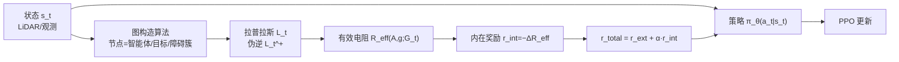

# Graph-Theoretic Intrinsic Reward: Guiding RL with Effective Resistance

**会议**: ICLR 2026  
**OpenReview**: [https://openreview.net/forum?id=W8bKDPf1Ko](https://openreview.net/forum?id=W8bKDPf1Ko)  
**代码**: 待确认  
**领域**: 强化学习 / 内在奖励 / 谱图论  
**关键词**: 有效电阻, 内在奖励, 稀疏奖励, 目标条件 RL, 谱图论, 探索  

## 一句话总结
把智能体的局部感知建成一张随时间演化的图，用图上"智能体节点—目标节点"之间的**有效电阻 (Effective Resistance)** 的变化作为稠密内在奖励，从谱图论角度给稀疏奖励探索提供了有理论保证、无需预训练的 on-policy 引导信号。

## 研究背景与动机
- **领域现状**：稀疏奖励环境下的探索是 RL 的老大难问题。早期靠手工设计的稠密奖励，扩展性差；近年主流转向内在动机 (intrinsic motivation)，用 novelty / curiosity / surprise 等信息论概念造稠密信号引导探索。
- **现有痛点**：(1) 多数内在奖励方法只有经验验证、缺乏理论保证；(2) 像 GCPO 这类近期 SOTA 需要先用行为克隆 (Behavioral Cloning) 预训练策略，代价高；(3) Surprise-based 方法（如 SRL）依赖显式建模转移概率 $P(s_{t+1}|s_t,a_t)$，在实际环境里高度非平凡；(4) HER 等关系型方法多为 off-policy，对非马尔可夫奖励等结构吃力。
- **核心矛盾**：常用的几何/拓扑度量都不够好——欧氏距离在路径被阻塞但直线距离不变时给不出任何信号；最短路径距离脆弱、对单点失效敏感；代数连通度 (algebraic connectivity) 又太"全局"、噪声大，不聚焦于"智能体—目标"这对关系。需要一个**既稠密、又目标导向、还能综合所有路径**的度量。
- **本文目标**：为目标条件 RL（GCRL）设计一个有谱图论根基、有理论保证、不需预训练、纯 on-policy 的内在奖励，在动态稀疏奖励环境里高效引导探索。
- **核心 idea**：**【用有效电阻量化目标可达性】** 把状态向量解析成图（节点是智能体/目标/障碍物簇，边权反映传感半径内的邻近关系），用图上智能体与目标之间的有效电阻作为内在奖励。有效电阻刻画两节点间"沿所有可能路径"的信息流——电阻下降意味着目标在智能体的感知地图里结构上更可达，这是欧氏距离捕捉不到的稠密信号。

## 方法详解

### 整体框架
方法在标准 PPO 的奖励上叠加一路内在信号 $r_{total}(t)=r_{ext}(t)+\alpha\cdot r_{int}(t)$。每一步把高维状态 $s_t$（如 LiDAR 观测）转成一张加权无向时变图 $G_t=(V_t,E_t,W_t)$，在图上算出智能体节点 $A$ 与目标节点 $g$ 的有效电阻 $R_{eff}(t)$，再用其**相邻两步的变化量**当稠密内在奖励去更新策略。注意图只用来构造奖励，动作仍由 $\pi_\theta(a_t|s_t)$ 直接基于 $s_t$ 预测。

### 关键设计

**1. 从状态向量到时变图：聚焦"智能体—目标"的局部拓扑。** 图构造是整套方法的基石。算法分三步走：先按物体类别把同类对象聚成簇节点、智能体单独成一个节点（自我中心 egocentric 形式），再把智能体节点连到其余节点，最后引入簇内连边和"选择性"的簇间连边。聚类阈值 $\tau$ 不是随手定的，而是有解析推导（附录 A.5.3）和完整的敏感度分析。这样得到的图既保留了障碍物分布带来的"瓶颈/通路"结构，又保持了自我中心的广泛适用性——只要状态空间能分解出感兴趣的实体，就能套用，因此对各类 GCRL 设定都通用。

**2. 有效电阻作为目标可达性度量。** 对两个节点 $u,v$，有效电阻定义为在 $u$ 注入单位电流、$v$ 抽出时两点的电位差，通过图拉普拉斯矩阵 $L_t$ 的 Moore–Penrose 伪逆 $L_t^+$ 计算：
$$R_{eff}(u,v;G_t)=(e_u-e_v)^\top L_t^+ (e_u-e_v)$$
其中 $e_u$ 是节点 $u$ 的标准基向量。相比最短路径（脆弱、单点失效）和代数连通度（全局、噪声大），有效电阻是**成对、目标导向**的度量，且天然综合了所有路径：当智能体—目标间出现更多可行通路（图 1 中第二种配置）时电阻更低，即便此时欧氏距离与第一种配置完全相同。这正是它能在欧氏距离失效处给出有意义稠密信号的原因。

**3. 基于电阻变化的内在奖励，并处理目标进/出视野。** 内在奖励用相邻两步电阻的负变化定义（电阻下降→正奖励），并对"目标是否在感知半径内"做分段处理：
$$r_{int}(t)=\begin{cases}-\big(R_{eff}(A,g;G_{t+1})-R_{eff}(A,g;G_t)\big) & \text{目标持续可见}\\ -\beta & \text{目标丢失}\\ +\beta & \text{目标重新进入视野}\\ 0 & \text{其它}\end{cases}$$
其中 $\beta\gg0$ 是惩罚丢目标、奖励找回目标的超参。推论建议把 $\beta$ 设得压过外在奖励、把权重 $\alpha$ 按环境动态尺度缩放。该公式与算法无关，文中接到 PPO 上即可，无需任何预训练，全程 on-policy。

**4. 理论保证：连通性、鲁棒性与方差缩减。** 一组引理把这套设计串成可证的闭环。**引理 1** 证明 $\frac{dR_{eff}}{dt}\cdot\frac{d\kappa(G_t)}{dt}\le -C_1\big(\frac{d\kappa}{dt}\big)^2$，即降低有效电阻数学上等价于提升代数连通度 $\kappa$（拉普拉斯第二小特征值），但 $R_{eff}$ 比直接用 $\kappa$ 更聚焦、噪声更小。**引理 2** 给出 $\kappa$ 的逐步变化有界、关于时间 Lipschitz 连续，保证策略优化稳定。**引理 3** 表明 $r_{int}$ 与一步连通度变化正相关，**定理 1** 由此证明最优策略是 $(\epsilon,\delta,T)$-鲁棒的（保连通、保目标可见、高概率到达目标）。**引理 4** 进一步证明 $r_{int}$ 作为方差缩减基线，使总目标的策略梯度对外在目标近乎无偏，且收敛所需梯度更新数降为 $U_{total}=O(U(2-2\rho))$（$\rho$ 是 $Q$ 函数与 $-\alpha R_{eff}$ 的相关系数），在外在奖励方差天然偏高的稀疏设定下收益尤其明显。

## 实验关键数据

### 主实验（Safety-Gymnasium，3 类环境 × 3 难度，每法 5 次训练 × 200 回合 = 1000 评估回合）

| 环境 / 难度 | 指标 | 本文方法 | 最强基线 (GCPO) | 提升 |
|---|---|---|---|---|
| Navigation-L2 | 成功率 | **55.5%** | 38.7% | +16.8 pts |
| Building-L2 | 成功率 | **88.4%** | 55.7% | +32.7 pts（>2× SRL-Std 的 38.8%）|
| Navigation-L1 | 成功率 | **99.6%** | 84.0% | +15.6 pts |
| Building-L1 | 成功率 | **99.2%** | 86.4% | +12.8 pts |
| Navigation-L2 | 中位归一化奖励 | **0.0068** | 0.0017 | ~4× |
| Building-L2 | 中位归一化奖励 | **0.0134** | 0.0041 | >3× |
| Building-L1 | 中位归一化奖励 | **0.0281** | 0.0155 | ~2× |

- 论文摘要总结：成功率最高 +59%、到达目标步数最多省 56%、累计奖励 4×。
- 6+ 个基线对比：PPO / PPO+Ent / SRL-Std / SRL-Diff / NGU / AIM / MEGA / GCPO。

### 消融与机理验证

| 验证项 | 结论 |
|---|---|
| 用 $R_{eff}$ vs 直接用 $\kappa$ | $R_{eff}$ 信号更聚焦、噪声更小（A.7/A.8.1）|
| 图构造各设计选择（聚类阈值 $\tau$ 等）| 有解析推导 + 敏感度分析支撑（A.5.1/A.5.3/A.9）|
| 收敛速度（Loss Plateau Iteration）| 本文方法更早进入平台、收敛更快，印证引理 4 |
| 超参 $\alpha,\beta$ 选择 | 按推论 1 与附录 A.6 的理论动机选取并经验证 |

### 关键发现
- **越难越强**：在最高难度（L2）上优势最显著，简单任务（L0）各法都接近天花板。
- **从零训练胜过预训练基线**：GCPO 需行为克隆预训练，本文方法 from scratch 仍全面领先。
- **PPO+Ent 不稳**：在 Fading 环境（目标 150 步后线性消失）因过度探索表现明显变差，凸显纯熵探索在动态目标下的脆弱性。
- 文中对每一条引理与超参选择都配了对应实验，理论—经验高度对齐。

## 亮点与洞察
- **把谱图论的"有效电阻"引入内在奖励**：第一个将这一度量形式化为 surprise-based 内在奖励用于 GCRL，提供了欧氏/最短路/代数连通度都给不出的"综合所有路径的目标可达性"信号。
- **理论与经验罕见地对齐**：从"电阻↓⇔连通度↑"到鲁棒性定理再到方差缩减的收敛加速，每步都有引理且都有实验佐证。
- **强归纳偏置带来"白吃的午餐"**：相比 Quasimetric Learning 需从交互数据学度量，谱图论先验直接给出可解释性与理论保证，省掉学度量的高样本复杂度。
- **工程友好**：无需预训练、纯 on-policy、即插即用接到任意 RL 算法（文中用 PPO）。

## 局限与展望
- **依赖状态可分解为实体**：方法前提是能从（全/部分）可观测状态里抽出"智能体/目标/障碍"等实体来建图，对无法实体化分解的高维原始观测（如纯像素）需额外感知模块。
- **图构造引入超参与开销**：聚类阈值 $\tau$、连边规则、$\alpha/\beta$ 等需调；每步要算拉普拉斯伪逆 $L_t^+$，大图上有计算成本（文中有运行时分析 A.11，但规模可扩展性待考）。
- **评测局限于 Safety-Gymnasium 导航类任务**：多目标、长程操作、真实机器人等更广设定下的有效性仍待验证。
- **假设较理想**：有界传感范围、有界物体运动、策略平滑性等假设虽合理，但极端动态环境下可能被打破。

## 相关工作与启发
- **内在动机/探索**：Surprise (SRL, Achiam & Sastry 2017)、Curiosity (Pathak 2017)、RND (Burda 2018)、NGU (Badia 2020 episodic memory)、AIM (Wass-1 距离)、MEGA (Pitis 2020 目标分布熵)——本文用图结构信号取代信息论/密度估计信号。
- **目标条件 RL**：HER（关系重标，off-policy）、GCPO（Xudong 2024，需 BC 预训练，本文主要对标基线）——本文给出无需预训练的 on-policy 替代。
- **度量学习**：Quasimetric Learning（Wang 2023, Liu 2024 从数据学距离）——本文用谱图论先验换取可解释性与样本效率。
- **启发**：谱图论里的成对度量（有效电阻、commute time 等）作为"结构可达性"奖励，可能迁移到其它需要刻画"全局连通而非局部距离"的探索/规划问题，例如多智能体协调、图上导航与网络鲁棒性优化。

## 评分
- **新颖性**: ⭐⭐⭐⭐ — 把谱图论有效电阻形式化为内在奖励是个干净且有理论根基的新角度，明显区别于主流信息论内在动机。
- **实验充分度**: ⭐⭐⭐⭐ — 3 类环境 × 3 难度、8 个基线、1000 评估回合，且每条引理/超参都有对应实验，覆盖较全；但局限于 Safety-Gymnasium 导航类。
- **写作质量**: ⭐⭐⭐⭐ — 动机层层递进、理论与实验呼应清晰；公式与图示（图 1 对比配置）很有说服力。
- **价值**: ⭐⭐⭐⭐ — 无需预训练、即插即用、理论保证齐全，对稀疏奖励 GCRL 是实用且有启发性的贡献。

<!-- RELATED:START -->

## 相关论文

- [\[ICLR 2026\] Self-Aligned Reward: Towards Effective and Efficient Reasoners](self-aligned_reward_towards_effective_and_efficient_reasoners.md)
- [\[ICLR 2026\] GraphOmni: A Comprehensive and Extensible Benchmark Framework for Large Language Models on Graph-theoretic Tasks](graphomni_a_comprehensive_and_extensible_benchmark_framework_for_large_language_.md)
- [\[ACL 2026\] Verifier-Free RL for LLMs via Intrinsic Gradient-Norm Reward](../../ACL2026/reinforcement_learning/verifier-free_rl_for_llms_via_intrinsic_gradient-norm_reward.md)
- [\[ICLR 2026\] Preference-based Policy Optimization from Sparse-reward Offline Dataset](preference-based_policy_optimization_from_sparse-reward_offline_dataset.md)
- [\[ICLR 2026\] Selective Expert Guidance for Effective and Diverse Exploration in Reinforcement Learning of LLMs](selective_expert_guidance_for_effective_and_diverse_exploration_in_reinforcement.md)

<!-- RELATED:END -->
