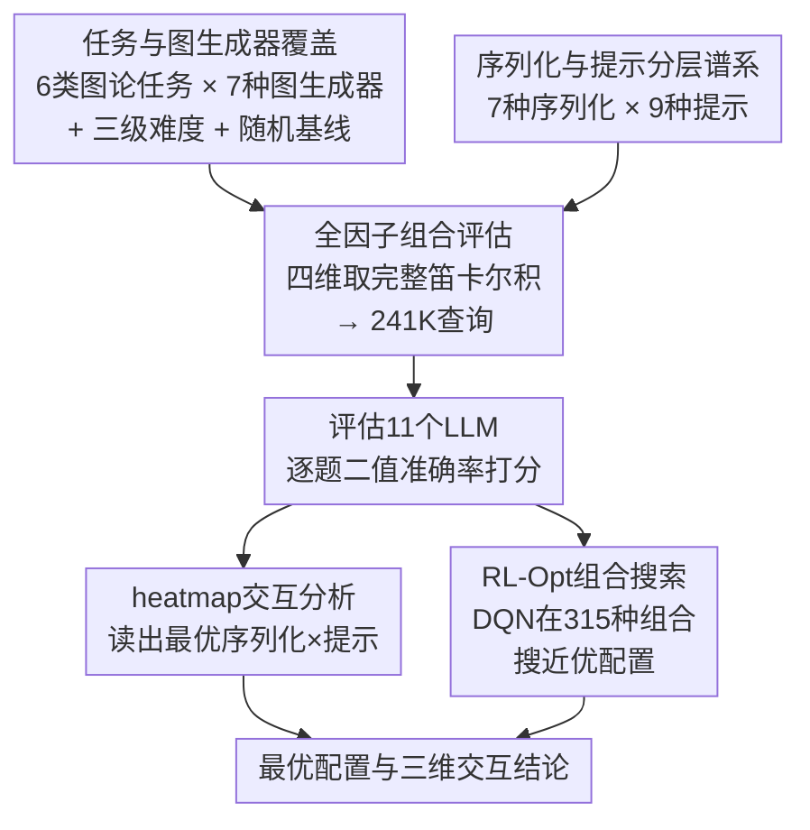

# GraphOmni: A Comprehensive and Extensible Benchmark Framework for Large Language Models on Graph-theoretic Tasks

**会议**: ICLR 2026  
**arXiv**: [2504.12764](https://arxiv.org/abs/2504.12764)  
**代码**: [GitHub](https://github.com/GAI-Community/GraphOmni)  
**领域**: 强化学习  
**关键词**: 图推理, LLM基准测试, 序列化格式, 提示策略, 强化学习

## 一句话总结

提出 GraphOmni 基准框架，在 7 种图类型 × 7 种序列化格式 × 9 种提示策略的 241K 查询上系统评估 11 个 LLM 的图论推理能力，揭示三维度间的复杂交互效应，并设计 RL 引导的组合搜索方法以 25% 成本保持约 90% 最优准确率。

## 研究背景与动机

**领域现状**：LLM 在自然语言任务上表现卓越，但将图结构数据序列化为文本后让 LLM 进行推理是一个新兴方向。已有若干 benchmark（NLGraph、GraphQA、GraphInstruct 等）尝试评估 LLM 的图推理能力，但它们在覆盖维度上存在显著盲区。

**现有痛点**：如表 1 所示，现有基准普遍只关注图类型、序列化格式或提示策略中的个别维度——NLGraph 覆盖 5 种提示但仅 1 种图类型和 1 种序列化；GraphQA 有 7 种图类型但只用纯文本序列化；GraphInstruct 支持 3 种序列化但仅 1 种提示。这种"单维度调参"的评估范式无法揭示维度间的交互效应，也无法判断性能提升到底来自模型能力、文本表示还是指令设计。此外，多数工作缺少随机基线作为参照，导致在类别不平衡任务（如环检测，50% 随机基线）上可能虚报能力。

**核心矛盾**：图推理性能高度依赖"怎么把图喂给 LLM"——同一模型在同一任务上，不同的序列化-提示组合可造成高达 40% 的准确率波动。但现有工作无法量化这种交互影响，更无法指导实践中的最优配置选择。

**本文目标** (1) 构建一个覆盖三维度完整笛卡尔积的大规模基准；(2) 系统量化图类型、序列化格式、提示策略之间的交互效应；(3) 提供一种自动化的最优组合搜索机制。

**切入角度**：作者的核心观察是"三个维度并非独立——一种对开源模型有效的序列化格式在闭源模型上可能反而有害"。因此必须做完整的网格评估(full factorial evaluation)才能得到可信结论。

**核心 idea**：通过 7×7×9 的全因子组合评估 + RL 引导的组合搜索，首次系统刻画 LLM 图推理中"图结构 × 文本表示 × 提示方式"三维交互的完整图景。

## 方法详解

### 整体框架

GraphOmni 是一个把"图怎么喂给 LLM"拆成四个可插拔维度的评估框架：6 类图论任务、7 种图生成器、7 种序列化格式、9 种提示策略，再叠加 Easy（5-10 节点）/ Medium（10-20）/ Hard（20-30）三级难度。它不像以往基准那样固定其余维度只调一个，而是对四维取完整笛卡尔积，共生成 241,726 个查询实例，逐一喂给 7 个开源模型（Llama-3、Llama-3.1、Mistral、Phi-4、Qwen-2.5 7B/72B、Qwen-3 8B）和 4+ 个闭源模型（Claude-3.5、GPT-4o、GPT-4o-mini、Gemini-2.0、o4-mini），每题用二值准确率打分。所有结果既铺成 heatmap 供交互分析，又交给一个 RL-Opt 搜索器，让它在不跑满全网格的前提下为新任务挑出近优配置；每个维度都按统一接口开放，研究者可自行扩充新选项。

### 关键设计

**1. 任务与图生成器覆盖：让每个分数都有可解释的参照系**

要诊断 LLM 到底会不会做图推理，先得让题目本身可解释。6 类任务被刻意挑成三个能力层：局部属性（连通性测局部链接理解、环检测测循环模式识别）、全局属性（直径需取所有节点对最短路径的最大值、BFS 测有序序列生成）、数值/路径（最短路径测路径规划、三角形计数测精确三元组枚举，最难）。每个任务都配一条专门的随机基线——连通性约 67%（真实图多数连通的先验）、环检测 50%、三角形计数仅约 2%——没有它就无法判断模型是真会还是在蒙。图侧则用 7 种生成器铺开拓扑谱：Erdős-Rényi 两变体（ERM 固定边数 / ERP 概率边）、二部 ER 两变体（BERM/BERP）、Barabási-Albert 无标度图两变体（BAG 优先连接 / BAF 森林）和 Scale-Free（SF 度加权），覆盖从均匀随机到幂律到层次树状的结构分布，并在附录用统计检验确认它们在 5-30 节点内确实结构显著不同。

**2. 序列化与提示分层谱系：把"文本表示"和"指令程度"做成连续可比的轴**

光有任务还不够，"怎么把图写成文本、给多少指令"才是性能波动的真正来源，所以这两件事被做成两条可排序、可比较的轴。7 种序列化按冗余度从紧到松排列：Edge Set/List（紧凑边表示）、Adjacency Set/List/Matrix（邻接表示）、GMoL/GMaL（结构化标记语言），它们的 token 开销差异巨大——Adjacency Matrix 在密集图上的 token 数远高于 Edge Set，这本身就是一个隐藏的成本/精度权衡维度。9 种提示按指导程度递增：从 0-Shot（无任何提示）一路到 Algorithm（显式写出 BFS/Dijkstra 的算法步骤），中间穿插 CoT、K-Shot、Instruct 及其零样本变体与 LTM（Least-to-Most）。把这两条轴做成连续谱系，正是后面 heatmap 交互分析能成立的前提。

**3. 全因子组合评估：让维度间的交互效应第一次变得可测**

前两个设计提供了维度，而全因子评估决定怎么用它们——以往基准"固定其他维度只调一个"，于是无从分辨性能差异究竟来自模型、文本表示还是指令设计。GraphOmni 的取法相反：它对四个维度做完整的笛卡尔积，每一个 (任务, 图类型, 序列化, 提示) 组合都被实际跑过一遍，因此可以把同一模型同一任务在不同序列化×提示下的准确率铺成一张 heatmap，直接读出哪种文本表示配哪种指令最有效。正是这张完整网格暴露出后文那个 40%+ 的组合方差，也使"开源模型受益于含示例提示、闭源模型却可能被 few-shot 干扰"这类交互结论第一次有了数据支撑。

**4. RL-Opt：用强化学习在组合里搜出近优配置，而不必跑满全网格**

既然全因子评估显示"没有一种组合对所有任务通用最优"，那对一个新任务就得有低成本的自动选配机制，否则跑满网格代价太高。作者把"为某任务挑最佳 (序列化, 提示, 模型) 组合"建模成序列决策：状态是当前已选的因子组合（如已定 Adjacency List、待选提示），动作是在某一维度里挑一个候选选项，奖励是该组合在验证集上的准确率，整个搜索空间为 $E = 7 \times 9 \times 5 = 315$ 种组合（5 个开源模型）。用 DQN 逼近最优 Q 函数，配 $\varepsilon$-greedy 探索（$\varepsilon$ 从 1.0 衰减到 0.01）。效果用两个指标量化：搜索成本 $\text{Cost}=k/K$（实际探索组合数占比）和最优率 $\text{Rate}=acc^*/acc_{\max}$（搜到的最佳准确率相对全局最优之比），最终在只探约 25% 组合（$\text{Cost}\approx0.22$）时就能拿到约 90% 的最优率（$\text{Rate}\approx0.90$）——这正是它的工程价值所在。

### 损失函数 / 训练策略

评估全程采用二值准确率，但判分规则按任务类型分流：定性任务（连通性、环检测）靠关键短语匹配判对错，定量任务（三角形计数、直径）提取数值与真值比较，多解任务（BFS 遍历、最短路径）用规则验证函数检查解是否合法。所有 few-shot 实验统一取 $k=5$ 个示例，保证跨组合可比。

## 实验关键数据

### 主实验（Table 3）

在全部 6 个任务 × 3 个难度 × 11 个模型上的核心结果（选取代表性模型）：

| 任务 | 难度 | o4-mini | Claude-3.5 | Qwen-2.5 72B | Qwen-3 8B | Llama-3.1 8B | 随机基线 |
|------|------|---------|------------|-------------|-----------|-------------|---------|
| BFS 遍历 | Easy | **95.46** | 91.42 | 71.41 | 65.87 | 18.69 | 0.00 |
| BFS 遍历 | Hard | **32.45** | 26.80 | 22.03 | 29.53 | 0.63 | 0.00 |
| 连通性 | Easy | **98.23** | 98.38 | 90.24 | 97.17 | 79.53 | 67.49 |
| 环检测 | Easy | **97.97** | 82.56 | 74.02 | 90.30 | 55.49 | 50.00 |
| 直径 | Easy | **98.88** | 83.71 | 78.50 | 77.56 | 41.27 | 11.20 |
| 直径 | Hard | 34.61 | **56.70** | 29.59 | 39.83 | 18.63 | 3.72 |
| 最短路径 | Easy | 95.08 | **94.35** | 90.03 | 77.69 | 38.75 | - |
| 三角形计数 | Easy | **84.54** | 43.41 | 36.57 | 41.36 | 14.97 | 2.13 |
| 三角形计数 | Hard | **16.27** | 8.63 | 4.73 | 19.54 | 3.07 | 0.47 |

### RL-Opt 组合搜索结果（Table 4）

| 任务 | 难度 | 平均搜索成本 (Cost) | 平均最优率 (Rate) |
|------|------|-------------------|-----------------|
| BFS 遍历 | Easy | 0.220 | 0.974 |
| 连通性 | Easy | 0.224 | 0.988 |
| 环检测 | Easy | 0.223 | 0.976 |
| 直径 | Easy | 0.226 | 0.973 |
| 最短路径 | Medium | 0.216 | 0.986 |
| 三角形计数 | Easy | 0.228 | 0.906 |
| 三角形计数 | Hard | 0.224 | **0.732** |

### 缩放 vs 推理效果对比（Table 11）

以 Qwen-2.5 7B 为基线，分别对比参数缩放（72B）和推理优化（Qwen-3 8B）：

| 任务 | 难度 | Qwen-2.5 7B | Qwen-2.5 72B (缩放) | Qwen-3 8B (推理) |
|------|------|------------|-------------------|-----------------|
| BFS 遍历 | Easy | 21.46 | **71.41** (+50) | 65.87 (+44) |
| BFS 遍历 | Hard | 1.38 | 22.03 | **29.53** (+7.5 vs 72B) |
| 直径 | Hard | 15.27 | 29.59 | **39.83** (+10 vs 72B) |
| 三角形计数 | Hard | 3.62 | 4.73 | **19.54** (+15 vs 72B) |
| 连通性 | Hard | 81.19 | 84.09 | **92.89** |

### 关键发现

1. **o4-mini 全面领先但仍有巨大提升空间**：o4-mini 在大多数任务上排名第一（Easy BFS 95.46%、三角形计数 84.54%），但在 Hard 难度下所有模型急剧下降，三角形计数 Hard 仅 16.27%，说明 LLM 目前在组合枚举类图推理上能力有限

2. **缩放提底线，推理提天花板**：Qwen 系列的对比揭示了两种提升路径——72B 在简单任务上大幅提升（BFS Easy +50%），但在 Hard 三角形计数上几乎无提升（+1.1%）；而 8B 推理模型在最难配置上反超 72B（三角形 Hard 19.54% vs 4.73%），表明组合推理能力更受益于架构/训练范式优化而非单纯扩参数

3. **序列化-提示组合的高变异性**：同一模型同一任务上，不同组合可造成 40%+ 准确率差异。如 GPT-4o 在 Diameter Easy 上，最佳组合 (Algorithm + Adjacency List) 达 0.715，最差组合仅 0.167，呈现出明显的 heatmap 热力图模式

4. **开源/闭源模型对提示策略的响应截然不同**：开源模型明显受益于 K-Shot 和 Instruct 等含示例的提示；闭源模型则更复杂——CoT 类提示在 0-shot 下就表现很好，加 few-shot 反而可能干扰（如 Algorithm 加 shot 提升，但 K-Shot 本身对闭源模型帮助有限）

5. **LLM 在图概念理解上存在根本性误解**：错误分析发现 LLM 会将"图直径"误解为"最长路径"而非"所有最短路径中的最大值"，将三角形数量错误地近似为 $\lfloor n/3 \rfloor$（节点数除以 3），说明 LLM 并未真正掌握图论定义

6. **真实世界图和 NP-Hard 任务的扩展验证**：在 IMDB-MULTI 和 ogbg-molhiv 真实数据集（~3.6K 样本）及 Hamiltonian 环 / Max-Cut NP-hard 问题上，相对排名保持一致，但真实图因多为稀疏连通导致部分任务（如连通性）被低估难度

## 亮点与洞察

- **全因子组合评估 (Full Factorial Design)** 是本文最核心的方法论贡献。与以往"固定其他维度调一个"的做法不同，GraphOmni 做了完整的笛卡尔积测试，这使得 heatmap 交互分析成为可能——这种设计在 NLP benchmark 领域较为罕见，值得其他评估工作借鉴

- **RL-Opt 的实用价值**胜过其技术复杂度：核心思路很简单（DQN + ε-greedy 在 315 种组合里搜索），但它回答了一个非常实际的问题——"面对新任务/新模型，如何用最小成本找到最佳配置"。25% 成本保持 90% 最优率在工程上很有吸引力

- **缩放 vs 推理的分离实验**（Table 11）提供了一个干净的对照——同一家族 7B→72B 和同参数量的推理模型，清晰展示了两种提升路径的互补性，这对模型选型决策有直接参考价值

- **随机基线的设计**看似简单但非常关键：环检测的 50% 基线暴露出一些模型（如 Llama-3.1 的 55.49%）实际上仅略好于随机猜测

## 局限与展望

- **图规模偏小（最大 30 节点）**：虽然附录扩展到 50 节点，但在相同 token 长度下只能编码几十个节点的图。真实应用中的图动辄上千节点，当前评估其实在测试 LLM 的"小图精确推理"而非"大图近似推理"能力
- **仅限合成图生成器**：虽然做了 IMDB/ogbg 的验证性实验，但主实验全部基于合成图。合成图结构分布有限，缺少社区结构、小世界属性等真实网络特征
- **缺少图的视觉模态**：所有输入都是文本序列化。随着 VLM 的发展，图的可视化表示（节点-边渲染图像）可能是更自然的输入形式，但完全未探索
- **RL-Opt 的搜索空间假设**：假设没有任何先验知识从零开始搜索，实际中我们通常已有部分经验（如"CoT 一般比 0-Shot 好"），引入这些先验可进一步降低搜索成本
- **开源模型规模集中在 7B-14B**：虽然包含了 Qwen-2.5 72B，但缺少 Llama-3.1 70B、Mistral Large 等大规模开源模型的对比
- **可扩展到动态图和异质图**：当前仅考虑静态同质无向图，可扩展到时序图、有向图、异质信息网络等更复杂场景

## 相关工作与启发

- **vs NLGraph**：NLGraph 覆盖 5 种提示但仅 1 种图类型和 1 种序列化，且仅有 5902 个样本（GraphOmni 的 2.4%）。NLGraph 的发现"Algorithm 提示最佳"在 GraphOmni 中被细化为"对开源模型确实最佳，但对闭源模型取决于任务"
- **vs GraphQA**：GraphQA 有 7 种图类型但只用纯文本描述（1 种序列化），无法分析序列化格式的影响。且 GraphQA 缺少随机基线，其报告的环检测准确率可能被高估
- **vs GraphArena**：GraphArena 有 10K 样本但仅 1 种序列化和 1 种提示。GraphOmni 在同一任务上的多组合评估揭示了 GraphArena 那种单一配置结果的不可靠性
- **启发**：在 LLM Agent 系统中处理图结构数据时，应为每个具体任务调优序列化-提示组合而非使用固定模板；RL-Opt 的思路可推广到更一般的"多超参 LLM 配置搜索"场景

## 评分

- 新颖性: ⭐⭐⭐⭐ 全因子组合评估范式新颖，但 RL-Opt 方法本身较简单
- 实验充分度: ⭐⭐⭐⭐⭐ 241K 查询 × 11 模型 × 3 难度，附录含大图/真实图/NP-hard 扩展
- 写作质量: ⭐⭐⭐⭐ 结构清晰，115 页附录极为详尽，但主文有些数据冗余
- 价值: ⭐⭐⭐⭐ 对 LLM 图推理的评估提供了最全面的参考，RL-Opt 有工程实用性

<!-- RELATED:START -->

## 相关论文

- [\[ICLR 2026\] Revolutionizing Reinforcement Learning Framework for Diffusion Large Language Models](revolutionizing_reinforcement_learning_framework_for_diffusion_large_language_mo.md)
- [\[ICLR 2026\] Virne: A Comprehensive Benchmark for RL-based Network Resource Allocation in NFV](virne_a_comprehensive_benchmark_for_rl-based_network_resource_allocation_in_nfv.md)
- [\[ICLR 2026\] Graph-Theoretic Intrinsic Reward: Guiding RL with Effective Resistance](graph-theoretic_intrinsic_reward_guiding_rl_with_effective_resistance.md)
- [\[ICLR 2026\] On Predictability of Reinforcement Learning Dynamics for Large Language Models](on_predictability_of_reinforcement_learning_dynamics_for_large_language_models.md)
- [\[ICLR 2026\] VerifyBench: Benchmarking Reference-based Reward Systems for Large Language Models](verifybench_benchmarking_reference-based_reward_systems_for_large_language_model.md)

<!-- RELATED:END -->
