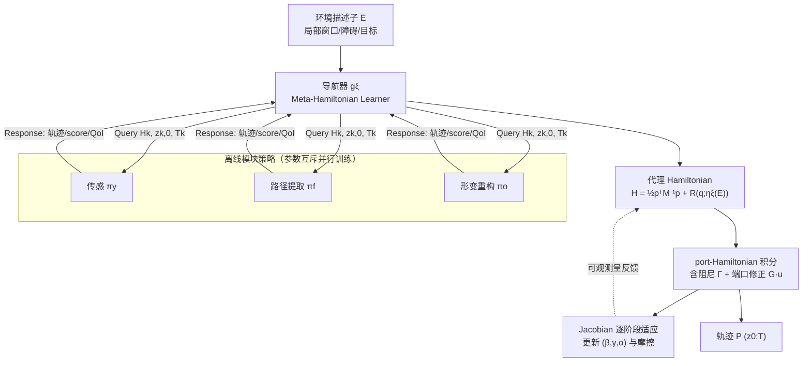

# GRL-SNAM: Geometric Reinforcement Learning with Differential Hamiltonians for Navigation and Mapping in Unknown Environments

**会议**: ICLR 2026  
**OpenReview**: [https://openreview.net/forum?id=KcC5mwfGf0](https://openreview.net/forum?id=KcC5mwfGf0)  
**代码**: [https://github.com/CVC-Lab/GRL-SNAM](https://github.com/CVC-Lab/GRL-SNAM)  
**领域**: reinforcement learning  
**关键词**: 几何强化学习, Hamiltonian 动力学, 同时导航与建图(SNAM), 微分策略优化, 能量景观, 可变形机器人  

## 一句话总结
把"导航+建图"重写成余切丛上的 Hamiltonian 能量优化问题，用学到的能量景观的梯度直接生成控制动作，替代了主流 RL 的 Bellman 自举，从而在只观测局部、几乎不建全局地图的条件下完成高质量导航并泛化到未见环境。

## 研究背景与动机
- **领域现状**：连续导航的 RL 大多在欧氏空间里跑 PPO/SAC/TD3，靠值函数递归自举（Bellman）来学策略；同时导航与建图(SNAM)则通常先建详细地图再规划。两条路线各有顽疾。
- **现有痛点**：纯 model-free 方法样本效率低、长程 rollout 中数值误差累积；分层方法依赖手工设计的分解，换环境就不迁移；安全约束（CBF）被当作与导航最优性正交的滤波器，导致保守行为；可变形机器人导航多靠预编程形变序列，无法在线适应。
- **核心矛盾**：标准 RL 策略**不显式编码导航的几何与物理结构**，于是过度依赖训练分布的统计规律而非任务的不变结构，分布漂移下鲁棒性差、长程衰减。
- **本文目标**：在**只用局部感知、尽可能少建地图**的前提下，得到高质量、保持安全间隙、能泛化到未见布局的导航策略。
- **核心 idea**：**[把导航当作 Hamiltonian 能量景观的优化]** 学一个定义在相空间上的 Hamiltonian $H(q,p)=K(p)+P(q)$，动能/势能编码控制目标、约束与适应策略；策略 = 学到能量的梯度流（Differential Policy Optimization），执行时**前馈地**从当前状态+局部观测+当前 Hamiltonian 算动作，不做 rollout 值传播。**[离线-在线 Hamiltonian 协同]** 离线拟合可复用的参考 Hamiltonian，在线只对当前障碍配置做受约束的能量修正 $h_{\text{adapted}}=h_{\text{ref}}+\Delta h_{\text{context}}$。

## 方法详解

### 整体框架
GRL-SNAM 分两层耦合：**离线**学三个模块各自的 Hamiltonian 响应模型（传感 $\pi_y$、路径提取 $\pi_f$、形变重构 $\pi_o$）；**在线**由一个导航器 $g_\xi$ 把这些响应装配成一个**代理 Hamiltonian**，并随着感知到的环境描述子 $E$ 变化做逐阶段修正。机器人状态 $q_t=(c_t,\theta_t,y_t,\psi_t)$ 含位姿与感知/内部构型，只感知 $2\hat d\times 2\hat d$ 的局部窗口；每个阶段导航器顺序查询三个策略拿到状态相关的控制提议，装配 Hamiltonian 后积分 port-Hamiltonian 动力学，再用可观测量（间隙、目标进度、速度）做一次基于 Jacobian 的能量权重短更新，形成逐阶段适应回路。

### 关键设计

**1. 从最优控制到 Hamiltonian：用 Legendre–Fenchel 共轭把控制惩罚变成动能。** 固定环境 $E$，考虑控制仿射动力学 $\dot q=f(q)+A(q)u$ 与阶段代价 $L(q,u;E)=-R(q;E)+\phi(u)$，其中 $R$ 编码目标/偏转/障碍势、$\phi$ 罚控制力度。Pontryagin 原理引入协态 $p$ 与控制 Hamiltonian，消去 $u$ 等价于对 $\phi$ 取 Legendre–Fenchel 共轭，得 $H(q,p;E)=\phi^*\!\big(A(q)^\top p\big)+p^\top f(q)+R(q;E)$。在二次情形 $\phi(u)=\tfrac12 u^\top\Phi u$ 下，$H(q,p;E)=\tfrac12 p^\top A(q)\Phi^{-1}A(q)^\top p+p^\top f(q)+R(q;E)$，把 $M(q)^{-1}:=A(q)\Phi^{-1}A(q)^\top$ 认作逆质量矩阵，就得到机械形式 $H=\tfrac12 p^\top M(q)^{-1}p+R(q;E)$。这条共轭构造说明：每个场景的内层运动律本就是 Hamiltonian，动能由控制惩罚诱导、势能由环境塑形；软约束（barrier）只是**加性地**进入 $R$，摩擦等非保守效应作为 port 输入不破坏共轭结构——这就把"安全/避障"直接焊进能量里，免去脆弱的 reward shaping。

**2. 导航器在能量空间里搜索：用置换不变的 set encoder 学环境到对偶权重的映射。** 把可行势 $R$ 看成 $Q$（及环境配置）上的 Hilbert 空间，平面导航时把搜索限制到由各任务能量张成的环境索引线性锥。势函数写成各模块项的加权和：$R(q;\omega,\eta_\xi(E))=E_{\text{sensor}}+\beta(E)E_{\text{goal}}+\lambda(E)E_{\text{obj}}+\sum_{i\in C_t(E,q)}\alpha_i(E,t)\,b(d_i(q;E);\omega_b)$，其中 $\omega$ 是项内参数（度量、目标形状、形变模型、barrier 模板），而元导航器 $\eta_\xi$ 学**项间权衡**：把环境 $E$ 映射到非负对偶权重 $(\beta,\lambda,\{\alpha_i\})$。由于活动约束集 $C_t(E,q)=\{i\mid d_i(q,E)\le\hat d\}$ 的基数随环境/时间变化，$\eta_\xi$ 用置换不变的集合编码器实现，对每个约束输出非负打分 $\alpha_i\ge 0$。活动集在线由感知发现——这让权重数 $m(E,t)=2+|C_t|$ 自适应于当前障碍数目。

**3. 子模块化架构：三个参数互斥的独立 score function，靠共享约束耦合。** 不学单一策略，而是分解成 $K=\{y,f,o\}$ 三个独立打分函数，每个对应传感/帧(路径)/物体(形变)，相空间状态 $z_k=(q_k,p_k)$、参数集互斥 $\Theta_i\cap\Theta_j=\varnothing$，策略定义为 $s_k^{\theta_k}(z_k,E,t)=S_k^{\theta_k}(\nabla_{z_k}h_k^{\theta_k})$。参数互斥保证 $\partial s_k/\partial\theta_j=0\,(j\neq k)$，从而能**并行训练**却仍通过共享约束 $C_t$ 协调。导航器对实现是 agnostic 的——真正的贡献是把它们用 Hamiltonian 结构与动态约束集 $C_t$ 绑在一起。各子模块按 port-Hamiltonian 流积分一小段时域：$\dot q_k=\nabla_{p_k}h_k$，$\dot p_k=-\nabla_{q_k}h_k-\Gamma_k\nabla_{p_k}h_k+G_k u_k$（$\Gamma_k\succeq 0$ 为 Rayleigh 阻尼，$G_k u_k$ 为非保守端口输入），返回含轨迹、score 序列和 QoI 的标准响应给导航器聚合。

**4. 多尺度时间协调 + 离线物理/在线能量修正的解耦。** 三个策略天然处在不同时间频率：形变 $f_{\text{shape}}\gg$ 路径 $f_{\text{path}}\gg$ 传感 $f_{\text{sensor}}$（对应 $T_{\text{sens}}\gg T_{\text{path}}\gg T_{\text{int}}$）。传感策略每阶段更新一次确立约束 $C_t$，路径策略中频算航点，形变策略每个积分步高频微调。这种时间分离支持**嵌套准静态近似**：最快的重构在每帧内平衡、帧动力学在更慢的传感演化前稳定，避免跨尺度的失稳交互同时保留必要耦合。与标准 RL"离线学任意策略 $\pi(a|s)$、在线微调、苦于跨域迁移"不同，GRL-SNAM 离线学**物理上有意义**的 Hamiltonian $h_\theta(z,C,t)$、在线只做面向感知 $C_t$ 的语境对齐 $\Delta h_{\text{context}}$，因此适应稳定。论文给出三条理论性质：多策略稳定性（$E_{\text{total}}\le\epsilon$）、辛结构保持（$\omega_k(z_{k,t+1})=\omega_k(z_{k,t})$）、线性样本复杂度（$N_{\text{total}}=\sum_k O(\epsilon_k^{-(2d_k+4)})$，对各策略维度求和而非联合维度指数）。

## 实验关键数据

### 主实验表格
2D 可变形导航（超弹性环穿越杂乱环境），与全局规划/局部反应/深度 RL 三类 baseline 在**匹配的局部感知预算**下比较，只统计成功 run：

| Method | SPL ↑ | Detour ↓ | Min. Clearance (m) ↑ | Mapping Ratio (%) ↓ |
|--------|-------|----------|----------------------|---------------------|
| PF | 0.77 | 1.42 | 0.18 | 10.3 |
| CBF | 0.96 | 1.04 | 0.32 | 11.2 |
| **GRL-SNAM** | **0.95** | 1.09 | 0.26 | **10.7** |
| PPO | 0.07 | 1.65 | −0.09 | 14.7 |
| TRPO | 0.57 | 1.44 | 0.004 | 14.3 |
| SAC | 0.57 | 1.53 | 0.004 | 14.6 |

GRL-SNAM 达到接近 CBF 的导航质量（SPL 0.95 vs 0.96），却用了最少的地图覆盖（10.7%，与 PF 的 10.3% 相当）；深度 RL 三家即便用相同观测/动作/Transformer 编码器，SPL 至多 0.57、间隙几乎贴边、还要更大的建图比例。

短 rollout、相同感知/rollout/架构下的导航性能：

| Method | Success (%) ↑ | Mean State Error (m) ↓ | Mean Goal Dist. (m) ↓ |
|--------|---------------|------------------------|-----------------------|
| PPO | 26.1 | 1.8 | 1.2 |
| TRPO | 21.7 | 2.1 | 1.5 |
| SAC | 18.4 | 2.4 | 1.9 |
| **GRL-SNAM** | **87.5** | **0.3** | **0.1** |

即便上百万交互步，PPO/TRPO/SAC 仅 18–26% 成功率，GRL-SNAM 用少一个数量级的更新就达 87.5%。

### 消融实验表格

| 消融维度 | 设置 | 结论 |
|----------|------|------|
| 损失分量 | 去 $L_{\text{friction}}$ | 摩擦匹配对稳定性关键 |
| 损失分量 | 去 $L_{\text{multi}}$ | 多起点鲁棒性防止过保守 |
| 传感噪声/动力学扰动 | 严重噪声 vs 标称 | 成功率 87% vs 99%，自适应 Hamiltonian 提供鲁棒性 |
| 样本效率 | vs RL baseline | 物理先验结构带来更快收敛 |

### 关键发现
- **少建图也能高质量导航**：逐阶段 Hamiltonian 精炼让每单位感知环境榨取最大价值，泛化到 in/out-of-distribution 都近 100% 成功。
- **在线重塑整个能量景观**：随新障碍被感知，$(\beta,\gamma,\alpha)$ 动态演化、重定义约化 Hamiltonian 本身，实现能量一致的后验更新，而非启发式反应调整——这解释了为何同样感知预算下深度 RL 会碰撞/卡死/绕远。
- **力场可组合**：$F=\beta F_g+\gamma F_{bs}$ 把目标吸引与障碍排斥统一进一个语境平衡的导航场。

## 亮点与洞察
- **范式层面的"换骨"**：直接绕开 Bellman 递归自举，把策略改造成学到能量的梯度流；值方法与该对偶形式在最优处一致，但本文显式在**非最优**区建模对偶 Hamiltonian 动力学。
- **几何结构当归纳偏置**：能量守恒稳住长程 rollout、辛几何天然分离快反应/慢规划、barrier 编码把安全焊进势函数——三个结构优势都来自"用 Hamiltonian 写策略"。
- **离线-在线解耦优雅**：离线学可复用参考 Hamiltonian，在线只加 $\Delta h_{\text{context}}$ 做保守适应，既稳又能换环境。
- **模块互斥并行**：参数 disjoint 让样本复杂度线性叠加而非联合维度指数，工程上可并行训练。

## 局限与展望
- **评测局限在 2D**：可变形环/点 agent 的 2D 程序生成环境，尚未见 3D、真实机器人或高维感知（图像）验证。
- **对噪声敏感**：严重传感噪声下成功率从 99% 跌到 87%，自适应框架虽缓解但仍有明显退化。
- **大量细节挪进附录**：导航器 meta-learning 的完整目标、QoI 在线适应、定理证明都在 appendix，正文可复现性需结合代码。
- **依赖能量项的手工模板**：barrier 模板、目标形状、度量等 $\omega$ 仍需先验设计，搜索被限制在线性锥内；对完全黑箱（只可观测动能）的 gray/black-box 设定只做了 remark 级讨论。
- **展望**：把 Hamiltonian 结构从低维控制推广到更高维 SNAM、引入 NeRF-SLAM 类神经场景表示供势函数计算，是自然的下一步。

## 相关工作与启发
- **几何 RL/控制**：SE(3)-等变策略、Riemannian 安全导航、(port-)Hamiltonian 神经模型——本文把结构保持参数化从简单控制推到模块化、部分可观的导航。
- **连续时间 RL**：Jia & Zhou 的连续时间 q-learning（鞅刻画）、Settai 等的 HJB 视角 TD、Nguyen & Bajaj 的对偶 Hamiltonian 控制；本文最贴近这条新兴线，差异在面向 SNAM、模块化子策略、逐阶段在线适应。
- **安全导航**：CBF+RL 有形式安全保证但把约束当正交滤波；本文把约束直接放进能量结构。
- **可变形机器人导航 & SNAM**：相对 HAVEN 等预编程形变、SGoLAM/CMP/CL-SLAM 等"先建图再导航"，本文显式追求**最小探索**，靠渐进路径精炼不断改良最小代价轨迹。
- **启发**：当任务有清晰物理/几何结构时，"学能量再取梯度"可能比"学值函数再自举"在分布漂移和长程稳定性上更稳——这对一切结构化控制问题都是值得借鉴的建模哲学。

## 评分
- **新颖性**: ⭐⭐⭐⭐⭐ 用 Legendre–Fenchel 共轭把最优控制转成可学 Hamiltonian、以能量梯度流替代 Bellman 自举，是 RL 方法论层面的实质创新。
- **实验充分度**: ⭐⭐⭐ 对比覆盖全局/反应/深度 RL 三类且控制变量严谨，但仅限 2D 程序生成环境，缺 3D/真机/高维感知，许多结果挪进附录。
- **写作质量**: ⭐⭐⭐⭐ 动机—结构—理论—实验链条清晰，公式与图（架构图/时间层级图）到位；个别记号与拼写（kinectic/caliberate）略粗糙。
- **价值**: ⭐⭐⭐⭐ 为结构化 RL 与几何导航提供了可复现（开源）的范式样板，最小建图+强泛化+免 reward shaping 对机器人导航与几何 RL 社区都有启发。

<!-- RELATED:START -->

## 相关论文

- [\[ICLR 2026\] Solving Parameter-Robust Avoid Problems with Unknown Feasibility using Reinforcement Learning](solving_parameter-robust_avoid_problems_with_unknown_feasibility_using_reinforce.md)
- [\[ICLR 2026\] Beyond Distributions: Geometric Action Control for Continuous Reinforcement Learning](beyond_distributions_geometric_action_control_for_continuous_reinforcement_learn.md)
- [\[ICLR 2026\] OCTAX: Accelerated CHIP-8 Arcade Environments for Reinforcement Learning in JAX](octax_accelerated_chip-8_arcade_environments_for_reinforcement_learning_in_jax.md)
- [\[ICLR 2026\] From Ticks to Flows: Dynamics of Neural Reinforcement Learning in Continuous Environments](from_ticks_to_flows_dynamics_of_neural_reinforcement_learning_in_continuous_envi.md)
- [\[ICLR 2026\] Single Index Bandits: Generalized Linear Contextual Bandits with Unknown Reward Functions](single_index_bandits_generalized_linear_contextual_bandits_with_unknown_reward_f.md)

<!-- RELATED:END -->
