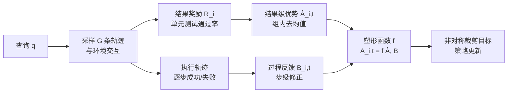

# Group Verification-based Policy Optimization for Interactive Coding Agents

**会议**: ICLR 2026  
**OpenReview**: [https://openreview.net/forum?id=RY47Tq0VsV](https://openreview.net/forum?id=RY47Tq0VsV)  
**代码**: 待确认  
**领域**: 强化学习 / LLM 智能体 / 交互式代码智能体  
**关键词**: RLVR, GRPO, 过程奖励, 优势塑形, 信用分配, AppWorld  

## 一句话总结
GVPO 在 GRPO 的群组相对优势之上叠加一层"过程可验证"塑形项，把代码执行成功/失败这类确定性的中间反馈直接注入到逐步优势里，从而修正稀疏结果奖励带来的信用分配偏差，让 32B 智能体在 AppWorld 上超过 OpenAI o1。

## 研究背景与动机
- **领域现状**：RLVR（reinforcement learning from verifiable rewards）已经成为训练交互式代码智能体的主流范式，其中 GRPO 用一组采样轨迹的组内相对奖励来估计优势，免去了训练奖励模型的成本，显著提升了 LLM 智能体的能力。
- **现有痛点**：GRPO 及其变体（Dr.GRPO、DAPO、LOOP 等）几乎只依赖**结果可验证奖励**（如单元测试是否全过）。这种信号稀疏、延迟，对推理过程中间步骤几乎没有指导。
- **核心矛盾**：稀疏的结果奖励导致信用分配失真——一条轨迹只要最终成功，早期的错误步骤也会被正向强化；反之只要最终失败，部分正确的推理也会被一并打压。结果是优化不稳、收敛慢、环境反馈被浪费。
- **本文目标**：把代码执行轨迹里天然存在的**过程可验证信号**（语法错误、运行时异常、部分单元测试结果）利用起来，做到更精细的逐步信用分配，同时不破坏与最终任务目标的对齐。
- **核心 idea**：**优势塑形（advantage shaping）**——保留结果级优势作为长期对齐锚点，再用确定性的过程反馈作为逐步"修正项"叠加上去，让短期过程指导与长期结果对齐统一在一个优势函数里。

## 方法详解

### 整体框架
对每个查询 $q$ 采样一组 $G$ 条轨迹与环境交互，得到结果奖励 $R_i$；由 $R_i$ 算出结果级优势 $\hat{A}_{i,t}$，同时从执行轨迹里抽取逐步成功/失败信号得到过程反馈 $B_{i,t}$；塑形函数 $f(\cdot)$ 把两者融合成最终优势 $A_{i,t}=f(\hat{A}_{i,t}, B_{i,t})$，再喂给带非对称裁剪的 PPO 式目标做更新。

### 关键设计
**1. 优势塑形框架：把过程反馈变成结果优势的修正项**　GVPO 不再像 GRPO 那样让一条轨迹的所有 token 共享同一个标量优势，而是定义 $A_{i,t}=f(\hat{A}_{i,t}, B_{i,t})$，其中结果级优势 $\hat{A}_{i,t}=R_i-\mathrm{mean}(\{R_i\}_{i=1}^{G})$ 故意**去掉了标准差归一化**（实验证明 std 归一化反而引入优化偏差）。$\hat{A}_{i,t}$ 负责锁定与最终任务目标的对齐，过程反馈 $B_{i,t}$ 则作为逐步的加减项实时校准信用分配。需要注意的是塑形后优势不再满足零均值无偏性（$\mathbb{E}[A]\neq 0$），这是用偏差换取更密集监督的有意取舍。

**2. 过程可验证塑形函数：按"是否执行失败 × 结果优势符号"分情形修正**　这是方法的核心。先把轨迹 token 划分为执行成功集 $I_i^{\mathrm{succ}}$、执行失败集 $I_i^{\mathrm{fail}}$（带错误信息的步骤）和观测 token 集 $I_i^{O}$（解释器返回的反馈，不参与更新）。最终优势按下式塑形：

$$A_{i,t}=\begin{cases}\hat{A}_{i,t} & t\in I_i^{\mathrm{succ}}\\ \hat{A}_{i,t}-b & t\in I_i^{\mathrm{fail}}\wedge \hat{A}_{i,t}=0\\ (1+b)\cdot\hat{A}_{i,t} & t\in I_i^{\mathrm{fail}}\wedge \hat{A}_{i,t}<0\\ 0 & \text{otherwise}\end{cases}$$

直觉很清晰：成功步骤保留原优势；失败步骤要受罚——若该轨迹结果优势为零（不好不坏）就直接扣固定惩罚 $-b$，若结果优势已经为负就**乘性放大**惩罚 $(1+b)$，把"既失败、最终又差"的步骤压得更狠；其余情形（如失败但结果优势为正）置零以免误伤。惩罚系数 $b=0.2$ 固定，乘性放大比加性常数惩罚更能保持结果与过程信号的平衡。

**3. 非对称裁剪 + smtm 聚合：在塑形之外稳住探索**　目标函数采用非对称裁剪 $\mathrm{clip}(a_{i,t}(\theta), 1-\epsilon_{\mathrm{low}}, 1+\epsilon_{\mathrm{high}})$（"clip-higher"策略），高低界分开控制，给正向更新留更大空间以维持探索、防止熵塌缩。损失聚合用 sequence-mean-token-mean（smtm）：先在轨迹内对 token 求均值，再跨轨迹求均值，相比 Dr.GRPO 的 smts（轨迹内求和、放大长轨迹影响）更长度无关、更稳定。

**4. 规则化、可扩展、免奖励模型**　过程可验证信号完全基于规则（编译状态、运行时错误、状态转移校验），不需要训练额外奖励模型。只要环境能输出确定性的过程反馈，这套塑形就能直接套用——论文在 AppWorld 代码环境里实例化，但范式不限于程序合成。

## 实验关键数据
基座 Qwen2.5-32B-Instruct，veRL 框架 + vLLM，仅用 AppWorld 难度 1/2 的 72 样本训练，每样本 8 rollouts。指标 TGC（任务目标完成率）/ SGC（场景目标完成率）。

### 主实验表格

| 方法 | Out. | Proc. | Test-N TGC/SGC | Test-C TGC/SGC |
|---|---|---|---|---|
| OpenAI o1 (零样本) | - | - | 61.9 / 41.1 | 36.7 / 19.4 |
| GPT-4o (零样本) | - | - | 48.8 / 32.1 | 30.2 / 13.0 |
| Qwen2.5-32B (零样本) | - | - | 34.5 / 16.1 | 18.9 / 7.9 |
| GRPO | ✓ | ✗ | 61.3 / 39.3 | 38.5 / 21.6 |
| Dr.GRPO | ✓ | ✗ | 63.7 / 44.6 | 40.5 / 18.7 |
| LOOP (最强 32B 基线) | ✓ | ✗ | 71.3 / 53.6 | 45.7 / 26.6 |
| **GVPO (本文)** | ✓ | ✓ | **72.6 / 55.4** | **49.4 / 28.8** |

GVPO 在更难的 Test-C（含未见过的 app、更长规划）上 TGC 比 o1 高 12.7、比最强 RL 基线 LOOP 高 3.7，SGC 高 2.2，泛化优势明显。

### 消融实验表格

| 变体 | Test-N TGC/SGC | Test-C TGC/SGC |
|---|---|---|
| GVPO 完整 | 72.6 / 55.4 | 49.4 / 28.8 |
| 聚合改 token-mean | 58.3 / 35.7 | 34.6 / 15.1 |
| 聚合改 smts | 64.9 / 46.4 | 42.8 / 23.7 |
| 对称裁剪 | 60.1 / 39.3 | 40.5 / 21.6 |
| 加 std 归一化 | 70.8 / 48.2 | 42.8 / 23.7 |
| 仅加性塑形 | 64.9 / 46.4 | 39.8 / 23.0 |

塑形系数 $b$ 灵敏度：$b=0.1$ 校正过弱、$b=0.4$ 过罚不稳，$b=0.2$ 整体最稳。

### 关键发现
- **熵轨迹**：GSPO 熵快速塌缩（过早收敛），GRPO/DAPO 也持续下滑，GVPO 始终保持更高熵不塌缩——过程塑形 + 非对称裁剪在惩罚错误轨迹的同时不扼杀多样性。
- **行为转变**："query-before-act"——GVPO 智能体执行失败率最低，却最频繁查 `show_api_docs` / `show_api_descriptions`（近一半步骤在查文档）。步级惩罚让智能体先查文档再动手，减少了纠错循环，交互步数比 GRPO 少、仅比 Dr.GRPO 略多。
- **乘性 vs 加性**：把失败负优势的乘性放大换成固定常数惩罚（加性）会削弱结果与过程信号的平衡，泛化变差，说明塑形形式很关键。

## 亮点与洞察
- 抓住了 RLVR 一个被忽视但很实在的信号源：代码执行反馈本身就是免费、密集、确定性的过程监督，不用额外训奖励模型。
- 塑形函数的分情形设计很克制——只在"失败 × 结果优势 ≤0"时加重惩罚，避免在结果还不错的轨迹上误伤失败步骤，体现了对信用分配的细致考量。
- 把方法层面的多个工程选择（去 std、非对称裁剪、smtm 聚合）和核心的过程塑形一起做了系统消融，证明它们各有贡献。
- 行为分析很有说服力：性能提升对应到可解释的策略变化（先查文档再行动），不是单纯刷分。

## 局限与展望
- 主要在 AppWorld 单一环境、单一基座（Qwen2.5-32B）上验证，过程塑形范式宣称的通用性（任意能给确定性过程反馈的环境）尚未在更多任务上检验。
- 塑形后优势不再无偏，理论上对收敛性的影响只有直觉解释，缺乏更严格的分析。
- 过程反馈目前是二值的成功/失败划分，更细粒度的错误类型（语法 vs 语义 vs 逻辑）尚未区分利用。
- 训练数据规模很小（72 样本），在更大规模、更多样任务上的稳定性有待观察。

## 相关工作与启发
- **GRPO 家族**：GRPO、Dr.GRPO（去 std、smts）、DAPO（动态采样、非对称裁剪）、LOOP、RLOO、GSPO，都只用结果奖励；GVPO 是首个把过程可验证信号通过优势塑形并入的方法。
- **ReAct / 交互式代码智能体**：与 ReAct 的"推理 + 动作"范式一致，但动作是可执行代码而非自然语言命令，因此天然能拿到执行反馈——这正是 GVPO 过程信号的来源。
- **启发**：凡是 agent 与确定性环境交互、环境能返回逐步成败信号的场景（工具调用、SQL、机器人仿真），都可以借鉴这种"结果优势 + 过程塑形"的轻量信用分配思路。

## 评分
- **新颖性**: ⭐⭐⭐⭐ 把执行轨迹的过程反馈通过优势塑形并入 GRPO 是一个简洁且此前未被系统利用的切口，分情形塑形函数设计有想法。
- **实验充分度**: ⭐⭐⭐⭐ 主实验覆盖零样本/RL 多基线，消融拆解了每个设计选择，还有熵轨迹和行为分析；但局限于单环境单基座。
- **写作质量**: ⭐⭐⭐⭐ 动机—方法—实验逻辑清晰，对比表（Table 1）一目了然，公式与直觉解释配合得当。
- **价值**: ⭐⭐⭐⭐ 思路即插即用、免奖励模型、可扩展，对训练交互式代码/工具智能体有直接借鉴价值。

<!-- RELATED:START -->

## 相关论文

- [\[ICLR 2026\] Revisiting Group Relative Policy Optimization: Insights into On-Policy and Off-Policy Training](revisiting_group_relative_policy_optimization_insights_into_on-policy_and_off-po.md)
- [\[ICLR 2026\] Information Gain-based Policy Optimization: A Simple and Effective Approach for Multi-Turn Search Agents](information_gain-based_policy_optimization_a_simple_and_effective_approach_for_m.md)
- [\[ICLR 2026\] GEPO: Group Expectation Policy Optimization for Stable Heterogeneous Reinforcement Learning](gepo_group_expectation_policy_optimization_for_stable_heterogeneous_reinforcemen.md)
- [\[ICLR 2026\] Single-stream Policy Optimization](single-stream_policy_optimization.md)
- [\[ICLR 2026\] DuPO: Enabling Reliable Self-Verification via Dual Preference Optimization](dupo_enabling_reliable_self-verification_via_dual_preference_optimization.md)

<!-- RELATED:END -->
