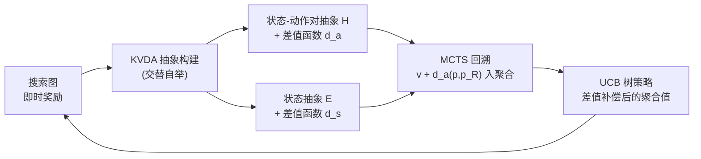

# Grouping Nodes with Known Value Differences: A Lossless UCT-based Abstraction Algorithm

**会议**: ICLR 2026  
**OpenReview**: [https://openreview.net/forum?id=Zk0zZMSAYc](https://openreview.net/forum?id=Zk0zZMSAYc)  
**代码**: 已开源（论文中 Schmöcker, 2025，C++ 实现）  
**领域**: 强化学习 / MCTS 规划  
**关键词**: Monte Carlo Tree Search, UCT, 状态抽象, OGA-UCT, 确定性 MDP, 样本效率  

## 一句话总结
本文提出 KVDA-UCT，把 MCTS 抽象从"只合并价值相等的节点"放松为"只要价值差可被推断就合并"，在不引入任何新参数、不损失精确性的前提下，比当前最优的 OGA-UCT 发现显著更多的抽象，从而提升确定性环境下的样本效率。

## 研究背景与动机
**领域现状**：Monte Carlo Tree Search（MCTS）的核心瓶颈是样本效率，一个有效的提升手段是在搜索树内部把"价值相同"的状态/状态-动作对分组，用聚合统计量替代单节点统计量，从而打通同层信息流。当前确定性环境下的 SOTA 抽象算法是 OGA-UCT，它基于 ASAP 框架，通过分析搜索图检测"在最优策略下具有相同 $Q^*$ 值"的节点。

**现有痛点**：ASAP 框架要求被合并的两个状态-动作对必须有**完全相同的即时奖励**（$|R(s_1,a_1)-R(s_2,a_2)|=0$）。这个条件过于刚性——很多节点的 $Q^*$ 值只差一点点（或差一个可计算的常数）却无法合并。前作 $(\varepsilon_a,\varepsilon_t)$-OGA 试图用阈值放松奖励相等条件，但带来两个新问题：(1) 引入两个需要调的超参数，调参困难；(2) 合并非价值等价的节点可能直接损害性能，使算法无法收敛到最优动作。

**核心矛盾**：抽象数量（样本效率）与抽象精确性（losslessness）之间难以兼得——想合并更多节点就得容忍误差，而容忍误差又可能破坏最优性保证。

**本文目标**：在**不损失精确性**、**不引入任何新参数**的前提下，让确定性环境下发现的抽象数量逼近"完全忽略奖励"的激进版本 $(\infty,0)$-OGA。

**核心 idea**：**[已知价值差抽象]** 不再坚持"只合并价值相等的节点"，而是"只要两个节点的价值差能被推断出来，就把它们合并"。价值差通过分析搜索树的即时奖励链式推导得到；在使用抽象做聚合时，先把价值差补偿掉再求平均。ASAP 在这个视角下只是"价值差恒为 0"的特例。

## 方法详解

### 整体框架
KVDA（Known-Value-Difference-Abstractions）扩展了 ASAP：ASAP 在抽象之上迭代构建抽象，而 KVDA 维护一个"(抽象, 差值函数) 对"并交替自举。给定状态抽象与差值函数，构造状态-动作对抽象及其差值函数 $d_a$；反过来给定状态-动作对抽象，构造状态抽象及其差值函数 $d_s$。差值函数被设计为在收敛时精确等于真实的 $Q^*$/$V^*$ 之差，因此抽象是"无损"的——只合并具有相同或已知差值 $Q^*$ 的节点。算法 KVDA-UCT 把该框架嵌入 MCTS 的树策略与回溯阶段，是 $(\varepsilon_a,\varepsilon_t)$-OGA 在 $\varepsilon_a$ 解耦后的自然推广。

### 关键设计

**1. 放松合并条件：丢掉奖励相等、保留转移相等**　KVDA 构造状态-动作对抽象时，相比 ASAP 删去了即时奖励必须相等的约束，只保留抽象后继分布相等这一条件：两个状态-动作对 $(s_1,a_1),(s_2,a_2)$ 等价当且仅当 $\sum_{x\in X}\big|\sum_{s'\in x}P(s'\mid s_1,a_1)-P(s'\mid s_2,a_2)\big|=0$，其中 $X$ 是当前状态抽象的等价类。奖励的差异不再阻止合并，而是被记录到差值函数里。这就是 KVDA 能比 ASAP 发现"严格更多"抽象的根源——在 Game of Life 这类即时奖励等于存活细胞数的环境里，细胞数不同的状态原本永远无法被 ASAP 合并，KVDA 却能合并它们。

**2. 差值函数的链式推导与可靠性**　被合并的两个节点价值差 $d_a$ 由即时奖励差与后继状态价值差递归累加得到：

$$d_a(p_1,p_2)=R(p_2)-R(p_1)+\sum_{x\in X}\sum_{s'\in x}\big(P(s'\mid p_1)-P(s'\mid p_2)\big)\cdot d'_s(s', s_x)$$

其中 $s_x$ 是等价类 $x$ 的任意固定代表元（论文证明 $d_a$ 的取值与代表元选择无关）。状态侧抽象 $E$ 则要求两个状态的动作能两两配对、且**所有配对的价值差都等于同一个常数 $d$**——这个 $d$ 就是 $d_s(s_1,s_2)$。这样把"价值相等"推广为"价值差恒定"，仍然构成等价关系。论文证明（附录 A.2）收敛时 $d_a,d_s$ 精确等于 $Q^*,V^*$ 之差，即抽象在确定性设置下无损。

**3. 差值补偿的 MCTS 回溯**　使用抽象时不能直接平均原始价值，而要先做差值补偿。每个抽象 Q 节点选一个代表元 $p_R$，统计量以代表元价值为基准：当原始节点 $p$ 以价值 $v$ 回溯时，写入抽象统计量的是 $v+d_a(p,p_R)$；$p$ 反过来从抽象节点取聚合值时再减去 $d_a(p,p_R)$。若代表元发生切换到 $p_R'$，则给统计量补上 $n\cdot d_a(p_R,p_R')$（$n$ 为抽象访问次数）。这一设计带来 OGA-UCT 不具备的强性质：在确定性设置下，一旦某状态-动作对被证明与另一个差值为正（即可证非最优）的对合并，它们的探索项相同而 $Q$ 值差恰为 $d_a$，于是 **KVDA-UCT 永远不会再访问这个次优动作**，把采样预算全留给有希望的分支。

**4. 增量维护与计算加速**　为让频繁重算抽象可行，KVDA-UCT 沿用 OGA 的 recency counter 机制：Q 节点计数器超阈值时不仅重算抽象，还重算其到代表元的差值，差值变化会触发父节点的抽象与差值函数重评估。状态抽象的完美配对（式 6）代价高，论文改用更严格但更快的充分条件——先检查同一抽象内动作的价值差为零，再检验 $s_1,s_2$ 间任取一个 ground 动作的价值差在所有抽象节点上恒定。整套修改不引入任何新超参（$\varepsilon_t$-KVDA 不依赖 $\varepsilon_a$，确定性下 $\varepsilon_t=0$ 即为纯 KVDA-UCT）。

## 实验关键数据

### 抽象发现率（Tab. 1，确定性环境）
比值 = 非平凡抽象 Q 节点数 / 总抽象 Q 节点数，越小代表合并越多（1=无抽象）。KVDA-UCT 几乎在每个环境都比 OGA-UCT 合并更多，且整体逼近"完全忽略奖励"的 $(\infty,0)$-OGA：

| 环境 | KVDA-UCT (ours) | OGA-UCT | $(\infty,0)$-OGA |
|---|---|---|---|
| d-SysAdmin | **0.15** | 0.48 | 0.20 |
| d-Wildfire | **0.19** | 0.37 | 0.30 |
| d-Tamarisk | **0.35** | 0.56 | 0.39 |
| d-Earth Observation | **0.65** | 0.99 | 0.68 |
| d-Manufacturer | **0.64** | 0.95 | 0.79 |
| d-Sailing Wind | **0.70** | 0.92 | 0.74 |
| d-Constrictor | 0.98 | 0.97 | 0.97 |

SysAdmin、Wildfire 等环境抽象率直接翻倍以上；Constrictor 等少数环境无增益。

### 参数最优性能（Tab. 2，平均回报↑，1000 次迭代）
所有方法均在 $C\in\{0.5,1,2,4,8,16\}$ 上取最优；$(\varepsilon_a,0)$-OGA 额外调 $\varepsilon_a$：

| 环境 | OGA-UCT | $(\infty,0)$-OGA | $(\varepsilon_a,0)$-OGA | KVDA (ours) |
|---|---|---|---|---|
| d-Manufacturer | −1255.6 | −1658.4 | −1246.0 | **−1158.2** |
| d-Push Your Luck | 125.1 | 66.7 | 132.4 | **137.9** |
| d-Wildfire | −195.6 | −503.5 | −415.0 | **−179.9** |
| d-Earth Observation | −7.18 | −30.0 | −30.0 | **−7.02** |
| d-SysAdmin | 477.1 | 448.4 | 450.7 | **477.2** |
| d-Skills Teaching | 207.9 | 211.3 | 211.3 | **216.2** |
| d-Connect4 | 42.7 | 46.8 | 47.5 | **47.9** |

KVDA-UCT 在多数环境优于 OGA-UCT，且即便对手 $(\varepsilon_a,0)$-OGA 做了额外调参，KVDA 仍持平或更优——而它**不需要任何额外参数**。

### 关键发现
- **无损得到验证**：对可用价值迭代求解的环境（Saving / Sailing Wind / Skills Teaching），实证确认 KVDA 只合并真正具有相同或已知差值 $Q^*$ 的节点，比 ASAP 检测到严格更多的真等价。
- **泛化能力**：用 normalized pairings score 评估单一参数设置的跨任务表现，前两名均被 KVDA 方法占据。
- **随机环境的边界**：扩展版 $\varepsilon_t$-KVDA 在随机环境中通常不如 $(\varepsilon_t,\varepsilon_a)$-OGA，但在个别环境取得最佳，可作为补充工具。

## 亮点与洞察
- **范式转变**：把抽象研究从"找价值等价"推广到"找价值差可推断"，这是概念层面的真正突破，而非工程调参。"价值差恒定"同样构成等价关系这一观察非常优雅。
- **免费午餐**：在不损精确性、不加参数的前提下提升样本效率，几乎没有代价——尤其相比 $(\varepsilon_a,\varepsilon_t)$-OGA 的调参负担和潜在的最优性破坏，这点极具实用价值。
- **剪枝副产品**：差值补偿天然带来"可证次优动作不再被访问"的强剪枝性质，把采样预算集中到有价值分支，是 OGA-UCT 做不到的。
- **理论扎实**：收敛性与 $d_a,d_s$ 的可靠性都有形式化证明，losslessness 不是经验断言而是定理。

## 局限与展望
- **随机环境不占优**：$\varepsilon_t$-KVDA 在随机 MDP 中很少超过 $(\varepsilon_t,\varepsilon_a)$-OGA，本文核心优势仅在确定性设置才成立——这是无损性保证的边界。
- **适用范围受限**：方法要求奖励非常数、非稀疏，否则 KVDA-UCT 与 OGA-UCT 退化为语义等价；棋类等稀疏奖励环境需人工设计启发式势函数 $V^h$ 来稠密化奖励。
- **计算开销**：差值函数的链式重算与增量维护增加了每次抽象更新的成本，论文用更严格的充分条件近似完美配对来缓解，但仍是潜在瓶颈。
- **未来方向**：把已知价值差的思想更深入地引入随机设置、与基于学习的 MCTS（如 AlphaZero）结合，是作者点出的延伸空间。

## 相关工作与启发
本文处于 MCTS 自动抽象的谱系中：AS-UCT（Jiang 2014）→ ASAP（Anand 2015）→ OGA-UCT（Anand 2016）→ $(\varepsilon_a,\varepsilon_t)$-OGA（Schmöcker 2025）。与之并行的还有"乐观粗抽象再细化"路线（Hostetler 2015）和转移函数剪枝路线（Sokota 2021 等）。KVDA 的启发在于：当精确等价太稀有时，与其放松到"近似等价"换数量（牺牲正确性），不如换个维度——**把差异显式建模为可补偿的量**，从而既增加数量又保留无损。这种"用结构化差值替代阈值近似"的思路，对其他需要状态聚合的 RL/规划场景（如表示学习中的 bisimulation 度量）有借鉴意义。

## 评分
- **新颖性**: ⭐⭐⭐⭐⭐　从"价值等价"到"价值差已知"是真正的概念突破，而非增量调参，且自洽优雅。
- **实验充分度**: ⭐⭐⭐⭐　覆盖 20+ 个 IPPC/棋类/经典抽象环境，含抽象率、参数最优、泛化三类实验且重复 ≥2000 次给 99% 置信区间；但随机环境劣势与计算开销缺少更系统的量化。
- **写作质量**: ⭐⭐⭐⭐　理论推导清晰、有形式化证明与直观示例（Fig. 1 三抽象例子），但符号密集、对不熟悉 OGA/ASAP 的读者门槛较高。
- **价值**: ⭐⭐⭐⭐　对确定性 MDP 规划是即插即用、无参数、无损的样本效率提升，实用价值高；适用范围（确定性、非稀疏奖励）限制了影响面。

<!-- RELATED:START -->

## 相关论文

- [\[ICLR 2026\] Value Flows](value_flows.md)
- [\[ICLR 2026\] Relative Value Learning](relative_value_learning.md)
- [\[ICLR 2026\] Policy Newton Algorithm in Reproducing Kernel Hilbert Space](policy_newton_algorithm_in_reproducing_kernel_hilbert_space.md)
- [\[ICLR 2026\] Universal Value-Function Uncertainties](universal_value-function_uncertainties.md)
- [\[ICLR 2026\] Offline Preference-based Value Optimization](offline_preference-based_value_optimization.md)

<!-- RELATED:END -->
