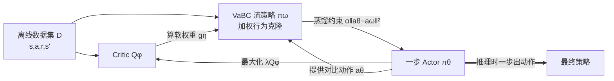

# Guided Flow Policy: Learning from High-Value Actions in Offline Reinforcement Learning

**会议**: ICLR 2026  
**OpenReview**: [https://openreview.net/forum?id=EBjy1rmpv0](https://openreview.net/forum?id=EBjy1rmpv0)  
**代码**: [simple-robotics.github.io/publications/guided-flow-policy](https://simple-robotics.github.io/publications/guided-flow-policy)（JAX 实现，rebuttal 后发布）  
**领域**: reinforcement learning  
**关键词**: 离线强化学习, 行为正则化, 流匹配, 加权行为克隆, BRAC, 价值感知正则  

## 一句话总结
GFP 把"流匹配行为克隆 + 一步蒸馏 actor"的双策略 BRAC 框架升级为**价值感知**版本：用 critic 和 actor 给数据集动作打软分，让行为克隆只重点模仿高价值动作，而不是无差别地克隆所有 state-action 对，从而在 144 个离线 RL 任务上拿到 SOTA。

## 研究背景与动机
**领域现状**：离线强化学习只能从静态数据集学策略，主流的 BRAC（Behavior-Regularized Actor-Critic）家族通过强制策略"靠近"数据集行为分布来抑制对分布外（OOD）动作的 Q 值高估——最简单的做法就是在 actor 损失里直接加一项行为克隆（BC）损失（如 TD3+BC、ReBRAC）。近年流匹配/扩散等表达力强的生成模型被引入，FQL（Park et al., 2025）把流匹配 BC 蒸馏成一步策略，既保留多模态建模能力，又避免了迭代采样和 BPTT 的开销。

**现有痛点**：所有这些 BRAC 方法的正则项都**无差别地对待数据集里的每一个动作**——BC 损失把高价值动作和低价值动作一视同仁地克隆。FQL 的流匹配 BC 同样不含任何 reward 信息。

**核心矛盾**：数据集往往是次优的，里面既有好动作也有差动作。正则得太松会高估 OOD 动作导致崩溃；正则得太严又会把策略锁死在次优动作上，无法利用数据集中本就存在的高回报动作。**克隆所有动作 ≠ 克隆好动作**，但现有正则机制无法区分二者。

**本文目标**：在 BRAC 框架的正则项里注入"价值感知"，让行为克隆有选择性地偏向数据集中最有希望的转移。

**核心 idea（价值感知行为克隆 VaBC）**：让流匹配 BC 策略 πω 与一步 actor πθ 形成**双向引导**——actor 和 critic 给每个数据集动作算一个软权重，引导 πω 重点克隆高价值动作；反过来 πω 又作为分布正则器把 actor 约束在数据集高价值动作的支撑集内，同时最大化 critic。

## 方法详解

### 整体框架
GFP 由三个组件构成：critic $Q_\phi$、一步 actor $\pi_\theta$、以及多步流匹配的价值感知 BC 策略 $\pi_\omega$（VaBC）。三者交替训练、互相引导：critic 评估动作价值，actor 在 critic 引导下追求高回报并被 VaBC 蒸馏约束，VaBC 则借助 actor 和 critic 的打分有选择地克隆数据集里的高价值动作。

### 关键设计

**1. 价值感知引导函数 gη：用 softmax 给数据集动作打软分** 这是 GFP 的灵魂。对每个数据集 state-action 对 $(s,a)$，GFP 不直接克隆它，而是先比较"数据集动作 $a$"和"actor 提案动作 $\mu_\theta(s,z)$"哪个 Q 值更高，用一个 softmax 形式的引导权重

$$g_\eta(s,a) = \frac{\exp(\tfrac{\lambda}{\eta} Q_\phi(s,a))}{\exp(\tfrac{\lambda}{\eta} Q_\phi(s,a)) + \exp(\tfrac{\lambda}{\eta} Q_\phi(s,\mu_\theta(s,z)))}$$

当数据集动作 Q 值更高时 $g_\eta>0.5$，加大克隆权重；当数据集动作较差时 $g_\eta<0.5$，削弱其影响。由于 $g_\eta\in(0,1)$ 天然有界，早期 critic 不可靠时也不会退化，保证训练稳定。相比 AWR 风格的指数优势加权 $g^{\mathrm{AWR}}_\eta=\exp(\tfrac{\lambda}{\eta}(Q_\phi(s,a)-Q_\phi(s,\mu_\theta)))$ 需要额外裁剪才能稳，这个 softmax 形式更鲁棒。

**2. VaBC 加权流匹配损失：只让高价值动作主导速度场** 把上面的软权重直接乘进标准的条件流匹配 BC 损失，得到 VaBC 的训练目标

$$L_{\mathrm{VaBC}}(\omega) = \mathbb{E}_{(s,a)\sim D,\,\epsilon\sim\mathcal{N}(0,I),\,t\sim U([0,1])}\left[g_\eta(s,a)\,\|v_\omega(t,s,a_t) - (a-\epsilon)\|_2^2\right]$$

其中 $a_t=(1-t)\epsilon + ta$ 是噪声与动作的线性插值，目标速度为 $a-\epsilon$（最优传输变体的流匹配）。关键性质：**VaBC 只在数据集内的 state-action 对上训练**，所以即使温度 η 极低、过滤极尖锐，它也永远跳不出数据集动作分布——这正是它能安全充当 actor 正则器的根本原因。

**3. 温度 η 控制过滤锐度：在数据保真与价值利用间取舍** 温度 $\eta$ 调节 $g_\eta$ 的尖锐程度：η 大（≥10⁻¹）→ 软过滤，几乎无差别克隆（退化为 FQL）；η 中等（≈10⁻³）→ 适度过滤，既偏向高价值动作又保留多样性和探索，效果最佳；η 极小（≤10⁻⁵）→ 强过滤，几乎只克隆最高价值动作，但会过度集中导致 actor 被推出分布、critic 高估而训练崩溃。论文用一张图直观展示了从 BC 到强过滤的连续谱。

**4. 一步 actor 的双向蒸馏：最大化 critic 同时贴近 VaBC** actor 通过行为正则化的策略梯度训练，既最大化 Q 又被蒸馏向 VaBC：

$$L_A(\theta) = \mathbb{E}_{s\sim D,\,z\sim\mathcal{N}(0,I)}\left[-\lambda Q_\phi(s,\mu_\theta(s,z)) + \alpha\|\mu_\theta(s,z) - \mu_\omega(s,z)\|_2^2\right]$$

其中 $\lambda=1/(\tfrac{1}{N}\sum|Q_\phi(s,a)|)$ 是 minibatch 上的 Q 值归一化因子（沿用 TD3+BC），在各损失项间保持一致尺度。蒸馏项 $\alpha\|\mu_\theta-\mu_\omega\|^2$ 把 actor 约束在 VaBC 学到的高价值动作支撑集附近，让 actor 既追求高回报又不跑到 OOD 区域。actor 是一步策略，推理时无需迭代采样、无需 BPTT。此外 critic 默认用标准 Bellman target，也可选用更保守的 $y_{\mathrm{VaBC}}=r+\tfrac{\gamma}{2}(Q_{\bar\phi}(s',\mu_\theta)+Q_{\bar\phi}(s',\mu_\omega))$，对 actor（易高估）和 VaBC（易低估）两个估计取平均。

## 实验关键数据

### 主实验表格
在 D4RL + Minari + OGBench 共 **144 个任务**（含像素任务）上评测，约 1.5 万次 run。下表为 OGBench 部分代表性结果（8 seeds，加粗为最优 95% 内）：

| 任务类别 | IQL | ReBRAC | FQL | **GFP actor πθ** |
|---|---|---|---|---|
| antmaze-large-navigate (5) | 53 | **95.9** | 88.1 | 93.8 |
| antmaze-large-explore (5) | 12.9 | 82.7 | 87.9 | **91.9** |
| humanoidmaze-large-navigate (5) | 2 | 12.9 | 6.5 | **17.8** |
| cube-double-play (5) | 7 | 12.6 | 29 | **47.2** |
| cube-double-noisy (5) | 4.5 | 19.6 | 38.2 | **63.1** |
| cube-triple-play (5) | 0.1 | 2.9 | 3.9 | **15.9** |
| cube-triple-noisy (5) | 4.8 | 5.2 | 3.5 | **24.5** |
| puzzle-4×4-play (5) | 7 | 17.1 | 17 | **26.1** |

在 Park et al. (2025) 报告的 50 个 OGBench 任务上对比 10 个先前方法，GFP 的 performance profile 明显领先全部基线。

### 消融实验表格
温度 η 是核心超参，论文用 performance profile 验证了"中等温度最优"的取舍曲线；附录还报告了用 AWR 风格 $g^{\mathrm{AWR}}_\eta$ 替代 softmax 引导（65 任务）、以及保守 Bellman target $y_{\mathrm{VaBC}}$ 的消融。

| 变体 | 说明 | 结论 |
|---|---|---|
| η 软过滤（大） | 退化为 FQL 无差别 BC | 次优，丢失价值感知 |
| η 中等（≈10⁻³） | 软偏向高价值 + 保留多样性 | **最佳取舍** |
| η 强过滤（极小） | 几乎只克隆最高价值动作 | actor 出分布、critic 高估、崩溃 |
| gη softmax vs g^AWR | softmax 有界 (0,1) | softmax 更稳，无需裁剪 |

### 关键发现
- **次优/噪声数据集增益最大**：在 cube-double-noisy（63 vs FQL 38、ReBRAC 20）、cube-triple-noisy（24 vs 4/5）等噪声任务上 GFP 大幅领先，正好印证"价值感知正则在数据质量差时最有用"。
- **难任务上拉开差距**：humanoidmaze-large-navigate（18 vs 7/13）、cube-triple-play（16 vs 4/3）等高难度任务 GFP 优势显著。
- **重评估前人工作**：论文重新调参复现 ReBRAC/FQL，发现超参和实现细节对结果影响巨大（呼应 ReBRAC 的回顾性分析精神），不少先前报告的分数被刷新。
- **VaBC 作为副产物**：πω 本身也能直接当策略用，但 actor πθ 才是主策略，二者性能在不同任务上各有高低。
- **高效**：单次训练在现代 GPU 上 < 30 分钟。

## 亮点与洞察
- **"克隆所有动作"到"克隆好动作"的一字之差**：GFP 抓住了 BRAC 家族一个被长期忽视的盲点——正则项无差别对待数据集动作。把 reward 信息注入正则项这一步看似简单，却是 TD3+BC、FQL 这类 minimalist 方法一直缺失的拼图。
- **softmax 引导比指数优势加权更优雅**：用 $g_\eta\in(0,1)$ 的有界 softmax 替代 AWR 的无界指数权重，天然避免早期训练退化，省掉了裁剪 trick，是个小而扎实的工程洞察。
- **双向引导的对称美**：actor 给 VaBC 提供"对比动作"来判断数据集动作好坏，VaBC 又反过来约束 actor 不跑出分布，两个策略互为镜像、互相托底。
- **"VaBC 永远跳不出分布"的安全保证**：因为它只在数据集内训练，所以无论温度多极端都不会失控，这给激进过滤提供了安全边界。

## 局限与展望
- **温度 η 任务敏感**：最优温度需要在数据保真和价值利用间手调，论文也承认极端温度会崩溃，缺少自适应 η 的机制。
- **依赖 critic 质量**：引导权重 $g_\eta$ 完全由 $Q_\phi$ 驱动，若 critic 本身在某些任务上估计偏差大，价值感知反而可能误导克隆。
- **三组件交替训练**：相比单策略方法引入了 actor、VaBC、critic 三方耦合，超参（α、η、保守 target 开关）更多，调参负担更重。
- **保守 Bellman target 非默认**：$y_{\mathrm{VaBC}}$ 只在部分任务有效，何时启用缺乏明确判据。

## 相关工作与启发
- **BRAC 家族**：TD3+BC（Fujimoto & Gu, 2021）、ReBRAC（Tarasov et al., 2023）是 minimalist 行为正则的代表，GFP 直接建立在其 actor 损失结构上并补上价值感知。
- **流/扩散离线 RL**：Diffusion-QL（Wang et al., 2022）、FQL（Park et al., 2025）引入表达力强的生成策略，FQL 的"流匹配 BC 蒸馏成一步 actor"是 GFP 的最直接前身——GFP 本质是给 FQL 的 BC 组件装上价值过滤器。
- **加权行为克隆 / AWR**：AWR（Peng et al., 2019）、Zhang et al. (2025) 的优势加权思想被 GFP 借鉴并改造为 softmax 引导。
- **启发**：把"价值感知"注入正则项的思路普适——任何依赖无差别模仿数据分布的离线/模仿学习方法，都可以考虑用一个软的、有界的价值打分器来重加权，从而在次优数据上榨取更多性能。

## 评分
- **新颖性**: ⭐⭐⭐⭐ — 在成熟的 BRAC 框架里精准切入"无差别正则"这个盲点，softmax 价值引导 + 双向蒸馏设计干净，但本质是 FQL 的价值感知增强而非全新范式。
- **实验充分度**: ⭐⭐⭐⭐⭐ — 144 任务、约 1.5 万 run、跨 D4RL/Minari/OGBench，还重评估了前人 SOTA，覆盖面与严谨度都很高。
- **写作质量**: ⭐⭐⭐⭐ — 动机叙述清晰，Fig.1/Fig.2 把双向引导和温度过滤讲得直观，公式与算法完整。
- **价值**: ⭐⭐⭐⭐ — 方法简单可复现、训练快（<30min）、在次优/噪声数据上增益明显，对离线 RL 落地有实用价值。

<!-- RELATED:START -->

## 相关论文

- [\[ICLR 2026\] Reinforcement Learning via Value Gradient Flow](reinforcement_learning_via_value_gradient_flow.md)
- [\[ICLR 2026\] One-Step Flow Q-Learning: Addressing the Diffusion Policy Bottleneck in Offline RL](one-step_flow_q-learning_addressing_the_diffusion_policy_bottleneck_in_offline_r.md)
- [\[ICLR 2026\] Flow Actor-Critic for Offline Reinforcement Learning (FAC)](flow_actor-critic_for_offline_reinforcement_learning.md)
- [\[ICLR 2026\] Peng's Q($\lambda$) for Conservative Value Estimation in Offline Reinforcement Learning](pengs_qlambda_for_conservative_value_estimation_in_offline_reinforcement_learnin.md)
- [\[ICML 2026\] Fast and Highly Expressive Policy Learning for Offline Reinforcement Learning via Bootstrapped Flow Q-Learning](../../ICML2026/reinforcement_learning/fast_and_highly_expressive_policy_learning_for_offline_reinforcement_learning_vi.md)

<!-- RELATED:END -->
