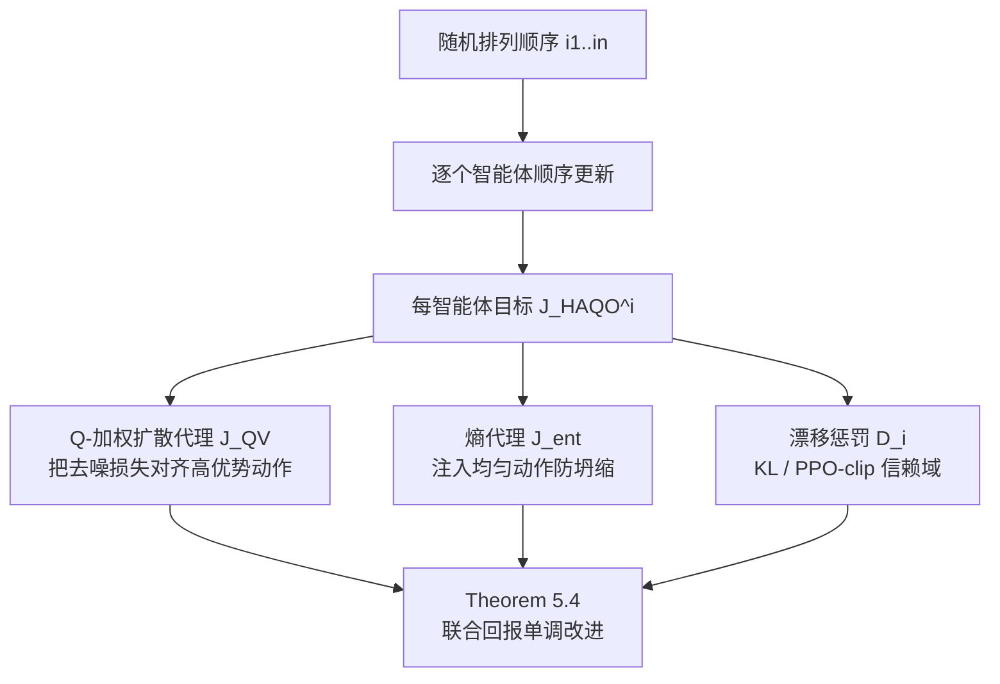

# Heterogeneous Agent Q-weighted Policy Optimization

**会议**: ICLR 2026  
**OpenReview**: [https://openreview.net/forum?id=kPrvXjUZPG](https://openreview.net/forum?id=kPrvXjUZPG)  
**代码**: 待确认  
**领域**: 强化学习 / 多智能体强化学习  
**关键词**: 多智能体强化学习, 异构智能体, 扩散策略, Q-加权变分目标, 顺序更新, 信赖域, 单调改进保证  

## 一句话总结
HAQO 把"顺序优势更新 + Q-加权扩散策略 + 熵正则"三件套统一进一个框架，让异构多智能体既能用扩散模型表达多模态策略，又能像信赖域方法那样保证联合回报单调改进。

## 研究背景与动机
- **领域现状**：协作式 MARL 长期被两类方法主导——值分解 / 信赖域方法（QMIX、MAPPO、HAPPO、HATRPO）有稳定性保证，但策略类被限制成单峰高斯；而扩散、归一化流等表达力强的生成式策略能刻画多模态行为，却缺乏优化层面的改进保证。
- **现有痛点**：异构场景（智能体观测空间/动作空间/角色各不相同）下，单峰高斯策略会**模式坍缩**到次优单一策略，无法表达协调所需的多模态行为；而同时更新所有异构智能体又会因优势函数定义在联合策略上而引入非平稳性，破坏改进保证。
- **核心矛盾**：**稳定性 ↔ 表达力**——稳定性要求约束更新避免发散，表达力要求捕捉多模态策略，两者在异构 MARL 里难以兼得。扩散策略的对数似然 $\log\pi^i$ 不可解析计算，使得经典的似然比代理与熵正则都失效。
- **本文目标**：在异构 MARL 中同时拿到表达力（多模态扩散策略）和稳定性（单调改进 + 信赖域），并给出形式化的回报差界。
- **核心 idea**：**顺序更新提供稳定性** + **Q-加权变分目标把扩散策略的去噪损失对齐到回报最大化** + **熵代理在无法算似然时维持探索**，三者合成一个每智能体的信赖域优化目标，并证明其单调改进。

## 方法详解

### 整体框架
HAQO 在 CTDE 范式下，把每个智能体的更新拆成"顺序 + Q-加权 + 熵正则"三层：智能体按随机排列顺序逐个更新，每个智能体在其前驱已更新的策略条件下，最大化一个由 Q-加权去噪代理（驱动回报改进）、熵代理（注入探索）和漂移惩罚（KL 或 PPO-clip 约束在基线策略邻域）组成的目标，最终证明整体联合回报单调改进。

### 关键设计

**1. 顺序优势感知更新：把多智能体非平稳性拆成可控的逐项改进。** 同时更新所有智能体会让优势函数（定义在联合策略上）失效，从而丢掉改进保证。HAQO 沿用 HAML 的顺序更新思想，把回报差按智能体边际贡献做电报式分解 $J(\pi_{\text{new}})-J(\pi_{\text{old}})=\sum_{m=1}^{n}\big[J(\pi^{i_{1:m}}_{\text{new}},\pi^{i_{m+1:n}}_{\text{old}})-J(\pi^{i_{1:m-1}}_{\text{new}},\pi^{i_{m:n}}_{\text{old}})\big]$，每个智能体在前驱已更新、后继保持旧策略的条件下优化代理目标 $L_i(\pi^i)=\mathbb{E}_{s\sim\rho_{\pi_{\text{old}}},a^{-i}\sim\pi^{-i}_{\text{new}}}\mathbb{E}_{a^i\sim\pi^i}[A_i(s,a^i)]$。再对每个智能体施加信赖域约束 $\mathbb{E}_{s\sim\rho_{\pi_{\text{old}}}}\mathrm{KL}(\pi^i_{\text{old}}\|\pi^i)\le\delta_i$，使分布漂移只贡献二次小量。Proposition 5.1 由此给出界 $J(\pi_{\text{new}})-J(\pi_{\text{old}})\ge\sum_i\big[L_i(\pi^i_{\text{new}})-L_i(\pi^i_{\text{old}})\big]-\sum_i C_i\delta_i^2$，关键是惩罚随智能体数**线性**而非指数增长。

**2. 异构 Q-加权变分（QV）扩散目标：用非负权重把不可算似然的扩散去噪损失变成合法的策略梯度代理。** 扩散策略通过反向 SDE 隐式定义，$\log\pi^i$ 无法闭式求值，经典似然比代理失效。HAQO 借鉴 QVPO，对每个智能体定义去噪代理 $J^{QV}_i(\theta_i)=\mathbb{E}\big[\omega_i(s,a^i,a^{-i})\,\|\epsilon-\epsilon_{\theta_i}(\sqrt{\bar\alpha_t}a^i+\sqrt{1-\bar\alpha_t}\epsilon,s,t)\|^2\big]$，让去噪更新偏向高优势动作。由于优势 $A_i$ 可负、直接当权重会让目标符号不定而不再是下界，作者用两种保正变换：`qadv` 先中心化再整流 $\omega_i=\max\{0,A_i(s,a^i)-\mathbb{E}_{\tilde a^i}A_i(s,\tilde a^i)\}$ 维持权重校准，`qcut` 用阈值 $\omega_i=\max\{0,A_i\}\cdot\mathbb{1}\{A_i\ge\varepsilon\}$ 聚焦高优势样本、滤掉噪声。Proposition 5.2 证明 $L_i(\pi^i)\ge J^{QV}_i(\theta_i)-\xi_i$ 且 $\xi_i=O(\epsilon_Q)$（$\epsilon_Q$ 为 critic 偏置），在零偏置、反向过程良定的极限下取等——即扩散策略能拿到和经典策略梯度同等的保证而不需单峰假设。

**3. 扩散策略的熵代理：在无法算 $\log\pi^i$ 时用均匀动作注入维持探索。** 经典熵正则需要 $\log\pi^i(a^i|s)$，对隐式扩散策略不可行。HAQO 把**均匀采样的动作**注入去噪目标 $J^{ent}_i(\theta_i)=\mathbb{E}_{s,\tilde a^i\sim U(A_i),\epsilon,t}\big[\alpha_i\|\epsilon-\epsilon_{\theta_i}(\sqrt{\bar\alpha_t}\tilde a^i+\sqrt{1-\bar\alpha_t}\epsilon,s,t)\|^2\big]$，以状态无关的均匀重构作为基线，拓宽策略支撑。Proposition 5.3 证明该代理非负、并在动作协方差上强制谱下界 $\lambda_{\min}(\Sigma^i_s)\ge\sigma^2_{\min}>0$，从而给出熵下界 $H(A_i|s)\ge\frac{d_i}{2}\log(2\pi e\,\sigma^2_{\min})$，把最大熵 RL 原则扩展到不可解似然的设定，防止模式坍缩。

**4. 合成目标与单调改进定理。** 三件套合成每智能体目标 $J^{HAQO}_i(\theta_i)=\max_{\pi^i\in\mathcal{T}^i(\pi^i_{\text{old}})}J^{QV}_i(\theta_i)+J^{ent}_i(\theta_i)-D_i(\pi^i\|\pi^i_{\text{old}})$，其中 $\mathcal{T}^i$ 是基线策略周围的信赖域，$D_i$ 为 KL 或 PPO-clip 漂移惩罚。Theorem 5.4 在有界奖励、正则策略、critic 偏置 $\epsilon_Q$ 与顺序更新假设下证明 $J(\pi_{\text{new}})-J(\pi_{\text{old}})\ge\sum_i\big[J^{QV}_i+J^{ent}_i\big]-\sum_i C_i\delta_i^2-O(\epsilon_Q)$，Algorithm 1 配合 K-候选方差缩减，把中心化 critic 更新 + 随机顺序逐智能体策略优化落成可扩展算法。

## 实验关键数据

### 主实验表格（Multi-Agent MuJoCo，平均回报，括号为标准差）

| 环境 | HAA2C | MAPPO | HATRPO | HAPPO | HAQO |
|------|-------|-------|--------|-------|------|
| Ant-v2 4x2 | 5637 (86) | 5874 (32) | 5013 (432) | 5793 (59) | **6014 (201)** |
| HalfCheetah-v2 2x3 | 4231 (1069) | 6984 (132) | 5369 (247) | **7024 (103)** | 6873 (137) |
| Hopper-v2 3x1 | 1832 (923) | 3612 (57) | 3733 (102) | 3481 (173) | **3884 (81)** |
| Walker2d-v2 2x3 | 1124 (94) | 5013 (483) | 3744 (373) | 5523 (214) | **5681 (301)** |
| Walker2d-v2 6x1 | 1923 (234) | 4693 (247) | 2109 (223) | 4317 (401) | **4789 (293)** |
| Humanoid-v2 17x1 | − | 732 (13) | − | 6739 (201) | **7013 (311)** |

HAQO 在 6 个连续控制任务里 5 个拿到最高回报，Humanoid 17x1 这种高维多模态任务上优势尤其明显（高斯策略坍缩为同质行为导致行走不稳，扩散策略能捕捉交替腿相、躯干稳定、手臂协调等多模态步态）。

### 消融实验表格（GRF，高斯 vs 扩散策略，平均回报）

| 环境 | 高斯策略 | 扩散策略 |
|------|----------|----------|
| PS | 76.24 (8.23) | **92.14 (2.13)** |
| RPS | 43.27 (10.31) | **80.39 (3.87)** |
| 3 vs 1 with keeper | 66.82 (9.12) | **97.27 (1.07)** |

### 关键发现
- **顺序更新**（Bi-D 双手操作）：同时更新会因动作冲突频繁掉落物体、抓取不稳；顺序更新让智能体适应伙伴最新策略，学习更快、性能更高。
- **表达力**（GRF）：扩散策略不仅回报更高、方差也显著更小（3 vs 1 中高斯 66.82±9.12 vs 扩散 97.27±1.07），证明多模态表达在多模态协调里是必需而非锦上添花。
- **熵正则**（MPE 两智能体覆盖三地标）：无熵正则时智能体坍缩到只覆盖两个地标（过度利用），加熵代理后均衡覆盖全部地标，实证 Proposition 5.3 在无显式似然下也能防坍缩。

## 亮点与洞察
- 把"稳定性 vs 表达力"这个 MARL 老矛盾用一个**可证明**的框架统一起来，而不是经验性地堆 trick：顺序更新管稳定、QV 代理管对齐、熵代理管探索，三者各有命题/定理支撑。
- 真正解决了扩散策略的两个"不可算似然"痛点——QV 去噪代理替代似然比、均匀注入熵代理替代 $\log\pi$ 熵，思路干净且互相印证（一个把质量推向高优势，一个防止过度集中）。
- 改进界随智能体数**线性**增长（得益于顺序而非同时执行），对异构、规模扩展友好。
- qadv/qcut 两种保正变换的设计点很实在：直接用优势当权重会破坏下界性质，中心化整流与阈值滤波分别兼顾校准与选择性精度。

## 局限与展望
- 熵代理是**单侧**的——只防坍缩（保证熵下界），并不上界熵，与标准最大熵 RL 的对称约束不同。
- 改进保证依赖 critic 偏置 $\epsilon_Q$ 有界（Assumption A.4）与信赖域半径 $\delta_i$ 小，实际中扩散策略的方差与计算成本仍可能放大估计误差。
- 主表只用 3 个随机种子，MuJoCo 上 HAQO 与 HAPPO/MAPPO 在部分任务（如 HalfCheetah）差距不大，扩散策略带来的推理开销未在正文充分量化。
- 扩散去噪需要多步采样，在线 MARL 的实时性/吞吐与单峰高斯相比的代价值得进一步评估。

## 相关工作与启发
- **异构镜像学习 HAML**（Zhong et al., 2024）：HAQO 的顺序更新与单调改进框架直接建立在 HAML 的镜像下降与信赖域保证之上，把它从单峰策略推广到扩散策略。
- **QVPO / 优势加权**（Ding et al., 2024；AWR、RWR）：QV 变分目标把扩散 VLB 对齐到策略梯度的思路源自单智能体 QVPO，本文做了多智能体推广并加入顺序更新的重要性采样修正。
- **扩散/生成式策略**（Diffuser、Diffusion Policy）：提供了多模态表达力，但此前缺优化保证、且多限于同构设定；HAQO 补上了异构在线协作场景的稳定整合。
- 启发：当一类高表达力但似然不可算的模型（扩散、流、能量模型）想接入有理论保证的优化框架时，"找一个可算的、与目标对齐的非负代理 + 一个防坍缩的代理"是一条可复用的范式。

## 评分
- **新颖性**: ⭐⭐⭐⭐ 首次把扩散策略 + Q-加权变分 + 顺序信赖域统一进异构 MARL，并给出单调改进定理；虽各组件有前作，但组合与理论扩展（不可算似然下的下界与熵界）有实质创新。
- **实验充分度**: ⭐⭐⭐⭐ 覆盖 MPE/SMAC/GRF/Multi-MuJoCo/Bi-D 多套基准，三组消融分别验证三件套；扣分在种子数偏少、扩散开销与部分任务优势幅度未充分量化。
- **写作质量**: ⭐⭐⭐⭐ 动机—矛盾—方法—定理逻辑清晰，命题/定理与算法对应明确；公式偏密、部分表述略冗长。
- **价值**: ⭐⭐⭐⭐ 给"表达力强的生成式策略如何拿到 MARL 改进保证"提供了可证明、可落地的模板，对异构协作、机器人/双手操作等场景有直接借鉴意义。

<!-- RELATED:START -->

## 相关论文

- [\[ICLR 2026\] Multi-Agent Guided Policy Optimization](multi-agent_guided_policy_optimization.md)
- [\[ICLR 2026\] GEPO: Group Expectation Policy Optimization for Stable Heterogeneous Reinforcement Learning](gepo_group_expectation_policy_optimization_for_stable_heterogeneous_reinforcemen.md)
- [\[ICLR 2026\] Correlated Policy Optimization in Multi-Agent Subteams](correlated_policy_optimization_in_multi-agent_subteams.md)
- [\[ICLR 2026\] Dichotomous Diffusion Policy Optimization](dichotomous_diffusion_policy_optimization.md)
- [\[ICLR 2026\] TRAPO: Trust-Region Adaptive Policy Optimization](trust-region_adaptive_policy_optimization.md)

<!-- RELATED:END -->
