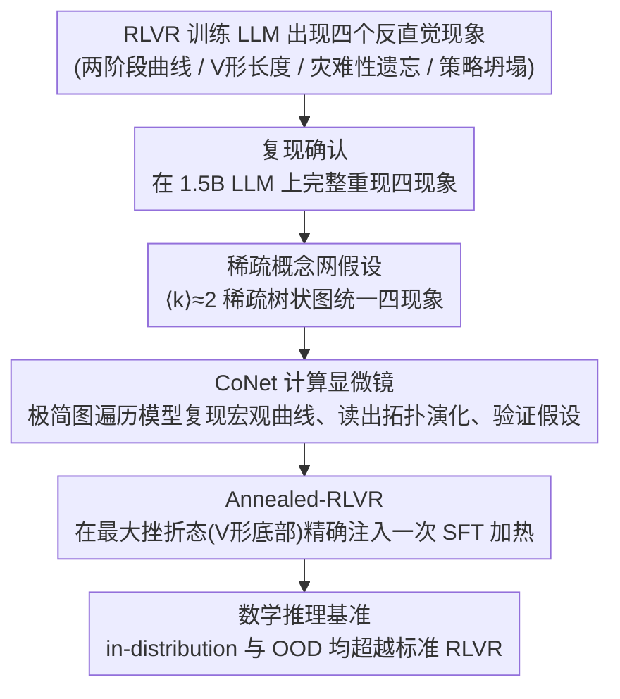

# How LLMs Learn to Reason: A Complex Network Perspective

**会议**: ICLR 2026  
**arXiv**: [2509.23629](https://arxiv.org/abs/2509.23629)  
**代码**: [https://anonymous.4open.science/r/CoNet-83A4](https://anonymous.4open.science/r/CoNet-83A4)  
**领域**: LLM推理 / 强化学习  
**关键词**: RLVR, 概念网络, 稀疏图, 灾难性遗忘, 退火算法

## 一句话总结
本文从复杂网络视角提出"稀疏概念网"理论来统一解释RLVR训练中四个令人困惑的现象（V形响应长度、两阶段学习曲线、灾难性遗忘、策略坍塌），揭示它们都源于平均度约为2的稀疏推理图的拓扑自组织，并据此设计Annealed-RLVR算法在数学推理基准上超越标准RLVR。

## 研究背景与动机

**领域现状**：RLVR（Reinforcement Learning with Verifiable Rewards）用于训练LLM的推理能力，代表性工作如DeepSeek-R1。但RLVR训练表现出四个令人困惑的现象：(1) 快速提升后长期平台期的两阶段学习曲线；(2) 正确答案长度先变短后变长的V形轨迹；(3) SFT后的灾难性遗忘；(4) 策略多样性坍塌。

**现有痛点**：现有解释各自孤立——平台期被归因于熵耗尽，V形被归因于冗余推理删减后的自我反思出现，灾难性遗忘被视为目标不匹配问题。缺乏统一框架将四个现象联系到共同的底层机制。

**核心矛盾**：直接从LLM的高维隐空间构建微观推理图极其困难，阻碍了对RLVR动力学结构根源的直接研究。

**本文目标**：提供一个统一的物理框架，将四个RLVR现象追溯到共同的拓扑自组织过程。

**切入角度**：受重整化群思想启发，不在token级别分析完整推理图，而是在语义级别研究粗粒化的"概念网"——一个平均度约为2的稀疏网络。使用简化的Concept Network Model (CoNet)作为计算显微镜验证。

**核心 idea**：提出并验证中心假设——RLVR训练后形成的概念网是一个平均度 $\langle k \rangle \approx 2$ 的稀疏网络。这种以树状结构为主的拓扑高效但脆弱，统一解释了V形曲线（从局部技能岛优化到全局网络集成时路径必然变长）、灾难性遗忘（关键"主干"边被切断导致子树不可达）和策略坍塌（叶节点的相变式学习累积导致探索冻结）。

## 方法详解

### 整体框架
本文不提新的训练方法，而是想回答一个机理问题：RLVR 训练 LLM 推理时，那四个反直觉现象（两阶段曲线、V 形长度、灾难性遗忘、策略坍塌）背后有没有一个共同的物理根源。整条研究链分四步走：先在 DeepSeek-R1-Distill-Qwen-1.5B 上完整复现这四个现象，确认它们真实可观测；再提出一个统一假设——训练后形成的"概念网"是平均度 $\langle k \rangle \approx 2$ 的稀疏图，并用它把四个现象串成一条因果链；接着把推理抽象成一个最小的图遍历模型 CoNet 当"计算显微镜"，在远比 LLM 简单、每条边都看得见的系统里复现同样的宏观曲线、直接读出训练时拓扑怎么演化并验证假设；最后把这套机理反过来用，设计出针对性干预算法 Annealed-RLVR，在数学推理基准上验证理论确实能转化为性能。

### 关键设计

**1. 稀疏概念网假设：用一个拓扑常数 $\langle k \rangle \approx 2$ 统一四个现象**

四个现象此前各有各的解释（平台期归因于熵耗尽、V 形归因于反思出现、遗忘归因于目标不匹配），彼此孤立。本文的核心主张是它们其实是同一个东西的不同侧面——RLVR 训练完成后，模型在语义层面组织出的"概念网"是一张平均度约为 2 的稀疏图，以树状主干为主，高效但脆弱。一旦接受这个拓扑事实，四个现象就被串成一条因果链。V 形长度对应网络的两阶段成形：下降段是若干独立"技能岛"各自做局部优化、删掉冗余路径，所以正确答案先变短；上升段是这些技能岛开始合并成一张全局概念网，而稀疏结构下平均测地距离会随网络规模增大，路径被迫变长，于是长度回升。灾难性遗忘则是 $\langle k \rangle = 2$ 的直接推论——主干边几乎是唯一连接，SFT 一旦覆写掉这些关键分支点的权重，整棵下游子树就被切断、变得不可达。策略坍塌来自叶节点上的相变式学习：每个叶子从探索到利用是一次 sharp transition，大量叶子陆续相变累积起来，全局探索多样性就被冻结。把这三件事统一到一张稀疏图上，正是这个假设的价值所在。

**2. CoNet 计算显微镜：在一个可完全追溯的玩具系统里复现 LLM 的宏观动力学**

直接从 1.5B LLM 的高维隐空间里抠出微观推理图几乎不可行，这是研究拓扑根源的最大障碍。CoNet 的做法是受重整化群启发做粗粒化：把 LLM 的"语义状态"映射成一张固定随机图上的抽象节点，把"逻辑过渡"映射成节点间可学习的概率边，于是整个学习过程退化成一个图遍历问题。关键观察是，这样一个极简模型竟然惊人地再现了 LLM 的 V 形曲线、两阶段学习等宏观行为——这本身就是"涌现行为由大尺度组织决定、不依赖微观细节"的有力佐证。因为 CoNet 的每条边、每个度数都看得见，它成了一台可读的显微镜：能直接量出训练中 $\langle k \rangle$ 是否真的稳定在 2 附近，能定位主干边被切断时遗忘怎么发生，把假设 1 里那些原本只能间接推断的机制变成可观测的量。

**3. Annealed-RLVR：在网络最脆弱的时刻精确注入一次 SFT 加热**

理解了机理就能开处方。标准 RLVR 的瓶颈在于技能岛合并阶段会陷入局部最优、最终走向策略坍塌。Annealed-RLVR 借模拟退火的思路打破它：在"最大挫折态"——技能岛竞争最激烈、恰好对应 V 形曲线底部的时刻——精确插入一段短暂的 SFT"加热"步骤，只针对那些准确率极低（$<0.1$）但确实存在正确解的难题施加 SFT，加热完立刻恢复 RLVR 继续"冷却"。之所以卡在这个时机，是因为最大挫折态正是探索多样性的峰值（对应原文 Figure 6b）：此时技能岛尚未固化成刚性的全局网络，对外部扰动最鲁棒，加热既能跳出局部最优、又不至于像错误时机的 SFT 那样切断已成形的主干而引发遗忘。加热打破局部最优、冷却把系统引向更优的全局配置，时机选择就是这套算法的全部要害。

### 损失函数 / 训练策略
RLVR 底层用 GRPO（Group Relative Policy Optimization）。Annealed-RLVR 在检测到 reward 曲线出现膝点、且响应长度落到 V 形底部时触发 SFT 加热（量级在几十步），加热结束后恢复标准 RLVR 训练。

## 实验关键数据

### 主实验

| 方法 | 训练集(512题) | Minerva(OOD) | AIME 2024/2025(OOD) |
|---|---|---|---|
| 标准RLVR | 基线 | 基线 | 基线 |
| **Annealed-RLVR** | **更优** | **更优** | **更优** |

### 消融实验

| 配置 | 效果 | 说明 |
|---|---|---|
| RLVR无干预 | 基线，后期策略坍塌 | 标准方法的固有问题 |
| 错误时机的SFT干预 | 灾难性遗忘 | 时机至关重要 |
| 最大挫折态SFT干预 | **最优** | 理论预测的最佳时机 |

### 关键发现
- CoNet（最小模型）和1.5B LLM展现出惊人一致的宏观动力学，支持"涌现行为不依赖微观细节"
- 概念网的平均度确实稳定在约2，直接验证了核心假设
- 灾难性遗忘后的快速恢复证实了"拓扑局部损伤"解释——知识未被擦除，只是变得不可达
- Annealed-RLVR在in-distribution和OOD基准上都超越标准RLVR

## 亮点与洞察
- **物理学视角的大一统理论**：用一个简洁的拓扑假设（$\langle k \rangle \approx 2$）统一解释四个独立现象，展示了跨学科思维的力量
- **最大挫折态=最佳探索时刻**：揭示了看似性能最差的时刻恰好是探索多样性最高的时刻，这个洞察对所有使用RLVR的研究者都有指导意义
- **从解释到处方**：不仅提出理论框架，还直接据此设计了可验证的优化算法，理论→实践的闭环完整

## 局限与展望
- CoNet是高度简化的模型，与真实LLM在规模和机制上差距巨大
- 核心假设（$\langle k \rangle \approx 2$）缺乏直接从LLM内部提取推理图的验证
- 仅在1.5B模型上验证，更大规模模型的适用性有待确认
- 退火时机的检测（V形底部/reward膝点）在实践中可能不总是清晰

## 相关工作与启发
- **vs DeepScaleR/DeepSeek-R1**: 提供RLVR训练动力学的理论解释，而非新的训练方法
- **vs 学习曲线分析工作**: 将宏观现象追溯到拓扑结构而非统计/优化视角
- 稀疏网络自组织的框架可能推广到理解其他涌现能力（如ICL、工具使用）

## 评分
- 新颖性: ⭐⭐⭐⭐⭐ 用复杂网络理论统一解释RLVR现象，视角全新
- 实验充分度: ⭐⭐⭐⭐ CoNet验证充分，LLM验证覆盖多个基准但模型规模有限
- 写作质量: ⭐⭐⭐⭐⭐ 叙事出色，从现象→理论→算法的逻辑链完整优雅
- 价值: ⭐⭐⭐⭐⭐ 对理解LLM推理学习机制有深远影响，Annealed-RLVR有实用价值

<!-- RELATED:START -->

## 相关论文

- [\[ICLR 2026\] ExGRPO: Learning to Reason from Experience](exgrpo_learning_to_reason_from_experience.md)
- [\[NeurIPS 2025\] ReSearch: Learning to Reason with Search for LLMs via Reinforcement Learning](../../NeurIPS2025/reinforcement_learning/research_learning_to_reason_with_search_for_llms_via_reinforcement_learning.md)
- [\[ICLR 2026\] How Far Can Unsupervised RLVR Scale LLM Training?](how_far_can_unsupervised_rlvr_scale_llm_training.md)
- [\[ICLR 2026\] On the Generalization of SFT: A Reinforcement Learning Perspective with Reward Rectification](on_the_generalization_of_sft_a_reinforcement_learning_perspective_with_reward_re.md)
- [\[AAAI 2026\] Reasoning with Exploration: An Entropy Perspective](../../AAAI2026/reinforcement_learning/reasoning_with_exploration_an_entropy_perspective.md)

<!-- RELATED:END -->
