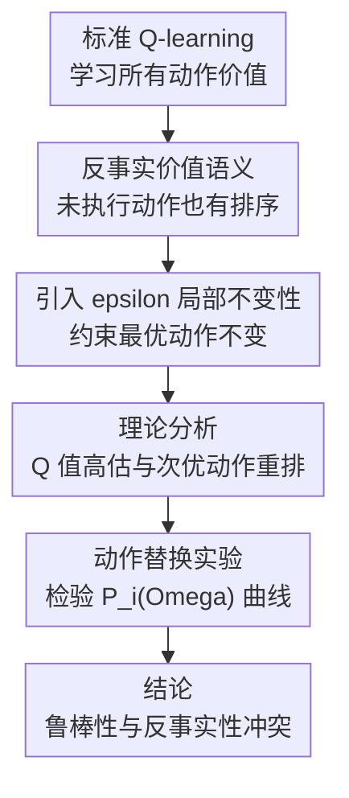

# How to Lose Inherent Counterfactuality in Reinforcement Learning

**会议**: ICLR2026  
**OpenReview**: [https://openreview.net/forum?id=2kutK2Y8Sv](https://openreview.net/forum?id=2kutK2Y8Sv)  
**代码**: 无  
**领域**: 强化学习 / 鲁棒强化学习  
**关键词**: 反事实价值, 鲁棒强化学习, 局部不变性, Q 值估计, 对抗训练

## 一句话总结

这篇论文从理论和 Atari 实验两条线说明：标准强化学习本来会给未执行动作学习有序的反事实价值，而显式追求 $\epsilon$-局部不变性的鲁棒训练会扭曲 Q 函数、重排次优动作、造成价值高估，并让策略丢掉这种反事实能力。

## 研究背景与动机

**领域现状**：深度强化学习用神经网络近似策略或 Q 函数后，已经能在 Atari 等高维状态 MDP 中学到复杂控制策略。与此同时，鲁棒强化学习和安全强化学习里有一条很有影响力的路线：既然小的观测扰动可能改变深度策略的动作选择，就在训练时显式约束策略在 $\epsilon$-ball 内保持动作不变，也就是让 $\arg\max_a Q(s,a)$ 对局部扰动不敏感。

**现有痛点**：这条路线看起来直觉很强，因为分类模型的对抗训练也常用类似的局部不变性目标。但强化学习的 Q 函数不是普通分类器的 logits，它要同时表示最优动作和所有未执行动作的长期回报。如果训练只关心“扰动前后最优动作身份不变”，就可能保住了表面动作，却牺牲了 Q 值排序和数值语义。

**核心矛盾**：论文抓住的矛盾是，RL 的价值学习天然包含反事实性：即使某个动作没有被执行，Q 函数也应估计“如果当时选它会怎样”。而 $\epsilon$-局部不变性训练把目标改成了“附近状态不能改变最优动作”，这会把所有次优动作推向服务于鲁棒 margin 的几何约束，而不再服务于真实 MDP 回报。

**本文目标**：作者想回答两个问题：第一，显式把安全或鲁棒性压进 Q-learning 更新，会对学到的价值函数产生什么后果；第二，为什么标准强化学习里那种看似朴素的反事实价值排序值得保留，而不是被当作可随意牺牲的副产物。

**切入角度**：论文把强化学习的数学直觉和神经科学中的反事实决策联系起来。人类决策不仅编码已选动作的价值，也会编码未选选项的价值，并用这种排序指导未来决策；标准 Q-learning 的 $Q(s,a)$ 在形式上正好有类似语义。作者认为，这个语义不是装饰，而是泛化和推理能力的一部分。

**核心 idea**：用一个可解析的线性 Q 函数 MDP 证明“准确估计 Q 值”和“强制 $\epsilon$-局部不变”之间存在结构性冲突，再用高维 Atari 实验证明鲁棒训练确实让 Q 函数失去反事实排序。

## 方法详解

### 整体框架

这篇论文不是提出一个新 RL 算法，而是做“机制诊断”：先形式化标准 RL 的反事实价值语义，再分析 $\epsilon$-局部不变性正则如何改变 TD loss，最后设计动作替换实验来检查训练好的 Q 函数是否仍然知道次优动作和最差动作的真实差别。整个框架的关键是把“鲁棒训练是否安全”转化为“Q 函数排序是否仍然与真实回报一致”。

在理论部分，作者分析的是线性函数近似下的 MDP，但目标不是停留在玩具例子，而是找出鲁棒正则的梯度偏好：它会倾向于扩大最优动作和竞争动作之间的 gap，即便这种扩大需要抬高某些 Q 值或打乱次优动作的真实顺序。在实验部分，作者把这个预测落到 ALE 的高维视觉状态上，比较 vanilla DDQN 和 SA-MDP、RADIAL、ORP 等 $\epsilon$-invariance 训练策略。

### 关键设计

**1. 反事实性定义：Q 函数不只服务于当前最优动作**

论文的第一步是重新强调 $Q(s,a)$ 的语义：在状态 $s$ 下，动作 $a_i$ 的 Q 值应该表示“先执行 $a_i$，之后再按最优策略行动”能得到的期望折扣回报。于是，一个训练好的 Q 函数不应该只知道 $a_1=\arg\max_a Q(s,a)$，还应该让 $a_2,a_3,\ldots$ 的排序对应真实后果。这里的反事实性并不是哲学概念，而是 Q-learning 更新本身赋予每个状态-动作对的估计目标。

这点对鲁棒训练很关键。很多 $\epsilon$-invariance 方法只检查局部扰动是否改变最优动作身份，也就是要求 $\arg\max_a Q(s,a)=\arg\max_a Q(\hat{s},a)$。但如果 Q 函数把第二好动作和最差动作排反了，最优动作仍然可能不变，鲁棒认证也可能看起来成立。论文因此把评估重心从“动作是否翻转”移到“整个动作价值排序是否还可信”。

**2. 局部不变性正则：为了保动作身份，训练会改写价值语义**

论文讨论的鲁棒 RL 基线会在 TD loss 之外加入正则项。这个正则项大致寻找 $\epsilon$-ball 中最危险的扰动状态 $\hat{s}$，让非最优动作的 Q 值不要超过原最优动作的 Q 值：

$$
R(\theta)=\sum_s \left(\max_{\hat{s}\in D_\epsilon(s)}\max_{a\ne a^*(s)} Q_\theta(\hat{s},a)-Q_\theta(\hat{s},a^*(s))\right).
$$

然后训练目标变成 TD Huber loss 加 $R(\theta)$。这个形式看起来只是给动作 margin 加保护，但论文指出它其实改变了优化器对 Q 函数的偏好：为了降低正则项，模型可以放大某些最优动作方向、压低某些竞争动作方向，甚至让数值远离真实 $Q^*$。也就是说，鲁棒正则不是在“真实价值函数上加一层保护壳”，而是在重新塑形价值函数本身。

这种机制解释了为什么 $\epsilon$-invariance 可能带来高估。若一个状态中最优动作只比次优动作略好，真实 Q 值会在局部状态插值中发生排序变化；要强行避免这种变化，模型可以把最优动作 Q 值整体抬高，或者扩大 action gap。表面上动作选择更稳定了，但 Q 值与真实 MDP 回报之间的校准关系被破坏。

**3. 线性 MDP 反例：准确估计和鲁棒不变不能同时免费获得**

论文的第一个核心定理构造了两个状态、两个动作的线性函数近似例子。设 $s_1,s_2$ 距离为 1，真实最优值满足 $Q^*(s_1,a_1)=\epsilon/10$、$Q^*(s_1,a_2)=0$、$Q^*(s_2,a_1)=0.8$、$Q^*(s_2,a_2)=1.0$。任何线性 Q 函数若在 $s_1,s_2$ 上精确匹配 $Q^*$，沿着两个状态之间的线段看，两条动作价值直线会在离 $s_1$ 很近的位置交叉，因此在 $\epsilon$ 邻域内最优动作会变，无法满足 $\epsilon$-局部不变性。

反过来，作者指出可以构造另一个线性 Q 函数，在 $s_1$ 仍保持正确最优动作，但把 $Q(s_1,a_1)$ 从真实的 $\epsilon/10$ 抬到 $0.8$，从而得到局部不变性。代价是 Q 值被严重高估，甚至高估因子达到 $8/\epsilon$。这个例子很锋利：问题不在某个优化算法没调好，而在“精确价值估计”和“局部动作不变”这两个目标本身就可能几何冲突。

**4. 动作替换曲线：用行为后果反推 Q 值排序是否可信**

为了在高维 Atari 中检验理论，论文提出性能下降曲线 $P_i(\Omega)$。对每个状态，把动作按 Q 值从大到小排序为 $a_1,a_2,\ldots,a_{|A|}$；然后随机抽取一部分比例为 $\Omega$ 的访问状态，在这些状态强制执行第 $i$ 好动作 $a_i$，其余状态仍执行 $a_1$。相对于 clean run 的归一化性能下降定义为：

$$
P=\frac{Score_{base}-Score_{actmod}}{Score_{base}-Score_{min}}.
$$

如果 Q 函数的反事实排序可信，那么强制执行第二好动作 $a_2$ 的损失应该小于执行最差动作 $a_w$ 的损失，也就是 $P_2(\Omega)<P_w(\Omega)$。论文还用 $\tau$-domination 比较两条曲线面积差：若一条曲线在积分意义上显著高于另一条，就说明对应动作造成了更大行为损失。这个评估很适合本文问题，因为它不只看 Q 值数值本身，而是看 Q 值排序在真实环境交互中是否兑现为回报差异。

### 一个完整示例

可以把 BankHeist 中某个局面想成一个例子。标准 DDQN 在状态 $s$ 下认为最优动作 $a_1$ 是继续朝目标移动，第二好动作 $a_2$ 是短暂停顿或换一条近似路线，最差动作 $a_w$ 是直接走向危险位置。若只在少量状态强制用 $a_2$，分数会下降，但不会崩掉；若强制用 $a_w$，下降应更明显。这正是“未选动作也被正确赋值”的反事实能力。

鲁棒 $\epsilon$-invariance 训练后的策略却出现反常现象：在多款游戏中，强制执行第二好动作造成的性能下降比执行最差动作还大，或至少第二好动作下降显著更大。直观地说，模型嘴上说 $a_2$ 是第二好，但环境回报告诉我们它并不比最差动作好。这说明 Q 函数保住了一个局部稳定的最优动作外壳，却把未执行动作的内部排序学乱了。

### 损失函数 / 训练策略

理论分析关注标准 Q-learning / DDQN 风格 TD 更新和 $\epsilon$-local invariance 正则的差异。标准目标是用 $r(s,a)+\gamma\max_{a'}Q_{target}(s',a')$ 回归 $Q_\theta(s,a)$；鲁棒训练则在这个目标上叠加局部最坏扰动正则，迫使 $D_\epsilon(s)$ 内非最优动作不能压过原最优动作。实验中 vanilla 策略用 DDQN 加 prioritized experience replay，鲁棒策略包括 State-Adversarial MDP RL、RADIAL 和 ORP，这些都属于围绕状态扰动鲁棒性或 Bellman 误差鲁棒性展开的代表性方法。

## 实验关键数据

### 主实验

论文在 Arcade Learning Environment 的 BankHeist、RoadRunner、Freeway 等高维 MDP 上比较 vanilla RL 和 $\epsilon$-invariance 训练。核心指标不是最终分数，而是动作修改后的性能下降面积；如果 $a_2$ 真是第二好动作，$P_2$ 不应大于最差动作 $P_w$。

| MDP | 动作修改 | $\epsilon$-Invariance AUC | Vanilla AUC | 现象 |
|-----|----------|---------------------------|-------------|------|
| BankHeist | $a_2$ | $0.449\pm0.007$ | $0.191\pm0.040$ | 鲁棒训练的第二好动作反而造成大幅损失 |
| BankHeist | $a_w$ | $0.311\pm0.011$ | $0.398\pm0.011$ | Vanilla 对最差动作更敏感，排序更合理 |
| RoadRunner | $a_2$ | $0.414\pm0.015$ | $0.247\pm0.009$ | 鲁棒训练下 $a_2$ 损失更大 |
| RoadRunner | $a_w$ | $0.345\pm0.011$ | $0.393\pm0.002$ | Vanilla 的最差动作确实更差 |
| Freeway | $a_2$ | $0.351\pm0.009$ | $0.302\pm0.007$ | 差距较小但方向一致 |
| Freeway | $a_w$ | $0.241\pm0.007$ | $0.311\pm0.010$ | 鲁棒训练中最差动作损失反而偏低 |

这个表最关键的读法是横向比较 $a_2$ 和 $a_w$。Vanilla RL 基本符合“第二好动作损失小、最差动作损失大”的直觉；$\epsilon$-invariance 训练则经常出现 $P_w(\Omega)<P_2(\Omega)$，说明 Q 函数给 counterfactual actions 的排序已经不可靠。

### 消融实验

论文没有做传统意义上的模块消融，因为它不是新模型论文；更接近消融的是把不同训练范式、动作修改类型和价值诊断指标拆开比较。下面按“去掉/加入鲁棒不变性约束”来理解核心分析。

| 配置 / 分析对象 | 关键指标 | 说明 |
|-----------------|----------|------|
| Vanilla DDQN | $P_2(\Omega)$ 低于鲁棒训练，$P_w(\Omega)$ 通常高于 $P_2(\Omega)$ | 标准 RL 保留了较合理的次优动作排序 |
| $\epsilon$-Invariance 训练 | $P_2$ AUC 在 BankHeist / RoadRunner 明显高于 Vanilla | 局部不变性让“第二好动作”变得行为上很差 |
| ORP / SA-MDP / RADIAL 类鲁棒方法 | 出现 $P_w(\Omega)<P_2(\Omega)$ | 不只是某个实现问题，而是鲁棒目标共享的趋势 |
| Q 值数值分析 | 鲁棒策略 Q 值更高但回报相近 | 支持“价值高估而非真实性能提升”的解释 |
| Action gap 分析 | 鲁棒训练扩大 action gap，但仍学到 biased values | 增大 gap 并不等价于更可靠的价值估计 |

### 关键发现

- 标准 RL 的反事实价值排序在行为层面是可观察的：当只把一部分状态的动作改成 $a_2$ 时，性能下降通常小于改成 $a_w$，说明 Q 函数并非只学到了最优动作标签。
- $\epsilon$-invariance 训练破坏的是次优动作之间的语义，而不一定马上表现为 clean score 下降；这让问题更隐蔽，因为常规分数评测可能看不出 Q 函数已经错位。
- Q 值高估和 action gap 扩大并没有带来真正可靠的价值估计。论文的解释是，鲁棒正则把优化重点放在局部最优动作不翻转上，导致模型用扭曲数值来满足几何 margin。
- 这组实验支持理论中的核心 trade-off：为了局部扰动稳定性牺牲 Q 值校准，会让策略失去用于泛化和推理的反事实信息。

## 亮点与洞察

- 论文最有价值的地方是把“鲁棒 RL 是否真的安全”转成了“Q 函数是否仍然表示 MDP”。这个视角比只看 adversarial attack 下分数是否下降更根本，因为它直接检查价值函数的语义是否被训练目标改写。
- 性能下降曲线 $P_i(\Omega)$ 是一个很实用的诊断工具。它不需要知道真实 $Q^*$，只要在环境中强制执行模型自己声称的第 $i$ 好动作，就能用行为后果反推排序是否可信。
- 论文对 action gap 的批评也很有启发：扩大最优动作与次优动作之间的 gap 可能有助于稳定 argmax，但如果没有约束 counterfactual actions 的相对顺序，gap 变大只是让模型更自信地错。
- 这篇工作提醒安全训练不能只优化局部不变性。对 RL 来说，安全性还应包括价值校准、反事实排序和长期行为一致性，否则“认证鲁棒”可能只是局部输入空间上的表面性质。

## 局限与展望

- 理论部分主要在线性函数近似和构造 MDP 上展开，虽然能揭示机制，但还不能完整覆盖深度网络、非线性表示和真实探索过程中的全部现象。
- 实验集中在 ALE 和 value-based RL，结论对 actor-critic、连续控制、多智能体或离线 RL 的适用性还需要进一步验证。
- 论文批评了 $\epsilon$-invariance 路线，但没有提出替代训练目标。下一步可以考虑把鲁棒性约束从“最优动作身份不变”改成“整条 Q 值排序或校准关系尽量稳定”。
- $P_i(\Omega)$ 诊断需要环境交互和动作修改，对真实机器人、医疗决策等高成本环境不一定容易直接使用。一个自然方向是发展离线版本的反事实排序评估。
- 神经科学对齐的论证很有启发，但也带有较强解释性立场。未来如果能把这种对齐转化为可操作的算法约束，会比只做类比更有说服力。

## 相关工作与启发

- **vs SA-MDP / SA-DDQN**: SA-MDP 系列把状态扰动建模进 MDP，并追求对观测扰动的 certified robustness；本文指出这种约束可能让 Q 函数为了局部稳定而学习错位的 counterfactual values。
- **vs RADIAL**: RADIAL 通过 adversarial loss 增强 deep RL 的鲁棒性；本文把它放在同一类 $\epsilon$-invariance 方法中，强调鲁棒损失可能扩大 action gap 但不保证次优动作排序正确。
- **vs ORP**: ORP 关注 Bellman infinity-error 下的最优对抗鲁棒 Q-learning；本文实验显示，即便是更先进的鲁棒策略，也可能在 $P_2$ 和 $P_w$ 关系上暴露反事实性丢失。
- **vs 标准 DDQN**: 标准 DDQN 没有显式鲁棒约束，却在动作替换实验中表现出更合理的反事实排序。本文由此提出一个反直觉结论：不加鲁棒正则的标准 RL 反而可能更接近自然决策中的价值比较。
- **启发**: 之后设计安全 RL 方法时，可以把“保持最优动作不变”改造成更细的约束，例如保持 top-k 动作排序、约束 Q 值校准误差、或者用反事实 roll-out 检查未执行动作的长期后果。

## 评分

- 新颖性: ⭐⭐⭐⭐⭐ 从反事实价值语义批评 $\epsilon$-local invariance 鲁棒训练，角度鲜明且有理论支撑。
- 实验充分度: ⭐⭐⭐⭐☆ ALE 实验和多个鲁棒方法覆盖了核心论点，但任务类型仍偏 value-based Atari。
- 写作质量: ⭐⭐⭐⭐☆ 主线清楚、论证有冲击力，不过神经科学对齐部分有时比算法证据更强势。
- 价值: ⭐⭐⭐⭐⭐ 对鲁棒 RL 和安全 RL 都有提醒意义：不能把局部动作不变误当成价值函数可靠。

<!-- RELATED:START -->

## 相关论文

- [\[ICLR 2026\] Enough is as good as a feast: A Comprehensive Analysis of How Reinforcement Learning Mitigates Task Conflicts in LLMs](enough_is_as_good_as_a_feast_a_comprehensive_analysis_of_how_reinforcement_learn.md)
- [\[ICLR 2026\] How Far Can Unsupervised RLVR Scale LLM Training?](how_far_can_unsupervised_rlvr_scale_llm_training.md)
- [\[ICLR 2026\] Mirage or Method? How Model–Task Alignment Induces Divergent RL Conclusions](mirage_or_method_how_modeltask_alignment_induces_divergent_rl_conclusions.md)
- [\[ICLR 2026\] RL Grokking Recipe: How Does RL Unlock and Transfer New Algorithms in LLMs?](rl_grokking_recipe_how_does_rl_unlock_and_transfer_new_algorithms_in_llms.md)
- [\[ICML 2026\] How Reasoning Evolves from Post-Training Data: An Empirical Study Using Chess](../../ICML2026/reinforcement_learning/how_reasoning_evolves_from_post-training_data_an_empirical_study_using_chess.md)

<!-- RELATED:END -->
