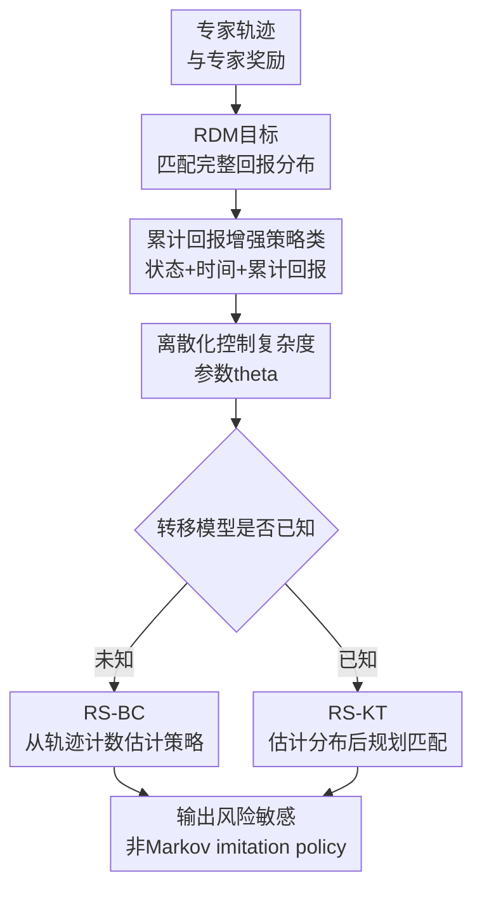

# Imitation Learning as Return Distribution Matching

**会议**: ICLR 2026  
**OpenReview**: [https://openreview.net/forum?id=7fwd3vjipk](https://openreview.net/forum?id=7fwd3vjipk)  
**代码**: https://github.com/filippolazzati/risk-IL  
**领域**: 强化学习 / 模仿学习 / 风险敏感RL  
**关键词**: 风险敏感模仿学习, 回报分布匹配, Wasserstein距离, 非Markov策略, 样本复杂度  

## 一句话总结

这篇论文把风险敏感模仿学习重新表述为“匹配专家完整回报分布”的问题，并在 tabular MDP 中用依赖累计回报的非 Markov 策略类设计 RS-BC 和 RS-KT 两个有样本复杂度保证的算法。

## 研究背景与动机

**领域现状**：经典模仿学习通常把专家轨迹当成行为数据，学习一个策略去匹配专家的 occupancy measure。Behavior Cloning 直接拟合状态到动作的映射，GAIL/IRL 类方法则通过奖励或判别器间接逼近专家行为；理论上，只要 occupancy measure 足够接近，任意奖励下的期望回报也会接近专家。

**现有痛点**：occupancy measure 本质上服务的是期望回报，也就是“平均表现”。但很多真实专家不是风险中性的：自动驾驶里人类驾驶员会避免低概率但严重的危险结果，金融决策里专家可能宁愿牺牲一点平均收益来压低尾部亏损。只匹配平均回报会把这类风险态度抹平，学出来的策略可能平均分相似，却在方差、尾部风险或整条回报分布上完全不像专家。

**核心矛盾**：已有风险敏感 IL 主要试图额外匹配某个固定水平的 CVaR，但这只盯住回报分布的一小段尾部；同时它们常把输出限制在 Markovian policy 内。问题在于，风险敏感最优行为往往依赖“之前已经拿到了多少回报”，而不只是当前状态和时间。若专家是非 Markov 的，Markov 策略即使有无限数据也可能存在结构性 misspecification error。

**本文目标**：作者希望建立一个比“期望 + 单个 CVaR”更完整的模仿目标，让学生策略不仅平均回报接近专家，还能复现专家回报分布的形状；同时还要避免直接搜索全体 non-Markovian policies 带来的指数维度灾难，并给出可证明的样本复杂度。

**切入角度**：论文观察到，风险态度可以直接编码在 return distribution $\eta_r^\pi$ 中。若能用 Wasserstein 距离匹配专家和学生的整条回报分布，那么期望、任意水平 CVaR、方差等统计量都会随之接近；而 Wasserstein 又比 total variation 更适合这个任务，因为它对一维回报分布的估计样本复杂度更友好。

**核心 idea**：用 Wasserstein 距离匹配专家完整回报分布，并用“当前状态 + 时间 + 离散累计回报”定义一类足够表达风险行为、又可多项式存储的非 Markov 策略。

## 方法详解

### 整体框架

论文先定义 Return Distribution Matching (RDM) 目标：给定专家奖励 $r_E$ 时，直接最小化学生策略和专家策略的回报分布距离 $W(\eta_{r_E}^{\pi}, \eta_{r_E}^{\pi_E})$。接着证明 Markov 策略无法充分表达这类目标，于是把策略空间扩展为依赖离散累计回报的非 Markov 策略类 $\Pi(r_E^\theta)$。在这个策略类上，作者分别针对“只有专家轨迹、未知转移”和“已知转移模型”两种信息条件设计 RS-BC 与 RS-KT。

核心上，RDM 不是要复刻专家每一步动作的完整历史依赖，而是只保留对回报分布有用的历史摘要：到当前时刻为止累计拿到了多少奖励。这个摘要足以表达很多风险敏感行为，例如“前面已经赚够了就保守一点”或“前面亏了就冒险一点”，而这些行为在同一个状态下可能选择不同动作，Markov 策略无法区分。

### 关键设计

**1. 回报分布匹配：把风险态度从单个统计量提升到整条分布**

标准 IL 目标通常等价于让学生与专家在任意奖励下的期望回报接近，但这只约束 $\mathbb{E}[G]$。本文定义的 RDM 直接匹配专家回报分布：

$$
\hat{\pi} \in \arg\min_{\pi \in \Pi_{NM}} W\left(\eta_{r_E}^{\pi}, \eta_{r_E}^{\pi_E}\right).
$$

这里 $\eta_r^\pi(g)=\Pr_\pi(\sum_{h=1}^{H} r_h(s_h,a_h)=g)$，$W$ 是一维 1-Wasserstein 距离。这个目标的意义很直接：如果学生的回报分布和专家接近，那么不仅期望回报接近，任意水平 $\alpha$ 的 CVaR 也满足 $|\mathrm{CVaR}_\alpha(\eta_{r_E}^{\pi_E})-\mathrm{CVaR}_\alpha(\eta_{r_E}^{\pi})| \le W/\alpha$，方差也可由 Wasserstein 距离控制。相比“只匹配一个 CVaR”，它不会把专家风险偏好压缩成一个手调的尾部点。

作者还解释了为什么不用 total variation 这类更强距离：如果每条轨迹都对应不同回报，那么匹配 TV 近似等价于匹配轨迹分布本身，最坏情况下需要指数级专家轨迹。Wasserstein 在一维回报上允许相近回报之间有“距离感”，因此既能刻画风险，又保留可学习性。

**2. 累计回报增强策略类：用最小必要历史表达风险敏感行为**

论文先给出一个反例说明 Markov 策略不够：在 horizon $H=3$ 的 MDP 中，专家可以根据第二步经过的历史决定最后动作，使总回报恒为 $1$；任何 Markov 策略在最后同一状态下看不到历史，只能混合产生 $0,1,2$ 三种回报，和专家的 Wasserstein 距离至少为 $0.5$。这说明问题不是数据少，而是策略类本身表达不了。

为避免退回全体 non-Markovian policies，作者定义 $\Pi(r)$：策略只依赖当前阶段 $h$、状态 $s$ 和到目前为止的累计奖励 $G(\omega;r)$。对任意专家策略 $\pi_E$，可以构造一个“平均化”的策略 $\pi_r$：它在状态 $s$、累计回报 $g$ 下采取动作 $a$ 的概率，等于专家所有达到同一 $(h,s,g)$ 情况时选择 $a$ 的条件概率。形式上，核心比值是

$$
\pi_r(a\mid s,\omega)=
\frac{\Pr_{\pi_E}(s_h=s,a_h=a,\sum_{t<h} r_t(s_t,a_t)=G(\omega;r))}
{\Pr_{\pi_E}(s_h=s,\sum_{t<h} r_t(s_t,a_t)=G(\omega;r))}.
$$

关键 lemma 说明，这个 $\pi_r$ 与专家有完全相同的回报分布。直觉是：它不保留全部历史，但保留了会影响“后续还能把总回报推到哪里”的累计回报；在同一累计回报层上做动作概率平均，不会破坏最终回报分布。

**3. 离散化累计回报：用 $\theta$ 在表达能力和存储复杂度之间做可控交换**

直接使用精确累计回报仍可能很大，因为连续奖励或细粒度奖励会让每条历史有不同的累计值，$|G_r|$ 最坏可随轨迹数指数增长。为此，论文把每步奖励离散到网格 $Y_h^\theta=\{0,\theta,2\theta,\ldots\}$，得到 $r_E^\theta$，并让策略依赖离散累计回报。

这样策略表的规模从全历史空间降到 $O(SAH|Y_\theta|)$，而 $|Y_\theta|=O(H/\theta)$。代价是近似误差：Lemma 4.2 表明在 $\Pi(r_E^\theta)$ 中存在一个策略 $\pi_{r_E^\theta}$，使得

$$
W\left(\eta_{r_E}^{\pi_{r_E^\theta}},\eta_{r_E}^{\pi_E}\right) \le H\theta.
$$

因此 $\theta$ 越小，累计回报网格越细，策略越能复现专家分布，但存储和计算越重；$\theta$ 越大，算法更轻，但会引入更大的结构性近似误差。这个设计把“风险敏感需要历史”变成了一个可控的多项式资源问题。

**4. RS-BC 与 RS-KT：同一策略类下区分无模型估计和已知模型规划**

RS-BC 用在 no-interaction/offline 场景：没有转移模型，也不能与环境交互，只有 $N$ 条专家轨迹和已知专家奖励。它直接统计专家在每个 $(h,s,g)$ 下采取各动作的次数，其中 $g$ 是离散累计回报 $G(\omega;r_E^\theta)$，再用频率估计 $\pi_{r_E^\theta}(a\mid h,s,g)$。没有见过的格点则回退到均匀动作分布。它可以看成在“状态被累计回报增强后的 MDP”里做 behavior cloning。

RS-KT 用在已知 transition model $p$ 的场景。它不再逐个状态-累计回报格点估计专家动作，而是先用专家轨迹估计专家回报分布 $\hat{\eta}$，再利用已知动力学求一个在 $\Pi(r_E^\theta)$ 中诱导回报分布最接近 $\hat{\eta}$ 的策略。这个优化可转成增强状态空间 $S\times Y_\theta$ 上的 occupancy measure 线性规划：变量是 $d_h(s,g,a)$ 和诱导的回报分布 $\eta(g)$，约束保证 $d$ 满足流守恒、$\eta$ 由最后一步 occupancy 产生，目标最小化 $W(\eta,\hat{\eta})$。

两者的理论差异很清楚：RS-BC 需要估计很多 $(s,g)$ 上的动作条件分布，样本复杂度随 $S,A,H$ 增长；RS-KT 只需估计一维回报分布，利用已知模型负责“找实现这个分布的策略”，因此样本复杂度可做到 $O(H^2\epsilon^{-2}\log(1/\delta))$，与 $S,A$ 无关。

### 一个完整示例

考虑一个简化驾驶任务：车辆在前两步可能已经获得“安全通过路口”的奖励，也可能因为遇到行人或急刹得到较低累计回报；第三步到达同一个状态“准备并线”。风险敏感专家如果前面已经很顺利，可能选择保守并线来避免尾部事故；如果前面已经因为避让损失了时间，可能选择稍激进但仍可接受的并线动作。对普通 Markov 策略来说，这两种历史在第三步看到的是同一个状态，因此只能给同一动作分布。

在本文的策略类里，这两个历史会落到不同的离散累计回报格点 $g$。RS-BC 会分别统计专家在 $(h=3,s=\text{准备并线},g=\text{高})$ 和 $(h=3,s=\text{准备并线},g=\text{低})$ 下的动作频率；RS-KT 则会寻找一个策略，使得最终“总安全/效率回报”的分布形状接近专家。这样学到的不是简单的平均动作，而是“在不同已实现回报条件下如何继续控制风险”。

### 损失函数 / 训练策略

RS-BC 本身没有神经网络训练损失，核心是最大似然式的条件频率估计。它把专家轨迹映射到增强样本 $(h,s,G(\omega;r_E^\theta),a)$，用计数 $M_h(s,g,a)$ 得到

$$
\hat{\pi}(a\mid h,s,g)=\frac{M_h(s,g,a)}{\sum_{a'}M_h(s,g,a')},
$$

若分母为 $0$ 则设为 $1/A$。理论上选择 $\theta=\epsilon/(4H)$ 时，RS-BC 以高概率达到 $W(\eta_{r_E}^{\pi_E},\eta_{r_E}^{\hat{\pi}})\le \epsilon$，样本复杂度为 $\tilde{O}(SH^6\epsilon^{-3}(A+\log(1/\delta))\log(1/\delta))$ 量级。

RS-KT 的训练策略更像 planning。它先用经验分布估计

$$
\hat{\eta}(g)=\frac{1}{N}\sum_{i=1}^{N}\mathbf{1}\left\{\sum_{h=1}^{H}r_{E,\theta,h}(s_h^i,a_h^i)=g\right\},
$$

再解线性规划寻找最接近 $\hat{\eta}$ 的可实现回报分布。选择 $\theta=\epsilon/(7H)$ 且优化精确求解时，样本复杂度为 $O(H^2\epsilon^{-2}\log(1/\delta))$。未知奖励设置下，论文没有给出可实用算法，而是证明若有 oracle 能解一个 robust RDM 问题，则已知转移模型时仍可用多项式样本估计任意奖励下的专家回报分布。

## 实验关键数据

### 主实验

论文的数值实验在随机生成的 tabular MDP 上进行，比较 RS-BC、RS-KT 与标准 IL 算法 BC、MIMIC-MD。主要指标是学生策略回报分布与专家回报分布之间的 Wasserstein 距离，越低越好。

| 设置 | N | RS-BC | RS-KT | BC | MIMIC-MD |
|------|---|-------|-------|----|----------|
| 非Markov专家, $S,A,H=(2,2,5)$, $\theta=0.05$ | 20 | 0.081±0.039 | 0.095±0.036 | 0.099±0.056 | 0.127±0.062 |
| 同上 | 80 | 0.038±0.016 | 0.049±0.017 | 0.076±0.054 | 0.086±0.055 |
| 同上 | 300 | 0.022±0.013 | 0.030±0.013 | 0.072±0.056 | 0.074±0.056 |
| 同上 | 1000 | 0.012±0.005 | 0.019±0.007 | 0.069±0.058 | 0.070±0.057 |
| 同上 | 10000 | 0.005±0.002 | 0.011±0.006 | 0.068±0.058 | 0.068±0.058 |

这个主表最关键的信息不是某个小数点，而是趋势：RS-BC 和 RS-KT 随着专家轨迹数增加持续下降，而 BC 与 MIMIC-MD 很快进入平台期。平台期说明它们并不是缺数据，而是 Markov policy class 无法表达非 Markov 专家的回报分布。

在更大 horizon 的设置中，这种差距更明显：

| 设置 | N | RS-BC | RS-KT | BC | MIMIC-MD |
|------|---|-------|-------|----|----------|
| 非Markov专家, $S,A,H=(2,2,20)$ | 20 | 0.193±0.086 | 0.223±0.066 | 0.208±0.080 | 0.265±0.106 |
| 同上 | 80 | 0.087±0.035 | 0.115±0.034 | 0.162±0.083 | 0.180±0.086 |
| 同上 | 300 | 0.046±0.019 | 0.072±0.023 | 0.156±0.086 | 0.159±0.084 |
| 同上 | 1000 | 0.027±0.010 | 0.053±0.017 | 0.151±0.086 | 0.153±0.087 |
| 同上 | 10000 | 0.012±0.005 | 0.041±0.018 | 0.151±0.085 | 0.150±0.085 |

horizon 变长后，历史累计回报对风险决策的影响更容易积累，Markov baseline 的偏差也更明显。RS-KT 在这些小规模实验中不总是数值上优于 RS-BC，原因包括线性规划近似、$\theta$ 引入的离散误差，以及小 $S,A$ 下 RS-KT 的“独立于 $S,A$”优势尚未完全体现。

### 消融实验

| 配置 / 分析项 | 关键指标 | 说明 |
|---------------|----------|------|
| $\theta=0.05$, 非Markov专家, $N=10000$ | RS-BC 0.005, RS-KT 0.011 | 细网格下两种方法都能接近专家分布，明显优于 Markov baseline |
| $\theta=0.5$, 非Markov专家, $N=10000$ | RS-BC 0.022, RS-KT 0.106 | 网格变粗后近似误差上升，RS-KT 尤其容易触及 $H\theta$ 量级的误差上界 |
| Markov专家, $S,A,H=(2,2,5)$, $N=10000$ | BC 0.003, RS-BC 0.004, RS-KT 0.010 | 当专家本来就是 Markov 时，BC 的小策略类反而带来更高样本效率 |
| 大状态空间, $S,A,H=(300,5,5)$, $N=1000$ | $\hat{\eta}$ 0.024, RS-BC 0.165, BC 0.177 | 估计回报分布本身很快，而逐状态学习动作频率很慢，支持 RS-KT 的样本复杂度优势 |

### 关键发现

- RS-BC 和 RS-KT 的优势来自策略表达能力：它们能根据累计回报区分同一状态下的不同风险处境，因此对非 Markov 专家不会像 BC/MIMIC-MD 那样存在明显平台误差。
- $\theta$ 是最重要的超参数。小 $\theta$ 降低离散化误差，但增加策略表或 LP 的规模；大 $\theta$ 让算法更轻，却会把不同累计回报历史合并，损伤风险偏好表达。
- 已知转移模型时，RS-KT 的统计瓶颈主要变成估计一维回报分布，所以在大 $S,A$ 场景理论上更有样本优势；但它需要求解 LP，计算成本比 RS-BC 高。
- 如果专家策略本身是 Markovian，普通 BC 可能更合适，因为它的假设空间更小，样本效率和计算效率都更好；本文方法主要解决的是风险敏感、历史依赖专家的模仿。

## 亮点与洞察

- 把风险敏感 IL 的目标从“期望 + 某个 CVaR”提升到完整 return distribution matching 很自然，也很干净。它避免了选择单个 $\alpha$ 的任意性，并把期望、方差、CVaR 都统一到 Wasserstein 距离控制下。
- 论文对“为什么需要非 Markov 策略”讲得很有说服力。短 horizon 反例说明 Markov 策略不是不够聪明，而是信息结构缺失：同一当前状态下，过去累计回报不同，未来风险动作就应不同。
- 累计回报增强策略类是一个很可复用的抽象。它比 RNN 或任意 history-dependent policy 更可分析，也比 Markov policy 更贴近风险敏感决策；在 tabular 理论里，它正好把表达力和可计算性连起来。
- RS-KT 的思想很有启发：如果已知动力学，与其学习专家在每个状态如何动作，不如先估计专家想要的回报分布，再通过规划找一个能实现该分布的策略。这把模仿学习从“模仿行为”转成“模仿结果分布”。
- 对未知奖励设置的 oracle 分析虽然不实用，但指出了一个有趣方向：困难可能不在统计估计，而在如何高效求解 robust RDM 优化问题。

## 局限与展望

- 论文主要停留在 tabular finite-horizon MDP。实际机器人、自动驾驶或金融环境通常是连续状态、连续动作、高维观测，直接存储 $O(SAH|Y_\theta|)$ 的策略表或求 LP 都不可扩展。
- 已知奖励是假设很强。许多 IL 场景正是因为奖励难以设计才使用专家示范；本文虽然讨论未知奖励，但给出的是 oracle-based 统计可行性结果，还没有真正可运行的算法。
- 实验是随机生成 MDP 上的数值模拟，没有真实人类示范或标准风险敏感控制 benchmark。它能验证理论现象，但还不能说明方法在复杂任务中能稳定学到人类风险偏好。
- Wasserstein 匹配整条回报分布会保留专家的风险态度，但也可能复制专家不合理的风险偏差。实际应用中可能还需要额外的安全约束或偏好修正，而不是无条件复制。
- 未来可以把累计回报增强思想接到函数逼近中，例如用神经网络输入 $(s,h,g)$，或在 distributional RL 框架下学习可实现的目标回报分布；另一条线是设计 unknown-reward robust RDM 的近似可解算法。

## 相关工作与启发

- **vs BC / GAIL / occupancy matching**: 标准 IL 匹配 occupancy measure，从而保证期望回报相近；本文匹配 return distribution，关心的不只是平均表现，还包括方差、尾部和整体形状。优势是能处理风险敏感专家，代价是需要奖励信息和更复杂的策略类。
- **vs CVaR-based risk-sensitive IL**: Santara et al. 和 Lacotte et al. 通过匹配期望与某个 $\alpha$ 水平的 CVaR 来刻画风险；本文认为单个 CVaR 只覆盖分布一角，而且 Markov 策略会带来表达偏差，因此改为 Wasserstein RDM + 非 Markov policy class。
- **vs Distributional RL**: distributional RL 通常是在给定策略优化或评估时建模回报分布；本文把“回报分布”作为模仿学习目标，并用专家分布作为要匹配的对象。RS-KT 中的固定 categorical representation 与 distributional RL 的表示方式很接近。
- **vs 非Markov模仿学习 / recurrent BC**: 机器人学习中常用 RNN 或 action chunking 表达历史依赖，但理论分析困难；本文只保留累计回报这一类历史摘要，牺牲一部分通用性，换来清晰的表达性 lemma 和样本复杂度界。
- **对后续研究的启发**: 在风险敏感任务里，不一定要复刻专家每个动作，也不一定只学一个 reward；直接学“专家愿意接受怎样的回报分布”可能是更贴近人类偏好的目标。

## 评分

- 新颖性: ⭐⭐⭐⭐⭐ 目标函数和策略类组合很清楚地补上了风险敏感 IL 中“只看期望/单个CVaR”和“Markov表达不足”的缺口。
- 实验充分度: ⭐⭐⭐⭐ 数值模拟覆盖了样本数、$\theta$、Markov/非Markov专家和大状态空间，但缺少真实任务与函数逼近实验。
- 写作质量: ⭐⭐⭐⭐⭐ 理论叙事非常顺，先说明 RDM 必要性，再给策略类、算法、样本复杂度和实验现象，逻辑闭合度高。
- 价值: ⭐⭐⭐⭐ 对风险敏感 IL 和分布式 RL 的理论连接很有价值，实际落地还需要解决连续环境、未知奖励和计算扩展问题。

<!-- RELATED:START -->

## 相关论文

- [\[ICLR 2026\] Q-Learning with Adjoint Matching](q-learning_with_adjoint_matching.md)
- [\[ICLR 2026\] Latent Wasserstein Adversarial Imitation Learning](latent_wasserstein_adversarial_imitation_learning.md)
- [\[ICLR 2026\] Flow Matching Policy Gradients](flow_matching_policy_gradients.md)
- [\[ICLR 2026\] Near-Optimal Second-Order Guarantees for Model-Based Adversarial Imitation Learning](near-optimal_second-order_guarantees_for_model-based_adversarial_imitation_learn.md)
- [\[ICLR 2026\] On Discovering Algorithms for Adversarial Imitation Learning](on_discovering_algorithms_for_adversarial_imitation_learning.md)

<!-- RELATED:END -->
