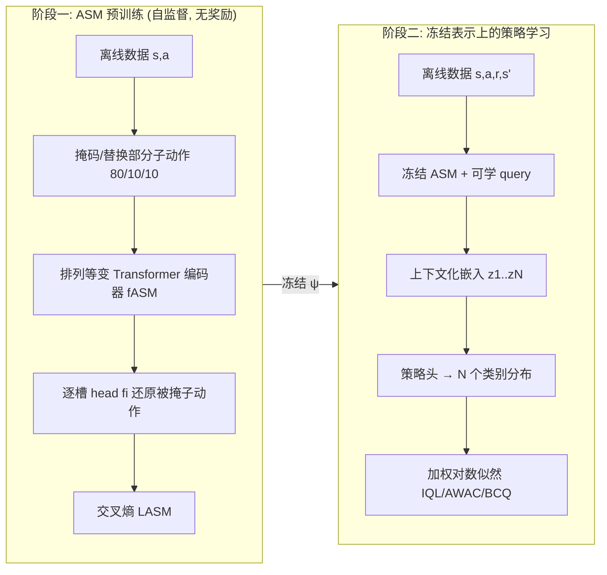

# Improving and Accelerating Offline RL in Large Discrete Action Spaces with Structured Policy Initialization

**会议**: ICLR 2026  
**OpenReview**: [https://openreview.net/forum?id=rPrNaDJrLx](https://openreview.net/forum?id=rPrNaDJrLx)  
**代码**: [https://github.com/matthewlanders/SPIN](https://github.com/matthewlanders/SPIN)  
**领域**: 强化学习 / 离线 RL / 大规模离散动作空间  
**关键词**: 离线 RL, 组合动作空间, 结构化策略, 表示预训练, 掩码自监督, Transformer 策略  

## 一句话总结
SPIN 把"学动作结构"与"学控制"两件事拆开——先用类 BERT 的掩码自监督预训练一个动作结构模型（ASM）来刻画合法联合动作所在的低维流形，再冻结这套表示、只训轻量策略头，从而在指数级离散组合动作空间的离线 RL 上把平均回报最多提升 39%、收敛速度最多加快 12.8 倍。

## 研究背景与动机
**领域现状**：医疗、机器人装配、推荐、网约车调度等场景常需在高维**离散组合动作空间**里决策——动作是 $A = A_1 \times \cdots \times A_N$ 的笛卡尔积，联合动作数随维度指数膨胀（$|A| = \prod_{d=1}^{N} m_d$，最大可达 $30^{38}\approx1.35\times10^{56}$）。这类场景在线探索代价高甚至不安全，因此离线 RL 更合适，但标准离线 RL 方法（CQL、IQL 等）要么对 Q 取 max、要么把策略参数化到整个离散动作集上，在指数空间里直接不可行。

**现有痛点**：组合动作空间的已有做法分两派，各有硬伤。**因子化派**（Factored IQL、Tang et al.）假设子动作之间条件独立，把联合策略拆成 $N$ 个独立分布，虽然保证了可解性，但丢掉了子动作间的依赖，常生成不连贯甚至非法的组合；**联合学习派**（SAINT、BraVE、自回归策略）试图同时学动作表示和控制策略，SAINT 用 Transformer 自注意力捕捉子动作依赖，但把"学结构"和"学控制"两个目标混在一个 RL loss 里优化，导致训练慢且不稳定。

**核心矛盾**：表示能力（建模子动作依赖）和优化稳定性/速度之间存在张力——保留依赖就得联合学习导致慢和不稳，追求快和稳就得砍依赖导致动作不连贯。

**本文目标**：在不牺牲跨维度依赖建模能力的前提下，让组合动作空间的离线策略学得又快又稳又好。

**核心 idea**：**[把离线 RL 重构成"表示问题 + 控制问题"两阶段]** —— 先用自监督把"什么样的联合动作是合法/连贯的"这个动作几何结构学出来并冻结，再让策略只在这个已经学好的低维流形上做轻量适配，从而把昂贵且不稳定的结构学习从 RL 优化循环里彻底剥离出去。

## 方法详解

### 整体框架
SPIN（Structured Policy INitialization）是个两阶段框架，明确把表示学习和控制解耦。**第一阶段**：用掩码自监督预训练一个动作结构模型 ASM（一个排列等变的 Transformer 编码器），让它在给定状态 $s$ 的条件下，把结构上连贯的联合动作映射到一个低维流形上。**第二阶段**：冻结 ASM 这套表示，把控制问题简化为在该动作流形上训练若干轻量策略头（只有 query 向量和输出头会更新）。"先学结构、后学策略"让 agent 直接利用动作几何，而不必在原始组合空间里搜索。

### 关键设计

**1. 动作结构模型 ASM：用掩码自监督把"合法动作流形"先学出来。** ASM 的输入序列把 $M$ 个可学的状态嵌入和 $N$ 个子动作嵌入拼接起来 $X=(x_{s_1},\dots,x_{s_M},x_{a_1},\dots,x_{a_N})\in\mathbb{R}^{(M+N)\times d}$，并且**刻意去掉子动作之间的位置编码**以保持对 $a_1,\dots,a_N$ 的排列等变性（组合动作没有天然顺序，自回归强加顺序会破坏这一性质）。训练目标照搬 BERT 的掩码语言建模：每个样本采一个子动作下标子集 $\mathcal{M}$，对其中每个 $i$ 以 80/10/10 的比例替换为掩码 token、随机子动作或保持不变，编码后用逐槽 head $f_i:\mathbb{R}^d\to\mathbb{R}^{|A_i|}$ 还原被掩动作，只在被掩位置算交叉熵：
$$L_{ASM} = \mathbb{E}_{(s,a)\sim D}\Big[\mathbb{E}_{\mathcal{M}}\sum_{i\in\mathcal{M}}\ell\big(f_i(h_{a_i}), a_i\big)\Big].$$
这套目标不需要任何奖励监督，纯靠数据就能学到"给定状态下子动作之间怎么搭才连贯"，让结构性强的联合动作聚集到低维流形上。这是个本质离线的预训练过程，只需一份静态数据集。

**2. 冻结表示上的轻量策略学习：保留跨维依赖却仍可解。** 第二阶段策略 $\pi_\theta$ 复用 SAINT 架构，但 ASM 主干被冻结，只更新 query 向量和输出头。$M$ 个状态嵌入和 $N$ 个可学动作 query 过一遍冻结的排列等变 Transformer，得到上下文化嵌入 $z_1,\dots,z_N$——每个 $z_i$ 同时编码了状态、对应 query 以及通过共享注意力得到的与其他子动作的关系。再经子动作专属 MLP 头输出 logits，参数化类别分布，联合策略按维度因子化：
$$\pi_\theta(a\mid s)=\prod_{i=1}^{N}\pi_\theta(a_i\mid s, z_i).$$
关键在于：它**和因子化方法一样把指数级联合分布拆成 $N$ 个类别分布**保证了可解性，但因为 $z_i$ 是经过共享自注意力上下文化的、依赖已在 ASM 预训练阶段学进表示里，所以**不像纯因子化那样假设条件独立**，从而既快又保留了跨维度连贯性。

**3. 与主流离线 RL 目标的兼容边界。** SPIN 的设计天然兼容那些把 actor 更新写成"数据集动作上的加权对数似然最大化"的算法：
$$\max_\theta \mathbb{E}_{(s,a)\sim D}\big[w_\Phi(s,a)\log\pi_\theta(a\mid s)\big],$$
其中 $w_\Phi(s,a)\ge0$ 是算法相关权重（优势或价值估计），涵盖 IQL、AWAC，也支持 BCQ 这类基于候选筛选的更新。但需要在整个联合动作空间上做全局操作的目标（如 CQL 的价值正则化）除非把 $Q_\Phi$ 或 $\pi_\theta$ 强行因子化、从而又丢掉跨维结构，否则不可解，因此落在 SPIN 兼容类之外——这条边界与 SAINT 一致。

## 实验关键数据
评测基于离散化的 DeepMind Control Suite（Beeson et al. 2024 引入），动作维度从 cheetah 的 6 到 dog-trot 的 38，每维 bin 数 3–30，联合动作空间从几百到 $3^{38}$ 量级。四个质量等级数据集（medium / medium-expert / random-medium-expert / expert），单卡 A40，5 个随机种子。"Time to Target"指达到 F-IQL 渐近性能 95% 所需的墙钟分钟数，SPIN 的计时**包含 ASM 预训练全程**。

### 主实验表格（按数据集质量的平均回报 / Time to Target）

| 数据集质量 | F-IQL | AR-IQL | SAINT | SPIN |
|---|---|---|---|---|
| Medium 平均回报 | 341.8 | 334.7 | 343.0 | **345.2** |
| Medium Time-to-Target | 48.2 | 114.3 | 174.6 | **45.5** |
| Medium-Expert 平均回报 | 724.7 | 717.2 | 733.3 | **753.2** |
| Medium-Expert Time-to-Target | 257.3 | 285.8 | 308.4 | **62.0** |
| Random-Medium-Expert 平均回报 | 388.3 | 395.6 | 438.9 | **499.2** |
| Random-Medium-Expert Time-to-Target | 85.1 | 95.8 | 100.2 | **38.4** |
| Expert 平均回报 | 778.1 | 770.3 | 773.1 | **778.7** |
| Expert Time-to-Target | 167.5 | 288.7 | 261.8 | **77.4** |
| **总平均回报** | 558.2 | 554.5 | 572.1 | **594.1** |
| **总 Time-to-Target** | 558.1 | 784.6 | 845.0 | **223.3** |

SPIN 总平均回报 594.1，超过次优 SAINT 的 572.1；总收敛时间 223.3 分钟，约为 F-IQL 的 2.5 倍快、SAINT 的 3.8 倍快。最难的 random-medium-expert 上 SPIN 比 SAINT 高 13%+；medium-expert 上 SPIN 仅需 62 分钟而其他方法均超 250 分钟。

### 消融实验表格（dog-trot 任务随动作基数增大，medium-expert）

| Bins | F-IQL | AR-IQL | SAINT | SPIN |
|---|---|---|---|---|
| 3 Bins | 472.3 | 526.5 | 635.1 | **647.0** |
| 10 Bins | 483.8 | 457.4 | 529.1 | **629.5** |
| 30 Bins | 485.0 | 557.4 | 562.5 | **703.9** |
| 平均回报 | 480.4 | 513.8 | 575.6 | **660.1** |
| Time to Target | 545.8 | 692.6 | 291.6 | **237.0** |

动作空间从 $3^{38}$ 到 $30^{38}$，SPIN 在每个基数上都最优且**领先幅度随空间增大而扩大**：30 bins 时 SPIN 703.9 vs SAINT 562.5（+25%），而 F-IQL 在 480 附近停滞、AR-IQL 不稳定。

### 关键发现
- **越组合越受益**：分离结构学习与控制带来的收益随组合复杂度增大而放大，因为 agent 在学好的低维流形上行动，端到端方法仍被原始联合空间规模拖累。
- **表示质量正相关**：ASM 预训练 10–100 epoch 后冻结再训策略，下游回报随预训练量普遍提升，证明动作结构本身就是有效控制的关键。
- **加速来自动作中心预训练**：附录对比表明 SPIN 的优势源于动作中心的预训练目标，而非"做了预训练"本身（轨迹中心预训练对比下其效果更弱）。

## 亮点与洞察
- **问题重构很漂亮**：把组合动作离线 RL 显式拆成"表示问题 + 控制问题"，是个干净且可迁移的视角——和 NLP/CV 里"先自监督预训练再轻量微调"的范式打通了。
- **掩码自监督学动作流形**：用 BERT 式 MLM 来学"合法联合动作"的几何，绕过了奖励监督，且去位置编码保排列等变性的细节抓得准。
- **可解性与表达力兼得**：因子化形式保留可解性，但通过共享注意力让因子条件于上下文化嵌入 $z_i$，回避了"条件独立"这个老毛病。
- **效率收益实打实**：Time-to-Target 还把预训练成本算进去，仍快数倍，说服力强。

## 局限与展望
- **兼容性有边界**：需全局联合动作操作的目标（如 CQL）落在兼容类之外，对依赖悲观价值正则的离线场景适用性受限。
- **两阶段假设静态数据**：ASM 预训练本质离线、依赖一份足够覆盖合法动作的静态数据集，若数据集动作分布偏窄，学到的流形可能不全。
- **评测集中在 DM Control**：虽补充了 Maze 实验，但医疗/推荐等真实组合场景尚未直接验证。
- **冻结表示的代价**：完全冻结 ASM 可能在分布偏移大时限制策略适配，未来可探索轻量微调或在线增量更新 ASM。

## 相关工作与启发
- **组合动作 RL**：相对 Factored IQL（条件独立、丢依赖）、自回归策略（强加顺序、破坏排列不变性）、BraVE（建模跨维交互但随动作规模扩展性差），SPIN 的解耦设计在保留依赖的同时保住了可扩展性。
- **SAINT（最直接对照）**：同样用 Transformer 捕捉子动作依赖，但联合学结构与控制；SPIN 用同一策略类做受控对比，差异仅在"是否分离表示与控制"，干净地隔离了贡献来源。
- **离线动作表示**：相比 MERLION（伪度量动作表示，但执行需对全枚举动作集做最近邻搜索、且把动作当原子），SPIN 按维度生成联合动作、显式建模组合结构，适配指数级组合空间。
- **RL 自监督预训练**：多数已有工作是状态/轨迹中心且常假设在线交互；SPIN 提出**动作中心**的预训练，为组合动作策略提供结构化初始化，是个新的预训练切入点，启发后续把"动作几何预训练"迁移到更广的离散决策问题。

## 评分
- **新颖性**: ⭐⭐⭐⭐ —— "把组合动作离线 RL 拆成表示+控制两阶段、用掩码自监督学动作流形并冻结"是个干净有力的新视角，动作中心预训练区别于主流状态/轨迹中心范式。
- **实验充分度**: ⭐⭐⭐⭐ —— 覆盖四种数据质量、动作维度 6–38、基数 3–30 的大范围扫描，含基数鲁棒性消融、表示质量分析、多 RL 目标（IQL/AWAC/BCQ）与 Maze 泛化；略欠真实组合场景验证。
- **写作质量**: ⭐⭐⭐⭐ —— 动机—矛盾—方法—验证逻辑顺畅，公式与算法框图清晰，兼容性边界讨论严谨。
- **价值**: ⭐⭐⭐⭐ —— 在指数级离散动作空间这一硬骨头上同时拿下性能（+39%）和效率（最高 12.8×），且范式可迁移，对推荐/调度等实际组合决策有较强吸引力。

<!-- RELATED:START -->

## 相关论文

- [\[ICLR 2026\] Accelerating Diffusion Planners in Offline RL via Reward-Aware Consistency Trajectory Distillation](accelerating_diffusion_planners_in_offline_rl_via_reward-aware_consistency_traje.md)
- [\[ICLR 2026\] DEAS: DEtached value learning with Action Sequence for Scalable Offline RL](deas_detached_value_learning_with_action_sequence_for_scalable_offline_rl.md)
- [\[ICLR 2026\] Structured In-context Environment Scaling for Large Language Model Reasoning](structured_in-context_environment_scaling_for_large_language_model_reasoning.md)
- [\[ICLR 2026\] Geometry of Uncertainty: Learning Metric Spaces for Multimodal State Estimation in RL](geometry_of_uncertainty_learning_metric_spaces_for_multimodal_state_estimation_i.md)
- [\[ICLR 2026\] One-Step Flow Q-Learning: Addressing the Diffusion Policy Bottleneck in Offline RL](one-step_flow_q-learning_addressing_the_diffusion_policy_bottleneck_in_offline_r.md)

<!-- RELATED:END -->
