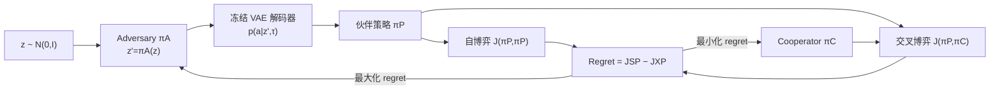

# Improving Human-AI Coordination through Online Adversarial Training and Generative Models

**会议**: ICLR 2026  
**OpenReview**: [https://openreview.net/forum?id=AeehNfbHqD](https://openreview.net/forum?id=AeehNfbHqD)  
**代码**: [https://sites.google.com/view/goat-2025/home](https://sites.google.com/view/goat-2025/home)  
**领域**: 强化学习 / 人机协作 / 零样本协调  
**关键词**: 零样本协调, 对抗训练, 生成模型, regret, 课程学习, Overcooked  

## 一句话总结
GOAT 把一个**冻结的合作策略生成模型（VAE）**塞进在线对抗训练回路，让对手只在生成模型的潜空间里搜索"最大化 regret"的合作伙伴，从而既能持续暴露协作智能体的弱点、又不会退化成自我破坏，在 Overcooked 真人评测上拿到 SOTA。

## 研究背景与动机
- **领域现状**：训练能与多样人类零样本协作（ZSC）的 AI 智能体，主流是 Population-Based Training（PBT）+ 多样性目标，靠一大群仿真伙伴去逼近人类行为分布；近期 GAMMA 用 VAE 生成多样合作策略，刷新了真人协作的 SOTA。
- **现有痛点**：PBT 随机采样伙伴、不针对学习者的弱点，样本效率低、对真人覆盖差；而对抗训练（min-max / 最小化 cross-play）虽然能自动生成针对弱点的课程，却在合作任务里"水土不服"——把伙伴训练去最小化协作回报，会激励它学**握手协议（handshaking）和故意摆烂（sabotage）**，不再是一个合理的人类伙伴。
- **核心矛盾**：合作场景里的"对抗对手"必须同时满足两个互斥诉求——**既要够难**（找到学习者的盲区），**又要仍然是合法的合作者**（不能自毁任务）。单纯加平衡项（如 mixed-play）治标不治本，因为"最小化 cross-play"这个目标本身就内生了不合作动机。
- **本文目标**：设计一种对抗训练，能充分探索高难度伙伴策略空间，但生成的伙伴永远是真实、有协作意图的。
- **核心 idea**：**[把约束交给生成模型而非目标函数]** 先在多样合作数据上预训练一个 VAE 生成模型，再把它**冻结**放进对抗回路；对手不再直接训练伙伴策略，而是去搜索潜向量 $z$——任何解码出来的伙伴天然都是合作的，于是对抗目标可以放心地"使坏"也不会越界。配合 **regret** 目标（而非 min-max），把"难但可解"的伙伴组成动态课程。

## 方法详解

### 整体框架
GOAT（Generative Online Adversarial Training）由三个角色构成：一个**冻结的 VAE 解码器**负责把潜向量解码成合法合作伙伴策略 $\pi_P$；一个**对手 Adversary** $\pi_A$ 学习把随机采样的 $z\sim\mathcal{N}(0,I)$ 映射成 $z'=\pi_A(z)$，目标是让生成的伙伴最大化 Cooperator 的 regret；一个 **Cooperator** $\pi_C$ 则反过来最小化 regret、努力适应这些刁钻伙伴。三者在线循环：采样 $z$ → 对手变换 → 解码伙伴 → 同时跑自博弈(SP)和交叉博弈(XP) → 算 regret → 分别更新对手和 Cooperator。

### 关键设计

**1. 用冻结生成模型代替对抗约束：把"合法合作"焊死在结构里。** 朴素的合作对抗目标是 min-max 形式 $J_{XP}=\max_{\pi_C}\min_{\pi_A}J(\pi_C,\pi_A)$，但直接训练伙伴去最小化协作回报，等于鼓励它学会破坏。GOAT 的关键转换是：对手不再生产策略本身，而只生产一个潜向量 $z'=\pi_A(z)$，喂给冻结的 VAE 解码器 $p(a_t|z',\tau_{0:t-1};\theta)$ 才得到伙伴 $\pi_P$。于是优化目标变为 $\max_{\pi_C}\min_{\pi_A}\mathbb{E}_{z\sim\mathcal{N}(0,I)}[J(\pi_C,\pi_P^{\pi_A(z)})]$。因为 VAE 只在合作数据上训练且权重不动，它的潜空间里根本"画不出"握手或自毁策略——对抗的破坏性被生成模型的归纳偏置悄悄挡掉，对手反而获得一个连续、光滑、易优化的搜索空间。

**2. 用 regret 取代 min-max：只挑"难但可解"的伙伴，而不是最烂的伙伴。** 即便有了生成模型兜底，纯 min-max 仍只盯着最坏情况，会让对手收敛到那些本身就菜、和谁都拿不到分的伙伴上（消融里观察到 min-max 固守在低回报区域不动）。GOAT 改用合作版 regret——把它定义成同一个伙伴的自博弈最优表现与它配合 Cooperator 时表现之间的差距：$\mathrm{Regret}(\pi_P,\pi_C)=\mathbb{E}[J(\pi_P,\pi_P)-J(\pi_P,\pi_C)]=J_{SP}-J_{XP}$。这个量的妙处在于：一个伙伴只有"自己玩得好、但 Cooperator 配不好"时 regret 才高，逼对手去找**有解但 Cooperator 还没学会**的策略；对那些谁来都玩不转的无效伙伴，最优自博弈也是零分，regret 归零、对手没有动力去碰它。于是 regret 自动把训练课程钉在"难度恰好高于当前能力"的区域。

**3. 在线循环 = Cooperator 弱点驱动的自动课程。** 最终目标是 min-max regret 博弈 $\min_{\pi_C}\max_{\pi_A}\mathrm{Regret}(\pi_P^{\pi_A(z)},\pi_C)$（Algorithm 1）。每一步对手用 REINFORCE 朝高 regret 的潜区域移动，Cooperator 用 PPO 去压低 regret；当 Cooperator 适应了某一区域、regret 被抹平，对手就被迫迁移到新的高 regret 区域。论文可视化（Fig 5a）显示对手的潜向量随训练在生成模型的潜球里"游走"——从早期均匀采样，到中期锁定一个区域猛攻，再到后期跨越潜空间不断换区域——天然形成由易到难的课程，避免了自博弈/PBT 常见的策略僵化。对手训练与具体 RL 算法无关（是无状态的一步优化），实现上对手用 REINFORCE、Cooperator 用 PPO。

## 实验关键数据

三类环境：One-Step Cooperative Matrix Game (CMG)、Cooperative Reaching Game (CRG)、Overcooked（Counter Circuit 与更复杂的 Multi-Strategy Counter）。对比 5 个有竞争力的基线：BC+RL、FCP、MEP、CoMeDi、MEP+GAMMA（前 SOTA）。

### 主实验（真人评测 / Overcooked）

| 布局 | 评测方式 | GOAT vs 前 SOTA (GAMMA) |
|------|----------|------------------------|
| Counter Circuit | 真人 | +3%（两者都接近最优，简单布局拉不开差距）|
| Multi-Strategy Counter | 真人 | **+38%**（复杂布局优势显著）|

- 真人用户研究：40 名 Prolific 被试，每人玩 6 轮、随机顺序、从 5 个随机种子里随机抽 checkpoint，IRB 批准。
- CRG：对 11 个启发式伙伴，GOAT 取得最高平均分（满分 11）。
- CMG：GOAT 不仅覆盖全部奖励模式，还能给高回报模式分配更高概率（低分模式 3/4/7 概率压低），而 SP/MEP 覆盖不全、CoMeDi/GAMMA 各模式概率平摊、MiniMax 收敛到最坏情况。

### 消融实验（Min-Max vs Regret）

| 对手目标 | 行为表现 |
|----------|----------|
| Min-Max | 固守单一低回报区域（红色簇），对手学会"刚好不破坏任务"地摸鱼，靠伙伴单方面完成任务拿分 |
| Regret | 在潜空间多个模式间迁移，覆盖更广，能生成"挡路 / 换角色"等鲁棒性训练场景 |

### 关键发现
- 仿真学习曲线（Fig 4b/4e）：GOAT 在两个 Overcooked 布局上都比 4 个仿真训练基线更高且收敛更快——对抗探索在潜空间里快速覆盖从简单到复杂的多样行为，样本复杂度低于传统 PBT。
- 复杂度越高、优势越大：简单布局逼近最优时差距被压缩，复杂布局才是 GOAT 真正拉开身位的地方。

## 亮点与洞察
- **把"硬约束"从损失函数挪到模型结构里**：与其在对抗目标上反复加平衡项去阻止破坏行为，不如直接换一个根本生成不出破坏行为的搜索空间——冻结的合作 VAE 让对抗目标可以无所顾忌地"使坏"。这是处理"对抗 vs 合法性"张力的一个干净思路。
- **regret 在合作场景的再诠释**：把单智能体 UED 里"最优 vs 学习者"的 regret 巧妙映射成合作里"自博弈 vs 交叉博弈"，零回报伙伴自动 regret 归零，既保证可解性又内生了课程。
- **真人评测而非只看 human proxy**：复杂布局 +38% 的真人提升，比仿真数字更有说服力。

## 局限与展望
- 验证环境仍是 Overcooked 这类网格化协作小游戏，能否扩展到机器人、自动驾驶等高维长程协作任务未知（作者也把这列为 future work）。
- 强依赖一个高质量的预训练合作 VAE：生成模型若覆盖不到某些真实人类策略，对抗对手也搜不到——上限被生成模型的数据分布锁死。
- 对手用 REINFORCE 这种一步无状态优化，在更长程、需要时序对手策略的任务上是否够用存疑。
- 未引入显式人类反馈，作者提出可在训练中纳入 human feedback 作为后续方向。

## 相关工作与启发
- **UED / regret（Dennis et al. 2021；PAIRED）**：GOAT 把单智能体环境设计里的 regret 课程思想搬到合作伙伴生成上。
- **min-max 多样性（CoMeDi, Sarkar 2023 的 mixed-play）**：指出"最小化 cross-play 内生破坏动机"这一根因，mixed-play 只是缓解；GOAT 用冻结生成模型从根上规避。
- **生成模型做合作（GAMMA, Liang et al. 2024）**：GOAT 直接复用其 VAE 训练流程，但把"随机采样伙伴"升级为"对抗式主动搜索弱点伙伴"，是对 GAMMA 的针对性增强。
- **启发**：当一个对抗目标会诱发退化行为时，与其不断给目标打补丁，不如换一个"物理上无法表达退化行为"的参数化空间——把安全性编码进表示，而非编码进奖励。

## 评分
- **新颖性**: ⭐⭐⭐⭐ — "冻结生成模型 + regret 对抗"组合解决合作对抗的根本矛盾，思路干净且有洞察，虽然各组件（VAE、regret、对抗课程）都来自已有工作。
- **实验充分度**: ⭐⭐⭐⭐ — 三类环境 + 5 基线 + 40 人真人研究 + min-max/regret 消融 + 潜空间可视化，论证链条完整；规模仍限于 Overcooked 级别任务。
- **写作质量**: ⭐⭐⭐⭐ — 动机层层递进（为什么 min-max 不行→为什么加生成模型→为什么用 regret），RQ 式结构清晰。
- **价值**: ⭐⭐⭐⭐ — 真人评测复杂布局 +38%，对 ZSC / 人机协作社区是扎实的方法贡献，且范式可迁移到其他"对抗易退化"的合作训练场景。

<!-- RELATED:START -->

## 相关论文

- [\[ICLR 2026\] Toward Conservative Planning from Human-AI Preferences in Reinforcement Learning](toward_conservative_planning_from_human-ai_preferences_in_reinforcement_learning.md)
- [\[ICLR 2026\] GAR: Generative Adversarial Reinforcement Learning for Formal Theorem Proving](gar_generative_adversarial_reinforcement_learning_for_formal_theorem_proving.md)
- [\[ICLR 2026\] Critique-RL: Training Language Models for Critiquing Through Two-Stage Reinforcement Learning](critique-rl_training_language_models_for_critiquing_through_two-stage_reinforcem.md)
- [\[ICLR 2026\] Using Reinforcement Learning to Train Large Language Models to Explain Human Decisions](using_reinforcement_learning_to_train_large_language_models_to_explain_human_dec.md)
- [\[ICLR 2026\] Shop-R1: Rewarding LLMs to Simulate Human Behavior in Online Shopping via Reinforcement Learning](shop-r1_rewarding_llms_to_simulate_human_behavior_in_online_shopping_via_reinfor.md)

<!-- RELATED:END -->
