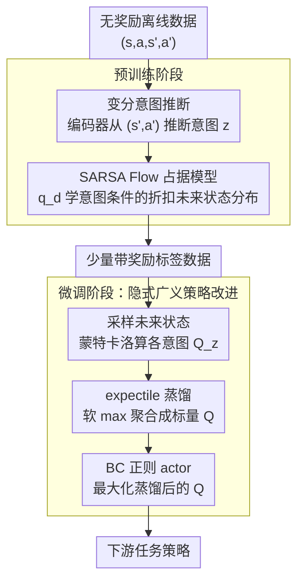

# InFOM: Intention-Conditioned Flow Occupancy Models

**会议**: ICLR 2026  
**arXiv**: [2506.08902](https://arxiv.org/abs/2506.08902)  
**代码**: [https://github.com/chongyi-zheng/infom](https://github.com/chongyi-zheng/infom)  
**领域**: 强化学习  
**关键词**: 占据度量, flow matching, 意图推断, 预训练微调, 广义策略改进

## 一句话总结

InFOM 通过变分推断学习潜在意图编码器、用 flow matching 建模意图条件化的折扣状态占据度量，实现了 RL 中的高效预训练与微调，在 36 个状态任务和 4 个图像任务上比基线提升 1.8 倍中位回报和 36% 成功率。

## 研究背景与动机

**领域现状**：基础模型的预训练-微调范式在 NLP 和 CV 中大获成功，但在强化学习中仍是开放问题。核心困难在于 RL 需要跨时间推理（动作有长期依赖）以及识别数据集中不同用户的不同意图。

**现有痛点**：当前 RL 预训练方法多数忽略了时间和意图这两个关键因素。行为克隆只预测动作但不推理长期后果；世界模型受 compounding error 限制难以做长时预测；占据模型（successor representations）虽能预测远期状态分布但训练困难且忽略用户意图。

**核心矛盾**：大规模离线数据集通常由多个执行不同任务的用户收集，但现有预训练方法要么不建模意图（导致模式平均），要么使用离散技能（限制表达力），无法有效利用数据中的异质结构。

**本文目标**：构建一个能同时捕获(1)时间信息（远期状态访问分布）和(2)用户意图的概率模型，实现高效的 RL 预训练与下游任务微调。

**切入角度**：结合变分推断学习潜在意图、用先进的生成模型（flow matching）建模占据度量、用广义策略改进（GPI）聚合不同意图的 Q 函数进行策略提取。

**核心 idea**：用潜在变量模型编码用户意图，用 flow matching 建模意图条件化的折扣状态占据度量，实现意图感知的长时预测和高效策略提取。

## 方法详解

### 整体框架

InFOM 想解决的是 RL 预训练里的两大难题：怎么在没有奖励标签的大规模离线数据上学到既懂"长期会去到哪些状态"、又懂"不同用户各自想干什么"的可迁移知识。它把训练拆成预训练和微调两个阶段。预训练阶段只用无奖励的离线转移 $\{(s,a,s',a')\}$：先让一个变分意图编码器从每条转移里推断出一个潜在意图 $z$，再用 flow matching 学一个意图条件化的占据模型，能在给定 $(s,a,z)$ 时预测"折扣加权下未来会访问哪些状态"。微调阶段拿到带奖励标签的少量数据后，不再重新学动态，而是从占据模型采样未来状态、用蒙特卡洛把它们换算成每种意图下的 Q 值，再把这一族 Q 值蒸馏成一个标量 critic，最后用一个带行为克隆约束的 actor 抽取出下游策略。

### 关键设计

**1. 变分意图推断：把"这条数据想干什么"压成一个潜在变量**

离线数据集由多个用户混合收集，每个人的意图不同，直接学一个占据模型只会得到模式平均的结果。InFOM 引入一个潜在意图变量 $z$，把"是哪种意图"显式建模出来。具体是最大化未来状态 $s_f$ 在给定 $(s,a)$ 下似然的证据下界（ELBO）：编码器 $p_e(z|s',a')$ 从**下一步**转移 $(s',a')$ 推断意图，解码器 $q_d(s_f|s,a,z)$ 在该意图条件下预测远期状态，并用 $D_{KL}\big(p_e(z|s',a') \,\|\, \mathcal{N}(0,I)\big)$ 把 $z$ 约束成一个信息瓶颈。

两个细节是关键。一是意图从下一步转移而非当前转移推断——这依赖"连续转移共享同一意图"的一致性假设，但好处是编码器看不到要预测的 $(s,a)$，无法退化成把答案直接抄过来的恒等映射，从而避免过拟合。二是 KL 瓶颈逼着 $z$ 只保留区分不同行为策略所需的结构信息，让异质数据中的不同意图被自然地分离开。

**2. SARSA Flow 占据模型：用 flow matching 把"折扣未来状态分布"学成可采样的生成器**

意图有了，还需要一个能预测远期会去到哪些状态的模型。InFOM 用 flow matching 来建模意图条件化的折扣状态占据度量 $p_\gamma^\pi(s_f|s,a,z)$。占据度量本身满足 Bellman 方程

$$p_\gamma^\pi(s_f|s,a) = (1-\gamma)\,\delta_s(s_f) + \gamma\, \mathbb{E}\big[p_\gamma^\pi(s_f|s',a')\big],$$

InFOM 把这个递归嵌进 flow matching 的向量场 $v_d(t, s^t, s, a, z)$ 里，得到分两部分的 SARSA flow loss：current flow loss 负责当前步（直接用 $s$ 自身当目标，对应 $\delta_s$ 项），future flow loss 用 TD-bootstrap 在 $(s',a')$ 上递归（对应期望项）。

这里两个选择都有讲究。用 flow matching 而非扩散模型，是因为它训练更稳、推理更快——采样走的是确定性 ODE 而不是随机 SDE。用 SARSA（在 $(s',a')$ 上 bootstrap）而非 Q-learning 式的 off-policy 更新，是因为一旦加上意图条件 $z$，就不再需要 off-policy 修正，从而避开了反事实误差；同时 TD bootstrap 相比纯蒙特卡洛还支持动态规划和轨迹拼接。

**3. 隐式广义策略改进（Implicit GPI）：用 expectile 蒸馏代替对意图的硬 max**

下游微调时，每种意图 $z$ 都能给出一个 Q 函数：从占据模型采样未来状态、对奖励做蒙特卡洛平均即可，$Q_z(s,a) = \frac{1}{(1-\gamma)N}\sum_i r\big(s_f^{(i)}\big)$，其中 $s_f^{(i)} \sim q_d(s_f|s,a,z)$。传统 GPI 要在一组有限意图上取 max 来聚合这些 Q，问题是 max 容易陷入局部最优，而且对 ODE 采样出来的样本反传梯度本身就不稳。

InFOM 改成把这些 Q 用 expectile 损失 $L_2^\mu$（$\mu \in [0.5,1)$）蒸馏进一个标量 Q 函数，相当于对意图维度做了一个"软 max"——既保留了 GPI 取大的倾向，又避开了 hard max 的局部最优和 ODE 梯度反传。最后用 BC 正则化的 actor 去最大化蒸馏后的 Q，BC 项防止策略漂到数据集外的 OOD 动作、抑制 Q 过估计的传播。

### 损失函数 / 训练策略

预训练：SARSA flow loss（Eq.5）+ KL 散度正则化（Eq.4）联合训练编码器和 flow 模型。微调：奖励预测器用简单回归训练，critic 用 expectile 蒸馏损失（Eq.7，$\mu \in [0.5, 1)$），actor 用 Q 最大化 + BC 正则化（Eq.8）。

## 实验关键数据

### 主实验

| 域 | InFOM | 最佳基线 | 基线名称 | 提升 |
|----|-------|---------|---------|------|
| ExORL Jaco (4任务) | 显著优于 | ~0 回报 | 所有基线 | ~20× |
| OGBench 操作 (20任务) | 最高成功率 | 次优基线 | FB Rep. | +36% |
| OGBench Visual (4任务) | 最高成功率 | 次优基线 | HILP | +31% |
| 真实机器人 | 优于基线 | - | 多种 | +34% |

### 消融实验

| 配置 | 效果 |
|------|------|
| InFOM (完整) | 最高回报 + 最小方差 |
| InFOM + 标准 GPI | 比隐式 GPI 低 44%，方差大 8× |
| FOM + one-step PI (无意图) | 回报和成功率显著下降 |
| 离散潜在变量 (VQ) | 连续潜在空间通常更好 |
| 采样 N=16 未来状态 | Q 估计的较好平衡点 |

### 关键发现

- 在最具挑战性的 OGBench 操作任务上，InFOM 比最强基线成功率高 36%——主要因为不同意图允许探索不同状态区域，缓解稀疏奖励问题
- 意图编码的 t-SNE 可视化显示 InFOM 能清晰区分"抓取"和"放置"行为，而 FB+FOM 和 HILP+FOM 产生混合的意图表示
- 隐式 GPI 比标准 GPI 不仅性能高 44%，方差更是缩小 8 倍，显示 expectile 蒸馏的稳定性优势

## 亮点与洞察

- **意图-占据模型的统一框架**是本文最大创新——将用户意图和长时状态预测在一个优雅的概率框架下联合学习，解决了 RL 预训练中的两大核心难题
- **SARSA flow 比 Q-learning flow 的选择**很有洞见——加入意图条件后不再需要 off-policy 修正，避免了反事实误差和不稳定性
- **隐式 GPI 的设计**（expectile 蒸馏替代 max）是一个通用的策略聚合技巧，可迁移到其他需要在连续条件空间上做 GPI 的场景

## 局限与展望

- 意图从连续的 $(s',a')$ 推断，可能不能完全准确捕获轨迹级别的原始意图
- 蒙特卡洛 Q 估计的方差受采样数 $N$ 影响，部分域上的种子间方差较大（如 cheetah、puzzle）
- 一致性假设（连续转移共享意图）在高度动态环境中可能不成立
- 未探讨与行为克隆预训练方法的正交组合

## 相关工作与启发

- **vs TD Flows (Farebrother et al., 2025)**: TD Flows 也用 flow matching 建模占据度量，但用 forward-backward 表示编码意图且在有限意图集上做 GPI；InFOM 用变分推断学习连续意图空间 + 隐式 GPI，性能更好
- **vs HILP (Park et al., 2024)**: HILP 学习 Hilbert 表示作为技能，但预训练时学多个技能；InFOM 不学技能而是直接用意图条件化占据模型
- **vs 行为克隆 (BC) 预训练**: BC 只模仿动作不推理长期后果，InFOM 通过占据度量实现长时推理

## 评分

- 新颖性: ⭐⭐⭐⭐⭐ 将变分意图推断、flow matching 占据模型、隐式 GPI 优雅统一
- 实验充分度: ⭐⭐⭐⭐⭐ 40个任务、8种基线、消融全面、含真实机器人验证
- 写作质量: ⭐⭐⭐⭐ 论文结构清晰但技术密度极高，需要较强的 RL 背景
- 价值: ⭐⭐⭐⭐⭐ 为 RL 预训练提供了一个强大且通用的框架

<!-- RELATED:START -->

## 相关论文

- [\[ICLR 2026\] Divide, Harmonize, Then Conquer It: Shooting Multi-Commodity Flow Problems with Multimodal Language Models](divide_harmonize_then_conquer_it_shooting_multi-commodity_flow_problems_with_mul.md)
- [\[ICML 2026\] Flow-Equivariant World Models: Memory for Partially Observed Dynamic Environments](../../ICML2026/reinforcement_learning/flow_equivariant_world_models_memory_for_partially_observed_dynamic_environments.md)
- [\[ICLR 2026\] Flow Actor-Critic for Offline Reinforcement Learning (FAC)](flow_actor-critic_for_offline_reinforcement_learning.md)
- [\[ICLR 2026\] PolicyFlow: Policy Optimization with Continuous Normalizing Flow in Reinforcement Learning](policyflow_policy_optimization_with_continuous_normalizing_flow_in_reinforcement.md)
- [\[AAAI 2026\] Intention-Guided Cognitive Reasoning for Egocentric Long-Term Action Anticipation](../../AAAI2026/reinforcement_learning/intention-guided_cognitive_reasoning_for_egocentric_long-term_action_anticipatio.md)

<!-- RELATED:END -->
