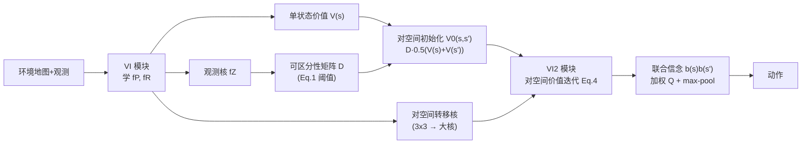

# Information-based Value Iteration Networks for Decision Making Under Uncertainty

**会议**: ICLR 2026  
**OpenReview**: [https://openreview.net/forum?id=if1Ndb6RWD](https://openreview.net/forum?id=if1Ndb6RWD)  
**代码**: 待确认  
**领域**: reinforcement learning / POMDP planning  
**关键词**: Value Iteration Network, POMDP, 部分可观测, Pairwise Heuristic, 价值of信息, 可微规划  

## 一句话总结
本文提出 VI2N（Value Iteration with Value of Information Network），把"成对启发式"（Pairwise Heuristic）做成可微的卷积网络模块，让价值迭代网络第一次能在高感知歧义的部分可观测导航环境中学会"先消除不确定性、再去拿奖励"的策略。

## 研究背景与动机
- **领域现状**：把经典价值迭代（value iteration）显式嵌入网络结构的 VIN（Value Iteration Network）在完全可观测环境中泛化能力远超普通卷积/全连接网络，并能生成正确标出奖励区域的环境模型。
- **现有痛点**：VIN 及其后续改进几乎都局限在完全可观测环境。一旦出现感知歧义（partial observability），智能体必须维护对当前状态的概率分布"信念"（belief），而决策要基于信念而非单点状态——现有网络的规划模块根本撑不住。
- **核心矛盾**：POMDP 最优决策不可在多项式时间求解，强力近似（采样、树搜索）又不可微，没法塞进神经网络。当前 SOTA 的可微 POMDP 网络 QMDP-Net 只能依赖最简单的 QMDP 求解器——它**假设第一步之后所有不确定性都消失**，因此在高不确定环境中必然失败。
- **本文目标**：为部分可观测下的价值迭代网络设计一个**真正能做长程不确定性消解**的、可微的策略模块。
- **核心 idea**：**借用成对启发式（Pairwise Heuristic）** —— 只考虑"两个状态构成的最小子问题"，对每一对状态先解歧、再取奖励，而这套计算恰好能写成贝尔曼方程，于是能像 VIN 一样用卷积层实现，并可在混合可观测环境中通过因子化大幅压缩计算量。

## 方法详解

### 整体框架
VI2N 把 POMDP 的成对启发式拆成两段串联的可微价值迭代：先用一个普通 VI 模块在底层 MDP 上算出单状态价值 $V(s)$、学到转移核 $f_P$ 与奖励核 $f_R$；再把环境的转移/奖励/价值"升维"到状态对空间 $(s,s')$，在对空间上跑第二个价值迭代模块（VI2 模块），最后用联合信念 $b(s,s')=b(s)b(s')$ 加权对空间 Q 值并做 max-pooling 选动作。整套流程全部由卷积、外积、阈值、矩阵乘法构成，端到端可微。

### 关键设计

**1. 成对启发式：用"状态对"承载不确定性，并把它写成贝尔曼方程。** 全空间 POMDP 不可微的根源是信念是连续分布。成对启发式的取巧之处在于只保留**最小的、仍含不确定性的子问题**——一对状态，对每一对都假设信念是 $0.5/0.5$，其期望总回报记为成对价值 $V(s,s')$。对每一对，策略遵循"先解歧、后取奖"：若两个状态在观测上本就可区分，不确定性视为已解决，成对价值直接取两者底层 MDP 价值的平均 $0.5(V(s)+V(s'))$；若不可区分，则需要主动走到能区分的状态对去消解歧义。这一"对空间"恰好又是一个 MDP，其转移是原环境转移的联合分布 $T((s,s'),a,(s'',s'''))=p(s''|s,a)\,p(s'''|s',a)$，奖励是两状态奖励均值 $R(s,s')=0.5(R(s)+R(s'))$，于是成对价值满足贝尔曼方程
$$V_k(s,s')=\max_a\Big[R(s,s')+\gamma\sum_{s'',s'''}T((s,s'),a,(s'',s'''))V_{k-1}(s'',s''')\Big]$$
正因为是贝尔曼递推，它才能和 VIN 一样用卷积价值迭代实现——这是整篇文章"可微化"的命门。

**2. 可区分性判据与不确定性的卷积式编码。** "两个状态能否被观测区分"决定了成对价值的初始化方式。本文用观测函数给出形式化判据：$s$ 与 $s'$ 可区分当且仅当
$$\sum_o p(o|s)\big(1-p(o|s')\big)+p(o|s')\big(1-p(o|s)\big)\ge 2\lambda$$
其中 $\lambda$ 由领域专家设定（无观测噪声时为 1）。网络实现非常直接：把观测核 $f_Z$ 卷过整张地图得到矩阵 $Z$，再用 $Z$ 与 $1-Z$ 的外积与阈值比较，输出一个二值 $|S|\times|S|$ 的可区分矩阵 $D$。成对价值初始化 $V_0(s,s')$ 就用 $D\cdot 0.5(V(s)+V(s'))$（可区分对）加上 $(1-D)\cdot \min R(S)$（不可区分对取最小奖励）——后者正是"逼迫智能体先去解歧"的机制来源。

**3. 转移核升维与动作选择。** 把单状态 $3\times3$ 转移核映射到对空间时，核要扩张到 $(2(\sqrt{S}+1)+1)\times(2(\sqrt{S}+1)+1)$，以容纳对内两个状态各自在行、列方向上的转移；$f_P$ 的九个值被填到对应通道对空间核的主对角线上，通道数等于动作数。动作选择实现 Eq.5：用信念外积 $b(s,s')=b(s)b(s')$ 与对空间 Q 值相乘后做 max-pooling
$$a_k^*=\arg\max_a\sum_{(s,s')}b(s,s')Q((s,s'),a)$$
当除最可能状态外的概率都可忽略时，这一选择会自然退化为底层 MDP 在最可能状态上的最优动作，保证了与全可观测情形的一致性。

**4. 混合可观测因子化：把平方级开销压成线性。** 现实中状态往往可拆成可见因子 $S_v$ 与隐藏因子 $S_h$（$S=S_v\times S_h$），即 MOMDP。关键观察是：**任何可见因子不同的状态对天然可区分**，因此成对价值只需在 $V(s_v,s_h,s_h')$ 上计算，价值迭代的对数从 $|S|(|S|-1)/2$ 降到 $|S_v|\cdot|S_h|(|S_h|-1)/2$。当 $|S_h|\ll|S_v|$ 时，成对模块的规模从 $|S_v|^2|S_h|^2$ 降到 $|S_v||S_h|^2$。在"未知目标位置"任务（$N=10$、$|G|=4$）里这直接带来约 100 倍的内存/计算压缩，使网络可训练、可扩展。

## 实验关键数据

对比对象为 QMDP-Net（已被证明显著优于无约束网络，故未再纳入后者）；同时测试的 Transformer 架构（Decision Transformer 类）在超过 10% 测试用例上失败被排除。为公平比较，所有智能体共用相同的信念更新模块，QMDP-Net 的 VI 递归次数被设为 VI2N 中 VI + VI2 递归次数之和（实际上 QMDP-Net 在自由参数上还占便宜）。

### 主实验：任务一（目标可见、自身位置未知）

| 模型 | Random(5%) | Random(10%) | Walls(1) | Walls(2) | Walls(3) | Symm(5%) | Symm(10%) | Symm(15%) |
|------|-----------|------------|---------|---------|---------|---------|----------|----------|
| **VI2N** | 93±1% | 95±1% | **77±1%** | **83±1%** | **82±1%** | **76±3%** | **74±3%** | **65±4%** |
| QMDP-Net | 93±1% | 96±1% | 69±1% | 78±2% | 80±2% | 61±3% | 51±5% | 41±4% |

环境越歧义（walls 长走廊、symmetric 四角对称），VI2N 优势越大；在最难的对称环境中差距高达 20+ 个百分点。破坏对称性的鲁棒性测试中，VI2N 中位成功率 68% vs QMDP-Net 48%。

### 主实验：任务二（目标位置未知、自身位置可见，MOMDP）

| 目标数 | 2(确定) | 3(确定) | 4(确定) | 2(随机) | 3(随机) | 4(随机) |
|--------|--------|--------|--------|--------|--------|--------|
| **VI2N** | **98±2%** | **96±2%** | **95±2%** | **91±2%** | **91±3%** | **91±2%** |
| QMDP-Net | 57±4% | 53±2% | 51±2% | 27±2% | 28±2% | 30±17% |

差距极其悬殊；随机转移下 QMDP-Net 几乎崩溃。20×20、4 目标的扩展性测试中，VI2N 79±3% vs QMDP-Net 27±2%。轨迹分析显示 VI2N 平均 96% 的回合会去"地标"消歧，而 QMDP-Net 仅 34%——直接验证了"先解歧"行为。

### 消融：递归步数的作用（任务二，|G|=4）

| kVI | kVI2 | 成功率 |
|-----|------|--------|
| 5 | 5 | 58±16% |
| 20 | 1 | 41±2% |
| 1 | 60 | 45±9% |
| 40 | 20 | **95±2%** |
| 60 | 40 | 94±2% |

任一规划模块的步数被压到 1 都会严重掉点，说明 **VI（取奖励）与 VI2（解歧）两个规划模块缺一不可**；步数到一定值后饱和，与经典价值迭代规律一致。

### 关键发现
- VI2N 不只赢成功率，还能产出**可解释的认知地图**：单状态价值 $V(s)$ 标出奖励区域，边际成对价值 $\sum_s V(s,s')$ 标出"信息丰富"区域；QMDP-Net 的价值函数里完全看不到信息区，因为其算法不考虑消解不确定性。

## 亮点与洞察
- **把不可微的 POMDP 启发式翻译成卷积价值迭代**：成对启发式天然是贝尔曼递推这一事实，是它能落进 VIN 框架的根本，体现了"挑对算法骨架"比"硬塞近似"更聪明。
- **"信息价值"被显式建模并可视化**：用成对价值的边际把"该去哪消歧"画成地图，让规划行为可解释，这是相对 QMDP-Net 在机制层面的本质差异。
- **MOMDP 因子化的工程价值巨大**：100 倍压缩把一个原本不可行的网络变成可训练可扩展，是方法能上规模的关键。

## 局限与展望
- 实验全部在**网格导航**任务（2D、动作为相邻格移动），转移核为 $3\times3$，离更一般的高维/连续控制还有距离。
- 可区分性阈值 $\lambda$ 需领域专家设定，未做自动学习/自适应。
- 成对启发式终究是次优近似，只取"两状态子问题"，对需要三阶及以上联合推理的极端歧义场景理论上仍有盲区。
- VI2 模块中转移核**不回传梯度**（被固定），虽简化训练但也限制了对空间转移的端到端优化空间。
- 感官/执行噪声虽测过能保持性能，但论文聚焦的是感知歧义而非传感器噪声，更复杂噪声组合下的表现仍待验证。

## 相关工作与启发
- **VIN 谱系**（Tamar 2016；Niu 2018；Zhang 2020；Ishida & Henriques 2022）把价值迭代嵌进卷积网络，但基本停留在完全可观测；本文是这条线向部分可观测的实质性延伸。
- **QMDP-Net**（Karkus 2017）是此前可微 POMDP 规划的 SOTA，但其 QMDP 内核"一步后不确定性消失"的假设是高歧义场景的根本短板，本文正是针对它的对照与超越。
- **Pairwise Heuristic** 源自贝叶斯主动学习（Golovin 2010）与通用 POMDP 求解（Khalvati & Mackworth 2013），本文把它改造成可微网络模块，是"经典规划启发式 × 深度可微规划"结合的范例。
- 启发：对于"现有可微近似太弱"的问题，与其堆网络容量，不如回到经典 OR/规划文献里找一个**既次优可用、又恰好能写成可微递推**的启发式——这是把不可微算法神经网络化的通用配方。

## 评分
- **新颖性**: ⭐⭐⭐⭐ — 首次把成对启发式做成可微 VIN 模块，机制上真正解决"长程不确定性消解"，相比 QMDP-Net 是本质而非增量改进。
- **实验充分度**: ⭐⭐⭐ — 两类任务、七种环境结构、确定/随机转移、扩展性与递归消融都覆盖到位且对照公平；但仅限网格导航、对手只有 QMDP-Net，基线略单薄。
- **写作质量**: ⭐⭐⭐⭐ — POMDP/MOMDP 背景铺垫扎实，从启发式数学到网络实现的映射讲得清晰，认知地图可视化加分。
- **价值**: ⭐⭐⭐⭐ — 给部分可观测下的可微规划提供了可解释、可扩展的新骨架，对机器人导航、神经认知建模都有借鉴意义。

<!-- RELATED:START -->

## 相关论文

- [\[ICML 2025\] Scaling Value Iteration Networks to 5000 Layers for Extreme Long-Term Planning](../../ICML2025/reinforcement_learning/scaling_value_iteration_networks_to_5000_layers_for_extreme_long-term_planning.md)
- [\[ICLR 2026\] Ada-Diffuser: Latent-Aware Adaptive Diffusion for Decision-Making](ada-diffuser_latent-aware_adaptive_diffusion_for_decision-making.md)
- [\[ICLR 2026\] Frozen Policy Iteration: Computationally Efficient RL under Linear $Q^{\pi}$ Realizability for Deterministic Dynamics](frozen_policy_iteration_computationally_efficient_rl_under_linear_qpi_realizabil.md)
- [\[ICLR 2026\] EMFuse: Energy-based Model Fusion for Decision Making](emfuse_energy-based_model_fusion_for_decision_making.md)
- [\[ICLR 2026\] Continuous-Time Value Iteration for Multi-Agent Reinforcement Learning](continuous-time_value_iteration_for_multi-agent_reinforcement_learning.md)

<!-- RELATED:END -->
