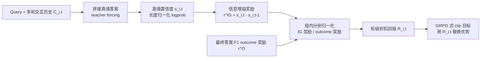

# Information Gain-based Policy Optimization: A Simple and Effective Approach for Multi-Turn Search Agents

**会议**: ICLR 2026  
**代码**: [https://github.com/GuoqingWang1/IGPO](https://github.com/GuoqingWang1/IGPO)  
**领域**: 强化学习 / Agentic RL / 多轮搜索智能体  
**关键词**: 信息增益、过程奖励、GRPO、多轮搜索智能体、稠密奖励、credit assignment  

## 一句话总结
IGPO 把每一轮 agent-环境交互看作"逐步逼近真值"的过程，用模型自身对 ground-truth 的置信度增量当作轮级稠密奖励，无需外部奖励模型或蒙特卡洛估计，就缓解了多轮 RL 里 outcome 奖励稀疏导致的优势塌缩问题。

## 研究背景与动机
**领域现状**：基于 LLM 的搜索智能体越来越多用 RL 来训练多轮工具调用能力，GRPO 这类 critic-free、组内归一化的方法已成为 agentic RL 的主流范式，它对每条 rollout 只用最终答案的正确性（与真值的 word-level F1）算一个标量 outcome 奖励，再用组内相对优势驱动策略更新。

**现有痛点**：outcome 奖励只在最后一步给监督，在多轮长轨迹场景里被三个问题放大——(i) **优势塌缩**：一组 rollout 给出相同答案（全对或全错）时，组内相对优势全为零，没有任何梯度信号，模型越小、查询越难，这种零优势 batch 占比越高；(ii) **缺乏细粒度 credit assignment**：后面的动作严格依赖前面，一个本身正确的工具调用可能被前面的错误拖垮，反之早期的成功也可能被后续错误抹掉，单一终端奖励无法区分哪一步真正有用；(iii) **样本效率低**：整条轨迹只回收一个终端信号，中间大量推理与工具交互的信息被浪费。

**核心矛盾**：已有的过程奖励方案要么依赖外部 oracle / 奖励模型来判别中间步骤（昂贵且引入偏差），要么靠蒙特卡洛模拟估计 step value（样本不够就高方差），都难以同时做到便宜、稳定、可扩展。如何在不引入外部监督的前提下，给多轮轨迹的每一步提供稠密、可靠、与真值对齐的奖励，是本文要解决的核心矛盾。

**本文目标**：提供一种内生（intrinsic）、稳定、几乎零额外开销的过程奖励，让每条样本即使没有一条 rollout 完全正确也能贡献学习信号。

**核心 idea**：**信息增益即奖励**——把每一轮交互建模为"获取关于真值的信息"的增量过程，用模型对 ground-truth 的置信度在相邻两轮之间的变化量作为轮级奖励，再与 outcome 奖励组合成稠密信号，套进 GRPO 式目标。

## 方法详解

### 整体框架
IGPO 在标准 GRPO 之上加了一条"轮级信息增益奖励"通路：对每条 rollout 的每个中间轮 $t$，把真值答案以与预测答案相同的 schema 拼接到当前交互历史 $C_{i,t}$ 后面，在 teacher forcing 下算真值 token 的长度归一化对数概率（即"对真值的置信度"$s_{i,t}$），相邻两轮置信度之差就是该轮的信息增益奖励 $r^{IG}_{i,t}$。信息增益奖励与最终的 outcome 奖励分别做组内归一化、再折扣累加成轮级折扣回报，最后替换掉 GRPO 里 rollout 级的优势项进行策略优化。

### 关键设计

**1. 信息增益奖励：用模型自己的置信度增量当过程监督。** IGPO 不去外部判别"这一步好不好"，而是问模型"看到这一轮新信息后，你对真值更有把握了吗"。具体地，在每个中间轮把真值答案 $a=(a_1,\dots,a_L)$ 接到当前历史 $C_{i,t}$ 后，算长度归一化的真值置信度 $s_{i,t}=\frac{1}{L}\sum_{j=1}^{L}\log\pi_\theta(a_j\mid C_{i,t},a_{<j})$，长度归一化是为了让不同长度答案之间可比、数值稳定。轮级奖励就是相邻置信度之差并停梯度：$r^{IG}_{i,t}\triangleq \mathrm{sg}(s_{i,t}-s_{i,t-1})$。这一设计天然具备三个性质：置信度上升则奖励为正、下降则为负，做到了 **ground-truth 感知**且最小化外部标注偏差；它给每个中间轮都提供信号，直接缓解优势塌缩、补上细粒度 credit assignment、提高样本利用率（**稠密监督**）；相比蒙特卡洛估计它只需常规前向，开销可忽略（**计算高效**）。

**2. 向量化实现：一次前向算完所有轮的置信度。** 朴素做法要对每个前缀 $C_{i,t}$ 单独前向，复杂度约 $\sum_t L_{i,t}^2$，代价不小。IGPO 把 $T_i$ 份格式化后的真值目标一次性追加到轨迹末尾，分别对应前缀 $C_{i,0},\dots,C_{i,T_i-1}$，再用一个**定制注意力掩码**让每份拷贝只能看到它对应的前缀和自己已生成的真值 token，从而在单次前向里同时算出所有轮所需的对数概率，且与逐前缀计算严格等价。由于追加的真值目标长度远小于完整推理轨迹，额外开销可忽略，还顺带减少了同步开销、提高 GPU 利用率，让"过程奖励"这件事在工程上几乎免费。

**3. 轮级折扣回报与策略优化：把瞬时增益变成面向未来的稠密信号。** 单纯的 $r^{IG}_{i,t}$ 只反映当轮瞬时效果，忽略了当前决策对后续轮的影响。IGPO 先把信息增益奖励 $\{r^{IG}_{i,t}\}$ 和 outcome 奖励 $\{r^O_i\}$ **在组内分别做 z-归一化**，避免两类奖励尺度互相压制：中间轮用 $\tilde r_{i,t}=\frac{r^{IG}_{i,t}-\mu^{IG}}{\sigma^{IG}}$，最后一轮用 $\tilde r_{i,T_i}=\frac{r^{O}_i-\mu^{O}}{\sigma^{O}}$。再做折扣累加得到轮级折扣回报 $\tilde R_{i,t}=\sum_{k=t}^{T_i}\gamma^{k-t}\tilde r_{i,k}$，捕捉长程依赖；对第 $m$ 个生成 token 按它所在的轮 $\kappa_i(m)$ 赋上 $\tilde R_{i,\kappa_i(m)}$。最终目标与 GRPO 同构，只是把 rollout 级优势换成轮级折扣回报：$J_{IGPO}(\theta)=\mathbb{E}\big[\frac{1}{G}\sum_i\frac{1}{M_i}\sum_m \min(\rho_{i,m}\tilde R_{i,\kappa_i(m)},\,\mathrm{clip}(\rho_{i,m},1-\epsilon,1+\epsilon)\tilde R_{i,\kappa_i(m)})-\beta D_{KL}(\pi_\theta\Vert\pi_{ref})\big]$，工具响应 token 只作为条件上下文、不计入损失。

## 实验关键数据

设置：主干 Qwen2.5-7B-Instruct（消融用 3B），verl 框架训练，折扣 $\gamma=1.0$，每步采 32 prompt × 16 rollout，最多 10 轮对话，工具用 Google Search API，配置对齐 DeepResearcher。指标为 word-level F1，覆盖 4 个 in-domain（NQ/TQ/HotpotQA/2Wiki）+ 3 个 out-of-domain（Musique/Bamboogle/PopQA）数据集。

### 主实验表格（与各类 agentic RL 基线对比，7B，Avg.）

| 方法 | 类型 | NQ | TQ | HotpotQA | 2Wiki | Musique | Bamboogle | PopQA | Avg. |
|---|---|---|---|---|---|---|---|---|---|
| CoT | Prompt | 19.8 | 45.6 | 24.4 | 26.4 | 8.5 | 22.1 | 17.0 | 23.4 |
| Search-o1 | Prompt | 32.4 | 58.9 | 33.0 | 30.9 | 14.7 | 46.6 | 38.3 | 36.4 |
| Search-r1-base | Outcome RL | 45.4 | 71.9 | 55.9 | 44.6 | 26.7 | 56.5 | 43.2 | 49.2 |
| DeepResearcher | Outcome RL | 39.6 | 78.4 | 52.8 | 59.7 | 27.1 | 71.0 | 48.5 | 53.9 |
| GiGPO | Step RL | 46.4 | 64.7 | 41.6 | 43.6 | 18.9 | 68.9 | 46.1 | 47.2 |
| **IGPO** | **本文** | **46.4** | **80.6** | **59.0** | **72.1** | **32.7** | **77.0** | **53.8** | **60.2** |

IGPO 平均 60.2，比最强基线 DeepResearcher 高 +6.3；step-reward 基线（StepSearch/ReasoningRAG/GiGPO）虽偶有亮点但整体不稳定，仍落后于强 outcome 基线。在同配置下与标准 RL 算法对比，IGPO 也全面领先：RLOO 49.7 / PPO 51.5 / GRPO 51.9 / Reinforce++ 47.3 / GSPO 52.0，IGPO 60.2。

### 消融实验表格（不同奖励组件，Avg.）

| 模型 | IGPO(w/ F1)=GRPO | IGPO(w/ IG) | IGPO(w/ F1+IG) |
|---|---|---|---|
| Qwen2.5-3B | 32.3 | 34.6 | **48.9** |
| Qwen2.5-7B | 51.9 | 53.5 | **60.2** |

### 关键发现
- **两类奖励互补**：只用 IG 或只用 F1 都明显逊于组合；outcome 奖励锚定最终目标但稀疏，信息增益奖励提供稠密稳定的中间引导。
- **只用 IG 不崩**：仅用信息增益（无 outcome 监督）就能持平甚至超过标准 GRPO，说明该内生奖励 grounded 在真值上、不易 reward hacking。
- **小模型受益更大**：相比 GRPO，3B 模型 +16.6（32.3→48.9）、7B +8.3（51.9→60.2）；弱模型优势塌缩更严重，更依赖稠密信号。
- **学习更快更稳**：训练曲线显示 IGPO 在七个数据集上稳定超过两个消融变体，收敛到更高 F1 且全程稳定。

## 亮点与洞察
- **"问模型对真值的置信度"是一个很巧的内生过程奖励**：它把"这一步有没有用"转化为"模型看到这一步后对正确答案是否更有把握"，天然 ground-truth 对齐，绕开了外部奖励模型的成本与偏差，也避开了蒙特卡洛的高方差。
- **向量化 + 定制注意力掩码把过程奖励做成"几乎免费"**：用一次前向、追加短真值拷贝就算完所有轮的置信度，工程上的低开销是这套方案能称为"simple and effective"的关键。
- **两类奖励分别归一化**是稳定训练的实用细节，避免信息增益与 outcome 尺度互相淹没。

## 局限与展望
- **依赖训练时可见的 ground-truth 答案**：信息增益奖励用真值在 teacher forcing 下算置信度，因此只适用于有明确参考答案的 QA/搜索任务，难以直接迁移到开放式、无唯一真值的生成任务。
- **置信度作为"信息量"的代理可能被表面相关性误导**：模型置信度上升不一定等于真正获取了有用证据，长程或需多跳推理时这种代理是否稳健仍待更深入分析。
- **实验集中在 Qwen2.5-3B/7B 与搜索 QA**，更大模型、更多工具类型（代码、计算、多模态）下的普适性有待验证。
- **折扣因子 $\gamma=1.0$ 未调**，长 horizon 任务上是否需要更精细的折扣/回报设计是可拓展点。

## 相关工作与启发
- **对接 GRPO 系**（Shao et al. 2024）：IGPO 是 GRPO 的最小改动版——保留组内归一化与 clip 目标，只把 rollout 级优势换成轮级折扣回报，工程迁移成本低。
- **vs 外部过程奖励**（StepSearch、PRM、奖励模型）：避开外部判别器的成本与偏差。
- **vs 蒙特卡洛 step value**（ReasoningRAG 等）：避开高方差估计，几乎零额外采样。
- **启发**：用"模型对目标的置信度变化"做内生稠密奖励，这一思路有望迁移到其他有可验证目标的多步任务（如可执行代码、可验证数学），值得关注其在 reward hacking 边界上的表现。

## 评分
- **新颖性**: ⭐⭐⭐⭐ 用真值置信度增量当轮级过程奖励的视角清晰且实用，向量化实现是有价值的工程贡献；不过整体是 GRPO 框架内的奖励设计改进。
- **实验充分度**: ⭐⭐⭐⭐ 覆盖 7 个 ID/OOD 数据集、与 prompt/outcome/step 三类基线及 5 种标准 RL 算法对比，消融拆清两类奖励贡献并验证小模型收益更大。
- **写作质量**: ⭐⭐⭐⭐ 动机三问题层层递进，方法公式完整、图示清晰（pipeline + 注意力掩码）。
- **价值**: ⭐⭐⭐⭐ 给多轮 agentic RL 提供了便宜、稳定、可复现的稠密奖励方案，对优势塌缩这一痛点切中要害，代码开源，落地价值高。

<!-- RELATED:START -->

## 相关论文

- [\[ICLR 2026\] Group Verification-based Policy Optimization for Interactive Coding Agents](group_verification-based_policy_optimization_for_interactive_coding_agents.md)
- [\[ICLR 2026\] TIPS: Turn-Level Information-Potential Reward Shaping for Search-Augmented LLMs](tips_turn-level_information-potential_reward_shaping_for_search-augmented_llms.md)
- [\[NeurIPS 2025\] Reinforcement Learning for Long-Horizon Multi-Turn Search Agents](../../NeurIPS2025/reinforcement_learning/reinforcement_learning_for_long-horizon_multi-turn_search_agents.md)
- [\[ICLR 2026\] Kevin: Multi-Turn RL for Generating CUDA Kernels](kevin_multi-turn_rl_for_generating_cuda_kernels.md)
- [\[ICLR 2026\] Multi-Agent Guided Policy Optimization](multi-agent_guided_policy_optimization.md)

<!-- RELATED:END -->
