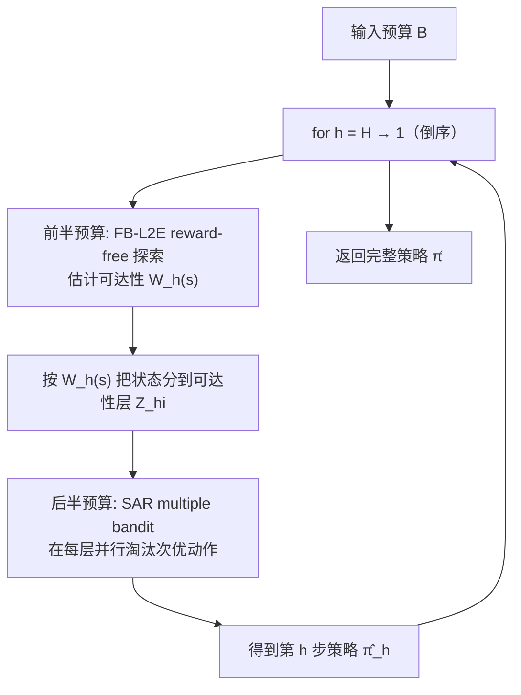

# Instance-Dependent Fixed-Budget Pure Exploration in Reinforcement Learning

**会议**: ICLR 2026  
**OpenReview**: [https://openreview.net/forum?id=xIycolc5Xw](https://openreview.net/forum?id=xIycolc5Xw)  
**代码**: 未开源（纯理论工作）  
**领域**: 强化学习 / 学习理论（纯探索、策略识别）  
**关键词**: 固定预算（fixed-budget）、纯探索、策略识别、instance-dependent、ε-uniform 保证、multiple bandit、reward-free exploration  

## 一句话总结
本文首次研究 MDP 中的固定预算纯探索问题，提出 BREA 算法——只输入交互预算 B，就能给出 instance-dependent 的「ε-uniform」失败概率上界（对所有超过预算阈值的精度 ε 同时成立），把策略识别从「需要预先指定精度 ε 和置信度 δ」的 PAC 范式中解放出来。

## 研究背景与动机
**领域现状**：强化学习理论的策略识别（pure exploration）长期由 **fixed-confidence（PAC RL）** 范式主导：算法需输入目标精度 ω 和失败率 δ，持续采样直到能「自我验证」返回的策略确实是 ω-最优才停止。而在多臂老虎机里早已流行的 **fixed-budget** 范式（给定固定交互次数 B，耗尽后必须输出一个策略），在 MDP 上几乎是一片空白。

**现有痛点**：fixed-confidence 范式有三大不便。其一，它假设算法可以「能采多少采多少」，一旦因实际约束被强制中止，就无法保证返回策略的质量；而 fixed-budget 让使用者直接控制预算，更贴近工程实践。其二，验证（verification）需求迫使算法多花样本去「证明自己对」，反而拿不到 bandit 里那种 instance-dependent 的加速率和 data-poor regime 保证。其三，ω 和 δ 对很多非关键应用而言只是累赘的超参。

**核心矛盾**：把 fixed-confidence 算法直接「转换」成 fixed-budget 不可行——转换需要知道未知的 instance-dependent 量，且即便可行也只对预先指定的某个 ω 成立，远弱于对所有 ω 同时成立的保证。同时，fixed-budget 下既不知道置信度 δ 也不知道精度 ω，无法像 fixed-confidence 那样套用预设置信水平的 Hoeffding/Bernstein 浓度不等式。

**本文目标**：在只输入预算 B 的前提下，给出 $P(V_0^* - V_0^{\hat\pi} > \omega)$ 关于 B 和 instance-dependent 量的指数衰减上界，且**对所有 $\omega \ge \omega^\dagger$（某个预算相关阈值）同时成立**——作者称之为 **ε-uniform guarantee**，本质是刻画学到策略次优度这个随机变量的整条尾部分布。

**核心 idea**：**【倒序分解 + 双机制】** 把每个 (状态, 步) 看成一个老虎机，用「reward-free 探索估可达性」+「multiple bandit 做动作淘汰」两套机制从 h=H 倒推到 h=1，逐步识别每个相关状态的近优动作。

## 方法详解

### 整体框架
BREA（Backward Reachability Estimation and Action elimination）从最后一步 H 倒推到第一步 1。在每一步 h，把预算劈成两半：前一半跑 **reward-free 探索**估计每个状态的可达性 $W_h(s)$，后一半用 **SAR multiple bandit** 机制淘汰次优动作。倒序的原因是：要学第 h 步的动作，需要在后续步用「足够准的策略」去采样轨迹（Proposition 1 保证用近优策略采样就够），而这些后续策略必须先于第 h 步确定。

### 关键设计

**1. ε-uniform guarantee：刻画次优度的整条尾部，而非单点。** 传统 PAC 保证形如「以概率 $1-\delta$ 返回 ω-最优策略」，需要把 ω、δ 钉死成输入。本文转而证明：对任意 $\omega \ge 2SH^2\omega_B$（其中阈值 $\omega_B := (1+\tfrac{\log(2)B}{c(B)})^{-0.6321}$ 随预算 B 单调下降），失败概率 $P(V_0^* - V_0^{\hat\pi} > \omega)$ 都被一个关于 B 与 instance 难度的指数函数同时控制。换言之，把学到策略的次优度看成随机变量，刻画的是它的整条尾部分布，于是 ω 和 δ 都不再是输入，只是分析时可任取的量。

**2. 可达性估计（FB-L2E）：把 fixed-confidence 的 reward-free 探索搬进 fixed-budget。** 作者把 Wagenmaker 等人的 Learn2Explore 小心改造成固定预算版 FB-L2E。核心技巧是重置奖励——令 $R_{h'}(s',a')=1$ 当且仅当 $(s',a',h')=(s,1,h)$，其余为 0，则最优策略恰好最大化访问 $(s,1)$ 的概率，于是 $V_0^* = W_h(s)$，可达性估计被转化成一个标准最优策略求解问题（用 STRONGEULER 求解，因其有 $\log\tfrac1\delta$ 依赖的高概率 regret 界）。Theorem 3.1 保证：以高概率，每个子集 $X_i$ 的可达性满足 $\tfrac{|X_i|}{|X|}2^{-i-3} \le W_h(X_i) \le 2^{-i+1}$，且存下来的策略能为每个相关状态-动作对提供足够多的样本，供下游淘汰使用。

**3. multiple bandit 的 ε-correctness（SAR）：用「同时解多个老虎机」省下 S 依赖。** 在第 h 步，所有同可达性层的状态构成 M 个老虎机实例（每个 K=A 臂），目标是给每个实例都挑出一个好臂。作者首次为 Bubeck 等人的 SAR（Successive Accept and Reject）算法证明 ε-correctness：把所有实例的经验 gap 排序后自适应分配预算。Theorem 3.2 给出 $P(\exists m: \mu_{m,1}-\mu_{m,J(m)} > \omega) \le 2M^2K^2\exp\!\big(-\tfrac{B-MK}{128\sigma^2\overline{\log}(MK)\sum_i(\bar\Delta_{(i)}\vee\omega)^{-2}}\big)$。相比逐个状态套用单臂 best-arm-identification，multiple bandit 让最终样本复杂度对 S 的依赖显著降低。

**4. 主定理与 instance-dependent 复杂度：H⁵·可控性²·gap⁻² 的刻画。** 合并上述机制，BREA（Algorithm 3）的主结果 Theorem 3.3 把失败概率界成两个指数项之和——一项来自可达性估计的低阶误差，主项形如 $\exp\big(-\tilde\Omega\big(\tfrac{B}{H^5\max_h C_h^2\sum_s W_h(s)^{-1}\sum_a(\bar\Delta_h(s,a)\vee\frac{\omega}{W_h(s)})^{-2}}\big)\big)$。其中 $C_h$ 是 MDP 的「可控性」（$1\le C_h\le S$，越大越难控制），$\bar\Delta_h(s,a)$ 是次优 gap。换算成样本复杂度后，bandit 特例（S=H=1）退化为经典的 $\sum_a(\bar\Delta_{(a)}\vee\omega)^{-2}$，与已有 best-arm-identification 文献一致；多出的 $H^5$（相比 PAC RL 的 $H^4$）正是 fixed-budget 「不知如何在各步间分配预算」这一固有难度的代价。若额外把 ω 作为输入，还能加一个 refinement 阶段（Theorem 3.4），得到与 MOCA 算法高度对齐的复杂度表达式。

## 实验关键数据

> 本文为纯理论工作，无数值实验，核心贡献是算法设计与失败概率/样本复杂度的理论界。下表整理关键理论结果以替代实验表格。

### 主要理论结果

| 结果 | 对象 | 核心界 | 意义 |
|------|------|--------|------|
| Theorem 3.1 | FB-L2E 可达性估计 | $\frac{|X_i|}{|X|}2^{-i-3}\le W_h(X_i)\le 2^{-i+1}$ | fixed-budget reward-free 探索工具 |
| Theorem 3.2 | SAR multiple bandit | $\le 2M^2K^2\exp(-\tfrac{B-MK}{128\sigma^2\overline{\log}(MK)\sum_i(\bar\Delta_{(i)}\vee\omega)^{-2}})$ | 首个 SAR 的 ε-correctness 保证 |
| Theorem 3.3 | BREA 主定理 | 主项 $\exp(-\tilde\Omega(\tfrac{B}{H^5\max_h C_h^2\sum_s W_h(s)^{-1}\sum_a(\cdots)^{-2}}))$ | 首个 MDP fixed-budget instance-dependent ε-uniform 界 |
| Corollary 3 | 精确最优策略识别 | $P(V_0^*-V_0^{\hat\pi}>0)$ 指数衰减 | gap 唯一时可识别精确最优 |
| Theorem 3.4 | 带目标精度 ω 的变体 | 三指数项之和，含 $|\mathrm{OPT}_h(3\omega)|$ | 与 MOCA 复杂度对齐 |

### 关键发现
- **bandit 一致性**：S=H=1 时主项退化为 $\sum_a(\bar\Delta_{(a)}\vee\omega)^{-2}$，与 Even-Dar/Audibert/Karnin 等经典 bandit 结果吻合，验证了界的正确尺度。
- **确定性 vs 概率性**：本文样本复杂度是确定性的，而 PAC RL 的样本复杂度通常只以概率 $1-\delta$ 成立。
- **可控性刻画难度**：界里出现的 $C_h$（$1\le C_h\le S$）直观刻画了 MDP 各步的可控性——越大说明策略越难调控占用度，问题越难。

## 亮点与洞察
- **范式层面的贡献**：把 bandit 里成熟的 fixed-budget 思想第一次系统搬到 MDP，填补了 RL 理论的一块空白，且证明了 fixed-budget 能拿到 fixed-confidence 因验证需求而拿不到的 instance-dependent 保证。
- **ε-uniform 是更强的保证形式**：一次性刻画次优度随机变量的整条尾部，而非单个 (ω,δ) 点，理念上比传统 PAC 更优雅、对使用者更友好（只需给预算）。
- **可复用的工具箱**：FB-L2E（fixed-budget reward-free 探索）和 SAR 的 ε-correctness 都被作者明确标注为「可能有独立价值」，对后续 fixed-budget RL 工作是现成的分析积木。

## 局限与展望
- **无实证验证**：全文无数值实验，算法在实际 MDP 上的常数项、可扩展性未知；BREA 的双阶段+倒序结构实现复杂度也较高。
- **$H^5$ 依赖偏松**：相比 PAC RL 的 $H^4$ 多了一个 H，作者指出这源于 fixed-budget 的预算分配难题，并猜测用 variance-dependent 浓度界可把 $H^2$ 因子改进。
- **未触及加速率与 data-poor regime**：作者把 bandit 里「好臂越多越快」的加速率、以及预算小于臂数仍有非平凡保证的 data-poor regime 留作开放问题。
- **表格型 MDP 限制**：当前仅限有限状态有限动作，扩展到函数逼近设置仍是未来工作。

## 相关工作与启发
- **fixed-budget bandit**：Even-Dar et al. (2006)、Bubeck et al. (2009/2013, SAR)、Zhao et al. (2023, data-poor regime) 是本文 bandit 侧的直接源头，SAR 被升级为 multiple bandit 的 ε-correctness 工具。
- **PAC RL / reward-free 探索**：Wagenmaker et al. (2022) 的 L2E、MOCA 与 Simchowitz & Jamieson (2019) 的 STRONGEULER 是 FB-L2E 和动作淘汰阶段的技术基础；本文在 fixed-budget 下重新适配并给出 ε-uniform 界。
- **启发**：把「目标精度/置信度从输入变成分析变量」这一思路，对其他需要预设超参的学习理论问题（如纯探索、主动学习）有借鉴意义——用「uniform over threshold」的尾部刻画替代单点 PAC 保证。

## 评分
- **新颖性**: ⭐⭐⭐⭐⭐ 首个 MDP fixed-budget instance-dependent ε-uniform 保证，开辟了 RL 理论的新设定，概念贡献扎实。
- **实验充分度**: ⭐⭐ 纯理论工作，无任何数值实验，理论界的实际常数与可行性未验证（理论论文常态，但仍是短板）。
- **写作质量**: ⭐⭐⭐⭐ 动机清晰、三大难点与设计对应明确、与 bandit/PAC 文献对照充分；但符号密集、阅读门槛高。
- **价值**: ⭐⭐⭐⭐ 对 RL 理论社区有奠基意义，提供了可复用的 fixed-budget reward-free 探索与 multiple bandit 工具，后续加速率/data-poor 方向想象空间大。

<!-- RELATED:START -->

## 相关论文

- [\[ICLR 2026\] Q-Learning with Fine-Grained Gap-Dependent Regret](q-learning_with_fine-grained_gap-dependent_regret.md)
- [\[ICLR 2026\] Instance-wise Adaptive Scheduling via Derivative-Free Meta-Learning](instance-wise_adaptive_scheduling_via_derivative-free_meta-learning.md)
- [\[ICLR 2026\] Is Pure Exploitation Sufficient in Exogenous MDPs with Linear Function Approximation?](is_pure_exploitation_sufficient_in_exogenous_mdps_with_linear_function_approxima.md)
- [\[ICLR 2026\] Off-Policy Safe Reinforcement Learning with Constrained Optimistic Exploration](off-policy_safe_reinforcement_learning_with_cost-constrained_optimistic_explorat.md)
- [\[ICLR 2026\] Selective Expert Guidance for Effective and Diverse Exploration in Reinforcement Learning of LLMs](selective_expert_guidance_for_effective_and_diverse_exploration_in_reinforcement.md)

<!-- RELATED:END -->
