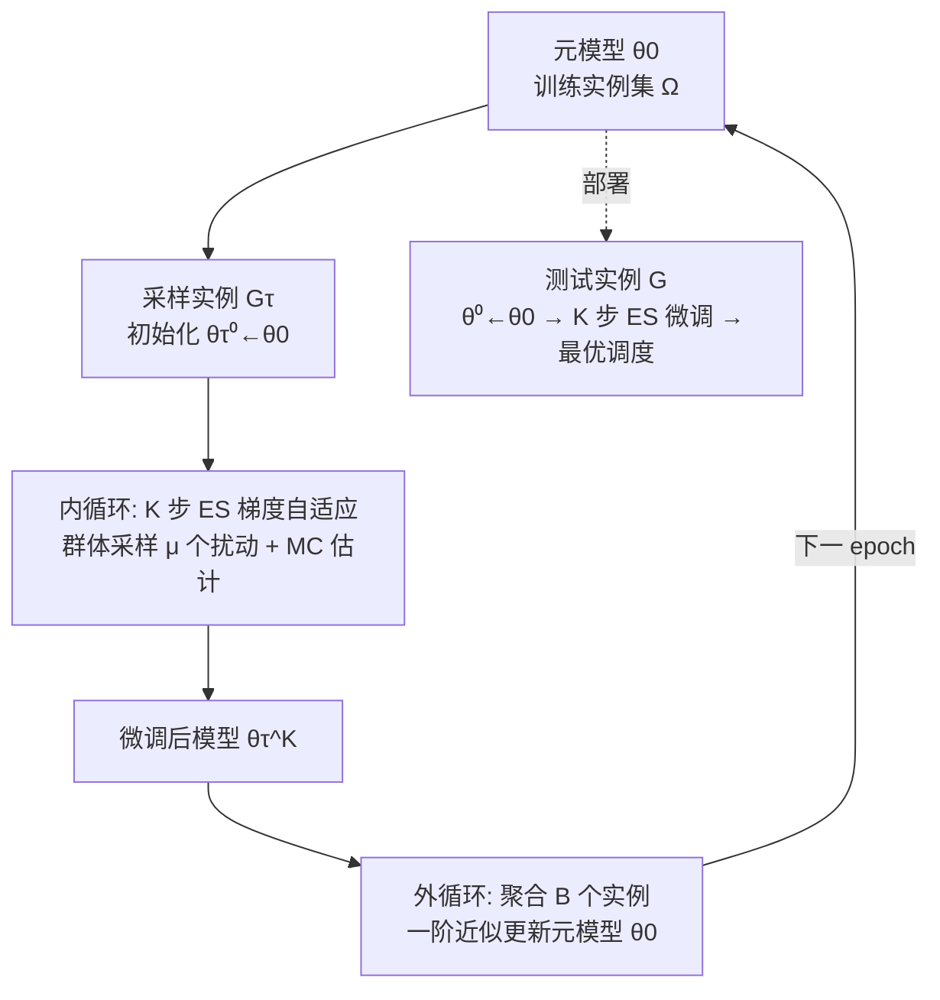

# Instance-wise Adaptive Scheduling via Derivative-Free Meta-Learning

**会议**: ICLR 2026  
**代码**: [https://github.com/calmQ/DF-META](https://github.com/calmQ/DF-META)  
**领域**: 强化学习 / 神经组合优化 / 调度  
**关键词**: 作业车间调度、FJSP、元学习、MAML、无导数优化、进化策略、实例级自适应  

## 一句话总结
针对深度强化学习调度模型"只优化平均性能、对单个实例不够好"的问题，本文用 MAML 元学习训练一个"专为微调而生"的初始化模型，并把内外两层优化全部换成无导数的进化策略（ES）、配合 GPU 并行，让模型能在测试时对每个实例做全参数自适应搜索，显著超越 Active Search / EAS 等测试时方法。

## 研究背景与动机
- **领域现状**：深度强化学习（DRL）在 NP-hard 的作业车间调度（JSP）及柔性版本（FJSP）上取得进展，主流范式是用 DRL 学习优先级派遣规则（PDR），把调度建模成 MDP 并用 PPO 训练 GNN/注意力策略网络，推理时贪婪或采样即可快速出解。
- **现有痛点**：现有方法沿用机器学习惯例，**优化的是训练集上的平均性能**，而调度的真实目标是把"每一个具体实例"都解好。由于 DRL 只能得到次优策略，即使是训练分布内的实例，训练好的策略也可能给出很差的解。测试时自适应（Active Search、Efficient Active Search）虽能针对单实例微调，但有两大缺陷：① 纯测试时机制，每个实例单独微调，**自适应知识用完即弃、无法跨任务复用**；② 依赖**梯度优化**，在 JSP/FJSP 这类组合优化的实例级搜索上容易陷入局部最优。
- **核心矛盾**：训练目标（平均性能）与真实诉求（单实例最优）错位，而能弥合这一错位的测试时搜索又被"梯度优化在组合空间上易陷局部最优 + 知识不可复用"所拖累。
- **本文目标**：学到一个**面向微调的参数初始化**，让模型在推理时能对每个未见实例快速收敛到高质量的实例专属解，且自适应过程具备强全局搜索能力、可跨实例共享知识。
- **核心 idea**：**【元学习显式建模微调】** 用 MAML 在训练阶段就模拟"逐实例微调"，让元模型成为每个新实例的好起点；**【全程无导数优化】** 把 MAML 内外两层梯度全部换成进化策略（ES）估计，既绕开梯度法的局部最优、又规避原版 MAML 复杂的二阶求导；**【GPU 群体并行】** 把传统 ES 的 CPU 密集计算搬到 GPU 批量推理。

## 方法详解

### 整体框架
方法是一个"实例级无导数元学习"框架，建立在 MAML 之上：**内循环**对每个采样实例做 K 步 ES 梯度的"模拟微调"，捕捉实例专属特征；**外循环**聚合一个 mini-batch 内多个实例的微调结果，更新共享的元模型，使其成为利于快速自适应的初始化。训练目标写作 $\theta_0^* = \arg\min_{\theta_0}\, \mathbb{E}_{G_\tau\sim\Omega}\big[F(\theta_\tau^{(K)}\mid G_\tau)\big]$，其中 $\theta_\tau^{(K)}$ 是从元模型 $\theta_0$ 出发、在实例 $G_\tau$ 上微调 K 步得到的模型，$F$ 为目标（makespan）。整个框架与具体策略网络解耦（model-agnostic），可套用到不同的调度学习模型。

### 关键设计

**1. 内循环的无导数自适应与两种 MC 适应度估计：把"实例搜索"做成全局而非局部。** 对训练实例 $G_\tau$，模型初始化为元模型 $\theta_\tau^{(0)}\leftarrow\theta_0$，随后做 K 步 ES 梯度更新。每步从参数分布采样 $\mu$ 个扰动个体 $\theta+\sigma\varepsilon_i$，按 OpenAI ES 公式估计梯度 $\frac{1}{\mu\sigma}\sum_i F_i\varepsilon_i$。但调度环境随机性强，单次 rollout 估出的适应度方差太大，于是本文为每个个体并行采 $L$ 个解，给出两种估计：**MC 平均**取 $F_i=\frac{1}{L}\sum_l F_i^{(l)}$ 来降方差，适配贪婪推理；**MC 最优样本**取 $F_i=\min_l F_i^{(l)}$，把"采样模式下只关心最好解"的信息直接注入内循环梯度，与 NCO 常用的 sampling 推理对齐。消融显示 MC 最优样本带来最强的自适应能力。

**2. 外循环的一阶近似元更新：用 FOMAML 思想砍掉"扰动套扰动"的高阶方差。** 外循环把每个训练实例当作伪测试实例，最大化其经过 K 步 ES 自适应后的性能（元级 ES 梯度见论文 Algorithm 3）。问题在于内外两层都是群体扰动，形成"perturbation-on-perturbation"，类似高阶微分会放大 ES 梯度方差，加之无导数方法本就收敛慢，全二阶训练在实际中不可行。本文借用 FOMAML 的一阶近似，显式丢弃二阶项，把 Line 9 的完整元梯度 $\nabla_{\theta_0}$ 替换为实例级梯度 $\nabla_{\theta_\tau}$：$\theta_0\leftarrow\theta_0-\frac{\beta}{B}\sum_{\tau=1}^{B}\nabla_{\theta_\tau}\mathbb{E}_{\varepsilon}\big[F(\theta_\tau^{(K)}+\sigma\varepsilon\mid G_\tau)\big]$，在保持效果的同时大幅降低计算开销。Table 5 显示同等条件下本方法全面优于 FOMAML。

**3. GPU 群体并行：把传统 ES 的 CPU 瓶颈搬上 GPU 做批量推理。** 传统 ES（Salimans 等）靠 Dask/Ray 在 CPU 集群上逐个体评估适应度，通信与同步成主要瓶颈、且无法发挥 GPU 算力。本文构造扰动矩阵 $\varepsilon=[\varepsilon_1,\dots,\varepsilon_\mu]\in\mathbb{R}^{d\times\mu}$，把整个群体拼成"群体网络" $\Theta=\theta+\sigma\varepsilon$，一次前向就为所有个体输出动作策略 $\Pi=F(\Theta,S)$；再把 FJSP 环境向量化为 $E=[E_1,\dots,E_\mu]$ 并行交互、同步收集适应度 $R=E(\Pi)$，ES 梯度直接写成 $\frac{1}{\mu\sigma}R\varepsilon^\top$。整个适应度评估过程下放 GPU、几乎无 CPU 依赖，使无导数方法在速度上反而能超过以"快"著称的 EAS。

## 实验关键数据

### 主实验表格（FJSP，部署到 SOTA 模型 DANIEL；Gap 相对 OR-Tools）

| 设置 | 方法 | 10×5 | 20×10 | 30×10* | 40×10* |
|------|------|------|-------|--------|--------|
| SD2 贪婪 | DANIEL | 25.20% | 32.09% | 15.75% | 2.59% |
| SD2 贪婪 | EAS | 16.65% | 23.21% | 10.51% | -1.64% |
| SD2 贪婪 | **Ours** | **13.18%** | **21.22%** | **9.47%** | **-1.94%** |
| SD2 采样 | EAS | 8.80% | 17.08% | 6.83% | -3.72% |
| SD2 采样 | **Ours** | **6.59%** | **14.72%** | **5.10%** | **-5.20%** |

（* 为训练未见的大尺寸，用 20×10 模型泛化；负 Gap 表示优于 OR-Tools 限时解。本方法在所有尺寸/分布上一致领先，且贪婪模式用 MC 平均、采样模式用 MC 最优样本。）

跨分布公开基准（用 SD1 小模型）同样全面领先 DANIEL/AS/EAS，在 edata（OOD）任务上提升尤为明显。

### 消融实验表格

| 消融维度 | 关键结果 |
|----------|----------|
| DFO vs 元学习拆解（Table 3，SD2 gap）| 仅 ES 训练+微调（14.38%@10×5）已超 AS/EAS；再叠加元学习 → Ours 13.18%，证明两部分各有贡献 |
| 对比 FOMAML（Table 5）| 同架构/初始化/200 epoch/10 微调步下，Ours 在所有尺寸全面优于梯度版 FOMAML，推理速度相当 |
| 内循环估计器（Fig 3）| 单样本 NES ≈ AS/EAS；MC 平均、MC 最优样本显著拉升，MC 最优样本自适应能力最强 |
| GPU vs CPU-Ray（Table 4，100 个体一次评估）| 20×10 上 GPU 3.8s vs CPU-Ray 122.3s，规模越大优势越大 |

### 关键发现
- **元学习的价值在"显式建模微调"**：元模型作为起点比纯测试时方法（AS/EAS）更利于实例级收敛，因为训练时就把微调过程考虑进去了。
- **无导数让全参数自适应可行**：ES 不需反向传播，可对全部参数做自适应搜索，既躲开梯度法的局部最优，又在质量和速度上双双超过 EAS。
- **方法跨学习范式通用**：除 FJSP（强化学习模型 DANIEL）外，作者把方法迁移到 JSP 的自监督模型 SPN（Self-labeling Pointer Network），同样有效，体现 model-agnostic 特性。

## 亮点与洞察
- **问题定位准**：精准点出 DRL 调度"平均性能 vs 单实例最优"的错位，并把它落到"测试时自适应不可复用 + 梯度法易陷局部最优"两个具体瓶颈上，动机链条清晰。
- **方法组合有新意**：首次在调度/组合优化的实例级自适应任务上用纯无导数优化，并把 MAML 的内外两层都"ES 化"，再用 FOMAML 一阶近似压住"扰动套扰动"的方差爆炸，是一套自洽的工程化设计。
- **效率论证扎实**：GPU 群体并行不只是"能跑"，而是让无导数方法在速度上反超以快著称的 EAS，把 ES 长期被诟病的"慢"在推理侧实质性缓解。
- **两种 MC 估计器对齐推理模式**：MC 平均配贪婪、MC 最优样本配采样，是对"训练目标该如何反映推理方式"的细致考量。

## 局限与展望
- **训练仍偏慢**：作者自承无导数优化收敛慢于梯度法，虽用一阶近似与 GPU 并行缓解，训练开销仍是软肋，未来需更高效的训练方案。
- **超参跨尺寸固定但在最小尺寸调**：所有超参在 10×5 上调好后固定到所有尺寸，泛化到超大实例（50×20、100×20）时是否仍最优需更系统验证。
- **依赖底层策略模型**：方法 model-agnostic，但效果上限仍受所套用的 PDR 学习模型（如 DANIEL）质量制约，本质是"更好的自适应"而非"更强的基础策略"。
- **与连续空间搜索类方法正交未融合**：作者指出与"在学到的连续空间里搜索解分布"的方法（如 latent search、T2T）正交、可结合，但本文未实际整合。

## 相关工作与启发
- **学习型调度**：以 PDR 学习为主流（Zhang 2020、Song 2023、Wang 2023 的 DANIEL），用析取图 + GNN/注意力实现尺寸无关；另有学习局部搜索控制策略的路线，质量更好但更慢。
- **实例级自适应**：Active Search、Efficient Active Search 是测试时微调代表；车辆路径/图优化里也有元模型探索，但依赖问题特定技巧且用梯度法，本文是首个对此类任务用无梯度优化。
- **方法源头**：MAML / FOMAML（Finn 2017）提供元学习骨架；OpenAI ES（Salimans 2017）与 NES（Wierstra 2014）提供无导数优化基石。
- **启发**：① "训练时模拟测试时搜索"是把平均优化转向实例最优的有效杠杆；② 当搜索空间是组合/离散且梯度不可靠时，把整条 MAML 管线换成群体式无导数估计 + GPU 并行，是一条值得复用的工程路径；③ 适应度估计器应显式对齐下游推理模式（贪婪/采样）。

## 评分
- **新颖性**: ⭐⭐⭐⭐ 首次在调度类组合优化的实例级自适应上引入全程无导数的元学习，把 MAML 内外层 ES 化并用一阶近似稳住方差，组合新颖、定位清晰。
- **实验充分度**: ⭐⭐⭐⭐ 覆盖 SD1/SD2 两类合成数据 6 种尺寸 + 4 个公开基准的跨分布测试，含 DFO/元学习拆解、FOMAML 对比、内循环估计器、GPU/CPU 效率等多维消融，并跨 RL/自监督两种范式验证；唯训练效率自身未给出充分量化优化。
- **写作质量**: ⭐⭐⭐⭐ 动机—方法—实验逻辑顺畅，算法伪代码与公式完整，框架图清晰；部分附录内容（更大尺寸、统计分析）外置略影响自洽阅读。
- **价值**: ⭐⭐⭐⭐ 对工业级调度的测试时优化有实用意义，model-agnostic 与 GPU 并行使其易于落地，且为"无导数 + 元学习"在组合优化中的应用提供了可复用范式。

<!-- RELATED:START -->

## 相关论文

- [\[ICLR 2026\] MIRACLE: Model-free Imitation and Reinforcement Learning for Adaptive Cut-Selection](miracle_model-free_imitation_and_reinforcement_learning_for_adaptive_cut-selecti.md)
- [\[ICLR 2026\] Instance-Dependent Fixed-Budget Pure Exploration in Reinforcement Learning](instance-dependent_fixed-budget_pure_exploration_in_reinforcement_learning.md)
- [\[ICLR 2026\] Scheduling Your LLM Reinforcement Learning with Reasoning Trees](scheduling_your_llm_reinforcement_learning_with_reasoning_trees.md)
- [\[AAAI 2026\] MARS: A Meta-Adaptive Reinforcement Learning Framework for Risk-Aware Multi-Agent Portfolio Management](../../AAAI2026/reinforcement_learning/mars_a_meta-adaptive_reinforcement_learning_framework_for_risk-aware_multi-agent.md)
- [\[ICLR 2026\] Leveraging Explanation to Improve Generalization of Meta Reinforcement Learning](leveraging_explanation_to_improve_generalization_of_meta_reinforcement_learning.md)

<!-- RELATED:END -->
