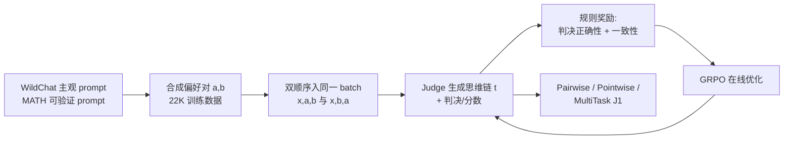

# J1: Incentivizing Thinking in LLM-as-a-Judge via Reinforcement Learning

**会议**: ICLR 2026  
**OpenReview**: [https://openreview.net/forum?id=dnJEHl6DI1](https://openreview.net/forum?id=dnJEHl6DI1)  
**代码**: 待确认  
**领域**: 强化学习 / LLM-as-a-Judge / 奖励建模  
**关键词**: LLM-as-a-Judge, 可验证奖励 RL, GRPO, 位置偏置, 思维链评估  

## 一句话总结
J1 把"主观/客观判断任务"统一改写成带可验证奖励的格式，用 GRPO 在线 RL 训练会"先思考再下判决"的 LLM 评委，在多个 reward 基准上以 32B 规模反超 o3、DeepSeek-R1-671B，并用纯合成数据消除位置偏置。

## 研究背景与动机

**领域现状**：AI 的进步越来越被"评估质量"卡脖子，LLM-as-a-Judge 成为核心解法。早期评委靠 prompt 直接生成思维链下判决，后来用迭代微调、DPO 等离线方法改进推理质量。与此并行的标量奖励模型（Bradley-Terry RM）则直接输出分数、没有显式推理。

**现有痛点**：(1) 离线方法（SFT/Self-Taught/DPO）无法在线优化"评估思考过程"本身，推理质量上限受限；(2) 成对评委存在顽固的**位置偏置**——交换两个回答的顺序，判决就翻转；(3) 逐点（pointwise）评委虽天然位置一致，但缺少参照对象、容易给两个回答打同样的分（ties）；(4) SOTA 生成式奖励模型（DeepSeek-GRM 等）依赖海量人工标注（百万级 judge 数据 + 几十万 RL 样本）。

**核心矛盾**：既要让评委"会推理"以提升判断准确率，又要让推理在线可优化、还要消除位置偏置——而判断任务大多是主观、不可验证的，无法直接套用可验证奖励 RL。

**本文目标**：训练一个既能成对、又能逐点评估的**通才 thinking-judge**，只用合成数据、不依赖人工标注，并系统性解决位置偏置。

**核心 idea**（加粗标签）：**把所有判断任务统一转成"可验证奖励"格式** —— 无论是 MATH 这种可验证 prompt，还是 WildChat 这种主观 prompt，都构造成偏好对 $(a,b)$，让"预测哪个回答更好"成为一个有 ground-truth 的可验证任务，从而用 RL from verifiable rewards 直接优化评估思考。

## 方法详解

### 整体框架
J1 在 verl 上用 GRPO 训练评委：先把 WildChat（主观）和 MATH（可验证）的 prompt 都构造成合成偏好对，并把两种顺序 $(x,a,b)$ 与 $(x,b,a)$ 放进同一 batch（position-agnostic batching）；再用基于规则的"判决正确性 + 一致性"奖励在线优化思维链与最终判决；最后探索成对、逐点、多任务等多种评委形式，统一进一个既能 pointwise 又能 pairwise 的多任务模型。

### 关键设计

**1. 统一可验证奖励训练：把主观判断也变成"有标准答案"的任务**
J1 沿用合成偏好对策略，把评估任务转成"预测更优回答"这一可验证任务。22K 训练数据由 17K WildChat + 5K MATH prompt 构成：WildChat 的 rejected 回答通过让 LLM 先生成原指令的"噪声变体"再据此作答得到，MATH 的 rejected 则取那些没有命中 gold answer 的采样。这样即便是主观 prompt 也有了 ground-truth 偏好标签，使得可验证奖励 RL 能统一覆盖"可验证 + 不可验证"两类任务，且与 EvalPlanner（用同一数据做两轮 DPO）形成同分布、可直接对比"在线 RL vs 离线 DPO"。

**2. 位置无关 batching + 一致性奖励：从训练机制根除位置偏置**
判决奖励是二元的：最终判决选对则 $+1$、否则 $0$。在此之上引入**一致性奖励**——只有当模型对同一对回答的两种顺序 $(x,a,b)$ 和 $(x,b,a)$ 都判对时才给 $+1$，任一顺序判错即 $0$。这要求把同一对的两种顺序放进同一 batch（position-agnostic batching），让一致性奖励能在 batch 内直接计算。作者还试过加 `<think>` 标签的格式奖励，但发现无明显收益。

**3. 多种评委形式 + 用成对监督蒸馏出逐点评委**
J1 用 GRPO 联合优化思考与判决，并定义了多种形式：**PaV**（promptPaV$(x,a,b)\to(t,y)$，直接出判决，主力配方）、**PaS**（出实值分数 $s_a,s_b$，分高者为判决，奖励看分数是否与 gold 一致）、**PaVS**（同时出分数与判决，分数作为隐变量观测、奖励只看判决）。更关键的是 **PoS 逐点评委**：promptPoS$(x,a)\to(t,s)$ 对单个回答打 0–10 分，天然位置一致。它仅靠**成对数据的远程监督**训练——把每个偏好对拆成两个逐点样本，联合评估两者分数，只有分数排序与 gold 判决一致才给奖励 $1$。由于偏好排序远比逐点标注易得，"用成对监督训出逐点 thinking-judge"是本文的新贡献之一。

**4. 多任务统一：一个模型兼做逐点与成对**
最后把 PoS 与 PaS 两套范式合进单一 **MultiTask-J1**，在成对 + 逐点数据上联合训练。由于成对判断整体优于逐点，最终在成对设置下评估这个多任务模型即可拿到最佳结果，且它同时超过单独训练的逐点、成对评委。

## 实验关键数据

### 主实验表格（PPE Correctness，成对设置，准确率，相对 base 的增益）

| 模型 | 训练偏好对 | Overall | MMLU-Pro | MATH | GPQA | MBPP-Plus | IFEval |
|------|-----------|---------|----------|------|------|-----------|--------|
| Llama-3.1-8B-Instruct (base) | – | 54.7 | 56.3 | 62.9 | 51.4 | 50.1 | 52.8 |
| EvalPlanner-Llama-70B (DPO) | 22K | 70.2 | 78.4 | 81.7 | 64.4 | 62.2 | 64.3 |
| DeepSeek-BTRM-27B (标量 RM) | 237K | 66.7 | 68.8 | 73.2 | 56.8 | 68.8 | 66.0 |
| J1-Llama-8B | 22K | 59.2 +4.5 | 65.6 | 70.0 | 53.2 | 53.1 | 54.0 |
| J1-Llama-70B | 22K | 72.9 +7.2 | 79.0 | 86.0 | 65.9 | 66.0 | 67.3 |
| J1-Qwen-32B | 22K | 74.6 +8.1 | 82.2 | 93.3 | 65.2 | 65.3 | 66.8 |
| **J1-Qwen-32B-MultiTask** | 22K | **76.8 +10.3** | 85.0 | 94.3 | 68.6 | 66.3 | 69.5 |

J1-Qwen-32B-MultiTask 以 76.8 取得 SOTA（$p<0.0001$），比 EvalPlanner 高 6.8%、比 DeepSeek-GRM-27B（用 1270K + 237K 数据）高 17%。

### 跨基准对比（5 个 reward 基准 Overall）

| 模型 | Overall | PPE | RewardBench | RM-Bench | JudgeBench† | FollowBenchEval† |
|------|---------|-----|-------------|----------|-------------|------------------|
| J1-Llama-8B | 61.9 +13.6 | 59.8 | 85.7 | 73.4 | 42.0 | 48.3 |
| J1-Llama-70B | 75.0 +10.7 | 69.6 | 93.3 | 82.7 | 60.0 | 69.3 |
| **J1-Qwen-32B-MultiTask** | **80.8** | 71.8 | 93.6 | 90.3 | 71.4 | 77.1 |
| OpenAI-o3 | 77.4 | 72.1 | 86.4 | 86.1 | 75.7 | 66.8 |
| DeepSeek-R1-671B | 78.4 | 72.3 | 90.6 | 88.6 | 68.9 | 71.7 |

仅 32B 规模的 J1-MultiTask 在 5 项中 3 项超过 o3 和 R1-671B。

### 消融实验（位置一致性，PPE Correctness）

| 模型 | 类型 | Consistent Acc ↑ | Verdict Flip/Ties ↓ |
|------|------|------------------|---------------------|
| J1-Qwen-32B | Pairwise | 65.2 | 14.5 |
| J1-Qwen-32B | Pointwise | 69.3 | 13.0 |
| J1-Qwen-32B-MultiTask | Pairwise | 67.0 | 17.0 |
| J1-Qwen-32B-MultiTask | Pointwise | **70.6** | **10.5** |

逐点评委在一致性准确率与翻转率上都优于成对，多任务模型逐点评估时翻转率最低（10.5）。

### 关键发现
- **在线 RL > 离线 DPO**：同数据下 J1 全面超过两轮 DPO 的 EvalPlanner，验证在线优化评估思考的优势。
- **小模型 + 合成数据可反超巨型模型**：32B 合成数据训练即超 o3、R1-671B 多项。
- **测试时扩展有效**：majority vote / 平均分数 N 越大，位置一致准确率上升、tie 率下降。
- **行为涌现**：J1 自发学会动态生成评估准则、自建参照答案、迭代自我纠错、对低质回答给反馈。

## 亮点与洞察
- **"统一可验证化"是关键抓手**：把主观评估硬转成有 ground-truth 的偏好预测，让可验证奖励 RL 这套强工具直接吃下原本无法 RL 的主观判断任务。
- **位置偏置从机制层面治理**：双顺序同 batch + 一致性奖励，比单纯靠 prompt 提示"保持一致"更彻底。
- **逐点评委靠成对监督蒸馏**，绕开昂贵的逐点标注，是工程上很划算的设计。
- **数据效率惊人**：仅 22K 合成偏好对就击败用百万级标注训练的模型。

## 局限与展望
- 训练偏好对仅来自 WildChat + MATH 两类种子，领域覆盖与 rejected 构造方式（噪声指令）可能限制泛化到更复杂的真实评估场景。
- 逐点评委虽位置一致但仍有较高 tie 率，缺少参照对象的"绝对打分"本质难题未根除。
- 奖励是纯规则二元信号，对"判对但理由错"无法区分；过程层面的奖励仍有探索空间。
- JudgeBench 上 32B 仍略逊 o3，超大思维模型在最难推理判断上仍有优势。

## 相关工作与启发
- **方法谱系**：从 prompt-based LLM-Judge → 迭代微调/DPO（EvalPlanner、Self-Taught Evaluator）→ 本文的在线 GRPO，延续 DeepSeek-R1 "可验证奖励 RL 激励推理"的思路并迁移到评委训练。
- **对比对象**：标量 RM（Skywork、Armo、DeepSeek-BTRM）、生成式 RM（DeepSeek-GRM、Reasoning Reward Model）、思维 LLM（o1-mini、o3、R1）。
- **启发**：任何"主观、难以验证"的任务，只要能构造成对偏好对，就可能改写成可验证奖励 RL 问题——这套"统一可验证化"范式有望迁移到 RLHF reward model、agent 自评、多模态评估等场景。

## 评分
- 新颖性: ⭐⭐⭐⭐ — "统一可验证化 + 一致性奖励 + 成对监督蒸馏逐点评委"组合新颖，把判断任务系统纳入可验证 RL。
- 实验充分度: ⭐⭐⭐⭐⭐ — 5 基准、3 规模、成对/逐点/多任务多形式消融、位置一致性与测试时扩展分析齐全。
- 写作质量: ⭐⭐⭐⭐ — 结构清晰、图表充分，多种形式命名（PaV/PaS/PaVS/PoS/MT）略增阅读负担。
- 价值: ⭐⭐⭐⭐⭐ — 32B 反超 o3/R1-671B、纯合成数据、可直接落地为 RLHF/评估管线的强评委，实用价值高。

<!-- RELATED:START -->

## 相关论文

- [\[ICLR 2026\] QuRL: Rubrics As Judge For Open-Ended Question Answering](qurl_rubrics_as_judge_for_open-ended_question_answering.md)
- [\[ICLR 2026\] Parallel-R1: Towards Parallel Thinking via Reinforcement Learning](parallel-r1_towards_parallel_thinking_via_reinforcement_learning.md)
- [\[ICLR 2026\] Scheduling Your LLM Reinforcement Learning with Reasoning Trees](scheduling_your_llm_reinforcement_learning_with_reasoning_trees.md)
- [\[ACL 2026\] Glance-or-Gaze: Incentivizing LMMs to Adaptively Focus Search via Reinforcement Learning](../../ACL2026/reinforcement_learning/glance-or-gaze_incentivizing_lmms_to_adaptively_focus_search_via_reinforcement_l.md)
- [\[ICLR 2026\] AbstRaL: Augmenting LLMs' Reasoning by Reinforcing Abstract Thinking](abstral_augmenting_llms_reasoning_by_reinforcing_abstract_thinking.md)

<!-- RELATED:END -->
