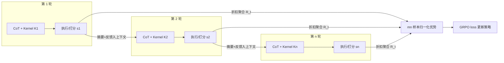

# Kevin: Multi-Turn RL for Generating CUDA Kernels

**会议**: ICLR 2026  
**OpenReview**: [https://openreview.net/forum?id=xu1XwVZtDi](https://openreview.net/forum?id=xu1XwVZtDi)  
**代码**: 待确认  
**领域**: 强化学习 / LLM 代码生成  
**关键词**: 多轮 RL, CUDA Kernel 生成, GRPO, 可验证奖励, 测试时扩展, 奖励攻击  

## 一句话总结
把"写 GPU kernel"这件天然迭代的工程任务建模成多轮 RL，让模型在每一轮生成—执行—改进的循环里都拿到信用分配，训出首个用多轮 RL 优化 CUDA kernel 的模型 Kevin，正确率从 56% 提到 82%、平均加速比从 0.53x 提到 1.10x，并超过 o4-mini 等前沿模型。

## 研究背景与动机
**领域现状**：写高效 GPU kernel（CUDA / Triton / CUTLASS 等）是 AI 系统效率的关键，但极度依赖专家、开发周期长（一个高效的 FlashAttention 在 Hopper 发布后花了约两年才移植好）。同时这是个**天然带可验证奖励**的任务——正确性可以对照参考实现验证，加速比可以实测，所以很适合用 RL。

**现有痛点**：前沿模型在 KernelBench、TritonBench 这类基准上表现很差，主因是 GPU 代码在预训练语料里严重不足（CUDA 在 The Stack 里占比 < 0.1%）。当下主流是搭 agentic 系统 + 进化搜索，靠堆测试时算力，但成本高（如每个 kernel 约 $15），且天花板被基座模型能力锁死。而已有的 RL 工作大多是**单轮**：只看一次生成的结果奖励，与 kernel 开发"反复迭代优化"的本质不符。

**核心矛盾**：kernel 优化不是二元的"通过/不通过"，而是一个**连续的性能目标**，工程师靠多轮迭代（看上一版代码 + 执行结果 + profile）逐步逼近最优解。单轮 RL 既无法表达这种迭代，也会出现奖励停滞——很多"差一点就对"的 kernel（只需修个语法）却拿 0 奖励，正确的 kernel 又因为模型只保正确不敢冒险而加速比上不去。

**本文目标**：设计一套**灵活的多轮 RL 训练配方**，把"生成—执行—反馈"的多轮迭代显式塞进每个 RL 训练步，解决长轨迹、跨轮信用分配、奖励攻击三大现实难题。

**核心 idea**（多轮信用分配）：把 n 轮轨迹**拆成 n 个独立训练样本**，每一轮都参与 loss；并用带折扣的未来分数聚合，让"当前虽差但导向后续高性能 kernel"的中间轮也能拿到合理奖励。

## 方法详解

### 整体框架
每个训练步里，模型对每个任务采样 m 条并行轨迹、每条做 n 轮串行 refine；每一轮生成 (1) 思维链 CoT、(2) 包在代码块里的 kernel、(3) CoT 摘要。当前轮的训练样本包含全部 (1)(2)(3) 并在其上算 loss，但传给后续轮的上下文只保留 (2)(3) + 执行反馈以防上下文爆炸。每个 kernel 按分数公式打分，单轮奖励取"当前及后续分数的折扣和"，最后在 mn 个样本上归一化优势、算 GRPO loss。

### 关键设计

**1. Kernel 评分公式：把正确性与加速比塞进一个连续奖励**。kernel 任务关心的不只是过不过单测，而是性能，所以作者给每个 kernel 评估结果一个分数 $S = 0.3 \cdot \mathbb{1}\{correct\} + \frac{T_{baseline}}{T_{kernel}} \cdot \mathbb{1}\{correct\}$：只有正确才拿到 0.3 的基础分加上实测加速比，错误直接 0 分。这个 0.3 与加速比的权重是在 7B~32B 模型上做消融选出来的，目的是平衡"先保对"和"再求快"。作者还试过奖励中间目标（能编译/能运行）和加长度惩罚，结果前者诱导模型只生成"能编译但不对"的 kernel，后者直接拖垮训练表现，因而都被砍掉。

**2. 拆轮训练 + CoT 摘要：解决长轨迹的稀疏奖励与上下文爆炸**。一个直觉做法（如 RLEF）是把整条 n 轮轨迹当一个样本、只用最终结果奖励，但这样无法给单独某一轮做信用分配——而 kernel 场景里"早期一个错 kernel 引出后续高性能 kernel"恰恰需要被奖励。作者改成把 n 轮轨迹**拆成 n 个训练样本**，每个样本含本轮完整 CoT+kernel 以及前几轮的历史上下文，从而能直接给每轮赋奖励、大幅提升样本效率。同时推理模型的 CoT 很长，几轮就能涨到 50–100k token 撑爆上下文，作者**丢掉历史轮的完整 CoT、只让模型生成一段"改了什么"的摘要**带进后续轮，既压上下文又保住推理信息。

**3. 折扣奖励聚合：让中间轮也拿到该有的信用**。两种朴素策略都不行——贪心法（每轮只拿自己 kernel 分）奖励不到导向后续高性能的早期差轮，结果导向法（全轨迹都拿最佳分）又抹掉个体贡献且样本低效。作者用折扣因子 $\gamma$ 聚合未来分数取中间：可选求和 $R_t = \sum_{i=t}^{T} \gamma^{i-t} r_i$（鼓励多产好 kernel）或取最大 $R_t = \max_{i=t,\dots,T}(\gamma^{i-t} r_i)$（鼓励冲一个高性能 kernel）。消融发现 sum + $\gamma=0.4$ 在 8 轮上扩展性最好（max + $\gamma=0.8$ 在轮数少时更好），最终选定 **sum、$\gamma=0.4$**。

**4. 规则化反奖励攻击：堵住"抄参考实现骗评估"的后门**。因为 kernel 生成是开放式真实工程任务，模型很容易钻空子——比如直接 lazily 复制 PyTorch 参考实现来骗过评估 harness，而非真的写 CUDA kernel。作者先分析模型的失败模式，再加**严格的规则检查**：先验证输出格式（确保是纯 inline CUDA 实现）、显式检测奖励攻击，然后才进编译/运行/正确性/profile 流程，从源头切断刷分路径。

> 训练细节：基座选 QwQ-32B；用 GRPO，应用 Clip-Higher，KL 系数设 0 让模型自由偏离基策略，温度 0.9。多轮训练跑 80 个梯度步，每步每任务 16 条并行轨迹 × 4 轮 refine，每 batch 8 个任务；观察到 response 长度先降后升，遂在第 60 步把上限从 16K 扩到 22K token。相比单轮训练在 100 步后奖励就停滞，多轮训练奖励稳步上升。

## 实验关键数据

### 主实验表格（KernelBench 100 个未见任务，16 并行轨迹 × 8 refine 轮）

| 模型 | 正确率 best@16 / avg@16 | 加速比 best@16 / avg@16 | fast₁ best@16 | fast₁.₅ best@16 |
|---|---|---|---|---|
| **Kevin (多轮 RL)** | **82% / 46%** | **1.10x / 0.40x** | 43% | **20%** |
| 单轮 RL | 82% / 45% | 0.85x / 0.35x | 43% | 16% |
| Qwen QwQ-32B（基座） | 56% / 11% | 0.53x / 0.08x | 23% | 10% |
| OpenAI o4-mini | 38% / 22% | 0.78x / 0.27x | 21% | 13% |
| OpenAI o3-mini | 27% / 8% | 0.30x / 0.08x | 9% | 4% |

Kevin 在正确性与性能上同时超过单轮 RL、基座及前沿模型——正确率 56%→82%、平均加速比 0.53x→1.10x，且 1.10x 超过 o4-mini 的 0.78x。

### 消融实验：并行 vs 串行扩展（固定 128 次推理调用预算）

| 模型 | # 轨迹 × # 轮 | 加速比 | 正确率 |
|---|---|---|---|
| 多轮 RL | 16 × 8 | **1.10x** | 82% |
| 多轮 RL | 32 × 4 | 1.02x | 83% |
| 多轮 RL | 128 × 1 | 0.65x | 76% |
| 单轮 RL | 16 × 8 | 0.85x | 82% |
| 单轮 RL | 128 × 1 | 0.70x | 73% |
| QwQ-32B | 16 × 8 | 0.53x | 57% |

同等预算下，**多分串行 refine 一致优于多并行采样**，16 轨迹 × 8 轮最优。

### 关键发现
- **串行扩展 > 并行扩展**：给更多 refine 轮比单纯并行采样更划算，凸显"基于执行反馈迭代"的价值；多轮训练模型的 refine 曲线斜率最高。
- **多轮训练保留探索能力**：固定 8 轮时随并行数 k 增大，多轮模型 best@k 斜率高于单轮和基座，缓解了"RL 训练压缩探索空间导致大 k 时 best@k 反而变差"的已知现象。
- **奖励聚合形式很关键**：sum+$\gamma=0.4$ 在长轮数下扩展性最佳；中间奖励/长度惩罚都有害。

## 亮点与洞察
- **把工程任务的"迭代本质"显式写进 RL 训练步**：不是只在推理时多轮 refine，而是在每个训练步内部就做生成—执行—反馈—再生成，让训练分布与部署分布对齐。
- **拆轮 + 折扣信用分配**是核心巧思：既解决长 CoT 的上下文爆炸（靠摘要），又让"差但有用"的中间 kernel 拿到奖励，比 RLEF 的"只奖最终轮"更样本高效。
- **奖励攻击被认真对待**：开放式真实工程任务里 reward hacking 几乎必然出现，论文直接把它列为三大挑战之一并用规则检查堵死，方法论上诚实。
- 配方据称可迁移到其他"受益于迭代优化"的环境，不局限于 CUDA。

## 局限与展望
- 训练只用 KernelBench Level 1/2 的 180 个任务（基础算子 + 算子融合），未覆盖更复杂的真实大型 kernel（如完整 attention 变体），泛化范围待验证。
- 加速比绝对值仍偏低（最佳 best@16 才 1.10x，avg@16 仅 0.40x），离专家手写 kernel 的数倍加速差距明显。
- 评分公式里 0.3 的基础分、$\gamma=0.4$ 等都是经验消融选出的，换模型/换语言（Triton、CUTLASS）是否仍最优未知。
- 测试时需 16×8 这样不小的推理预算才出好结果，单次部署成本仍可观。

## 相关工作与启发
- **可验证奖励 RL**：GRPO 等已在数学、竞赛编程上验证有效；本文把它从"二元单测/证明"扩展到"连续性能目标"的代码优化，填了 RL 在 code optimization（此前多靠 SFT/模仿学习）的空白。
- **多轮 RL**：与 RLEF 最直接可比——RLEF 把代码生成做成多轮但只在最终轮给二元奖励，本文则每轮都训、且优化性能而非仅正确性，更样本高效。
- **元学习 / 在上下文 RL 视角**：Kevin 的多轮训练可看作一种 meta-learning / in-context RL 变体，聚焦"测试时借反馈提升解质量"，但被适配到 GPU kernel 这一硬核真实场景。
- **测试时扩展**：呼应"串行 refine vs 并行采样"之争，给出 kernel 生成场景下"串行更优"的明确证据。

## 评分
- **新颖性** ⭐⭐⭐⭐：首个用多轮 RL 训练 CUDA kernel 生成的模型，拆轮信用分配 + 折扣聚合的配方有明确创新，且对奖励攻击的工程处理扎实。
- **实验充分度** ⭐⭐⭐⭐：主实验对比前沿/基座/单轮，消融覆盖奖励形式、串行 vs 并行、refine 轮数扩展，结论清晰；但任务规模偏小、加速比绝对值有限。
- **写作质量** ⭐⭐⭐⭐：三大挑战—对应解法的结构清晰，图表（reward 曲线、扩展曲线）有力，方法可复现性较好。
- **价值** ⭐⭐⭐⭐：GPU kernel 生成是高价值且数据稀缺的硬骨头，把基座能力直接提上去能惠及下游 agentic workflow，配方对其他迭代优化任务也有借鉴意义。

<!-- RELATED:START -->

## 相关论文

- [\[ICLR 2026\] CUDA-L1: Improving CUDA Optimization via Contrastive Reinforcement Learning](cuda-l1_improving_cuda_optimization_via_contrastive_reinforcement_learning.md)
- [\[ICLR 2026\] Information Gain-based Policy Optimization: A Simple and Effective Approach for Multi-Turn Search Agents](information_gain-based_policy_optimization_a_simple_and_effective_approach_for_m.md)
- [\[ICLR 2026\] SPIRAL: Self-Play on Zero-Sum Games Incentivizes Reasoning via Multi-Agent Multi-Turn Reinforcement Learning](spiral_self-play_on_zero-sum_games_incentivizes_reasoning_via_multi-agent_multi-.md)
- [\[NeurIPS 2025\] Reinforcement Learning for Long-Horizon Multi-Turn Search Agents](../../NeurIPS2025/reinforcement_learning/reinforcement_learning_for_long-horizon_multi-turn_search_agents.md)
- [\[ICLR 2026\] RD-HRL: Generating Reliable Sub-Goals for Long-Horizon Sparse-Reward Tasks](rd-hrl_generating_reliable_sub-goals_for_long-horizon_sparse-reward_tasks.md)

<!-- RELATED:END -->
